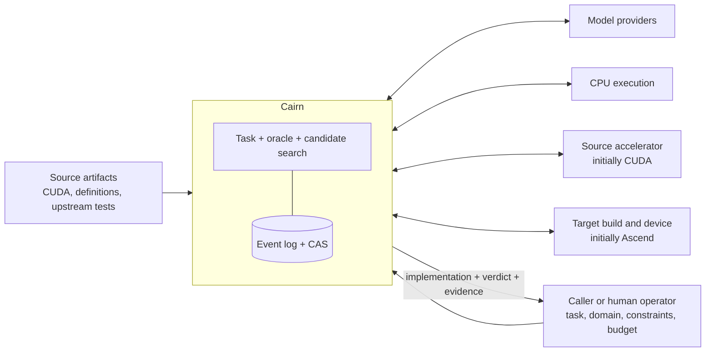
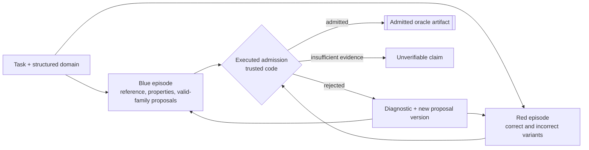
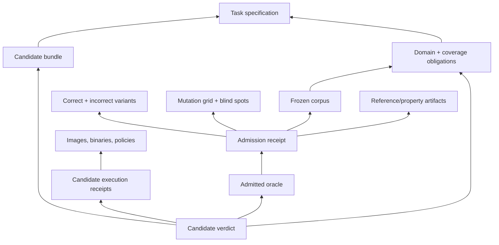
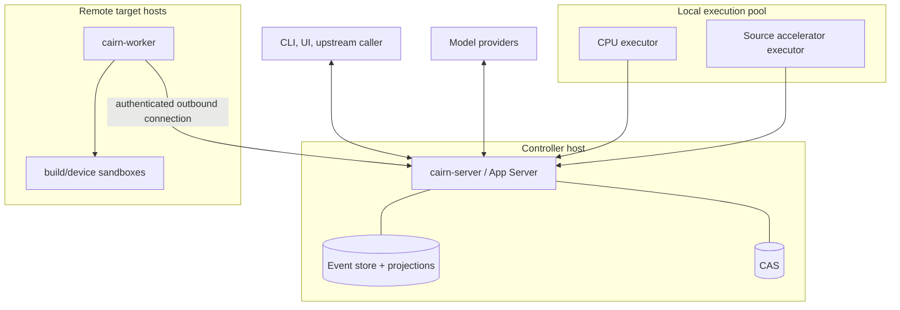

# Cairn system design

- Status: normative target design
- Date: 2026-08-24
- Satisfies: [`SYSTEM_REQUIREMENTS.md`](SYSTEM_REQUIREMENTS.md)

## 1. Design objective

Cairn is one product with several internal authorities. It must let agents propose work without
letting agents decide whether their own work is trustworthy. It must execute untrusted artifacts on
heterogeneous machines without making remote workers understand product semantics. It must return a
verdict without losing the requests, decisions, artifacts, failures, and assumptions that produced
that verdict.

The architecture therefore separates four kinds of responsibility:

1. **proposal** — agents and external sources may propose semantics, cases, variants, and candidates;
2. **execution** — workers run authorized opaque jobs and capture observations;
3. **adjudication** — trusted verification code derives and applies admission/verdict policy;
4. **record** — append-only facts and immutable content preserve what every other part did.

The single-repository decision removes release and deployment coupling between the earlier Cairn and
Alloyport repositories. It does not erase these responsibility boundaries.

## 2. Design principles

### P1 — The product is a claim plus evidence

A generated kernel without an admitted oracle and a traversable evidence chain is an intermediate
artifact, not a completed migration.

### P2 — Models propose; code adjudicates

Models may author domain claims, references, properties, variants, and target implementations. They
may not author generic mutants, tolerance derivation, comparison, or the final admission/verdict
decision used on their own work.

### P3 — Model-visible means durably reconstructable

The record, not mutable runtime memory, is the source from which model input is projected. Anything
new that can affect a model request needs a durable representation before dispatch.

### P4 — Execution is opaque; meaning stays above it

A worker executes a job contract. It does not know whether the job is an oracle calibration, source
gate, build, correctness run, or performance measurement.

### P5 — Identity follows bytes and decisions

Verdict-relevant content is immutable and content-addressed. Decisions that select content are
recorded. Derived identities are explicit and never masquerade as stored bytes.

### P6 — Failure is information, not an inconvenience

Recoverable subject defects, infrastructure failures, ambiguous effects, false rejects, blind spots,
and unverifiable claims have different types and different recovery paths.

### P7 — Spend the cheapest decisive resource

For each proposal, validation stops at the cheapest layer that can decide it. Provider spend is a
separate search budget, not the last rung of the hardware validation ladder.

### P8 — Generality is demonstrated by a second real user

Neutral names do not make a framework. The second materially different operator must pass without
modifying generic runtime, execution, or verification core types.

## 3. System context



Cairn can be invoked directly through its CLI/API or by a larger migration system. Upstream
feedback may constrain a new task or report a measurement. Method remains inside the search unless
it is introduced as an explicit, versioned policy change.

## 4. Vocabulary and containment

| Term | Meaning |
|---|---|
| **Task** | One bounded migration objective and its immutable inputs. |
| **Episode** | One role-scoped agent run within a task, such as oracle author, breaker, or candidate author. |
| **Turn** | Work initiated by one admitted input to an episode and ending when the episode yields control. |
| **Step** | One model request and the tool operations it causes before another model request. |
| **Operation** | One durable tool invocation with effect and recovery semantics. |
| **Job** | An opaque execution request suitable for a local executor or remote worker. |
| **Attempt** | One concrete execution of a job. Retries are new attempts. |
| **Artifact** | Immutable bytes with content identity and provenance. |
| **Claim** | A statement whose subject, scope, strength, assumptions, and evidence are explicit. |
| **Oracle proposal** | Unadmitted domain/reference/property bundle. It cannot judge a candidate. |
| **Oracle artifact** | An immutable proposal version that passed admission for a stated scope. |
| **Calibration** | Executed evidence that an oracle accepts required honest paths and rejects required attacks. |
| **Candidate** | A target implementation proposed during kernel search. |
| **Receipt** | A canonical record of one check or execution, citing its inputs and observations. |
| **Verdict** | Cairn's adjudicated result over a candidate, oracle, domain, policy, and evidence set. |
| **Projection** | A rebuildable view derived from durable events and immutable content. |
| **Branch** | A new execution lineage derived from a historical boundary without changing its source. |

The public API uses product resources (`Task`, `Episode`, `Attempt`, `Oracle`, `Artifact`, `Verdict`).
Internal runtime event variants are not automatically public protocol commitments.

Semantically different identities and states remain different Rust types throughout production
logic. A `TaskId` is not an `EpisodeId`; a `ContentId<T>` is not an aggregate ID; a stream revision is
not an event sequence; and an empirical assurance is not a proven bound. String, integer, and byte
representations are confined to validated codec, protocol, and storage adapters. Generic `Id`, raw
digest, and boolean status fields are not substitutes for domain types.

## 5. Architectural layers


The layer number expresses authority and dependency, not call-stack order. Product tools registered
with the agent runtime may call verification and execution services, but `cairn-agent` does not
import those services. Composition occurs in the product layer through ports.

### 5.1 Layer invariants

- L0 contains no workflow or domain policy.
- L1 contains no product verdict logic.
- L2 contains no migration, operator, CUDA, Ascend, or gate vocabulary.
- L3 contains no operator mathematics or verdict adjudication.
- L4 contains generic verification method but does not compile operator-specific mathematics into a
  deployed worker.
- L5 domain-specific behavior enters as immutable artifacts or product adapters.
- L6 is the only layer that binds agent roles, tools, verification, execution, and task policy.
- L7 translates stable resources and events; it does not own task truth.

## 6. Proposed Rust workspace

The first implementation should prefer a small number of stable boundaries over many single-purpose
crates. The target decomposition is:

| Crate | Owns | Must not own |
|---|---|---|
| `cairn-protocol` | identifiers, canonical envelopes, schema versions, shared error/effect vocabulary | persistence, runtime services, domain policy |
| `cairn-codec` | canonical JSON encoding/decoding, schema dispatch, compatibility fixtures | domain decisions, persistence, workflow |
| `cairn-record` | store ports, event semantics, projections, graph audit, replay loading | SQL, model calls, job execution, verdict policy |
| `cairn-store-sqlite` | SQLite event/projection/coordination adapters and initial content metadata | product, agent, execution, or verdict policy |
| `cairn-agent` | episodes, steps, model/tool/context capabilities, role scopes, budgets | CUDA/Ascend/gates/worker scheduling |
| `cairn-execution` | job/attempt contracts, leases, capability matching, executor/worker ports, evidence capture | oracle meaning or operator mathematics |
| `cairn-verification` | claim strength, oracle admission, tolerance provenance, mutants, comparison, calibration, verdict | provider SDKs, worker deployment, operator source |
| `cairn-migration` | task aggregate, domain bundle schemas, oracle/candidate workflows, product tools, report assembly | storage/transport implementations |
| `cairn-app-server-protocol` | stable external request/response/notification types and schema generation | runtime implementation |
| `cairn-server` | composition root, API, stores, scheduler, provider adapters | reusable domain logic that belongs in libraries |
| `cairn-worker` | remote worker process and supported execution backends | product adjudication |
| `cairn-cli` | reference client and local operator experience | alternative implementation of server logic |
| `cairn-testkit` | scripted/recorded providers, fake clock, fake executor, fault injection, fixtures | production shortcuts |

Domain adapters may begin inside `cairn-migration` while only one source/target pair exists. A new
crate is justified when a second adapter demonstrates a stable interface, not before.

All production crates live in one workspace. A single verification entry point runs formatting,
linting, tests, schema compatibility, dependency boundaries, mutation controls, and documentation
links while preserving each failing exit status.

`cairn-protocol` exposes typed SHA-256 semantic identities and typed UUIDv7 lifecycle identities.
The algorithm enum is deliberately closed to SHA-256 in V1. `cairn-record` owns canonical event
identity material and derives `EventId` only after sequence allocation; storage adapters call that
shared trusted function rather than inventing identity rules. Physical blob hashes remain an
internal `ContentStore` concern and cannot satisfy an API requiring `ContentId<T>`.

## 7. Top-level product state

### 7.1 Task aggregate

A task is a projection over immutable inputs and durable events. Its coarse state is:

```text
Created
  → InputsResolved
  → OracleSearch
  → OracleAdmitted
  → CandidateSearch
  → VerdictReady
  → Completed
```

From any active state it may also become `Suspending`, `Suspended`, `Cancelling`, `Cancelled`,
`BudgetExhausted`, `Incomplete`, or `InfrastructureBlocked`. `Fail` is not a task infrastructure
state; it is a candidate verdict.

State transitions are accepted through commands with an expected aggregate revision. Successful
commands append events atomically. Snapshots accelerate reads but carry the last applied event
identity and can be discarded.

### 7.2 Separate aggregates

The system avoids one enormous task record. Independently consistent lifecycles have their own event
streams:

- task;
- episode;
- operation;
- job and attempt;
- oracle proposal and admission run;
- candidate;
- verdict.

Relationships are immutable identities in events. Cross-aggregate workflows are driven by durable
process managers that are idempotent under event replay.

## 8. End-to-end workflow

### 8.1 Intake

1. The server validates a versioned task specification.
2. Content inputs are archived in CAS; external secret references are classified and excluded.
3. Canonical task identity is derived.
4. The caller's minimum structured contract produces mandatory base cases and explicit unknowns.
5. A role-scoped domain-analysis/blue episode may propose evidence-citing refinements without
   rewriting the caller declaration.
6. Source probing, upstream/external test proposals, and historical failure obligations challenge
   both declarations and refinements.
7. Oracle admission adjudicates these separate sources into an immutable admitted-domain artifact or
   returns a conflict/insufficient-evidence result.
8. Policy resolves allowed providers, tools, machines, budgets, oracle strength, and data boundary.
9. `TaskInputsResolved` is appended only after all model-visible and verdict-relevant identities are
   explainable.

### 8.2 Oracle search



Blue and red are role scopes, not necessarily model identities. Different model families reduce a
shared-prior risk but are not the adjudication authority. Admission is code and executed evidence.

The detailed contract is in [`ORACLE_ADMISSION.md`](ORACLE_ADMISSION.md).

### 8.3 Candidate search

1. A candidate episode is opened with a frozen oracle identity and restricted product tools.
2. The model proposes a candidate bundle.
3. Source validation checks completeness and self-consistency without remote execution.
4. A target build job compiles and links the bundle.
5. An admitted correctness plan schedules only the still-needed source/reference and target runs.
6. Trusted verification code compares observations and emits a receipt.
7. Recoverable rejection is returned as typed diagnostic evidence to the same episode.
8. The model may inspect, revise, and submit a new immutable candidate version within budget.
9. A terminal candidate verdict and task result are assembled without discarding earlier attempts.

The model should not retype candidate, manifest, gate, or job identities already present in a cited
receipt. Product tools take the smallest independent input and derive the rest from trusted records.

### 8.4 Result assembly

The server walks the evidence graph before completing a task. A missing required edge yields
`Unverifiable` or `InfrastructureFailure`, depending on whether evidence cannot exist or should exist
but is missing. It never yields an incomplete `Pass`.

The exported result is a manifest pointing to canonical artifacts and receipts, not an archive whose
directory layout defines semantics.

## 9. Agent runtime design

### 9.1 Capability seams

A capability seam is complete only when it defines:

1. a service contract;
2. one or more providers;
3. a consumer;
4. durable facts required for reconstruction;
5. permissions and failure/effect semantics.

Initial seams:

| Seam | Decides | Example providers |
|---|---|---|
| `ModelTransport` | which bytes are sent and returned | HTTP/provider SDK, recorded bytes, scripted fake |
| `ModelAdapter` | what provider bytes mean semantically | Responses-like, chat-like, Anthropic-like, recorded turn |
| `ToolGateway` | validation and result of a tool operation | product tool registry, recorded tools, scripted fake |
| `TurnInputPolicy` | instructions, tools, context, pending results visible this step | full history, skill injection, recorded decision |
| `ApprovalGateway` | whether a policy-sensitive action may proceed | static policy, interactive client, recorded decision |
| `Clock/IdSource` | time and generated operational identity | system, deterministic test provider |

Recorded providers are ordinary providers, not replay flags in the loop.

### 9.2 Durable versus live events

The runtime distinguishes:

- **durable facts** — admitted input, prompt block selected, model request committed, response bytes
  received, tool call decoded, operation state changed;
- **live interception points** — authorization, request decoration, streaming observation, telemetry;
- **ephemeral UI updates** — partial token/output deltas that may be useful live but do not establish
  durable truth unless committed into a final item.

An interception point cannot be the only location of verdict-relevant or model-visible information.

### 9.3 Step transaction boundary

Before provider dispatch, Cairn appends a `ModelRequestPrepared` event citing the canonical request
bytes and all input decision identities. Dispatch authority follows only after that append commits.

After provider response:

1. raw response bytes are stored;
2. a response-received event cites them and provider metadata;
3. semantic decoding creates a derived turn identity and records the decoded content;
4. tool calls are validated into durable operations;
5. the next request is projected from committed facts.

A crash may produce an ambiguous provider attempt. Cairn records ambiguity; it does not invent a
response or automatically bill a duplicate request without policy authority.

### 9.4 Role scopes

Each episode receives a typed capability set:

- blue can read task/source semantics and submit oracle proposals;
- red can read the proposal contract needed to attack it and submit variants;
- candidate author can read the frozen oracle's public contract and diagnostics but not modify
  admission inputs;
- no role receives store or worker credentials;
- sensitive capabilities are enforced by server-side registration, not prompt text.

Subagents, when introduced, create child episodes and return content-addressed reports. Their full
events remain available without automatically spending parent model context.

## 10. Execution substrate design

### 10.1 Job contract

A job contains:

- schema version and logical job identity;
- immutable input bundle root;
- execution backend and environment/image identity;
- argv/entry contract with no shell interpretation unless explicitly selected;
- resource requirements and capability selectors;
- sandbox, mount, network, timeout, output, and evidence policy;
- expected output descriptors and size limits;
- idempotency/effect classification.

Product task kind is metadata owned by the workflow, not an execution enum variant.

### 10.2 Worker protocol

Workers dial the controller. A connection establishes:

- stable worker identity and unique process incarnation;
- binary/protocol version;
- OS/architecture and available execution backends;
- device capabilities and current policy state;
- supported evidence/attestation features.

Assignment lifecycle:

```text
Queued → Leased → Starting → Running → Uploading → Completed
                    ↘ Failed
                    ↘ Ambiguous
Expired lease → Reconciliation → Retry or operator decision
```

The controller owns lease reaping. A worker heartbeat is evidence of liveness, not proof that an
individual external effect did or did not occur.

### 10.3 Evidence boundary

An attempt has two output domains:

1. **candidate-visible workspace** — useful diagnostics, fully untrusted;
2. **worker evidence channel** — argv, resolved image/binary, mounts, stream bytes, exit status,
   timing, declared output ingestion, and device observations, inaccessible to candidate writes.

The worker reads expected outputs through bounded, duplicated paths where practical. Streaming UI
output is never the only durable capture path.

### 10.4 Execution backends

Initial backends:

- controlled local process for trusted repository utilities;
- sandboxed container without device;
- sandboxed source-accelerator container;
- sandboxed target-device container.

An out-of-process backend can be added behind the job/attempt protocol. It must not require a fork of
product or agent logic.

## 11. Verification architecture

`cairn-verification` operates on claims, observations, policies, and immutable artifacts. It does not
call a model. It may request jobs through an execution port and then adjudicate their receipts.

Its core modules are expected to include:

- domain and coverage obligations;
- observation vocabulary for scalar, tensor/array, status, determinism, and invocation evidence;
- reference/property/implicit oracle plans;
- tolerance provenance, assurance, and per-case numerical allowance;
- versioned admission profiles for variant counts, class coverage, independence, saturation, and
  budget-exhaustion outcomes;
- generic mutants and mutation-grid classification;
- admission checks and calibration receipts;
- candidate comparison and verdict receipts;
- evidence-graph validation.

The verifier consumes an immutable `AdmissionPolicy`; it does not embed one global variant count.
The policy identity participates in the admission identity and its configured stopping reason is
recorded. Numerical allowance is modeled as value plus independent provenance and assurance fields.
Held-out derivation/validation overlap is rejected by identity before adjudication, and empirical
passes remain visibly distinct from proven or exhaustive claims.

Operator-specific reference source, properties, corpus material, and call adapters travel in a
versioned bundle. The trusted runner provides generic ABI/execution machinery. Adding an operator
does not redeploy operator mathematics in worker binaries.

The full proof model is in [`ORACLE_ADMISSION.md`](ORACLE_ADMISSION.md).

## 12. Record and identity architecture

### 12.1 Event store

Every event has:

- event identity;
- aggregate kind and identity;
- aggregate sequence/revision;
- schema name and version;
- causal command identity and optional parent event;
- timestamp as an observation, not ordering authority;
- canonical payload bytes;
- optional actor/session provenance.

Append uses expected revision. Global ordering is not required for truth; cross-stream process
managers use explicit causality and idempotency keys.

V1 persists event payloads and structured artifacts as canonical UTF-8 JSON through `cairn-codec`.
The event/aggregate model is format-neutral; envelopes carry encoding and schema identifiers so a
future codec is an explicit versioned transformation. JSON object ordering, numbers, duplicate keys,
escaping, and unknown fields are defined by compatibility fixtures rather than delegated to a
particular serializer's defaults.

The first store adapter is SQLite. `cairn-store-sqlite` implements append-only streams, command
idempotency, transactional outbox, projections, leases, attempts, checkpoints, and artifact-reference
metadata behind `EventStore`, `ProjectionStore`, `CoordinationStore`, and `ContentStore` ports.
Product crates do not import SQLite APIs or SQL schemas. Immutable content bytes may initially live
in filesystem blobs with SQLite metadata; that layout is an adapter detail.

### 12.2 Content store

The CAS stores exact bytes and verifies content identity on write and read. Canonical structured
artifacts define their encoding version. Large trees use a canonical manifest whose entries cite
content objects.

Secrets are references, not artifacts. Derived identities use explicit domain separators and types.

### 12.3 Identity graph



Completion walks this graph and validates every required object, schema, and identity edge.

Details of reconstruction and replay are in [`RECORD_REPLAY.md`](RECORD_REPLAY.md).

## 13. External API and App Server

The App Server is a long-lived process hosting task aggregates, episodes, worker connections, and
event subscriptions. It exposes a bidirectional, versioned protocol over stdio for local embedding
and a supported network transport for remote clients.

### 13.1 Resource methods

The initial protocol families are expected to include:

- `initialize` and capability negotiation;
- `task/create`, `task/start`, `task/read`, `task/list`, `task/suspend`, `task/resume`, `task/cancel`;
- `episode/read` and event subscription;
- `oracle/read`, `candidate/read`, `verdict/read`;
- `artifact/read` and authorized export;
- `approval/respond` for server-initiated requests;
- worker registration, heartbeat, assignment, and attempt methods on a separately authenticated
  control surface.

Exact methods remain subject to protocol design, but resource naming and versioned schema generation
are requirements.

### 13.2 Event translation

Internal facts are translated into stable client items:

- agent message;
- reasoning summary where policy allows;
- tool operation;
- execution attempt;
- source/build/correctness diagnostic;
- artifact publication;
- oracle admission update;
- candidate verdict update;
- approval request;
- warning or infrastructure incident.

Each item has `started`, optional `updated`, and terminal `completed`/`failed` behavior. Durable item
completion can be reconstructed after reconnect; transient deltas may be lost without changing
truth.

### 13.3 Backpressure

Ingress and egress queues are bounded. Saturated clients may lose explicitly ephemeral deltas, but
durable facts remain queryable. Commands rejected for overload return a retryable typed error and do
not acquire execution authority.

## 14. Deployment topology



The initial deployment may co-locate server, event store, CAS, CPU, and source accelerator. The
interfaces remain process-safe so a later deployment can move them without changing product logic.

Workers are replaceable execution capacity. Durable task truth remains on the controller side.

## 15. Cost model and scheduling

The earlier single ladder placed provider turns after target devices even though provider turns
generate the proposals that enter every validation tier. Cairn models two dimensions instead.

### 15.1 Validation ladder

| Tier | Resource | Typical proof |
|---|---|---|
| V0 | CPU | schema, reference, corpus, properties, valid/invalid variants, comparator, self-consistency |
| V1 | source accelerator | observed source domain, fp behavior/error surface, source admission |
| V2 | target build environment | compilation, linkage, declared ABI |
| V3 | target device | target behavior and candidate verdict evidence |

A proposal stops at its first decisive failure. Passing V0 does not imply V1; passing V1 does not
imply coverage of target-specific failures.

### 15.2 Search budget

Model turns, human approvals, and externally priced services are search costs. They are charged to
episodes and tasks independently of V0–V3. Before buying a correction turn, the workflow should
collect all safe, already-authorized cheap diagnostics for the current proposal so the turn receives
one coherent failure report.

Logical tool-operation budget is reserved before a proposed tool call becomes an executable
binding. The durable admission records ordered operation identities and trusted registration
metadata; an over-limit proposal terminates at that boundary without producing tool authority.
Invocation retries retain the logical operation identity and consume a separate attempt or metered
budget when those ledgers are available.

Scheduling decisions and skipped checks are durable facts.

## 16. Trust and security boundaries

### 16.1 Trusted computing base

The initial trusted base includes:

- canonical identity and schema code;
- event/CAS integrity code;
- authorization and role scoping;
- job assembly and worker evidence capture;
- generic verification method and adjudication;
- deployment policies whose limitations are declared.

It excludes:

- model outputs;
- candidate and oracle-proposed code;
- candidate-writable workspace;
- external corpora by origin;
- UI summaries;
- stored `passed` fields when underlying trials can be recomputed.

### 16.2 Sandboxing

Untrusted code receives only declared input mounts, a writable temporary workspace, bounded
CPU/memory/time/process count, and explicitly authorized devices. Network is denied by default.
Worker evidence storage and credentials are not mounted into the sandbox.

### 16.3 Data policy

Each task resolves a data-boundary policy before model or remote dispatch. The policy determines:

- which source bytes may reach which provider;
- which artifacts may leave the controller;
- redaction/export behavior;
- retention and deletion policy;
- allowed external corpora and license obligations.

Policy identity participates in task and episode identity.

### 16.4 Attestation honesty

If Cairn cannot independently observe that a candidate executed on the declared device, or cannot
verify the runner binary, the verdict records those facts as unverified. Deployment metadata never
silently upgrades a claim to attested execution.

## 17. Failure and recovery model

### 17.1 Failure classes

| Class | Example | Default handling |
|---|---|---|
| Subject rejection | build error, wrong result, missing bundle path | durable diagnostic; model may correct |
| Invalid citation/input | model cites unknown artifact | reject operation with available correct identity; no external dispatch |
| Infrastructure failure | corrupt store, worker crash before effect | preserve task; retry only under policy |
| Ambiguous effect | provider/job may have executed before acknowledgement | reconcile or request authority; never blind retry |
| Policy denial | unauthorized network/device/data action | durable denial; do not reinterpret as candidate failure |
| Unverifiable claim | no admitted reference/property strength | terminal claim result or caller-authorized weaker claim |

Error classification is decided by typed authority boundaries, not by parsing human-readable error
strings.

### 17.2 Restart

On restart the server:

1. verifies stores and loads projections at known revisions;
2. replays later events;
3. resumes process managers idempotently;
4. expires or reconciles leases;
5. restores subscriptions from client cursors;
6. does not dispatch a model or job unless a committed operation grants authority.

### 17.3 Retention and deletion

Evidence retention is policy-controlled. Deletion uses reference-aware garbage collection and
produces an audit event. A retained verdict cannot continue to claim a deleted required artifact is
auditable; exports should be self-contained manifests or declare external dependencies.

## 18. Extensibility model

### 18.1 In-tree extensions

Stable Rust traits and typed registries support model adapters, tool implementations, context
policies, execution backends, stores, and domain adapters. Composition is explicit in the server
binary and configuration.

### 18.2 Out-of-tree extensions

Out-of-tree extensions run as processes or protocol services. Their manifest declares:

- protocol/version range;
- capabilities and methods;
- permissions/data access;
- durable events and artifact types;
- effect and retry semantics;
- source/license/provenance.

Cairn does not load arbitrary Rust dynamic libraries into the trusted server.

### 18.3 Configuration

Configuration selects providers and policies. It cannot replace immutable historical meaning. The
fully resolved configuration bytes or a reconstructable, secret-free form are archived for each
task/episode.

## 19. Verification strategy for Cairn itself

### 19.1 Test lanes

- pure unit tests for canonicalization, reducers, comparison, and policy;
- contract suites shared by store, provider, executor, and backend implementations;
- property tests for state transitions and identity sensitivity;
- mutation controls for gates, oracle admission, summaries, and boundary checks;
- fixture replay from historical old Cairn/Alloyport records;
- fault injection at every external-effect/commit boundary;
- process integration tests for server, worker, reconnect, duplicate identity, and lease expiry;
- hardware-free emulation in public CI;
- declared hardware lanes for source accelerator and target device;
- end-to-end first and second operator controls.

### 19.2 Controls before claims

Every new measurement or gate includes:

1. an honest-path control;
2. a verified perturbation that makes it red;
3. a check that the perturbation affected the intended subject;
4. a false-reject control where applicable;
5. an explicit statement of what the test does not cover.

### 19.3 Historical evidence corpus

Old records are migrated as immutable fixtures, especially:

- the false correctness verdict caused by a single sampled evaluation order;
- comparator-only mutation and per-case blind spots;
- missing model-input bytes;
- same reconstructed request with different live continuation;
- wrong digest transcription and recoverable citation semantics;
- lost followed output;
- stale assignment/lease and duplicate worker identity;
- target-specific `GM_ADDR`, `DataCopyExtParams`, alignment, and initialization failures.

These are regression obligations, not anecdotes.

## 20. Rewrite sequence

The implementation grows from evidence inward:

1. **Protocol and record kernel** — canonical identities, append-only events, CAS, projections,
   complete-input audit.
2. **Agent control** — recorded/scripted providers, one neutral loop, role scopes, operation effects,
   byte/semantic/workflow replay.
3. **Executed oracle admission** — structured domain, variants, implementation-scope calibration,
   false-accept/false-reject controls.
4. **Execution control plane** — opaque jobs, local executor, worker leases/recovery, trusted evidence.
5. **Unified reduction control** — reproduce known historical verdicts and first complete run without
   copying old aggregates.
6. **Second operator** — force the real domain/verification seams before broad renaming or plugins.
7. **Stable App Server** — freeze public resources after internal lifecycle is measured.
8. **Open-source release** — public CI, docs, licenses, security, extension example, reproducible
   binaries.

The old projects remain readable throughout. Code is ported only when its behavior has a named new
home and a control proving the behavior still holds.

## 21. Rejected architectural alternatives

| Alternative | Rejection reason |
|---|---|
| Keep Cairn and Alloyport as sibling repositories | Creates moving path dependencies, double commits/deployments, and makes one product's evidence boundary an operational convention. |
| Make everything a dynamically unloadable plugin | Maximizes composition at the cost of Rust static boundaries, auditability, and a stable trusted base before a real extension ecosystem exists. |
| Put all state in one task aggregate | Couples unrelated lifecycles, makes external-effect recovery brittle, and produces the same oversized state machine the rewrite is intended to escape. |
| Use mutable database rows as historical truth | Makes replay and audit depend on reconstructing overwritten decisions. Projections may be mutable; facts may not. |
| Treat the source implementation as the sole oracle | It samples one implementation's behavior and may itself be wrong; it cannot define all legitimate target behavior. |
| Let the model generate its own tests and accept them | Plausible tests are not grounded truth, and candidate-controlled coverage is self-grading. |
| Admit an oracle using receipt mutation only | Proves the final comparator, not the build/execute/observe path that a real defect traverses. |
| Put provider turns at the end of a single cost ladder | Search turns generate proposals before validation; provider spend and validation resources are different axes. |
| Expose internal event enums directly as public API | Couples clients to implementation churn and prevents stable UI-ready lifecycle semantics. |
| Claim deterministic live replay | Same bytes can produce a different provider response. Only recorded external answers can be replayed deterministically. |

## 22. Requirements traceability

| Design area | Primary requirements |
|---|---|
| Task and product workflow | FR-TASK-*, FR-CAND-*, FR-COST-* |
| Oracle and verification | FR-ORACLE-*, QR-AUD-* |
| Agent runtime | FR-AGENT-* |
| Execution and deployment | FR-EXEC-*, QR-REL-*, QR-SEC-* |
| Record and identity | FR-REC-*, QR-AUD-*, QR-REL-* |
| App Server and extensions | FR-API-*, FR-EXT-* |
| Workspace and release | QR-MNT-*, QR-OSS-* |

Unresolved choices that would materially change this design are listed in
[`OPEN_QUESTIONS.md`](OPEN_QUESTIONS.md), not hidden in implementation notes.
