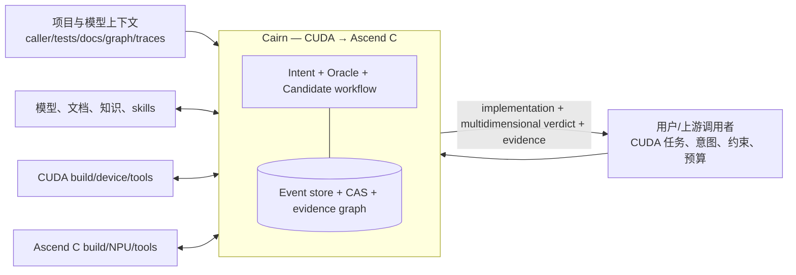
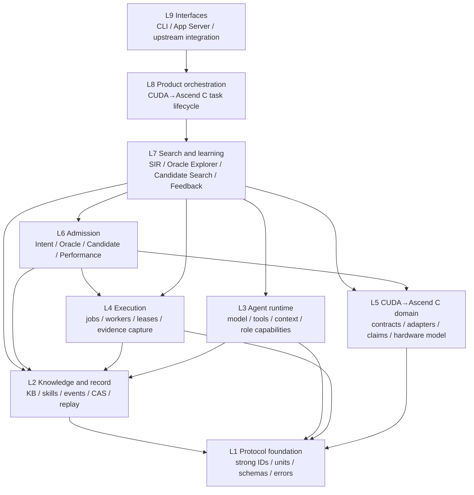
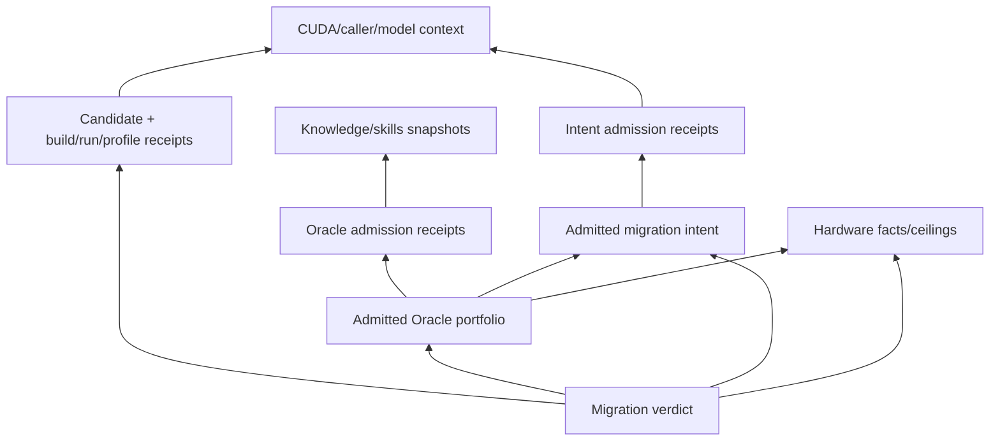
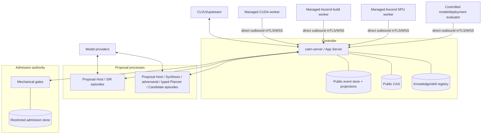

# Cairn 系统设计

- 状态：规范性目标设计
- 日期：2026-08-29
- 产品范围：CUDA → Ascend C 算子移植
- 对应需求：[SYSTEM_REQUIREMENTS.md](SYSTEM_REQUIREMENTS.md)
- 软件架构细化：[design/README.md](design/README.md)
- Agent 架构细化：[design/AGENT_ARCHITECTURE.md](design/AGENT_ARCHITECTURE.md)

## 1. 设计目标

Cairn 是一个专门的 CUDA → Ascend C 移植系统。它从 CUDA kernel 及其必要上下文中恢复用户
真正希望保留的高阶语义，探索并准入能够判断这些语义的 Oracle，搜索 Ascend C 候选实现，
在真实 CUDA/Ascend 环境中获取受控证据，并给出可审计、可反驳、可重放的多维迁移结论。

产品不是一段生成的 Ascend C 代码，而是：

```text
Ascend C implementation
+ admitted user intent
+ admitted Oracle portfolio
+ correctness / numerical / execution / safety / performance evidence
+ real-model feedback and known blind spots
+ an independently adjudicated verdict
```

本设计不把 Cairn 泛化为通用代码生成、通用异构迁移或通用 agent 平台。底层 agent runtime、
record 和 worker 可以保持领域无关，以形成清晰依赖与复用边界；这只是内部工程性质，不扩大
产品目标。只有用户将来作出新的产品决策，才讨论 CUDA → Ascend C 之外的范围。

## 2. 核心设计原则

后续设计和实施还必须逐项满足
[Oracle 设计不变量与实施前检查清单](oracle/DESIGN_INVARIANTS.md)；当前代码或旧实施计划不能覆盖
该清单。

### P1 — 首要目标是恢复用户意图

CUDA 源码是意图证据，不是意图本身。Cairn 优先恢复算法、数值、模型/部署和可观察契约，区分
必须保留的语义与 CUDA/特定硬件的实现伪影。

### P2 — 提案与权威分离

模型、skill、知识库、外部测试、CUDA 行为和 agent 都可以提出 claim。只有独立的准入边界可以
授权 intent、Oracle、hardware fact 或 candidate verdict。

### P3 — 正确性是多平面组合

算法语义、数值接受域、真实执行、内存/并发安全和 Oracle 充分性分别判断。性能是同级产品目标，
但不能补偿任何 required correctness plane 的失败。

### P4 — Oracle 是 claim portfolio，不是 expected bytes

Oracle 的基本单位是带 domain、authority、expected relation、comparator、coverage、strength 和
blind spots 的 claim。固定 expected output 只是其中一种关系。

### P5 — 反馈是证据，不是 reward 真值

上一轮候选、Oracle 误判、profiling、真实模型接入和用户决策都进入下一轮探索，但必须先分类、
归因和准入，不能静默改写已冻结意图、Oracle 或阈值。

### P6 — Hardware roofline 是条件化 ceiling family

理论峰值、microbench 实测 ceiling、算法 roofline 和当前实现 roofline 必须分开。瓶颈结论绑定
dtype、shape、数据流、引擎、memory level、工具链和 device state。

### P7 — 知识扩大探索，不扩大权限

文档、知识库和 skill 的作者与来源只是 provenance。信赖按具体 claim、证据、适用域和生命周期
决定。检索排名、官方标签或模型信心都不是 admission。

### P8 — Model proposes; receipts and trusted code adjudicate

Agent 可以编排、分析和提出下一步实验。机械 gate 从不可变 artifact 和权威 receipt 重算，拒绝
applicant 自报的 `passed`、`trusted` 或“已在真实设备运行”。

### P9 — Model-visible means durably reconstructable

任何影响模型请求的 instructions、tools、history、knowledge/skill snapshot、evidence 和 policy 必须
先有耐久表示。Live provider continuation 可能不同，不能冒充确定性 replay。

### P10 — 强类型是 authority boundary

不同身份、单位、角色、生命周期、证据强度、provenance 和 policy outcome 在 Rust 中是不同的
验证类型。Raw wire/storage 值只存在于 codec 边界，反序列化重新执行构造约束。

### P11 — 失败、未知和冲突都是产品结果

Infrastructure failure、candidate violation、unverifiable claim、authority conflict、budget
exhaustion 和 policy denial 不能互相转换。系统宁可输出窄结论或未知，也不制造虚假 pass。

### P12 — 隔离支持未来优化

高阶意图恢复、Oracle 探索、硬件模型、知识/skill、candidate search 和 admission 通过不可变协议
连接。任何一个子系统可以被更强模型、静态分析或形式化方法替换，而不获得相邻 authority。

## 3. 系统上下文



初始执行单元是“一个 CUDA kernel + 显式 host launch + 对应 Ascend C kernel”。为了恢复意图，
分析窗口可以读取受限 caller slice、模型图和部署反馈；这不把候选执行单位扩大为整个模型。

## 4. 总体架构

```mermaid
flowchart TD
    intake["Task Intake & Evidence Resolution"]
    sir["Semantic Intent Recovery\nproposal-only, isolated"]
    ia{"Intent Admission"}
    intent[["MigrationIntentContract"]]
    oe["Oracle Explorer\nclaims/cases/references/comparators"]
    oa{"Oracle Admission\nhidden controls + receipts"]
    oracle[["AdmittedOraclePortfolio"]]
    cs["Ascend C Candidate Search"]
    ca{"Independent Candidate Admission"]
    verdict[["MigrationVerdict"]]

    hpm["Hardware Performance Model\nspec/microbench/profiler/rooflines"]
    ks["Knowledge & Skill Registry\nclaim trust/lifecycle"]
    feedback["Feedback & Learning\ncounterexamples/model integration"]
    exec["Execution Substrate\nCUDA/CPU/Ascend jobs"]
    rec[("Record/CAS/Evidence graph")]

    intake --> sir --> ia
    ia -->|admitted| intent --> oe --> oa
    oa -->|admitted| oracle --> cs --> ca --> verdict
    ia -->|revise/conflict| sir
    oa -->|revise/reject| oe
    ca -->|diagnostic| cs

    hpm <--> oe
    hpm --> ca
    ks --> sir
    ks --> oe
    feedback --> sir
    feedback --> oe
    verdict --> feedback

    sir -.jobs.-> exec
    oe -.jobs.-> exec
    oa -.jobs.-> exec
    cs -.jobs.-> exec
    ca -.jobs.-> exec
    exec --> rec
    sir --> rec
    oe --> rec
    oa --> rec
    cs --> rec
    ca --> rec
```

### 4.1 五个 authority domain

| Authority domain | 可以做 | 不可以做 |
| --- | --- | --- |
| Proposal | 恢复假设、生成 Oracle/candidate、提出实验 | 授权自己的结论 |
| Execution | 运行授权 job、捕获环境和观察 | 解释算子语义或给 verdict |
| Admission | 验证 claim、运行 hidden controls、从 receipt 重算 | 凭空创造缺失语义 |
| Record | 保存事实、内容、因果和身份 | 决定业务含义 |
| Policy/User | 决定意图冲突、预算、发布阈值和数据权限 | 用主观决定冒充执行证据 |

Agent 可以作为某一 authority domain 的编排器，但权限由 server-enforced capabilities 决定，不由
prompt 中的角色名称决定。

## 5. 分层与依赖



层级表达依赖和 authority，不表达运行时调用顺序：

- Protocol 不知道业务生命周期；
- Record 不产生 verdict；
- Agent runtime 不含 CUDA、Ascend C、Oracle 或 gate 业务词汇；
- Execution worker 不含算子数学、roofline 或 admission policy；
- CUDA→Ascend C domain 层拥有 ABI、意图、Oracle claim、adapter 和硬件知识；
- Admission 与 proposal 实现分离；
- Product orchestration 是唯一组合各 capability 的位置。

## 6. 领域模型与强类型边界

### 6.1 核心 aggregate

独立生命周期分别拥有 event stream：

- `MigrationTask`；
- `IntentRecoveryRun` 与 `IntentAdmissionRun`；
- `OracleExplorationRun`、`OracleReviewRun` 与 `OracleAdmissionRun`；
- `CandidateSearchEpisode` 与 `Candidate`；
- `Job` 与 `Attempt`；
- `KnowledgeClaim` 与 `SkillRecord`；
- `HardwareMeasurementRun`；
- `MigrationVerdict`。

它们通过 typed immutable identity 连接，不被塞进一个可变大对象。跨 aggregate 的 process manager
从事件重建并在重放下幂等。

### 6.2 提案类型与准入类型不可互换

关键编译期边界包括：

```text
IntentHypothesisSet      != MigrationIntentContract
OraclePortfolioProposal != AdmittedOraclePortfolio
HardwareFactProposal    != AdmittedHardwareFact
CandidateObservation    != CandidateVerdict
ExploratoryFeedback     != UserIntentDecision
ReviewedSkill           != ValidatedSkill
TheoreticalPeak         != MeasuredCeiling
CorrectnessOutcome      != PerformanceOutcome
```

不得用 `bool admitted` 或 `String status` 模拟这些差异。状态转换消费前一状态并产生新类型或新
artifact；加载 persisted V1 bytes 必须重新校验所有 invariants。

### 6.3 Identity

- 内容 artifact 使用 domain-separated typed SHA-256 semantic identity；
- aggregate/run/attempt 使用独立生命周期 identity；
- derived identity 不能被当作 CAS bytes identity；
- 相似底层表示不构成 generic ID 抽象理由；
- 容易混淆的 ID、单位、role 和 lifecycle 必须有 compile-fail/equivalent static tests。

Pre-release 期间内部 schema、event、snapshot、artifact 和 protocol 保持单一 V1。设计变化直接修改
V1 并同步更新代码、测试、fixture 和文档；不增加兼容 reader、migration 或 V2。

## 7. 端到端工作流

本节由 Controller 的一个 durable state machine 编排；SIR、Oracle Blue/Red、Candidate 和可选 Planner
是不同的 Agent Loop，不是固定 Agent 数量或 role-specific process。完整 transition、反馈路由、实验路径
和停止语义见 [WORKFLOW_ARCHITECTURE.md](design/WORKFLOW_ARCHITECTURE.md)。

### 7.1 Intake

1. 接收严格 V1 `CudaToAscendMigrationTask`；
2. 归档 CUDA kernel、host launch、caller slice、测试、文档、模型上下文和政策；
3. 区分可归档内容、外部秘密引用和不允许出域的数据；
4. 验证 source entry point、target SoC/toolchain、requested claims 和预算；
5. 生成 mandatory ABI/domain facts 与显式 unknown；
6. 完成 evidence backwards audit 后才能进入探索。

### 7.2 高阶意图恢复与准入

SIR 从静态事实、CUDA 行为、caller/model 上下文和反馈产生多组带证据假设，明确算法意图、数值
意图、部署契约、CUDA 实现伪影和疑似缺陷。详细设计见
[SEMANTIC_INTENT_RECOVERY_DESIGN.md](oracle/SEMANTIC_INTENT_RECOVERY_DESIGN.md)。

Intent Admission 逐 claim 校验证据、冲突、隐藏区分 case 和用户政策。结果是不可变
`MigrationIntentContract`，或局部 `Conflict`、`Unknown`、`NeedsUserDecision`。SIR 本身没有
promotion edge。

首个 SIR evaluation 使用 D-039 的 Cairn clean-room `f32` 一维求和，但其expected claims、domain、corpus
partition和review identity只属于evaluator。按D-042，运行时DeepSeek只接收task source、bounded context和
authorized tools，不接收上述答案；同一production profile/API还必须处理一个语义形态不同的任务。D-040的
预建qualification set已被supersede并删除，proposal-only proof不等待Admission或mechanism registry。
D-041只允许newly authored sanitized V1 fixtures进入测试。

### 7.3 Oracle 探索与准入

Oracle Explorer 按已准入意图生成 claim portfolio、domain partition、reference/property、case、
comparator、execution/safety、adequacy 和 performance proposal。Synthesis 与 adversarial
exploration 是可替换 strategy；使用模型策略时以独立 durable episode 通过冻结 artifact 交互，
也可由 mutation/property/counterexample 等非 Agent 策略承担对抗探索。详细设计见
[ORACLE_EXPLORATION_SYSTEM_DESIGN.md](oracle/ORACLE_EXPLORATION_SYSTEM_DESIGN.md)。

Oracle Admission 从权威 receipt 重算，运行正确实现正控制、错误实现/定向 mutation 负控制、
conflict/domain/bypass/hidden controls，并冻结局部 `AdmittedOraclePortfolio`。现有具体校准机制见
[ORACLE_ADMISSION.md](oracle/ORACLE_ADMISSION.md)；其中明确把当前 reduction/matmul 路径归类为
实现证据，不能用它们替代新的 intent/performance 架构。

### 7.4 Candidate search

1. 以 admitted intent + admitted Oracle + target environment 打开隔离 episode；
2. 模型/搜索器生成 immutable Ascend C candidate 和转换说明；
3. 先做静态/source completeness、ABI 和 target build gate；
4. 再按 Oracle plan 请求 target execution、correctness、safety 和 profiling；
5. trusted judge 返回最小 typed diagnostic，candidate 不能更改 gate；
6. 新修订产生新 candidate identity，历史尝试全部保留；
7. 搜索预算、停止原因和 Pareto frontier 均为 durable facts。

Candidate Search 可以读取公开 Oracle claim 和失败反例，不能读取 hidden admission corpus、trusted
mutant 私有定义、expected-output artifact 或 judge continuation。

### 7.5 Independent Candidate Admission

Candidate Admission 冻结候选后运行，至少分别判断：

- semantic/algorithmic correctness；
- numerical allowance/assurance；
- real build/launch/device/ABI execution；
- memory/concurrency/synchronization safety；
- Oracle adequacy 与 anti-bypass；
- performance target/baseline/roofline；
- model/deployment integration feedback。

Admission-kind-specific Planner 可以选择检查顺序并解释证据，但并非每类 Admission 都必须调用
Agent；required evidence 在 Planner 之前由 trusted policy 机械派生，final gate 只从 trusted records
和 receipts 派生 outcome。业务准入边界见
[INDEPENDENT_ADMISSION_DESIGN.md](oracle/INDEPENDENT_ADMISSION_DESIGN.md)，Planner profile、进程和
软件结构见 [ADMISSION_ARCHITECTURE.md](design/ADMISSION_ARCHITECTURE.md)。

### 7.6 Feedback and learning

Verdict、counterexample、真实模型表现和 operator review 被分类成 typed feedback，进入新的 SIR、
Oracle 或 performance run。它们不会原地修改已准入 artifact。经复现、归因、复用性审查和 claim
admission 后，才进入知识库 T1/T2。

## 8. Semantic Intent Recovery

SIR 是可替换、proposal-only 的独立 Agent Loop，在 Controller/Admission authority 外的通用 Proposal
Host 运行，只读不可变输入。它不是执行 Worker，也不要求专用 SIR binary。主要产物：

- `IntentHypothesisSet`；
- `IntentEvidenceGraph`；
- `IntentConflict` / `IntentUnknown`；
- `SemanticInvariant`；
- `OptimizationFreedom`；
- `ImplementationArtifact`；
- `DisambiguationExperimentProposal`。

它不可读取 hidden admission 或 candidate judge material，不可修改 caller declaration 或
`MigrationIntentContract`。未来可在不改变下游协议的前提下，用更强 IR、静态分析、多 agent 或
形式化工具替换。

## 9. Oracle Explorer

Oracle Explorer 是 claim、case、reference、relation、comparator 和实验的生成/组合器，不是
judge。它保留 authority dependency graph，避免把共享库、共享模型或 CUDA 单次行为重复计为
独立证据。

Oracle 至少覆盖 semantic、numerical、execution、safety、adequacy、performance 六个平面。每个
case 保存 `CaseIntent`；每个 comparator 保存适用 domain 和依据；每项 unknown/conflict 保持可见。

当前模型驱动的 Blue/Red profile 是 synthesis/adversarial strategy 的一组实现证据，其 role、缓存、
外部研究和 artifact-mediated 修订机制必须遵循
[Oracle Explorer 设计](oracle/ORACLE_EXPLORATION_SYSTEM_DESIGN.md) 与
[Agent 架构](design/AGENT_ARCHITECTURE.md)。它们不是永久固定的 Agent 拓扑；无论采用何种 strategy，
都必须消费已准入意图并服从本设计更严格的 proposal/admission 边界。

## 10. Hardware Performance Model

Hardware Performance Model 独立管理：

- T0 官方/机器规格事实；
- T1 受控 microbench 实测事实；
- benchmark registry/generator；
- profiler adapter 与字段校准；
- algorithm/implementation intensity；
- conditional multi-ceiling roofline；
- bottleneck hypothesis；
- workload-weighted performance evaluation。

理论 peak、实测 ceiling、candidate observation 和业务 target 是不同类型。Roof 必须绑定 SoC、
dtype、shape、engine、memory level、数据流、并发、toolchain 和 device state。详细设计见
[PERFORMANCE_ORACLE_DESIGN.md](oracle/PERFORMANCE_ORACLE_DESIGN.md)。

## 11. Knowledge 与 Skill Registry

知识以 claim 为单位采用 T0–T3 层级和 Candidate→Reviewed→Admitted→Retracted 生命周期；skill
采用 Unaudited→Reviewed→Validated→Refuted 生命周期。作者身份永远只是 provenance，内容变化
使验证失效，撤回触发反向影响审计。

Agent 按 role 进行 progressive disclosure 查询和 skill 加载。Reviewed skill 可以在受限探索中
使用并带 provenance，但不能支持 admission、改 policy 或扩大工具权限。详细设计见
[KNOWLEDGE_AND_SKILL_TRUST_DESIGN.md](oracle/KNOWLEDGE_AND_SKILL_TRUST_DESIGN.md)。

## 12. Agent runtime

`cairn-agent` 保持业务中立，提供：

- durable episode/turn/step；
- protocol-native model continuation 与 semantic turn；
- role-scoped tool/capability catalog；
- deterministic model-input projection；
- model template、deployment、protocol、transport、credential 分层；
- token/turn/tool/wall-time/external-meter budgets；
- cancellation、ambiguous effect 和 recorded/live replay；
- knowledge/skill snapshot 注入记录。

Model transport 只完成一次 provider exchange；tool 执行、重试、预算和终止由 runtime 控制。不同
role 不共享私有 continuation。Retrieved content 永远是 data，不获得 instruction authority。

当前 OpenAI Responses、Chat Completions 和 Anthropic Messages 的 native continuation 设计继续
有效；provider 选择与 CUDA→Ascend C 业务解耦。详见 [RECORD_REPLAY.md](RECORD_REPLAY.md)。产品侧
Agent-capable function、strategy、profile、episode、Host、process 和 authority 的定义及当前派生 catalog 见
[AGENT_ARCHITECTURE.md](design/AGENT_ARCHITECTURE.md)。Agent-capable 位置数量不等于模型调用数、并发数
或进程数，功能存在也不等于必须使用 Agent。

## 13. Execution substrate

Worker 执行 opaque `JobContract`，不知道 Intent、Oracle、candidate 或 migration stage。Job 冻结：

- input bundle、command、environment 和 output declarations；
- placement/resource/network/sandbox policy；
- stream/artifact/evidence limits；
- retry/effect semantics。

Attempt evidence 分为 candidate-writable workspace 和 worker-controlled evidence channel。后者记录
argv、binary/image、mount、exit、timing、device/launch observation 和 declared output ingestion。

Controller 负责资源匹配、reservation、lease、attempt、reconciliation 和权威 receipt；worker
heartbeat 只证明 liveness，不证明某项外部 effect 是否发生。CUDA source、Ascend build 和 NPU
device 是不同 capability，不能因共处一台机器而混合 authority。

现有 worker、调度、资源探测和 Docker 边界分别见
[WORKER_EXECUTION.md](WORKER_EXECUTION.md)、[SCHEDULER.md](SCHEDULER.md)、
[RESOURCE_PROBING.md](RESOURCE_PROBING.md) 和 [ENROLLMENT.md](ENROLLMENT.md)。

## 14. Record、证据与 replay

### 14.1 Event 与 CAS

Event store 保存 aggregate identity、revision、causality、schema V1、canonical payload 和 actor
provenance。CAS 保存精确 bytes 并在读写时重算 typed content identity。Projection 可重建，event 和
artifact 不可原地修改。

### 14.2 Evidence graph



完成任务前执行 backwards audit。任何 verdict-relevant identity 必须能解析到内容、权威 event 或
明确的 secret/external reference。缺边不能产生 `Admitted` 或 `Satisfied`。

### 14.3 Replay

- recorded replay 重用历史外部答案和 receipt，可确定性重建决策；
- live rerun 可能得到不同模型/设备结果，是新 run；
- counterfactual branch 从历史边界开始，保留父身份但不修改历史；
- retracted knowledge 或过期 hardware fact 触发 revalidation，不重写旧 verdict。

## 15. MigrationVerdict

顶层 task outcome 与 claim outcome 分开。

### 15.1 Task outcome

- `Completed`：按 policy 得到完整多维结论；
- `Incomplete`；
- `Cancelled`；
- `BudgetExhausted`；
- `InfrastructureFailure`；
- `NeedsUserDecision`。

### 15.2 Claim outcome

- `Satisfied`；
- `Violated`；
- `Unknown`；
- `Conflict`；
- `NotApplicable`；
- `NotExecuted`；
- `InfrastructureFailure`。

### 15.3 Evidence strength

Claim 还携带离散强度，例如 proven、exhaustive、specification-derived、independent-differential、
property-supported、empirical、unsupported。数值 provenance 与 assurance 分开。

发布 policy 可派生：

- `AdmissibleForDeployment`；
- `CorrectButPerformanceRejected`；
- `BlockedByCorrectness`；
- `BlockedByUnknownOrConflict`；
- `EvidenceIncomplete`。

这些是强类型 policy outcome，不是存储在底层 comparison 中的布尔字段。每个结果列出 scope、
failed claims、blind spots、assumptions、unverified claims 和支持 receipt。

## 16. 性能与成本调度

### 16.1 验证资源梯度

| 层级 | 资源 | 主要目的 |
| --- | --- | --- |
| V0 | CPU/静态工具 | schema、意图/Oracle 提案、reference、case、property、host control |
| V1 | CUDA source device | 源行为、sanitizer、数值/执行观测 |
| V2 | Ascend build | compile/link/ABI/静态 artifact |
| V3 | Ascend NPU | 真实 correctness/safety/performance/device evidence |
| V4 | 模型/部署环境 | e2e integration、first divergence、业务加权效果 |

这是一条成本/证据梯度，不是 schema 版本。一个 proposal 在最便宜的 decisive failure 处停止。
Provider turn、人工审批和外部服务是独立搜索预算，不排在硬件层级末端。

### 16.2 Performance search

性能搜索维护 Pareto frontier，结合业务目标、production baseline、hardware ceiling、remaining
headroom、下一检查成本和可验证性决定是否继续。只有在 correctness 前置 gate 和 measurement
admission 满足时，才输出发布级性能结论。

## 17. 安全和信赖边界

Trusted computing base 包括：

- canonical schema/identity/strong-type invariants；
- authorization、role/capability scoping；
- record/CAS integrity；
- job assembly、worker evidence capture 和 receipt；
- trusted derivation/comparison/mutation/adjudication；
- 明确限制的 deployment/data policy。

“属于 TCB”只表示 authority placement，不表示已经正确。每个 verdict-relevant mechanism 和 policy
仍需 exact qualification receipt、negative/tamper/fault controls、适用范围和 revalidation trigger；
最低层 trust root 保持小型并明确残余假设，不能由自身或另一个 agent 自我认证。

它不包括：

- 模型输出、SIR/Oracle/candidate proposal；
- 外部文档、tests、knowledge 或 skill 的正文；
- CUDA source 的语义正确性；
- candidate-writable output；
- profiler 未校准解释；
- UI summary 或 applicant 自报状态。

任务在任何 provider、网络或 remote execution 前解析 data-boundary policy。Worker sandbox 是可重放
与意外损害边界，不声称敌对多租户安全。无法独立观测 device/binary/launch 时，结果必须标为
unverified。

## 18. Failure 与恢复

| 类型 | 示例 | 处理 |
| --- | --- | --- |
| Proposal defect | schema 错、证据缺、错误 identity | 原子拒绝，给可修复 diagnostic |
| Intent/authority conflict | 文档、CUDA、模型行为不一致 | 保留 conflict，请求实验或用户决策 |
| Candidate violation | build/结果/safety/perf 不满足 | claim-scoped fail，允许候选修订 |
| Infrastructure failure | store/worker/device/tool 失败 | 不转为 candidate fail；按 effect policy 恢复 |
| Ambiguous effect | provider/job 可能执行但未确认 | reconcile，不盲重试 |
| Policy denial | 数据、网络、设备或预算不允许 | durable denial |
| Unverifiable | 无足够 intent/Oracle/allowance authority | 输出 unknown/unverifiable，不降级 pass |
| Knowledge invalidation | claim/skill 被撤回 | impact audit + revalidation |

重启从 event、CAS、projection revision、operation authority 和 attempt journal 恢复。没有 durable
start authority 不得重新 dispatch 外部 effect。

## 19. 部署拓扑



Workers 在 operator 已有可路由私网/VPN 上通过 direct outbound mTLS/WSS 连接 Controller，公共 durable
task truth 留在 Controller。Single-lab Controller listener 绑定 `0.0.0.0` 并发布 VPN 可达 endpoint；
目标架构没有 SSH tunnel、反向拨号或 Cairn 自建 VPN。Controller 保持模块化单体；SIR、Oracle
synthesis/adversarial、typed Planner 和 Candidate 都以隔离 durable Agent episode 运行；capability/data
boundary 相同的 episode 可共用通用 Proposal Host，不同边界按 policy 拆 Host instance。Admission gate 与 restricted material
位于独立 authority process。首期可以共用一台受控主机和相同存储技术，但 public/restricted 使用
不同数据库/CAS root、进程身份和 capability port。

同一 Host 内的 episode 仍只能通过冻结 artifact、typed request/diagnostic 和 durable event 交互；不能
共享 private continuation、mutable scratch context、pending tool result 或未提交推理。多 Agent 共识、
投票和重复反思不形成新的 evidence strength。详细交互和调用策略见
[AGENT_ARCHITECTURE.md](design/AGENT_ARCHITECTURE.md)。

Hardware Performance Model 首期是 Controller 内的独立确定性领域服务，不因概念数量提前微服务化。
Hidden admission job 的资源调度经过 Controller，但 payload/evidence 使用 Admission 与已分配 Worker
之间的一次性 restricted capability，不能落入 public CAS。详细进程、存储、网络和恢复设计见
[RUNTIME_ARCHITECTURE.md](design/RUNTIME_ARCHITECTURE.md)。

## 20. 外部接口

App Server 暴露稳定 product resources，而不是内部 event enum：

- `Task`、`IntentRecoveryRun`、`MigrationIntent`；
- `OracleExplorationRun`、`Oracle`；
- `CandidateSearchEpisode`、`Candidate`；
- `ExecutionAttempt`、`Artifact`、`Receipt`；
- `HardwareFact`、`PerformanceClaim`；
- `Feedback`、`MigrationVerdict`；
- approval、subscription 和 authorized export。

Client lifecycle item 可有 started/updated/completed/failed；瞬时 delta 可在 backpressure 下丢失，
durable facts 必须可查询。Public protocol 与 internal schema 在 pre-release 都保持当前 V1，修改时
直接更新当前定义，不保留兼容层。

## 21. Rust workspace 责任

现有 crate 边界继续作为基础；新的业务能力优先在稳定接口后落位，不因文档先行立即拆 crate。
目标代码结构和以下责任表的具体化见
[CODE_ORGANIZATION.md](design/CODE_ORGANIZATION.md)：

| Crate/area | 责任 | 禁止承担 |
| --- | --- | --- |
| `cairn-protocol` | 强类型 identity、单位、envelope、V1 schema/error vocabulary | 业务 workflow |
| `cairn-codec` | canonical V1 encoding/strict decode | domain decisions |
| `cairn-record` / SQLite adapter | events、CAS ports、projection、audit/replay | verdict policy |
| `cairn-agent` | domain-neutral agent/model/tool/context/budget runtime | CUDA/Ascend/Oracle 业务 |
| `cairn-execution` | jobs、attempts、workers、leases、receipt | 算子语义与 judge |
| `cairn-verification` | generic claim/admission/comparator/mutation/verdict mechanics | 提案模型或 vendor source |
| `cairn-cuda-ascend`（目标；直接替换当前 `cairn-migration`） | CUDA→Ascend C task、intent/Oracle/candidate workflow 与 domain artifacts | provider/worker implementations |
| `cairn-server` | composition、API、provider/worker/storage adapters | 可复用 domain logic |
| `cairn-proposal-host`（DEV-022最小实现） | 隔离承载已有SIR/Candidate role-scoped proposal episode | admitted constructor、restricted store、Worker credential |
| `cairn-sir`（已删除） | DEV-008 one-shot SIR typed ingress/capability历史proof | DEV-022接管后无兼容路径；只在Git history保留 |
| `cairn-admission`（目标） | restricted store、typed mechanical gates、公开 decision surface | model transport、applicant 修改 |
| `cairn-worker` | opaque authorized execution | product adjudication |
| `cairn-testkit`（目标） | fake/recorded providers、fault injection、fixtures | production shortcuts |

`cairn-migration` 的替换发生时直接更新当前 V1、全部调用者和测试并删除旧 crate 名，不保留 alias、
re-export facade 或双路径。Hardware、knowledge、feedback、intent、Oracle 和 candidate 首期作为产品
crate 内模块；未来是否继续拆 crate，由真实依赖、第二种实现或独立部署需求证明，不由概念数量决定。

## 22. Cairn 自身的验证

每个 authority boundary 至少需要：

- unit/property tests：canonicalization、state、units、domain 和 comparison；
- compile-fail/static boundary tests：容易混淆的 ID、state、role、unit 和 evidence；
- contract suites：store、model adapter、executor、worker、profiler、knowledge loader；
- positive/negative/conflict/unknown/bypass controls；
- mutation：admission、summary、policy、identity edge；
- fault injection：external effect 前后、commit、crash/restart、lease/reconcile；
- hardware-free recorded lanes 与声明的 CUDA/Ascend hardware lanes；
- historical regressions 和真实模型 feedback replay；
- 第二个语义形态不同的 CUDA kernel，验证边界而非泛化产品。

任何新 gate 都必须证明 honest path 可通过、目标 perturbation 确实发生且会变红、false reject 被
控制，并声明没有覆盖什么。

## 23. 当前实现状态与设计差距

截至 2026-08-29，以下基础已经存在或已有已记录控制：

- 强类型 V1 protocol/codec、event/CAS、record/replay；
- agent provider/continuation/tool/budget 基础；
- worker enrollment、资源探测、调度、lease、Docker 执行和跨架构发布；
- generic job/call-adapter/input/output/receipt 边界；
- structured migration domain、boundary/dtype/memory obligations；
- historical reduction 的 host admission→candidate verdict 控制；
- 固定 `matmul-zero-k` f32 的模型提案→物化→真实 host adapter→比较管线；
- Blue/Red role、external-test research 和 artifact-mediated dogfood；
- 一条窄的 DeepSeek SIR → 用户决定 → Intent Admission → local Oracle publication → DeepSeek Candidate →
  remote no-device Ascend build → native diagnostic → DeepSeek repair → native rebuild 控制链；最新 native
  rebuild 为 `SubjectFailed`，不构成 native success、NPU correctness 或 verdict。

以下是目标设计，尚不能由上述控制宣称完成：

- 通用 Proposal Host 中的 SIR/Oracle/Candidate Agent Loop 与完整 Controller process manager；
- claim-scoped authority graph 和多假设 intent contract；
- 完整 Oracle portfolio 与多平面 verdict；
- 真实 CUDA 和 Ascend C candidate adapter/device attestation；
- target sanitizer、并发/同步和 anti-bypass 证据；
- hardware facts、microbench、profiler calibration 和 multi-roofline；
- performance admission 与真实模型闭环；
- 知识/skill registry、claim lifecycle、retraction propagation；
- hidden-corpus exposure/burn/replenishment 与 feedback contamination control；
- verifier mechanism/policy qualification 和反向影响审计；
- 完整 Agent profile catalog、invocation policy、artifact-mediated interaction 和同 Host episode isolation；
- 第二个真实 CUDA→Ascend C kernel 端到端控制。

设计完成不等于这些能力已实现。未来开发顺序与 gate 由
[开发计划设计](dev/README.md) 管理，当前实现事实与历史控制摘要由
[CURRENT_BASELINE.md](dev/CURRENT_BASELINE.md) 管理，详细旧账本通过 Git 历史追溯。

## 24. 被拒绝的架构方案

| 方案 | 拒绝理由 |
| --- | --- |
| 把 Cairn 定义为通用异构迁移系统 | 稀释已明确的 CUDA→Ascend C 目标，容易使抽象和评估漂移 |
| 从 CUDA 单次输出直接生成最终 Oracle | 固化 source bug、未定义行为、偶然数值和实现伪影 |
| 同一 agent 同时生成 candidate 和自我判分 | 共同错误、泄漏和 reward hacking，缺乏 authority separation |
| SIR 直接输出正式意图契约 | 无法独立优化/替换，错误抽象会直接污染所有下游 authority |
| 全局 `atol/rtol` 或一个总置信分 | 混淆 domain、数值语义、证据强度和冲突 |
| 性能达标补偿 correctness 失败 | 产生不可接受的错误迁移 |
| 用单一宣传峰值判断 roofline | 忽略 dtype/shape/engine/dataflow/measurement 条件 |
| 把官方文档、知识或内置 skill 自动设为可信 | 作者/来源不等于 exact claim 已被证据支持 |
| 让 Admission Agent 自报通过 | 第二个模型不是机械独立 judge，必须从 receipt 重算 |
| 只保存最终 artifact/summary | 无法重放、撤回、定位共同依赖或审计反馈演化 |
| 预先建立 schema V2/兼容 reader | Cairn 尚未建立公共兼容基线，违反 pre-release V1 规则 |

## 25. 需求追踪

| 设计区域 | 主要需求 |
| --- | --- |
| CUDA→Ascend C 产品和 task | FR-TASK-*、FR-CAND-* |
| Intent Recovery/Admission | FR-INTENT-*、FR-TASK-005/006/007 |
| Oracle Explorer/Admission | FR-ORACLE-*、QR-AUD-* |
| Performance/hardware | FR-PERF-*、FR-CAND-*、FR-COST-* |
| Knowledge/skills/feedback | FR-KNOW-*、FR-FEEDBACK-*、FR-REC-*、FR-AGENT-* |
| Agent runtime 与产品 Agent topology | FR-AGENT-* |
| Execution/deployment | FR-EXEC-*、QR-REL-*、QR-SEC-* |
| Record/replay/identity | FR-REC-*、QR-AUD-*、QR-MNT-* |
| API/open source | FR-API-*、FR-EXT-*、QR-OSS-* |

本次架构刷新已经把 intent、performance、knowledge/skill 和 feedback 义务补入
`SYSTEM_REQUIREMENTS.md`。D-039、D-041 冻结 evaluator fixture 与 historical fixture policy；D-042 冻结
runtime-model-first 的近期验证顺序并 supersede D-040 的预建 qualification profile。这些边界是规范性目标，
不应被旧的较窄 Oracle 实施计划或历史 review 流程覆盖。
