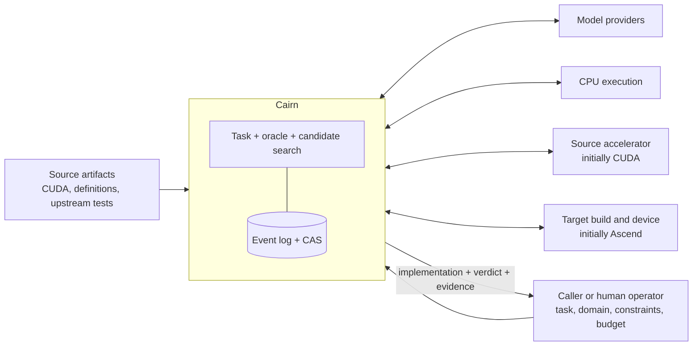
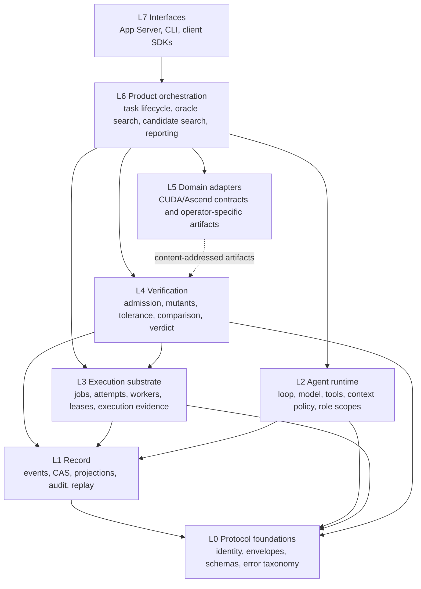
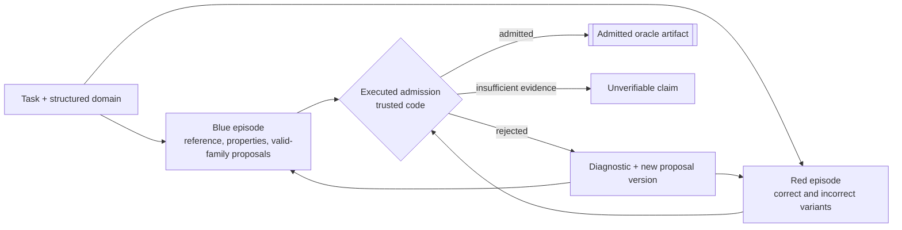
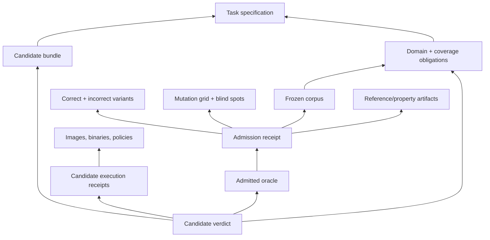
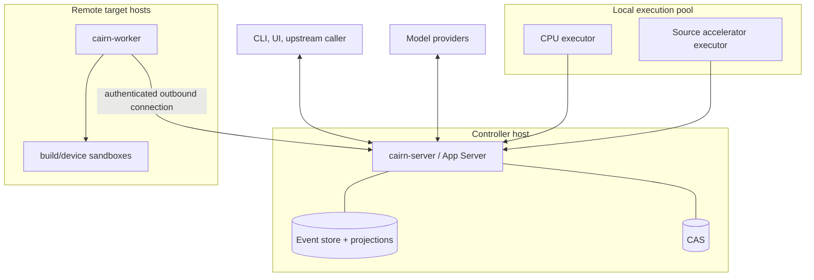

# Cairn system design

- Status: normative target design
- Date: 2026-08-24
- Satisfies: [`SYSTEM_REQUIREMENTS.md`](SYSTEM_REQUIREMENTS.md)

## 1. Design objective

Cairn is one product with several internal authorities. It must let agents propose work without
letting agents decide whether their own work is trustworthy. It must execute operator-submitted migration jobs on heterogeneous private machines without making
remote workers understand product semantics. It must return a
verdict without losing the requests, decisions, artifacts, failures, and assumptions that produced
that verdict.

The architecture therefore separates four kinds of responsibility:

1. **proposal** — agents and external sources may propose semantics, cases, variants, and candidates;
2. **execution** — workers run authorized opaque jobs and capture observations;
3. **adjudication** — trusted verification code derives and applies admission/verdict policy;
4. **record** — append-only facts and immutable content preserve what every other part did.

The single-repository decision removes release and deployment coupling between the earlier Cairn and
Alloyport repositories. It does not erase these responsibility boundaries.

## 2. Design principles

### P1 — The product is a claim plus evidence

A generated kernel without an admitted oracle and a traversable evidence chain is an intermediate
artifact, not a completed migration.

### P2 — Models propose; code adjudicates

Models may author domain claims, references, properties, variants, and target implementations. They
may not author generic mutants, tolerance derivation, comparison, or the final admission/verdict
decision used on their own work.

### P3 — Model-visible means durably reconstructable

The record, not mutable runtime memory, is the source from which model input is projected. Anything
new that can affect a model request needs a durable representation before dispatch.

### P4 — Execution is opaque; meaning stays above it

A worker executes a job contract. It does not know whether the job is an oracle calibration, source
gate, build, correctness run, or performance measurement.

### P5 — Identity follows bytes and decisions

Verdict-relevant content is immutable and content-addressed. Decisions that select content are
recorded. Derived identities are explicit and never masquerade as stored bytes.

### P6 — Failure is information, not an inconvenience

Recoverable subject defects, infrastructure failures, ambiguous effects, false rejects, blind spots,
and unverifiable claims have different types and different recovery paths.

### P7 — Spend the cheapest decisive resource

For each proposal, validation stops at the cheapest layer that can decide it. Provider spend is a
separate search budget, not the last rung of the hardware validation ladder.

### P8 — Generality is demonstrated by a second real user

Neutral names do not make a framework. The second materially different operator must pass without
modifying generic runtime, execution, or verification core types.

## 3. System context



Cairn can be invoked directly through its CLI/API or by a larger migration system. Upstream
feedback may constrain a new task or report a measurement. Method remains inside the search unless
it is introduced as an explicit, versioned policy change.

## 4. Vocabulary and containment

| Term | Meaning |
|---|---|
| **Task** | One bounded migration objective and its immutable inputs. |
| **Episode** | One role-scoped agent run within a task, such as oracle author, breaker, or candidate author. |
| **Turn** | Work initiated by one admitted input to an episode and ending when the episode yields control. |
| **Step** | One model request and the tool operations it causes before another model request. |
| **Operation** | One durable tool invocation with effect and recovery semantics. |
| **Job** | An opaque execution request suitable for a local executor or remote worker. |
| **Attempt** | One concrete execution of a job. Retries are new attempts. |
| **Artifact** | Immutable bytes with content identity and provenance. |
| **Claim** | A statement whose subject, scope, strength, assumptions, and evidence are explicit. |
| **Oracle proposal** | Unadmitted domain/reference/property bundle. It cannot judge a candidate. |
| **Oracle artifact** | An immutable proposal version that passed admission for a stated scope. |
| **Calibration** | Executed evidence that an oracle accepts required honest paths and rejects required attacks. |
| **Candidate** | A target implementation proposed during kernel search. |
| **Receipt** | A canonical record of one check or execution, citing its inputs and observations. |
| **Verdict** | Cairn's adjudicated result over a candidate, oracle, domain, policy, and evidence set. |
| **Projection** | A rebuildable view derived from durable events and immutable content. |
| **Branch** | A new execution lineage derived from a historical boundary without changing its source. |

The public API uses product resources (`Task`, `Episode`, `Attempt`, `Oracle`, `Artifact`, `Verdict`).
Internal runtime event variants are not automatically public protocol commitments.

Semantically different identities and states remain different Rust types throughout production
logic. A `TaskId` is not an `EpisodeId`; a `ContentId<T>` is not an aggregate ID; a stream revision is
not an event sequence; and an empirical assurance is not a proven bound. String, integer, and byte
representations are confined to validated codec, protocol, and storage adapters. Generic `Id`, raw
digest, and boolean status fields are not substitutes for domain types.

## 5. Architectural layers



The layer number expresses authority and dependency, not call-stack order. Product tools registered
with the agent runtime may call verification and execution services, but `cairn-agent` does not
import those services. Composition occurs in the product layer through ports.

### 5.1 Layer invariants

- L0 contains no workflow or domain policy.
- L1 contains no product verdict logic.
- L2 contains no migration, operator, CUDA, Ascend, or gate vocabulary.
- L3 contains no operator mathematics or verdict adjudication.
- L4 contains generic verification method but does not compile operator-specific mathematics into a
  deployed worker.
- L5 domain-specific behavior enters as immutable artifacts or product adapters.
- L6 is the only layer that binds agent roles, tools, verification, execution, and task policy.
- L7 translates stable resources and events; it does not own task truth.

## 6. Proposed Rust workspace

The first implementation should prefer a small number of stable boundaries over many single-purpose
crates. The target decomposition is:

| Crate | Owns | Must not own |
|---|---|---|
| `cairn-protocol` | identifiers, canonical envelopes, schema versions, shared error/effect vocabulary | persistence, runtime services, domain policy |
| `cairn-codec` | canonical JSON encoding/decoding, strict V1 schema checks, conformance fixtures | domain decisions, persistence, workflow |
| `cairn-record` | store ports, event semantics, projections, graph audit, replay loading | SQL, model calls, job execution, verdict policy |
| `cairn-store-sqlite` | SQLite event/projection/coordination adapters and initial content metadata | product, agent, execution, or verdict policy |
| `cairn-agent` | episodes, steps, model/tool/context capabilities, role scopes, budgets | CUDA/Ascend/gates/worker scheduling |
| `cairn-execution` | job/attempt contracts, leases, capability matching, executor/worker ports, evidence capture | oracle meaning or operator mathematics |
| `cairn-verification` | claim strength, oracle admission, tolerance provenance, mutants, comparison, calibration, verdict | provider SDKs, worker deployment, operator source |
| `cairn-migration` | task aggregate, domain bundle schemas, oracle/candidate workflows, product tools, report assembly | storage/transport implementations |
| `cairn-app-server-protocol` | stable external request/response/notification types and schema generation | runtime implementation |
| `cairn-server` | composition root, API, stores, scheduler, provider adapters | reusable domain logic that belongs in libraries |
| `cairn-worker` | remote worker process and supported execution backends | product adjudication |
| `cairn-cli` | reference client and local operator experience | alternative implementation of server logic |
| `cairn-testkit` | scripted/recorded providers, fake clock, fake executor, fault injection, fixtures | production shortcuts |

Domain adapters may begin inside `cairn-migration` while only one source/target pair exists. A new
crate is justified when a second adapter demonstrates a stable interface, not before.

All production crates live in one workspace. A single verification entry point runs formatting,
linting, tests, strict schema conformance, dependency boundaries, mutation controls, and documentation
links while preserving each failing exit status.

`cairn-protocol` exposes typed SHA-256 semantic identities and typed UUIDv7 lifecycle identities.
The algorithm enum is deliberately closed to SHA-256 in V1. `cairn-record` owns canonical event
identity material and derives `EventId` only after sequence allocation; storage adapters call that
shared trusted function rather than inventing identity rules. Physical blob hashes remain an
internal `ContentStore` concern and cannot satisfy an API requiring `ContentId<T>`.

## 7. Top-level product state

### 7.1 Task aggregate

A task is a projection over immutable inputs and durable events. Its coarse state is:

```text
Created
  → InputsResolved
  → OracleSearch
  → OracleAdmitted
  → CandidateSearch
  → VerdictReady
  → Completed
```

From any active state it may also become `Suspending`, `Suspended`, `Cancelling`, `Cancelled`,
`BudgetExhausted`, `Incomplete`, or `InfrastructureBlocked`. `Fail` is not a task infrastructure
state; it is a candidate verdict.

State transitions are accepted through commands with an expected aggregate revision. Successful
commands append events atomically. Snapshots accelerate reads but carry the last applied event
identity and can be discarded.

### 7.2 Separate aggregates

The system avoids one enormous task record. Independently consistent lifecycles have their own event
streams:

- task;
- episode;
- operation;
- job and attempt;
- oracle proposal and admission run;
- candidate;
- verdict.

Relationships are immutable identities in events. Cross-aggregate workflows are driven by durable
process managers that are idempotent under event replay.

## 8. End-to-end workflow

### 8.1 Intake

1. The server validates a versioned task specification.
2. Content inputs are archived in CAS; external secret references are classified and excluded.
3. Canonical task identity is derived.
4. The caller's minimum structured contract produces mandatory base cases and explicit unknowns.
5. A role-scoped domain-analysis/blue episode may propose evidence-citing refinements without
   rewriting the caller declaration.
6. Source probing, upstream/external test proposals, and historical failure obligations challenge
   both declarations and refinements.
7. Oracle admission adjudicates these separate sources into an immutable admitted-domain artifact or
   returns a conflict/insufficient-evidence result.
8. Policy resolves allowed providers, tools, machines, budgets, oracle strength, and data boundary.
9. `TaskInputsResolved` is appended only after all model-visible and verdict-relevant identities are
   explainable.

### 8.2 Oracle search



Blue and red are role scopes, not necessarily model identities. Different model families reduce a
shared-prior risk but are not the adjudication authority. Admission is code and executed evidence.

The detailed contract is in [`ORACLE_ADMISSION.md`](ORACLE_ADMISSION.md).

### 8.3 Candidate search

1. A candidate episode is opened with a frozen oracle identity and restricted product tools.
2. The model proposes a candidate bundle.
3. Source validation checks completeness and self-consistency without remote execution.
4. A target build job compiles and links the bundle.
5. An admitted correctness plan schedules only the still-needed source/reference and target runs.
6. Trusted verification code compares observations and emits a receipt.
7. Recoverable rejection is returned as typed diagnostic evidence to the same episode.
8. The model may inspect, revise, and submit a new immutable candidate version within budget.
9. A terminal candidate verdict and task result are assembled without discarding earlier attempts.

The model should not retype candidate, manifest, gate, or job identities already present in a cited
receipt. Product tools take the smallest independent input and derive the rest from trusted records.

### 8.4 Result assembly

The server walks the evidence graph before completing a task. A missing required edge yields
`Unverifiable` or `InfrastructureFailure`, depending on whether evidence cannot exist or should exist
but is missing. It never yields an incomplete `Pass`.

The exported result is a manifest pointing to canonical artifacts and receipts, not an archive whose
directory layout defines semantics.

## 9. Agent runtime design

### 9.1 Capability seams

A capability seam is complete only when it defines:

1. a service contract;
2. one or more providers;
3. a consumer;
4. durable facts required for reconstruction;
5. permissions and failure/effect semantics.

Initial seams:

| Seam | Decides | Example providers |
|---|---|---|
| `ModelTransport` | which bytes are sent and returned | HTTP/provider SDK, recorded bytes, scripted fake |
| `ModelAdapter` | what provider bytes mean semantically | Responses-like, chat-like, Anthropic-like, recorded turn |
| `ToolGateway` | validation and result of a tool operation | product tool registry, recorded tools, scripted fake |
| `TurnInputPolicy` | instructions, tools, context, pending results visible this step | full history, skill injection, recorded decision |
| `ApprovalGateway` | whether a policy-sensitive action may proceed | static policy, interactive client, recorded decision |
| `Clock/IdSource` | time and generated operational identity | system, deterministic test provider |

Recorded providers are ordinary providers, not replay flags in the loop.

### 9.2 Model provider stack

Cairn does not define a universal provider message format. A provider-neutral semantic turn is useful
for tool validation, the agent loop, replay, and inspection, but it cannot losslessly represent every
protocol's continuation requirements. The model boundary therefore has two coordinated products:

- a durable semantic turn consumed by domain-neutral runtime logic; and
- a protocol-native continuation containing the exact ordered items, messages, blocks, and
  correlation identities needed to materialize the next request.

Model selection is resolved through independent layers:

| Layer | Owns | Must not decide |
|---|---|---|
| model template | wire model plus per-protocol context/output bounds, tools, reasoning, parallel-call, schema capabilities, defaults, and model quirks | endpoint, account, or secrets |
| runtime alias | operator-facing choice of template, deployment, and optional bounded generation overrides | model capabilities |
| deployment | provider label, protocol choice, HTTPS endpoint, credential reference, transport bounds, and data boundary | model capability declarations or agent-loop behavior |
| protocol codec | request encoding, response decoding, usage extraction, and native continuation | HTTP, retries, tools, or vendor routing |
| transport | one bounded HTTP exchange and byte limits | response semantics or tool execution |
| credential resolver | dispatch-time header value from an external reference | durable model configuration |

The provider label is attribution, not dispatch logic. A deployment's `protocol` selects one of the
initial codecs:

| Protocol | Native continuation that must be preserved | Tool-result correlation |
|---|---|---|
| OpenAI Responses | typed output items, including reasoning and function-call items | function `call_id` |
| OpenAI Chat Completions | ordered messages and the exact assistant tool-call message, including compatible reasoning extensions | `tool_call_id` |
| Anthropic Messages | ordered content blocks, including `thinking`, `redacted_thinking`, and `tool_use` where returned | `tool_use_id` |

Reasoning replay is protocol-native state, not normalized assistant text:

| Family/profile | Local retention and resend rule |
|---|---|
| OpenAI Responses, stateless | Preserve every ordered output item. Profiles using OpenAI opaque reasoning add `include: ["reasoning.encrypted_content"]`, then retain and resend the returned encrypted field. |
| DeepSeek Chat | Preserve the exact assistant message. When it contains tool calls, the DeepSeek template requires `reasoning_content`; Cairn refuses to prepare a continuation if it is absent. |
| Anthropic Messages | Preserve ordered `thinking`, `redacted_thinking`, and `tool_use` blocks. Thinking text/signature and redacted data are returned without modification during the tool-use turn. |

These artifacts use the content domain `agent.native-model-continuation-sensitive.v1`. Raw responses
already contain the same material, so native continuations inherit the raw-response sensitivity
classification: ordinary logs and default exports must cite identities, not print thinking content.
Encryption at rest remains a deployment/storage responsibility until Cairn has an explicit encrypted
CAS capability.

The prepared request also cites `agent.native-model-request-state-sensitive.v1`, which binds the
exact provider request identity to its base continuation, selected protocol, and offered tool names.
This artifact is what makes a response decodable after process loss: recovery does not depend on an
in-memory codec object retaining the previous request boundary.

The codec must retain unrecognized but policy-allowed native blocks in the archived continuation or
fail explicitly; it must not silently coerce them into text. Tool arguments remain untrusted bytes
until Cairn's schema validator accepts them. The SDK/transport performs one provider turn only. Tool
execution, retry authority, budgets, and episode termination remain in the generic runtime.

V1 uses locally reconstructable continuation. OpenAI Responses deployments therefore set
`store=false`; Chat Completions and Anthropic Messages replay their recorded native history. A future
hosted continuation ID may be recorded as external evidence, but it cannot be the sole reconstruction
authority. Changing model, template revision, deployment, protocol, or codec version creates a new
episode or explicit counterfactual branch rather than mutating an episode's frozen selection.

Model characteristics and operator deployment choices are stored separately. Repository-maintained
`model-templates/<vendor>/<model>.json` files own the wire model, per-protocol capability profiles,
protocol-specific request settings, and safe defaults. User configuration states which template is
enabled, which protocol/output form to use, its endpoint and authentication reference, the data
boundary and transport bounds, and optional generation overrides. It never asks the operator to
retype whether the model supports tools, parallel calls, reasoning, or a context size.

The initial DeepSeek V4 Pro template declares the OpenAI Responses, OpenAI Chat Completions, and
Anthropic Messages combinations exercised or required by this project. The runtime example enables
Responses, matching the prior Alloyport integration evidence; choosing Chat or Anthropic requires
only a different deployment protocol and endpoint. A private deployment changes those user-owned
fields without copying the model template. Future conformance receipts can qualify a particular
endpoint's actual behavior without moving model capability declarations back into user config.

Template files are versioned data rather than Rust constants. Resolution validates the selected
protocol section and user overrides, then freezes the template's typed content identity, model
capabilities/defaults, and user deployment into the episode snapshot. Updating a template affects
new resolutions only; an old episode continues to cite its exact template revision.

Authentication shape is also deployment configuration rather than a protocol inference: official
OpenAI commonly uses Bearer and official Anthropic uses `x-api-key`, but a compatible gateway may
make a different choice. Cairn validates that only an external secret reference is present; a live
deployment check determines whether its configured endpoint accepts that authentication shape.

**Implemented:** `cairn-agent` now has the strict runtime model catalog, strongly typed quantities,
the separate `ModelTemplateRegistry`, three protocol-specific template sections, bounded preference
overrides, capability and credential-reference validation, and a content-addressable frozen
resolution. `model-templates/deepseek/deepseek-v4-pro.json` supplies model characteristics while
`config/runtime-models.example.json` contains only the enabled Responses deployment. The native
protocol slice now provides closed per-protocol history variants, typed tool-call correlations,
model-template replay policies, and sensitive CAS archival for both continuation and prepared
request state. One parse of immutable response bytes produces the native continuation and semantic
turn; `agent.native-continuation-recorded`, `agent.model-response-decoded`, and every
`agent.tool-call-proposed` fact commit in one optimistic event batch. The generic `AgentStep` and
`AgentEpisode` paths reject independent semantic decoding for native requests and can recover the
exact request context from events plus CAS after memory loss. A hardware-free two-step fixture runs
model tool call → trusted binding/execution → durable result → native result correlation → second
model yield, while checking byte-identical reconstruction. These tests do not claim that a fresh
live model output is deterministic.
The bounded HTTPS transport reads its credential file only at dispatch, marks authorization headers
sensitive, disables redirects, applies configured connect/request/body limits, extracts validated
usage receipts, and preserves not-sent/rejected/ambiguous effect classes. The opt-in DeepSeek
Responses conformance executable performs a real tool call and tool-result continuation around a
SQLite/CAS close-reopen boundary, checks byte identity before the second dispatch, and rejects a
missing or repeated tool call. It emits identities, usage, and boolean checks only; thinking and
answer bodies remain archived rather than printed.

The wire rules are based on the provider documentation current at implementation time:

- [OpenAI Responses create reference](https://developers.openai.com/api/reference/cli/resources/responses/methods/create)
  requires reasoning items in manually managed context and documents encrypted reasoning for
  stateless/ZDR operation.
- [DeepSeek thinking mode](https://api-docs.deepseek.com/guides/thinking_mode/) requires
  `reasoning_content` to be returned with tool-calling assistant messages, while ordinary completed
  turns may omit it; [DeepSeek multi-round chat](https://api-docs.deepseek.com/guides/multi_round_chat/)
  makes client-side history reconstruction explicit. Its
  [Responses reference](https://api-docs.deepseek.com/api/create-response/) likewise describes the
  endpoint as stateless and requires the client to supply complete input history.
- [Anthropic extended thinking](https://platform.claude.com/docs/en/build-with-claude/extended-thinking)
  requires thinking blocks in a tool-use turn to be returned complete and unmodified.

### 9.3 Durable versus live events

The runtime distinguishes:

- **durable facts** — admitted input, prompt block selected, model request committed, response bytes
  received, tool call decoded, operation state changed;
- **live interception points** — authorization, request decoration, streaming observation, telemetry;
- **ephemeral UI updates** — partial token/output deltas that may be useful live but do not establish
  durable truth unless committed into a final item.

An interception point cannot be the only location of verdict-relevant or model-visible information.

### 9.4 Step transaction boundary

Before provider dispatch, Cairn appends a `ModelRequestPrepared` event citing the canonical request
bytes and all input decision identities. Dispatch authority follows only after that append commits.

After provider response:

1. raw response bytes are stored;
2. a response-received event cites them and provider metadata;
3. semantic decoding creates a derived turn identity and records the decoded content;
4. tool calls are validated into durable operations;
5. the next request is projected from committed facts.

A crash may produce an ambiguous provider attempt. Cairn records ambiguity; it does not invent a
response or automatically bill a duplicate request without policy authority.

### 9.5 Role scopes

Each episode receives a typed capability set:

- blue can read task/source semantics and submit oracle proposals;
- red can read the proposal contract needed to attack it and submit variants;
- candidate author can read the frozen oracle's public contract and diagnostics but not modify
  admission inputs;
- no role receives store or worker credentials;
- sensitive capabilities are enforced by server-side registration, not prompt text.

Subagents, when introduced, create child episodes and return content-addressed reports. Their full
events remain available without automatically spending parent model context.

## 10. Execution substrate design

### 10.1 Job contract

A job contains:

- schema version and logical job identity;
- immutable input bundle root;
- execution backend and environment/image identity;
- argv/entry contract with no shell interpretation unless explicitly selected;
- resource requirements and capability selectors;
- sandbox, mount, network, timeout, output, and evidence policy;
- expected output descriptors and size limits;
- idempotency/effect classification.

Product task kind is metadata owned by the workflow, not an execution enum variant.

**Implemented controller kernel (2026-08-24).** `cairn-execution` archives the canonical V1 job
contract only after verifying its typed input-bundle and environment references. Its current
identity covers logical job, input, environment, backend, command, resources/capabilities, network,
and configurable stdout, stderr, diagnostic, trusted-evidence, and declared-output bounds. Mount
and richer sandbox/effect policy remain part of the target contract above. The command is an exact
sandbox-relative program plus argv; there is no shell-string or host-path form in the contract.

Attempt authority is linear and durable:

```text
Authorized → Started → Completed(receipt)
                     ↘ NotStarted → fresh AttemptId may be authorized
                     ↘ Ambiguous  → reconciliation required
restart after Started without a terminal fact → InDoubt
```

The executor port receives authority only after `Started` commits. A recovered `Authorized` fact can
reconstruct start authority, but a recovered `Started` fact cannot reconstruct execution authority.
Completed recovery reloads every cited CAS artifact and revalidates outcome/exit semantics, byte
bounds, output completeness, observed backend/environment, canonical output ordering, and receipt
lineage against the frozen contract. Recorded and scripted executors provide deterministic seams.

**Implemented F2 Docker path (2026-08-25).** `docker-v1` consumes strict input-bundle and Docker
environment artifacts from worker-local CAS. It accepts only a full immutable local image ID and
uses one deterministic container name per `AttemptId`. Worker startup recovers locally journaled
starts and reconciles absent, created, running, or exited Docker state. Terminal streams and
declared outputs are bounded by the job contract; the worker commits the terminal observation and
outbox message before cleanup. The real Hello World gate is documented in
[`WORKER_EXECUTION.md`](WORKER_EXECUTION.md).

### 10.2 Worker protocol

**Implemented durable control kernel (2026-08-24).** The domain layer now distinguishes stable
`WorkerId`, process/boot `WorkerIncarnationId`, logical `AssignmentId`, bounded `LeaseId`, durable
`ControlMessageId`, short-lived `ControlConnectionId`, and connection-local `ControlSequence`.
Authentication is a replaceable trusted capability that resolves transport evidence to a stable
principal, exact `CredentialId`, and operator-authorized worker pool; the controller permanently
binds subject and pool to the logical worker while binding the credential to one incarnation.
Static protocol, binary, observed platform, backend, capability, quantitative startup observation,
provenance, and concurrency data is a canonical content-addressed profile.
Dynamic health, drain state, available slots, and the worker's advisory active-attempt set are a
separate content-addressed heartbeat snapshot.

Registration rejects a second incarnation while the first is live. An incarnation replacement is
accepted only after explicit disconnect or a configured session timeout, and the replacement fact
records the old incarnation and exact expiry boundary so recovery can recheck the decision. Static
placement and dynamic availability matching are generic and contain no product task kind.

**Implemented resource-placement kernel (2026-08-25).** Native architecture, operating system, and
target environment are strong extensible selector types. `cairn-worker` derives them from the
compiled/running binary; serialized `expected_platform` fields are assertions that fail closed and
cannot overwrite the observation. Every profile resource claim retains whether it came from a
built-in probe, operator declaration, controller verification, or external attestation. The V1
profile content domain prevents the new meaning from being confused with earlier flat capability
bytes.

A worker hello may introduce only built-in platform observations and operator-declared
backend/capability claims. It cannot label its own bytes `ControllerVerified` or
`ExternalAttestation`; those assurance levels require a later trusted controller challenge or
attestation adapter and a separate authoritative fact.

**Implemented startup resource observation (2026-08-25).** Worker profile V1 embeds one immutable,
versioned startup observation for the process incarnation. The Linux host probe records logical
CPU count, total memory bytes, available bytes on a configured scratch filesystem, accelerator
namespace discovery completeness, and canonical device facts. Every device has a strong device ID
and zero or more equality capabilities such as driver or PCI identity. CPU counts and each byte or
device quantity are distinct positive Rust/wire types; a value from one unit cannot be passed as
another without an explicit conversion.

Operator configuration selects probe paths, independently optional expected minima, whether
accelerator discovery is disabled, and an optional freshness duration. These values are assertions
and policy only: they never become observed capacity. A missing configured accelerator namespace
is a complete empty observation of that namespace; disabled discovery or an unreadable device is
partial. Unit mismatch, arithmetic overflow, duplicate device/capability identity, expectation
mismatch, future evidence, and expired evidence fail closed. The initial `/sys/class/accel`
adapter is deliberately generic and does not claim to discover every vendor device class.

Job contract V1 carries optional logical-CPU, memory-byte, scratch-byte, accelerator-count, and
discovery-completeness requirements. An accelerator requirement also contains canonical per-device
capabilities; only devices satisfying all of them contribute to its count. Scheduler filtering and
assignment recheck use the caller's observation time, so expired evidence cannot remain eligible.

**Implemented dynamic resource authority (2026-08-25).** The startup observation remains part of
immutable profile identity, while a distinct typed CAS domain and `worker-resources-observed` fact
hold the current observation. Worker refresh has an independently optional interval and never
extends heartbeat liveness. Reconnect performs a new probe before hello. The projection retains the
exact observation ContentId, worker-stream event revision, and optional controller/external
admission evidence. Worker transport can submit only `BuiltinProbe`; higher assurance requires an
on-demand trusted admission capability citing an independent evidence `EventId`.

Placement snapshot V1 and scheduler event V1 freeze that resource evidence. A reservation owns its
CPU, memory, scratch quantities and deterministic accelerator device IDs. Unreleased reservations
are subtracted before selection, missing previously reserved devices fail closed, and SQLite
optimistic concurrency serializes competing claims. Assignment grant requires the exact resource
ContentId, revision, and admission evidence observed at placement; even a beneficial refresh makes
the old snapshot stale rather than silently changing its meaning.

All current job-contract, worker-profile, registration, scheduler, and snapshot formats are V1.
During pre-release development an incompatible change replaces the V1 definition and requires
development-state rebuild; runtime readers reject non-V1 data and contain no conversion path.

An immutable `PlacementRequest` now separates optional platform constraints, an authenticated-pool
allow-list, and additional capability equality from timeout and backend. Pool membership comes from
controller enrollment rather than worker hello. Registration persists it beside the authenticated
subject and rejects an implicit change on restart. `cairn-migration` will decide which evidence and
opaque job are needed, then produce this domain-neutral request; the execution scheduler—not the
migration adapter—selects a concrete worker. Agent role and migration stage never become worker
profile fields.

Assignment delivery uses a two-phase authority boundary:

```text
AttemptAuthorized
  → AssignmentLeased (persist before send)
  → AssignmentAccepted (worker has persisted admission; still cannot execute)
  → AttemptStarted (controller grants the one-shot execution capability)
```

Each `AttemptId` owns exactly one assignment aggregate, so restart cannot create parallel active
leases for the same attempt. Before `AttemptStarted`, an expired lease is reaped as
`BeforeExecutionStart`; the same attempt authority may then be placed again using fresh assignment
and lease identities. After `AttemptStarted`, lease expiry is `ExecutionInDoubt` and grants only a
reconciliation requirement. Renewal requires an unexpired accepted lease, the current live worker
incarnation, and a heartbeat no older than the accepted/renewed assignment state that names the
attempt active. Heartbeat presence never establishes start, completion, or cancellation.

The assignment grant freezes distinct offer/start logical message identities before either can be
sent. The controller then has a durable event-sourced outbox: enqueue precedes delivery, delivery
mappings precede transport send, and only a valid cumulative acknowledgement removes a logical
message. Acknowledgements normally piggyback on logical traffic; an explicitly recorded
acknowledgement-only frame closes the peer outbox when there is no message to send. A reconnect
creates a fresh connection sequence while retaining the same logical message identity. A crash
after `AttemptStarted` but before start-message enqueue can therefore reconstruct
the exact start message from the persisted assignment binding instead of inventing a second
execution identity.

The worker journal is a separate storage authority. It atomically commits immutable admission plus
the acceptance response before acknowledging an offer, commits start before constructing one-shot
executor authority, and atomically commits a terminal observation plus its worker outbox response.
A restart after local start without terminal observation is explicitly in doubt and cannot invoke
the executor again. Remote terminal observations are not authoritative on arrival: the controller
checks the exact worker/incarnation/assignment/lease/attempt/contract binding, accepts post-start
lease expiry only as reconciliation state, reruns all capture/receipt validation, and publishes one
terminal execution fact. Duplicate delivery after publication is recognized without overwriting the
receipt.

Assignment material is also a separate readiness boundary. The controller fully verifies the
contract's typed `InputBundleArtifact` and `ExecutionEnvironmentArtifact` in CAS and freezes their
identities, lengths, and chunk policy in the durable offer. While that offer remains pending, the
authenticated assigned worker requests sequential ranges through an efficient `ContentRangeStore`
port. Chunk messages are ephemeral protocol V1 data movement, never domain facts. One controller
logical message remains in flight, preventing control/chunk interleaving. The worker syncs each
range to a private per-offer regular file and resumes from exact length after reconnect. It derives
both typed identities while publishing the assembled files into its own SQLite/CAS; only that
persistence result can authorize admission and offer acknowledgement. Start does not trust this
earlier proof: it reopens both local objects before appending the start fact. Aggregate limits are
independently optional; positive chunk size and exact base64-expanded wire fit are startup-checked.
Create-only sandbox-tree expansion remains later adapter work.

V1 frames use strict canonical JSON behind explicit encode/decode functions. The frame byte budget
is a typed configuration value with `None` as its disabled state. Logical outboxes and admissions
persist storage-domain payloads rather than treating a network frame as a domain fact. A test uses
independent controller and worker SQLite event stores, drops both directions' acknowledgements,
reopens both stores, replays on fresh connections, executes once, reconciles the result, and proves
both outboxes empty after another reopen.

**Implemented outbound transport slice (2026-08-25).** `cairn-control-transport` now carries only
binary canonical JSON over WebSocket on a mutually authenticated TLS stream. The worker verifies
the controller certificate and DNS name; the controller verifies the client chain, hashes the
verified leaf DER, and admits a hello only when that fingerprint is durably registered to the exact
strong `WorkerId`. A `Welcome` freezes a fresh `ControlConnectionId`
and negotiated protocol version before either side accepts control frames. TLS/WebSocket bytes
never become execution facts by themselves.

**Implemented enrollment bootstrap slice (2026-08-25).** Normal worker onboarding no longer
requires an operator to create or copy a worker private key, certificate, and logical identity.
`cairn-server enrollment create` first appends an expiring `EnrollmentId` offer with a secret digest
and controller-authorized pool, then writes one non-overwriting `0600` bundle. The bundle pins a
separate server-authenticated enrollment endpoint; the normal control endpoint continues to require
a client certificate during TLS negotiation.

`cairn-worker enroll` creates a `0700` state directory, persists its `0600` private key and exact
CSR before network access, and submits the CSR with the one-shot authority. The issuer overwrites
CSR subject, CA, usage, lifetime, and serial policy while retaining and verifying the worker public
key. The serial is a rotatable `CredentialId`; the controller independently creates the stable
`WorkerId` and binds the configured pool. Issuer certificate/key mismatch fails startup, and the
worker verifies the returned leaf binds its staged key before committing public material.

The append-only singleton registry stores offer and issuance events but never the bearer secret.
An issuance records the CSR digest, certificate result, fingerprint, stable worker, credential, and
pool. After a lost response, the same secret plus exact staged CSR returns the persisted result even
after token expiry; another CSR is rejected. A fresh controller rebuilds
fingerprint-to-credential/worker/pool authentication from that stream.

**Implemented one-command join F1 (2026-08-25).** Enrollment bundle V1 carries two explicit trust
domains: the one-shot bootstrap endpoint and the externally routable ordinary-control endpoint.
Each includes its own TCP/WebSocket authority, TLS server name, and pinned CA, so isolating
bootstrap does not force matching DNS or certificates and a worker does not reconstruct endpoint
configuration from deployment convention.

`cairn-worker join <bundle> <state-dir>` composes the existing enrollment port with a fixed local
layout, running-binary SHA-256 identity, Linux host/platform probe, strict V1 configuration, and
preflight validation. The identity private key remains worker-local under `identity/`; scratch and
journal locations are relative to the fixed root. If a valid configuration already exists, join
checks that it still names the bundle's controller and managed identity, probes it, and leaves its
bytes untouched. The generated profile contains no model, oracle, migration stage, or product role.
Because the executable backend remains unimplemented, initial availability is explicitly
unavailable/draining with zero slots. Service integration and explicit backend activation remain
F2 rather than being smuggled into bootstrap.

**Implemented credential-authority foundation (2026-08-25).** Registration V1 records the exact
`CredentialId` independently of stable subject, `WorkerId`, pool, and incarnation. The controller
uses the managed certificate fingerprint only to find the credential record, then derives the
stable principal from controller-owned worker identity. A live incarnation cannot switch
credentials; after explicit disconnect or expiry, a replacement incarnation may use another
credential while subject and pool remain fixed.

The enrollment registry now projects independent append-only facts for credential revocation,
logical-worker disablement, and unused-enrollment revocation. Inactive authority is checked before
registration and on each active control-loop iteration, so an observed managed session is closed
and its reconnect is rejected. This application check remains authoritative even when certificate
chain validation succeeds. SQLite schema V1 uses WAL plus immediate writer transactions so a
separate administrative command and the running controller serialize authority facts without a
deferred read-to-write deadlock.

**Implemented explicit registry lifecycle E2a (2026-08-25).** Credential and unused-enrollment
revocation, worker disable/re-enable, and worker-pool reassignment now take an operator-supplied
strong `CommandId`. Projecting the complete history precedes replay recognition, so corrupt history
cannot be hidden behind an old command; exact schema and payload retry returns the original event,
while command reuse with different input fails closed. Pool ownership is a separate per-worker
projection with its own authority revision. Reassignment is admitted only while the worker is
disabled and only when the pool changes.

The controller resolves every new certificate handshake from the current durable registry rather
than its startup enrollment snapshot. If pool authority changed, it first appends
`execution.worker-pool-assigned`, citing the exact registry event. The execution projector admits
that fact only after durable disconnect or the exact configured session expiry and then permits
registration in the new pool. Authentication subject, credential/incarnation boundaries, and the
rule rejecting implicit pool change remain intact. The managed mTLS integration exercises a live
worker through disable, reassignment, re-enable, automatic reconnect, and restart-safe cross-link
projection.

**Implemented registry inspection E2b (2026-08-25).** Read-only inspection is another adapter over
the same projector, not a parallel SQL read model. Every list/show/audit request reads and validates
the complete singleton registry stream at one explicit wall-clock instant. The versioned report is
ordered by strong IDs and exposes the current worker-pool authority revision, disabled state,
credential fingerprint/provenance, rotation predecessor/successor and retirement boundary, plus
the effective credential state. Audit returns causal head and aggregate counts only after all
history invariants pass. Report DTOs reject unknown fields and unsupported versions; CLI stdout is
JSON-only, while not-found and invalid-history diagnostics remain on stderr. Secret digests,
certificate bodies and private material never enter the report boundary.

**Implemented registry authority E1 (2026-08-25).** Controller schema V1 has no static enrollment
array or import command. Normal authentication, liveness authority checks, candidate discovery,
and grant rechecks consume only the persistent registry. An empty registry is a valid startup state
for a fresh open-source deployment, and workers enter it only through managed enrollment.

**Implemented safe credential rotation slice (2026-08-25).** Enrollment authority V1 distinguishes
bootstrap from rotation. A rotation offer freezes the exact active predecessor credential,
controller-owned worker/pool, and configured optional overlap. Issuance V1 creates a fresh
`CredentialId` and certificate while recording predecessor lineage and its exact retirement
instant. Registry replay admits both credentials inside the overlap, then derives predecessor
retirement from the frozen fact; `null` disables automatic retirement and requires explicit
revocation.

Each worker rotation has an immutable `rotations/<EnrollmentId UUID>/` directory containing its
fresh `0600` key, exact CSR, issued certificate, CA, and predecessor manifest. Only `identity.json`
is atomically replaced. Exact staged-CSR replay closes response and local-commit loss windows.
Worker configuration V1 includes a positive identity-manifest poll interval: a running process notices
cutover, closes its old connection, reloads material, and reconnects under a new incarnation while
the predecessor is still authorized.

If a successor is revoked before predecessor retirement, registry projection cancels that pending
retirement; the worker can then validate and atomically restore the predecessor manifest. Once the
deadline passes, both authority projection and local rollback fail closed. The mTLS integration
test exercises failed-successor rollback, another rotation, live-process cutover, exact issuance
recovery, old-certificate rejection after overlap, and final successor revocation.

**Implemented scheduler reservation kernel C1 (2026-08-25).** The execution layer now separates an
immutable `PlacementId`, capacity-bearing `ReservationId`, downstream `AssignmentId`, and bounded
`LeaseId`. A placement freezes a content-addressed snapshot of the canonical worker candidate set.
Each entry cites exact incarnation, credential, profile, resource observation, availability, and
heartbeat evidence, captures the controller-owned authority revision when the adapter has one, and
records the first stable rejection reason or its capacity inputs. Policy
`stable-worker-id-quantitative-v1` filters first and then chooses the lowest eligible stable
`WorkerId`; selection is therefore replayable rather than a function of map iteration or connection
arrival order.

The reference C1 capacity authority is a singleton append-only scheduler ledger. Before assignment
grant it commits one reservation against registered concurrency and current reported availability.
Independent SQLite writers race through expected revision, so one physical slot cannot produce two
successful reservations. Assignment grant then reloads the exact worker snapshot and rechecks
current application credential authority; changed heartbeat/profile/incarnation/credential or
revocation fails closed.

Reservations are conservative. They are released only when assignment recovery proves terminal
execution or expiry before start. A reservation never becomes reusable for an in-doubt started
attempt. If a crash occurs after reservation but before assignment, a separately configured
positive claim deadline permits release only while the assignment stream remains absent. The
singleton ledger is an initial correctness boundary, not a permanent scale claim; it can be sharded
later while retaining placement/snapshot/reservation identities.

**Implemented scheduler composition C2 (2026-08-25).** The controller now derives its canonical
candidate set from persistent registry enrollment, reloads the registry for every placement-
authority observation, and cites the latest registry event. Contract preparation,
placement reservation, conditional attempt authorization, assignment grant, and durable offer
enqueue form one
recoverable application service. Callers retain strong identities for every boundary; exact retry
recovers the prior assignment phase and never invents a second lease. Revocation after snapshot but
before grant fails closed, while reservation release remains limited to unclaimed, proven
pre-start-expired, or terminal assignments and continues to reject execution-in-doubt state.

The new `cairn-migration` translation layer retains V0–V3 validation meaning above the execution
boundary and emits only generic platform, authenticated pool, backend, capability, timeout, and
resource constraints. A SQLite-backed fixture reaches the selected worker's durable outbox without
placing migration-stage vocabulary in execution types. Scheduler enablement, algorithm version,
reservation claim time, lease time, and session time are explicit configuration; scheduler
enablement may be turned off without disabling reconciliation.

After a worker heartbeat is durably accepted, the controller returns an ephemeral
`HeartbeatAccepted` message. This resets the worker's independently configurable controller-silence
deadline without entering either durable control outbox. It conveys connection liveness only: it
cannot acknowledge a control sequence, prove an execution attempt, renew a lease, or create a
verdict-relevant fact.

Runnable `cairn-server` and `cairn-worker` composition roots now connect this adapter to separate
SQLite authorities. The server durably registers and heartbeats workers, validates inbound
sequence/acknowledgement cursors, drains its durable outbox, and reconciles worker messages. The
worker derives active-attempt heartbeats from its journal, durably admits offers, records start
before executor authority, drains its result outbox, and supervises outbound reconnects. Managed
mTLS integration reconstructs live authority through independent SQLite readers, while execution
tests cover durable outbox/journal replay. All wire-size, handshake, idle, heartbeat,
polling, reconnect, and diagnostic bounds are configured; `null` disables an optional control.

Bootstrap intentionally composes a `NotStarted` executor and unavailable/draining availability.
Schema-V1 configuration may activate `docker-v1` only by coherently changing execution mode, the
exact advertised backend, and ready one-slot availability. Typed material replication, resumable
transfer, Docker supervision, bounded capture, terminal publication, and worker-start recovery are
implemented. Accelerator device exposure, additional network modes, concurrency greater than one,
and service deployment remain later demand-driven slices.

**Implemented cross-link release slice (2026-08-25).** The repository pins Rust 1.85.0,
cargo-zigbuild 0.21.8, Zig 0.14.1, `Cargo.lock`, and a GLIBC 2.28 ceiling. One release entry point
builds `cairn-server` and `cairn-worker` for both `x86_64-unknown-linux-gnu` and
`aarch64-unknown-linux-gnu`, then rejects the result unless its ELF machine, interpreter, maximum
GLIBC symbol, and shared-library set match the frozen target contract. Sorted archives use a fixed
source epoch and contain checksums plus commit/toolchain metadata. The deployment gate rebuilds each
archive independently and executes the workers on both real host architectures; target machines
contain no Rust or C build toolchain.

Workers dial the controller. A connection establishes:

- stable worker identity and unique process incarnation;
- binary/protocol version;
- built-in-observed OS/architecture/target environment and available execution backends;
- controller-authorized worker pool, separately from any business or agent role;
- device capabilities and current policy state;
- supported evidence/attestation features.

Assignment lifecycle:

```text
Queued → Leased → Starting → Running → Uploading → Completed
                    ↘ Failed
                    ↘ Ambiguous
Expired lease → Reconciliation → Retry or operator decision
```

The controller owns lease reaping. A worker heartbeat is evidence of liveness, not proof that an
individual external effect did or did not occur.

### 10.3 Evidence boundary

An attempt has two output domains:

1. **job workspace** — operator-submitted files and useful diagnostics; its results are not verdicts;
2. **worker evidence channel** — argv, resolved image/binary, mounts, stream bytes, exit status,
   timing, declared output ingestion, and device observations, inaccessible to candidate writes.

The worker reads expected outputs through bounded, duplicated paths where practical. Streaming UI
output is never the only durable capture path.

### 10.4 Execution backends

Implemented backend:

- `docker-v1` for operator-submitted CPU build and validation jobs.

Device-aware Docker execution may be added when the migration workflow reaches source-accelerator
or target-device validation. It is not a separate orchestration platform.

An out-of-process backend can be added behind the job/attempt protocol. It must not require a fork of
product or agent logic.

## 11. Verification architecture

`cairn-verification` operates on claims, observations, policies, and immutable artifacts. It does not
call a model. It may request jobs through an execution port and then adjudicate their receipts.

**Implemented verification foundation (2026-08-25).** `cairn-verification` now owns strict V1,
domain-neutral `AdmissionPolicy` and `NumericalAllowance` contracts. Variant minima, required
construction/fault classes, structural-independence rules, saturation rounds, accepted strengths,
required execution scopes, and incomplete-budget outcome are explicit immutable policy fields; the
verifier supplies no hidden global profile defaults. Allowance magnitude uses exact canonical
decimal bytes rather than binary floating point. Provenance and assurance remain independent,
held-out validation requires non-empty identity-disjoint derivation/validation corpora, and the
trusted classification boundary prevents asserted or external-prior-only values from being
upgraded by assurance metadata. Only proven-bound or exhaustive-finite assurance can reach the
unqualified-domain-wide class; held-out evidence reaches empirical at most.

This foundation does not claim executed admission. Admitted-domain/frozen-corpus artifacts, receipt
lifecycles, variant build/execution, mutation-grid adjudication, historical reduction controls,
candidate judgment, and complete evidence-graph validation remain target work for M2.

**Implemented proposal artifact graph (2026-08-25).** Strict V1 manifests now preserve the caller
domain and its explicit unknowns separately from evidence-citing refinements; corpus cases retain
source, source provenance, license provenance, and coverage obligations without becoming trusted by
origin. Authorship records caller/human/model/repository/external origin without trust promotion;
model authorship requires an exact episode and model-configuration artifact. Correct variants must
cite a construction claim whose closed justification vocabulary has no “passes the oracle under
test” alternative. Wrong variants instead cite a distinct fault class and fault-injection evidence.
Domain-refinement, corpus-provenance, construction, and fault-injection evidence use separate content
identity domains.

`OracleProposal` cites the task inputs, caller domain, separate refinements, corpus proposal,
reference/property proposals, source-admission plan, valid-family plan, observation plan, requested
strength, and authorship. Its strict schema has no admission policy, allowance, trusted mutant,
comparison policy, or decision field. This graph establishes immutable proposal inputs only: the
full mandatory corpus, execution, admission receipt, and adjudication remain unfinished.

**Implemented strongly typed migration-domain slice (2026-08-25).** `cairn-migration` now defines a
strict V1 caller-domain body for operator entry point, ABI-ordered buffers and scalar parameters,
buffer roles, dtypes, fixed/symbolic shapes, logical shape-symbol sources and ranges, tile/alignment
moduli, input-value families, invalid-input behavior, requested semantics, claim kind, and explicit
exclusions. Buffer name, scalar-parameter name, shape-symbol name, argument index, dimension axis,
rank, extent, ordinary integer, modulus, and status code are distinct Rust types; compile-fail
controls prevent cross-unit assignment. Domain validation rejects duplicate ABI positions/names,
dtype/range mismatch, unknown shape symbols, disagreement between logical and ABI ranges, and
ambiguous shape-parameter bindings.

Trusted `BoundaryV1` derivation emits complete one-variable-at-a-time assignments for valid minima,
maxima, zero/empty, one/singleton, lower/upper interiors, representable invalid neighbors, and the
first/last below-at-above tile boundaries. A shape backed by a scalar ABI parameter updates both
typed assignments together. Cases retain typed obligations and the caller-declared invalid behavior
rather than inventing an expected status. Dtype and memory-surface patterns are derived by separate
typed policies described below; historical target-failure families and executable case
materialization remain target work.

Trusted `DtypePatternsV1` derivation emits typed construction obligations for floating, signed
integer, unsigned integer, and boolean inputs without encoding recipes as strings or generic numeric
values. It covers exact dtype extrema, positive/negative zero, normal/subnormal boundaries,
infinities, quiet/signaling NaN, unit cancellation, and a deterministic mixed-scale cancellation
sequence. The caller must classify negative zero, subnormal, infinity, and NaN families separately
as supported, invalid with explicit behavior, explicitly excluded with a content identity, or
unknown. Exclusion identities must also occur in the domain's canonical exclusion set. These are
construction obligations, not yet concrete corpus bytes or executed observations.

Trusted `PointerAndAliasingV1` derivation covers null addresses, violated non-trivial alignments,
one-byte capacity shortfalls, exact buffer aliasing, and applicable one-byte partial overlaps at
valid non-empty shapes. Required alignment, misalignment offset, capacity shortfall, overlap offset,
and canonical buffer pair remain distinct Rust types. The domain must classify every memory
condition as supported, invalid with explicit behavior, explicitly excluded with a content identity,
or unknown, and it must declare every distinct ABI buffer pair exactly once. The derivation omits
non-empty pointer cases for zero-only buffers and does not claim partial overlap for two one-byte
regions. These obligations still require isolated byte materialization and execution before they
become observations.

Its core modules are expected to include:

- domain and coverage obligations;
- observation vocabulary for scalar, tensor/array, status, determinism, and invocation evidence;
- reference/property/implicit oracle plans;
- tolerance provenance, assurance, and per-case numerical allowance;
- versioned admission profiles for variant counts, class coverage, independence, saturation, and
  budget-exhaustion outcomes;
- generic mutants and mutation-grid classification;
- admission checks and calibration receipts;
- candidate comparison and verdict receipts;
- evidence-graph validation.

The verifier consumes an immutable `AdmissionPolicy`; it does not embed one global variant count.
The policy identity participates in the admission identity and its configured stopping reason is
recorded. Numerical allowance is modeled as value plus independent provenance and assurance fields.
Held-out derivation/validation overlap is rejected by identity before adjudication, and empirical
passes remain visibly distinct from proven or exhaustive claims.

Operator-specific reference source, properties, corpus material, and call adapters travel in a
versioned bundle. The trusted runner provides generic ABI/execution machinery. Adding an operator
does not redeploy operator mathematics in worker binaries.

The full proof model is in [`ORACLE_ADMISSION.md`](ORACLE_ADMISSION.md).

## 12. Record and identity architecture

### 12.1 Event store

Every event has:

- event identity;
- aggregate kind and identity;
- aggregate sequence/revision;
- schema name and version;
- causal command identity and optional parent event;
- timestamp as an observation, not ordering authority;
- canonical payload bytes;
- optional actor/session provenance.

Append uses expected revision. Global ordering is not required for truth; cross-stream process
managers use explicit causality and idempotency keys.

V1 persists event payloads and structured artifacts as canonical UTF-8 JSON through `cairn-codec`.
The event/aggregate model is format-neutral; envelopes carry encoding and schema identifiers so a
future codec is an explicit versioned transformation. JSON object ordering, numbers, duplicate keys,
escaping, and unknown fields are defined by conformance fixtures rather than delegated to a
particular serializer's defaults.

The first store adapter is SQLite. `cairn-store-sqlite` implements append-only streams, command
idempotency, transactional outbox, projections, leases, attempts, checkpoints, and artifact-reference
metadata behind `EventStore`, `ProjectionStore`, `CoordinationStore`, and `ContentStore` ports.
Product crates do not import SQLite APIs or SQL schemas. Immutable content bytes may initially live
in filesystem blobs with SQLite metadata; that layout is an adapter detail.

### 12.2 Content store

The CAS stores exact bytes and verifies content identity on write and read. Canonical structured
artifacts define their encoding version. Large trees use a canonical manifest whose entries cite
content objects.

Secrets are references, not artifacts. Derived identities use explicit domain separators and types.

### 12.3 Identity graph



Completion walks this graph and validates every required object, schema, and identity edge.

Details of reconstruction and replay are in [`RECORD_REPLAY.md`](RECORD_REPLAY.md).

## 13. External API and App Server

The App Server is a long-lived process hosting task aggregates, episodes, worker connections, and
event subscriptions. It exposes a bidirectional, versioned protocol over stdio for local embedding
and a supported network transport for remote clients.

### 13.1 Resource methods

The initial protocol families are expected to include:

- `initialize` and capability negotiation;
- `task/create`, `task/start`, `task/read`, `task/list`, `task/suspend`, `task/resume`, `task/cancel`;
- `episode/read` and event subscription;
- `oracle/read`, `candidate/read`, `verdict/read`;
- `artifact/read` and authorized export;
- `approval/respond` for server-initiated requests;
- worker registration, heartbeat, assignment, and attempt methods on a separately authenticated
  control surface.

Exact methods remain subject to protocol design, but resource naming and versioned schema generation
are requirements.

### 13.2 Event translation

Internal facts are translated into stable client items:

- agent message;
- reasoning summary where policy allows;
- tool operation;
- execution attempt;
- source/build/correctness diagnostic;
- artifact publication;
- oracle admission update;
- candidate verdict update;
- approval request;
- warning or infrastructure incident.

Each item has `started`, optional `updated`, and terminal `completed`/`failed` behavior. Durable item
completion can be reconstructed after reconnect; transient deltas may be lost without changing
truth.

### 13.3 Backpressure

Ingress and egress queues are bounded. Saturated clients may lose explicitly ephemeral deltas, but
durable facts remain queryable. Commands rejected for overload return a retryable typed error and do
not acquire execution authority.

## 14. Deployment topology



The initial deployment may co-locate server, event store, CAS, CPU, and source accelerator. The
interfaces remain process-safe so a later deployment can move them without changing product logic.

Workers are replaceable execution capacity. Durable task truth remains on the controller side.

## 15. Cost model and scheduling

The earlier single ladder placed provider turns after target devices even though provider turns
generate the proposals that enter every validation tier. Cairn models two dimensions instead.

### 15.1 Validation ladder

| Tier | Resource | Typical proof |
|---|---|---|
| V0 | CPU | schema, reference, corpus, properties, valid/invalid variants, comparator, self-consistency |
| V1 | source accelerator | observed source domain, fp behavior/error surface, source admission |
| V2 | target build environment | compilation, linkage, declared ABI |
| V3 | target device | target behavior and candidate verdict evidence |

A proposal stops at its first decisive failure. Passing V0 does not imply V1; passing V1 does not
imply coverage of target-specific failures.

### 15.2 Search budget

Model turns, human approvals, and externally priced services are search costs. They are charged to
episodes and tasks independently of V0–V3. Before buying a correction turn, the workflow should
collect all safe, already-authorized cheap diagnostics for the current proposal so the turn receives
one coherent failure report.

Logical tool-operation budget is reserved before a proposed tool call becomes an executable
binding. The durable admission records ordered operation identities and trusted registration
metadata; an over-limit proposal terminates at that boundary without producing tool authority.
Invocation retries retain the logical operation identity and consume a separate attempt or metered
budget. The implemented external-meter ledger uses independent named unit ceilings and a distinct
`MeteredActionId`. It durably reserves the worst-case charge before granting one-shot start
authority, then records a bounded provider receipt. Reserved capacity is intentionally not refunded:
this keeps crash recovery conservative when the provider outcome is unknown. A durable start
recovers as in-doubt and permits receipt reconciliation, never blind re-execution. Live provider and
service adapters are still target work at this seam.

Provider input/output-token usage is accepted only as a receipt returned with the model response
and is committed with that response fact. An episode may configure an observed token threshold;
the cumulative receipts are checked before granting another model step. The response that reaches
or crosses the threshold remains valid because its usage was not knowable before dispatch. Missing
usage fails closed before a continuable next step for a budgeted episode and remains explicitly
unmetered for an episode with no token threshold. A step that already yielded requires no additional
budget stop because it grants no further model authority.

Scheduling decisions and skipped checks are durable facts.

## 16. Trust and security boundaries

### 16.1 Trusted computing base

The initial trusted base includes:

- canonical identity and schema code;
- event/CAS integrity code;
- authorization and role scoping;
- job assembly and worker evidence capture;
- generic verification method and adjudication;
- deployment policies whose limitations are declared.

It excludes:

- model outputs;
- candidate and oracle-proposed code;
- candidate-writable workspace;
- external corpora by origin;
- UI summaries;
- stored `passed` fields when underlying trials can be recomputed.

### 16.2 Worker execution boundary

Workers run in operator-controlled private infrastructure. Submitted code and container images are
the operator's responsibility; Cairn does not scan them or claim hostile multi-tenant containment.
The Docker adapter uses a read-only root and input, temporary work storage, no network, non-root
execution, dropped capabilities, and `no-new-privileges` as reproducibility and accidental-damage
defaults. Worker credentials, journal files, CAS, and the Docker socket are not mounted into jobs.
Deployment-specific CPU, memory, PID, and writable-work limits are independently configurable or
disableable.

### 16.3 Data policy

Each task resolves a data-boundary policy before model or remote dispatch. The policy determines:

- which source bytes may reach which provider;
- which artifacts may leave the controller;
- redaction/export behavior;
- retention and deletion policy;
- allowed external corpora and license obligations.

Policy identity participates in task and episode identity.

### 16.4 Attestation honesty

If Cairn cannot independently observe that a candidate executed on the declared device, or cannot
verify the runner binary, the verdict records those facts as unverified. Deployment metadata never
silently upgrades a claim to attested execution.

## 17. Failure and recovery model

### 17.1 Failure classes

| Class | Example | Default handling |
|---|---|---|
| Subject rejection | build error, wrong result, missing bundle path | durable diagnostic; model may correct |
| Invalid citation/input | model cites unknown artifact | reject operation with available correct identity; no external dispatch |
| Infrastructure failure | corrupt store, worker crash before effect | preserve task; retry only under policy |
| Ambiguous effect | provider/job may have executed before acknowledgement | reconcile or request authority; never blind retry |
| Policy denial | unauthorized network/device/data action | durable denial; do not reinterpret as candidate failure |
| Unverifiable claim | no admitted reference/property strength | terminal claim result or caller-authorized weaker claim |

Error classification is decided by typed authority boundaries, not by parsing human-readable error
strings.

### 17.2 Restart

On restart the server:

1. verifies stores and loads projections at known revisions;
2. replays later events;
3. resumes process managers idempotently;
4. expires or reconciles leases;
5. restores subscriptions from client cursors;
6. does not dispatch a model or job unless a committed operation grants authority.

### 17.3 Retention and deletion

Evidence retention is policy-controlled. Deletion uses reference-aware garbage collection and
produces an audit event. A retained verdict cannot continue to claim a deleted required artifact is
auditable; exports should be self-contained manifests or declare external dependencies.

## 18. Extensibility model

### 18.1 In-tree extensions

Stable Rust traits and typed registries support model adapters, tool implementations, context
policies, execution backends, stores, and domain adapters. Composition is explicit in the server
binary and configuration.

### 18.2 Out-of-tree extensions

Out-of-tree extensions run as processes or protocol services. Their manifest declares:

- protocol/version range;
- capabilities and methods;
- permissions/data access;
- durable events and artifact types;
- effect and retry semantics;
- source/license/provenance.

Cairn does not load arbitrary Rust dynamic libraries into the trusted server.

### 18.3 Configuration

Configuration selects providers and policies. It cannot replace immutable historical meaning. The
fully resolved configuration bytes or a reconstructable, secret-free form are archived for each
task/episode.

Every episode budget dimension is independently optional in configuration. In the serialized
`EpisodeBudget`, a typed value enables its check and `null` or omission disables it. This applies to
model-step count, logical tool-operation count, observed provider-token usage, absolute deadline,
and named external meters. External meters use an optional list of `{meter, units}` limits: an empty
enabled list rejects every meter, and an unlisted meter fails closed. The resolved budget is copied
into `EpisodeOpened`, so a configuration reload changes only episodes opened afterward.

## 19. Verification strategy for Cairn itself

### 19.1 Test lanes

- pure unit tests for canonicalization, reducers, comparison, and policy;
- contract suites shared by store, provider, executor, and backend implementations;
- property tests for state transitions and identity sensitivity;
- mutation controls for gates, oracle admission, summaries, and boundary checks;
- fixture replay from historical old Cairn/Alloyport records;
- fault injection at every external-effect/commit boundary;
- process integration tests for server, worker, reconnect, duplicate identity, and lease expiry;
- hardware-free emulation in public CI;
- declared hardware lanes for source accelerator and target device;
- end-to-end first and second operator controls.

### 19.2 Controls before claims

Every new measurement or gate includes:

1. an honest-path control;
2. a verified perturbation that makes it red;
3. a check that the perturbation affected the intended subject;
4. a false-reject control where applicable;
5. an explicit statement of what the test does not cover.

### 19.3 Historical evidence corpus

Historical failures are retained as immutable regression fixtures, especially:

- the false correctness verdict caused by a single sampled evaluation order;
- comparator-only mutation and per-case blind spots;
- missing model-input bytes;
- same reconstructed request with different live continuation;
- wrong digest transcription and recoverable citation semantics;
- lost followed output;
- stale assignment/lease and duplicate worker identity;
- target-specific `GM_ADDR`, `DataCopyExtParams`, alignment, and initialization failures.

These are regression obligations, not anecdotes.

## 20. Rewrite sequence

The implementation grows from evidence inward:

1. **Protocol and record kernel** — canonical identities, append-only events, CAS, projections,
   complete-input audit.
2. **Agent control** — recorded/scripted providers, one neutral loop, role scopes, operation effects,
   byte/semantic/workflow replay.
3. **Executed oracle admission** — structured domain, variants, implementation-scope calibration,
   false-accept/false-reject controls.
4. **Execution control plane** — opaque jobs, local executor, worker leases/recovery, trusted evidence.
5. **Unified reduction control** — reproduce known historical verdicts and first complete run without
   copying old aggregates.
6. **Second operator** — force the real domain/verification seams before broad renaming or plugins.
7. **Stable App Server** — freeze public resources after internal lifecycle is measured.
8. **Open-source release** — public CI, docs, licenses, security, extension example, reproducible
   binaries.

The old projects remain readable throughout. Code is ported only when its behavior has a named new
home and a control proving the behavior still holds.

## 21. Rejected architectural alternatives

| Alternative | Rejection reason |
|---|---|
| Keep Cairn and Alloyport as sibling repositories | Creates moving path dependencies, double commits/deployments, and makes one product's evidence boundary an operational convention. |
| Make everything a dynamically unloadable plugin | Maximizes composition at the cost of Rust static boundaries, auditability, and a stable trusted base before a real extension ecosystem exists. |
| Put all state in one task aggregate | Couples unrelated lifecycles, makes external-effect recovery brittle, and produces the same oversized state machine the rewrite is intended to escape. |
| Use mutable database rows as historical truth | Makes replay and audit depend on reconstructing overwritten decisions. Projections may be mutable; facts may not. |
| Treat the source implementation as the sole oracle | It samples one implementation's behavior and may itself be wrong; it cannot define all legitimate target behavior. |
| Let the model generate its own tests and accept them | Plausible tests are not grounded truth, and candidate-controlled coverage is self-grading. |
| Admit an oracle using receipt mutation only | Proves the final comparator, not the build/execute/observe path that a real defect traverses. |
| Put provider turns at the end of a single cost ladder | Search turns generate proposals before validation; provider spend and validation resources are different axes. |
| Expose internal event enums directly as public API | Couples clients to implementation churn and prevents stable UI-ready lifecycle semantics. |
| Claim deterministic live replay | Same bytes can produce a different provider response. Only recorded external answers can be replayed deterministically. |

## 22. Requirements traceability

| Design area | Primary requirements |
|---|---|
| Task and product workflow | FR-TASK-*, FR-CAND-*, FR-COST-* |
| Oracle and verification | FR-ORACLE-*, QR-AUD-* |
| Agent runtime | FR-AGENT-* |
| Execution and deployment | FR-EXEC-*, QR-REL-*, QR-SEC-* |
| Record and identity | FR-REC-*, QR-AUD-*, QR-REL-* |
| App Server and extensions | FR-API-*, FR-EXT-* |
| Workspace and release | QR-MNT-*, QR-OSS-* |

Unresolved choices that would materially change this design are listed in
[`OPEN_QUESTIONS.md`](OPEN_QUESTIONS.md), not hidden in implementation notes.
