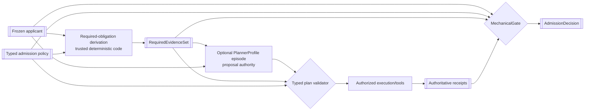
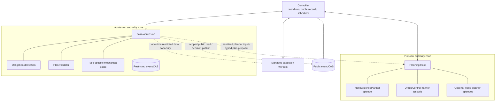
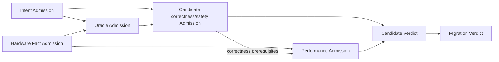

# Cairn Admission 软件架构设计

- 状态：规范性目标设计
- 日期：2026-08-27
- 产品范围：仅限 CUDA → Ascend C 算子移植
- 父设计：[`ARCHITECTURE_OVERVIEW.md`](ARCHITECTURE_OVERVIEW.md)
- Agent 设计：[`AGENT_ARCHITECTURE.md`](AGENT_ARCHITECTURE.md)
- 业务准入规则：[`../oracle/INDEPENDENT_ADMISSION_DESIGN.md`](../oracle/INDEPENDENT_ADMISSION_DESIGN.md)

## 1. 目的与文档边界

本文定义 Admission 在软件中的承载方式：组件、typed planner profiles、进程、ports、状态机、存储、
执行、故障恢复和代码归属。它不重新定义什么证据足以准入某项 Oracle claim；具体业务规则仍由：

- [`../oracle/INDEPENDENT_ADMISSION_DESIGN.md`](../oracle/INDEPENDENT_ADMISSION_DESIGN.md)：所有
  applicant 共用的 authority、hidden、receipt、outcome 和 revalidation 规则；
- [`../oracle/ORACLE_ADMISSION.md`](../oracle/ORACLE_ADMISSION.md)：Oracle 六个平面的控制与 closure；
- [`../oracle/SEMANTIC_INTENT_RECOVERY_DESIGN.md`](../oracle/SEMANTIC_INTENT_RECOVERY_DESIGN.md)：Intent
  proposal 与 Intent Admission 边界；
- [`../oracle/PERFORMANCE_ORACLE_DESIGN.md`](../oracle/PERFORMANCE_ORACLE_DESIGN.md)：Hardware Fact 与
  Performance Admission；
- [`../oracle/KNOWLEDGE_AND_SKILL_TRUST_DESIGN.md`](../oracle/KNOWLEDGE_AND_SKILL_TRUST_DESIGN.md)：
  Knowledge Admission 与 Skill Validation；

规定。

如果两边冲突，业务 focused design 不能削弱本文的进程/权限隔离，本文也不能降低 focused design 的
证据要求；受影响实施必须暂停并同步修正规范。

## 2. 核心结论

Admission 不是一个 Agent，也不是一个通用 `admit(applicant) -> bool` 服务。它由四层组成：

```text
Admission Policy & Obligation Derivation     trusted, deterministic
Optional Typed Planning                      proposal-only, agent or deterministic
Authorized Execution & Receipt Collection    observation authority
Typed Mechanical Gate & Decision Publication trusted, deterministic
```

关键结论如下：

1. `RequiredEvidenceSet` 必须在 Planner 之前由 trusted policy 机械派生；
2. Planner 不能删除 required obligation、改变 policy、制造 receipt 或产生 admitted type；
3. 不存在一个万能 `Admission Planner Agent`，而是 admission-kind-specific typed profile family；
4. Planner 是可选能力，不是每类 Admission 的必经模型步骤；
5. 多个 planner episode 可以运行在同一 Planning Host，但 context、continuation、capability 和 artifact
   lineage 必须隔离；
6. Planning Host 与 Mechanical Gate 必须跨 authority/process boundary；
7. 一个 Admission service 首期可以承载多种 type-specific gate，不因此共享 policy 或 outcome 类型；
8. Planner 错误最坏只能导致计划拒绝、成本增加、预算耗尽或 unverifiable，不能导致 false pass；
9. final decision 只能从冻结 applicant、trusted policy、authoritative receipt 和 qualified mechanism
   重算；
10. public outcome 与完整 restricted decision 分开提交和发布。

## 3. Authority 模型



图中 Planner 可以不存在。若全部 obligation 都能由确定性 recipe 展开，`RequiredEvidenceSet` 直接
进入 plan validator/execution。即使存在 Planner，gate 也不读取 Planner 的自然语言结论，只读取
被验证的计划事实和 execution receipts。

### 3.1 Proposal authority

Planner 可以：

- 选择尚未完成 obligation 的检查顺序；
- 在 policy 允许的实验族中提出具体实验；
- 提议额外但非替代性的控制；
- 根据已公开 receipt 提出更有区分力的下一项实验；
- 形成 typed diagnostic proposal 和停止建议。

Planner 不可以：

- 删除、降级或标记 required obligation 已满足；
- 修改 applicant、policy、corpus、threshold、comparator、baseline 或 hardware ceiling；
- 将 tool/model 输出包装成 authoritative receipt；
- 读取完整 hidden case、expected value、private mutant 或 judge implementation；
- 调用 admitted-artifact constructor 或发布 decision；
- 用多数意见、置信分或自然语言覆盖 gate。

### 3.2 Execution authority

Executor/Worker 只执行已经验证和授权的 opaque job，产生 observation/receipt。它不解释意图、不判断
Oracle adequacy、不决定 performance outcome。Candidate-writable output 与 worker-controlled evidence
channel 分离。

### 3.3 Admission authority

Mechanical Gate 按 exact admission kind：

- 验证 applicant/policy/corpus/environment/mechanism identity；
- 验证 required obligations 没有被遗漏或替换；
- 从 authoritative receipt 重算事实；
- 检查 hidden exposure、domain、independence 和 evidence closure；
- 产生 scoped outcome、strength、blind spots 和 revalidation edges；
- 通过受限 decision publisher 发布结果。

“另一个 Agent 同意”仍属于 proposal evidence，不能成为 Admission authority。

## 4. Admission kinds

首期领域模型承认七种 admission kind：

| Kind | Applicant | 正式输出 | 默认规划方式 |
| --- | --- | --- | --- |
| Intent | `IntentHypothesisSet` 中的 claims | `MigrationIntentContract` 或 scoped conflict/unknown | 推理型 Planner 有价值 |
| Oracle | `OraclePortfolioProposal` | `AdmittedOraclePortfolio` 或 scoped outcome | 推理型 Planner 有价值 |
| Hardware Fact | spec/measurement fact proposal | `AdmittedHardwareFact` | 确定性 recipe 优先，Agent 可选 |
| Performance | frozen candidate observations + instruments | `PerformanceOutcome` | 确定性 measurement plan 优先，Agent 可选 |
| Candidate | frozen Ascend C candidate | `CandidateVerdict` | 确定性 evidence scheduler 优先 |
| Knowledge | reusable claim/recipe proposal | admitted/rejected knowledge claim | 独立 curator profile，Agent 可选 |
| Skill | exact skill content/capability claim | validated/refuted skill capability | 独立 probe profile，Agent 可选 |

“共享 Admission 架构”只表示它们共享 authority pattern 和 runtime mechanics，不表示共享：

- applicant schema；
- policy；
- required obligation vocabulary；
- experiment request；
- receipt interpretation；
- gate；
- diagnostic；
- outcome 或 admitted artifact。

## 5. Planning Runtime、Profile 与 Episode

### 5.1 三个不同概念

`AdmissionPlanningRuntime` 是业务中立的 episode/model/tool/budget 执行机制。

`PlannerProfile<K>` 决定某一 admission kind 的：

- 输入和输出 schema；
- system/repository instruction identity；
- allowed tools 和 experiment request family；
- knowledge/skill allowed-use policy；
- Planner-visible evidence 与 hidden metadata view；
- budget、stop 和 diagnostic policy；
- model/template/deployment/protocol snapshot；
- profile lifecycle/qualification identity。

`PlannerEpisode<K>` 是一次具体 attempt 的 durable 运行实例，绑定 applicant、policy、required set、
profile、context snapshot、continuation 和预算。

同一模型或同一个 Planning Host 可以运行多个 `K`，不使 profile/episode 可互换。一个进程中存在多个
episode 时，必须按 episode 分离 continuation、tool result、knowledge snapshot 和 writable artifact
namespace。

### 5.2 这里的 `K` 不意味着 generic ID

本文用 `K` 表示概念上的 admission kind。Rust 设计必须保留公共语义类型，例如：

```text
IntentPlannerProfile            != OraclePlannerProfile
IntentAdmissionPlanProposal     != OracleAdmissionPlanProposal
HardwareMeasurementRequest      != PerformanceMeasurementRequest
OracleAdmissionReceipt          != CandidateAdmissionReceipt
PerformanceOutcome              != CorrectnessOutcome
```

可以共享 private validation/encoding mechanics，但不得因为底层字段相似就暴露可互换的
`PlannerProfile<String>`、`ApplicantId`、`ExperimentRequest` 或 `bool admitted`。

### 5.3 Profile 不是权限来源

Profile 声明期望 capability，实际授权是以下交集：

```text
profile requested capabilities
∩ planning-role policy
∩ task data policy
∩ deployment policy
∩ exact admission-attempt grant
```

模型、prompt、skill 或 profile 文本都不能扩大权限。Profile content identity 变化产生新 episode/profile
qualification，不复用旧 continuation 或旧验证结论。

## 6. Typed planner profiles

### 6.1 `IntentEvidencePlannerProfile`

目标：寻找能区分竞争性用户意图假设的证据和实验。

可见输入：

- `IntentHypothesisSet`；
- caller declaration 与公开 source/caller/model context；
- CUDA observation；
- evidence graph 中允许公开的依赖；
- 已 disposition 的历史 feedback；
- `RequiredIntentEvidenceSet`。

可提出：

- `IntentDisambiguationExperimentProposal`；
- source/caller evidence query；
- conflict/unknown 定位；
- `UserDecisionRequestProposal`；
- claim-scope 缩小建议。

禁止：替用户选择 desired semantics、产生 `MigrationIntentContract`、修改 source-behavior disposition、
讨论 candidate pass 或读取 hidden intent answer。

默认实现：推理型 Agent 通常有价值，但简单、完全规范化的 claim 可以由 deterministic recipe 完成。

### 6.2 `OracleControlPlannerProfile`

目标：为冻结 Oracle proposal 安排能发现 false accept、false reject、domain 漏洞和 bypass 的准入控制。

可见输入：

- admitted `MigrationIntentContract`；
- exact `OraclePortfolioProposal` revision；
- required Oracle claim/obligation set；
- 公开 fault taxonomy、historical regression 和 feedback；
- 公开 mechanism qualification summary。

可提出：

- honest/false-reject controls；
- wrong-variant/mutation/counterexample requests；
- domain/conflict/unknown/bypass checks；
- reference-independence 和 coverage experiment；
- 下一项最有区分力的 control。

禁止：修改 admitted intent、预判 candidate、读取 hidden expected values/mutant definition、删掉
required claim 或产生 `AdmittedOraclePortfolio`。

Oracle Explorer 的 adversarial strategy 和此 profile 不等价：前者帮助 applicant 修订 proposal，后者
只为已经冻结的 applicant 安排准入控制。二者可能复用算法或模型，但不能共享 episode、private
continuation 或 applicant write capability。

### 6.3 `HardwareMeasurementPlannerProfile`

目标：建立设备/工具链条件下可复现的硬件规格、microbench ceiling 和 profiler calibration evidence。

可见输入：

- target SoC、dtype、shape/engine/memory/dataflow condition；
- specification/source provenance；
- benchmark registry；
- toolchain/firmware/device-state snapshot；
- required hardware fact obligations。

可提出：

- microbench family/parameter sweep；
- warmup、stabilization、repetition 和 interference controls；
- profiler calibration；
- 单位/字段一致性检查；
- 异常测量的区分实验。

禁止：从 candidate observation 反推 hardware ceiling、修改业务 target、把 theoretical peak 当成
measured ceiling 或判断 candidate 性能合格。

默认实现：优先 deterministic benchmark recipes。Agent 只在设计新 microbench、解释异常或提出新
bottleneck hypothesis 时启用。

### 6.4 `PerformanceExperimentPlannerProfile`

目标：在 correctness prerequisites 已满足后，规划 candidate performance measurement 与瓶颈区分。

可见输入：

- frozen candidate；
- correctness prerequisite outcomes；
- admitted performance instruments/hardware facts；
- workload、baseline、business target；
- 已有公开 measurement/profile observations；
- required performance obligations。

可提出：

- warmup/repetition/synchronization/统计计划；
- workload region/shape/quantile 分解；
- contention/thermal/frequency validity control；
- bottleneck-disambiguation experiment；
- Pareto/frontier 的下一项 measurement。

禁止：修改 target、baseline、workload weight、roof、numerical allowance，忽略 correctness failure，
或用平均 improvement 隐藏 required tail/SLO regression。

默认实现：measurement validity 和必要样本先由 deterministic policy 生成；Agent 只做 adaptive
experiment selection。所有请求必须通过 typed validator。

### 6.5 `CandidateEvidencePlannerProfile`

目标：按依赖和成本组织 candidate required evidence，不重新定义其判断标准。

可见输入：

- frozen candidate；
- admitted intent/Oracle；
- target environment；
- public diagnostic 和已完成 receipt disposition；
- `RequiredCandidateEvidenceSet`；
- 预算/资源 availability。

可提出：

- static → build → correctness → safety/integration → performance 的检查顺序；
- 可以安全并行的 obligation；
- 因 cheap decisive failure 停止后续昂贵检查的建议；
- 缺失 evidence 的 typed diagnostic proposal。

禁止：修改 Oracle、删除 required claim、更改 comparator/performance policy、把 infrastructure failure
转成 candidate violation 或聚合 final verdict。

默认实现：首期使用 deterministic dependency/cost scheduler。Candidate Search Agent 负责修复代码，
不应因为能解释 diagnostic 就进入 Candidate Admission authority。

### 6.6 `KnowledgeReviewPlannerProfile`

目标：为可复用 knowledge claim 提出 recurrence、scope、attribution、evidence 和 retrieval-value 检查。

它属于治理 workflow，不读取 hidden admission corpus，也不能把作者、官方来源或 retrieval rank 当成
trust。默认采用 curator rules；复杂归因可用 Agent，但输出仍为 review proposal。

### 6.7 `SkillProbePlannerProfile`

目标：为 exact skill content 的 capability/effect/safety claim 安排静态审查和 sandbox probes。

它不能执行未经 policy 授权的网络、设备或 secret 操作，不能让 skill manifest 扩大自身权限，也不能
把 skill 输出写成 admission fact。Skill 内容变化使该 profile 的旧 probe 结论不适用于新内容。

## 7. Planner 何时被调用

Admission policy 先为每项 obligation 选择 planning mode：

```text
DeterministicRecipe
AdaptiveTypedPlanner
UserDecisionRequired
NoAuthorizedMethod
```

- `DeterministicRecipe`：直接由 qualified recipe 产生 plan；
- `AdaptiveTypedPlanner`：启动对应 `PlannerProfile<K>` episode；
- `UserDecisionRequired`：只用于用户有权决定的 desired semantics/policy，不伪装成 agent plan；
- `NoAuthorizedMethod`：该 obligation 保持 unverifiable/not-executed。

选择 Planner 的原因、profile identity、额外成本和停止理由进入 durable record。不能因为“系统支持
Agent”就默认购买模型 turn，也不能因为预算不足就把 adaptive obligation 静默变成 optional。

## 8. Required evidence 与 plan validation

### 8.1 Required set 的来源

`RequiredEvidenceSet<K>` 只能由 trusted policy 根据以下冻结输入派生：

- applicant scope；
- admitted upstream contracts；
- requested claims/release policy；
- target environment；
- corpus/control policy；
- applicable mechanism qualification；
- data/worker/device policy。

Planner 和 applicant 只读 required set。额外实验可以追加为 `SupplementalObligationProposal<K>`，但
不能替代 required obligation。

### 8.2 Typed plan proposal

Plan proposal 至少包含：

- exact obligation ID；
- experiment/control kind；
- input artifact refs；
- requested execution capability/environment；
- expected observation schema，而不是 expected answer；
- 依赖的前置 receipt；
- cost estimate 与 stop relation；
- public/restricted visibility；
- rationale 与 provenance；
- planned diagnostic exposure class。

### 8.3 Deterministic plan validator

在任何 tool/device effect 前，validator 检查：

1. proposal profile 与 admission kind 匹配；
2. obligation 属于 exact attempt 且尚未满足；
3. request 属于 policy allowlist；
4. applicant/policy/corpus/environment identity 冻结；
5. capability 不超过授权交集；
6. hidden material 未进入 public bundle；
7. required predecessor 已满足；
8. budget 和 diagnostic exposure 允许；
9. request 不要求 Planner 自报 comparator/expected result；
10. operation/effect semantics 可记录和恢复。

通过后产生 `ValidatedAdmissionExperiment<K>`。Plan rejection 返回 typed diagnostic 给 Planner，不启动
外部 effect。Required-set derivation 与 plan validator 都是 verdict-relevant mechanisms，必须具有 exact
identity、qualification receipt、适用 scope、限制和 requalification trigger；“确定性代码”本身不是
正确性证明。

## 9. Admission 状态机

```text
AdmissionRequested
  → InputsResolved
  → RequiredEvidenceDerived
  → PlanningNotRequired | PlanningRequested
  → PlanValidated
  → EvidenceCollectionRunning
  → EvidenceCollectionComplete | EvidenceIncomplete | terminal failure
  → GateEvaluationRunning
  → DecisionCommittedRestricted
  → DecisionPublishedPublic
```

旁路 terminal states 至少包括：

- `Rejected`；
- `Unverifiable`；
- `Conflict`；
- `NeedsUserDecision`（仅适用 kind）；
- `BudgetExhausted`；
- `PolicyDenied`；
- `Cancelled`；
- `InfrastructureFailure`；
- `AmbiguousExternalEffect`。

Planner episode 有独立生命周期：

```text
Prepared → Running → PlanProposed → Completed
                   ↘ PlanRejected → Revising
                   ↘ BudgetExhausted / Cancelled / InfrastructureFailure
```

Planner terminal 不等于 Admission terminal。Planner 失败后，policy 可以切换到 deterministic fallback
recipe；这不是 schema/compatibility fallback，而是同一 V1 中预先声明的 planning policy branch。若
policy 没有授权替代方法，Admission 输出 unverifiable/budget/infrastructure outcome。

Adaptive planning 可以循环，但每轮都产生新的 `PlanRoundId<K>`、冻结 plan proposal 和 sanitized
`PlannerObservationBundle<K>`：

```text
PlanValidated
  → EvidenceCollected
  → RemainingObligationsDerived
  → PlanningRequested / DeterministicRecipe
  → next PlanValidated
```

Planner 不能在原 plan 上原地追加，也不能直接读取 restricted raw receipt。多个 Planner 并行提出的
plan 由 deterministic validator/policy 按 obligation、成本、互斥资源和 exposure budget 选择；不以
Agent 投票决定。

## 10. 进程架构



### 10.1 必须跨进程的边界

- Planning Host 与 Admission service；
- Admission service/restricted store 与普通 Controller principal；
- generated/applicant code execution 与控制面；
- remote device Worker 与 Controller/Admission。

Admission service 不链接 model transport，不持 provider credential，不执行模型 continuation。

### 10.2 不要求一 profile 一进程

Intent、Oracle、Hardware、Performance、Candidate、Knowledge 和 Skill planner episode 可以运行在同一
Planning Host，也可以按风险在不同 process instance 中运行。是否跨进程由：

- capability 是否不同；
- 数据可见性是否不同；
- tool/plugin 是否执行不可信代码；
- dependency/runtime 是否不同；
- 故障/资源隔离需求；

决定，而不是由“有几个 Agent 名称”决定。

同一 Host 中仍必须具备 durable episode isolation。未经 policy 授权，任何 episode 不得读取另一
episode 的 private continuation、unsubmitted reasoning、tool result 或 writable namespace。

### 10.3 Planner 调用路径

Admission service 不直接调用 provider：

1. Admission 生成 sanitized `PlannerInputEnvelope<K>`；
2. Controller 验证 planning request 与 public task/run binding；
3. Planning Host 创建 exact profile episode；
4. Host 通过 Controller 的 capability gateway 查询公开 artifact/knowledge/tool；
5. Host 返回 `AdmissionPlanProposal<K>`；
6. Controller 归档 proposal 并提交给 Admission；
7. Admission validator 决定是否执行。

该路径避免给 Admission gate 引入 model transport，也避免给 Planning Host restricted store handle。

## 11. 数据可见性与 hidden metadata

### 11.1 Planner 默认可见内容

- public applicant contract；
- public policy contract；
- required obligation 的公开描述；
- 已允许的 public/historical feedback；
- 公开 receipt disposition；
- profile-specific knowledge/skill snapshot。

### 11.2 最小 hidden view

有些 adaptive planning 需要知道资源或 domain，但不需要知道答案。Admission 可以发布：

```text
OpaqueObligationId<K>
PublicClaimKind<K>
AdmittedDomainPartitionRef<K>
RequiredControlClass<K>
ResourceRequirement
PriorAttemptDisposition<K>
DiagnosticExposureClass
```

不得发布 hidden input bytes、expected value、private mutant source、区分该 case 的唯一描述或可由普通
knowledge index 反推其存在的 metadata。

每次 Planner-visible hidden metadata、query 和 diagnostic 都写 exposure ledger。若暴露足以让 applicant
lineage 推导答案，相应 material burn 为 public regression。

### 11.3 Planning feedback 与 applicant feedback

Plan validator diagnostic 只帮助 Planner 修正结构/权限/依赖，不自动返回 applicant。Admission
diagnostic 经 redaction 后才路由到负责 subsystem：Intent、Oracle Explorer、Hardware Model、Candidate
Search、Knowledge Curator 或 Skill owner。两类 feedback 使用不同类型和 visibility。

## 12. Execution 与 receipt closure

### 12.1 Public experiment

公开输入/输出可走 Controller 普通 Job/CAS 路径。Controller 记录 scheduler、assignment、attempt 和
worker receipt；Admission 根据 exact refs 获取并重算。

### 12.2 Restricted experiment

Hidden job 使用 [`RUNTIME_ARCHITECTURE.md`](RUNTIME_ARCHITECTURE.md) 定义的双路径：

- Controller 只接收 scheduling metadata 和 opaque job ref；
- Admission 为已分配 Worker 提供一次性 attempt-scoped bundle/evidence capability；
- 完整 input/output/expected/control receipt 留在 restricted store；
- 只有 redacted diagnostic 和 public decision binding 返回 public store。

受限路径不可用时，该 obligation 是 not-executed/unverifiable；禁止把 hidden bytes 临时复制到 public
CAS。

### 12.3 Closure

Gate 必须证明：

- 每个 required obligation 有 exact disposition；
- receipt 绑定 applicant、policy、plan、job、attempt、binary/device/tool/environment；
- applicant 无法写 worker evidence；
- comparator/statistics/units 从底层 observation 重算；
- skipped/non-injectable/inconclusive 有 typed reason；
- assumptions、blind spots 和 tool limits 保留；
- evidence graph 可走回原始 input 或明确 external reference；
- profile/plan 只影响实验选择，未被当作 execution fact。

## 13. Admission kinds 的组合关系



### 13.1 Candidate 不重复 Oracle Admission

Oracle Admission 判断 portfolio 是否有资格判断 specified claims。Candidate Admission 应用已准入
portfolio 获取 candidate-specific evidence。Candidate planner 不重新选择 Oracle fault taxonomy 或
修改 comparator。

### 13.2 Performance 不嵌入 correctness

Candidate Admission aggregate 可以协调 Performance Admission，但 candidate correctness/safety outcome
与 `PerformanceOutcome` 独立产生，再由 typed composition 形成 `CandidateVerdict`。Correctness
prerequisite 不满足时 performance 为 not-executed/not-applicable-by-policy，不能用性能补偿。

### 13.3 Hardware Fact 不由 Performance 自证

Performance Planner 只能消费 admitted hardware facts/ceilings。Candidate measurement 不能同时推导
ceiling 并证明自己接近该 ceiling。

### 13.4 Knowledge/Skill 不成为隐藏 authority

Knowledge/skill 可以影响 Planner proposal，但只有 admitted claim/validated capability 能用于 policy
允许的 planning context。它们不能修改 gate、required set 或 hidden visibility。

## 14. Profile 生命周期与评价

Planner 不产生权威结论，但 profile 会影响成本、覆盖和 hidden disclosure，因此需要 exact identity 和
生命周期：

```text
Proposed → Reviewed → QualifiedForPlanning → Refuted
```

`QualifiedForPlanning` 只表示它在声明 scope 内能安全、有效地产生计划，不表示其 proposal 正确，也不
授予 Admission authority。

评价维度包括：

- required obligation omission attempt rate；
- valid-plan rate；
- decisive evidence per cost；
- redundant experiment rate；
- false-stop/late-stop rate；
- hidden exposure/diagnostic leakage；
- domain/authority violation attempts；
- infrastructure failure amplification；
- 相对 deterministic baseline 的收益；
- replay/provenance completeness。

Profile、template、tool menu、knowledge policy 或 verdict-relevant selection algorithm 变化产生新 identity，
新 attempt 需要相应 review/qualification。历史 episode 仍引用旧内容，不建立兼容 reader。

## 15. 故障与停止语义

| 故障 | Admission 处理 |
| --- | --- |
| Planner schema invalid | 原子拒绝 plan，允许有界修订 |
| Planner 请求越权 capability | policy denial + security diagnostic，不启动 effect |
| Planner 删除 required obligation | plan rejection；required set 保持不变 |
| Planner budget exhausted |若无授权 deterministic continuation，则 Admission `BudgetExhausted`/`Unverifiable` |
| Provider/Planning Host failure | infrastructure failure，不归咎 applicant |
| Experiment effect ambiguous | reconcile，不能盲重试或标 claim violated |
| Worker/device/tool failure | infrastructure/invalid measurement，不等于 applicant fail |
| Receipt incomplete/corrupt | closure failure，fail closed |
| Gate mechanism refuted | decision blocked或依赖 verdict revalidation |
| Public publish失败 | restricted decision 已提交则按 decision identity 幂等重发 |
| Hidden disclosure |更新 exposure ledger，burn/replenish，不删除历史 |

“使用确定性 recipe”不是 Planner failure 的自动 fallback。只有 policy 在 attempt 开始前声明允许的多个
planning mode，才可在同一 V1 workflow 中切换；否则必须保持失败/未知。

## 16. 并发、幂等与恢复

- 每个 `AdmissionAttemptId<K>` 只有一个 authoritative decision；
- 多个 planning proposal 可并行探索，但 validator 以 proposal identity 分别处理；
- 同一 obligation 的重复 experiment 需要 distinct attempt identity 或显式 idempotency key；
- plan acceptance 与 execution start authority 在 durable commit 后生效；
- Controller/Admission 通过 outbox 和 decision identity 至少一次投递、幂等消费；
- restricted decision 先 commit，public outcome 后 publish；
- Gate 在 restart 后从冻结 inputs/receipts 重算，不从日志或 Planner summary 恢复；
- 新 evidence 到达已终止 attempt 后创建 revalidation/new attempt，不原地改 decision；
- parallel receipts 只有在 environment/interference policy 允许时才可共同支持 performance claim。

## 17. 代码归属

### 17.1 产品 crate

`cairn-cuda-ascend` 拥有 admission-kind-specific 类型和规则：

```text
src/admission/
├── policy.rs
├── required_evidence.rs
├── planning/
│   ├── intent.rs
│   ├── oracle.rs
│   ├── hardware.rs
│   ├── performance.rs
│   ├── candidate.rs
│   ├── knowledge.rs
│   └── skill.rs
├── plan_validation.rs
├── diagnostics.rs
└── ports.rs
```

各具体 intent/oracle/hardware/... module 仍拥有其 applicant、receipt interpretation 和 admitted artifact。
共享目录只保存真正跨 kind 的 composition mechanics，不使用万能业务 enum。

### 17.2 `cairn-agent`

只拥有业务中立的 episode、model、tool、budget 和 continuation runtime。它不知道
`IntentEvidencePlanner` 或 `OracleControlPlanner`。

### 17.3 `cairn-proposal-host`

拥有 Planning Host adapter：读取 exact typed profile、投影 context、执行 episode、提交 plan proposal。
它不拥有 required-set derivation、plan acceptance 或 gate。

### 17.4 `cairn-admission`

拥有：

```text
src/
├── service.rs
├── request.rs
├── obligation_derivation.rs
├── plan_validation.rs
├── planning_bridge.rs
├── restricted_store/
├── execution/
├── gates/
│   ├── intent.rs
│   ├── oracle.rs
│   ├── hardware.rs
│   ├── performance.rs
│   ├── candidate.rs
│   ├── knowledge.rs
│   └── skill.rs
├── receipt_closure.rs
├── diagnostic_redaction.rs
├── decision_publish.rs
└── mechanism_qualification.rs
```

Admission binary 不依赖 model transport/provider credential。架构测试禁止 proposal host 链接 restricted
store adapter，禁止普通 Controller composition 获得 restricted reader。

## 18. 强类型边界

至少保持：

```text
IntentAdmissionAttemptId        != OracleAdmissionAttemptId
OraclePlannerProfileId          != PerformancePlannerProfileId
AdmissionPlanProposal<K>        != ValidatedAdmissionPlan<K>
PlannerToolObservation<K>       != AuthoritativeExecutionReceipt<K>
RequiredEvidenceSet<K>          != PlannerSuggestedEvidenceSet<K>
PublicPlannerObligationView<K>  != HiddenAdmissionControl<K>
PlanValidationOutcome<K>        != AdmissionOutcome<K>
AdmissionDiagnostic<K>          != PlannerDiagnostic<K>
AdmittedWithLimits<K>           != FullyAdmitted<K>
BudgetExhausted                 != InfrastructureFailure
```

Raw kind/status/ID 只存在 wire/storage DTO。Decode 立即调用对应构造器并重新验证 kind、scope、identity、
lifecycle 和 capability invariants。容易混淆的 plan、receipt、ID、outcome 和 visibility port 必须有
compile-fail/static boundary tests。

## 19. 验证策略

### 19.1 Planner/profile controls

- 同一模型运行不同 profile，证明 continuation/context/tool 不串流；
- Planner 尝试删 required obligation，被 validator 拒绝；
- Planner 请求错误 admission kind 的 experiment，编译期或 decode fail；
- prompt/skill 要求扩大权限，capability 不变；
- hidden metadata/diagnostic 泄漏触发 exposure/burn；
- deterministic baseline 与 Agent Planner 的成本/decisive-evidence 对比；
- Planner 不存在时 deterministic path 正常；
- Planner/provider failure 不产生 admitted outcome。

### 19.2 Gate controls

- honest、false-reject、false-accept、conflict、unknown、domain、bypass；
- missing/duplicate/wrong-attempt receipt；
- applicant-authored `passed`、stdout、summary 和 screenshot 不生效；
- tampered plan、policy、corpus、binary、device 或 mechanism identity 变红；
- partially admitted type 不能进入 full-closure API；
- gate/mechanism refutation 触发 reverse impact；
- restricted commit/public publish crash 恢复。

### 19.3 Process/storage controls

- Planning Host 无 restricted filesystem/API permission；
- Admission process 无 model provider dependency/credential；
- Controller 无 restricted store path/credential；
- hidden job 不经过 public CAS；
- 同一 Planning Host 的多 episode 隔离；
- 按风险切换为 per-episode process 不改变 artifact/protocol semantics；
- logging 完全关闭不改变 decision；
- non-V1 input fail closed，无 compatibility branch。

## 20. 首期范围与实施边界

第一个 architecture proof slice 只需要：

1. 一个 CUDA kernel 的 `IntentHypothesisSet`；
2. type-specific `RequiredIntentEvidenceSet` 机械派生；
3. 一个 `IntentEvidencePlannerProfile` 或明确的 deterministic recipe；
4. typed plan validation；
5. separate Admission process 的 Intent gate；
6. `MigrationIntentContract` 或非成功 outcome；
7. 下游生成一个 Oracle claim proposal后停止。

它不要求同时实现七类 planner，不要求真实 NPU/performance，不要求多 Agent，也不授权建立万能
`AdmissionPlannerV1` schema。具体 operator、claim 和 hidden corpus 仍受
[`OQ-019`](../OPEN_QUESTIONS.md) 阻塞。

后续建议按真实依赖扩展：Oracle Control → Hardware deterministic recipes → Candidate deterministic
scheduler → Performance adaptive planning → Knowledge/Skill governance。顺序仍需进入 Implementation Plan
并为每个 slice 写 `DesignConformanceRecord`，本文不构成本轮实施授权。

## 21. 当前实现状态

截至 2026-08-27，当前仓库已有 generic admission/candidate-verdict mechanics、historical reduction
controls、固定 matmul Oracle materialization、agent runtime、execution worker 和 record/CAS 基础。

尚未实现：

- 独立 `cairn-admission` process；
- typed required-evidence derivation family；
- 上述 planner profiles 与 Planning Host bridge；
- public/restricted store physical/capability separation；
- restricted device job data plane；
- 七类 gate 的完整 receipt closure；
- profile qualification 与 evaluation；
- 第一条 Intent Admission architecture proof slice。

设计完成不表示 Admission 已经存在。

## 22. 被拒绝的方案

| 方案 | 拒绝原因 |
| --- | --- |
| 一个万能 Admission Planner Agent | 混合语义、权限、工具和 feedback，无法由类型阻止越界 |
| 每种 Admission 都必须调用 Agent | 增加成本/不确定性，把确定性 workflow 误写成推理问题 |
| Planner 自己定义 required evidence | applicant-adjacent role 可以删除最难 obligation，形成 false pass |
| Planner 与 Mechanical Gate 同进程/同 authority | model transport、hidden material 和 promotion edge 混合 |
| 一个 profile 一个常驻进程 | 把逻辑角色误当安全边界，造成无收益部署复杂度 |
| Agent agreement 替代 gate | 多模型一致不形成 receipt closure 或 mechanism qualification |
| Candidate Planner重新设计 Oracle | 在 applicant 评价阶段移动裁判标准 |
| Performance Planner 同时推导 ceiling 和验证 candidate | measurement 自证，产生循环 evidence |
| Hidden job退化到 public CAS | 破坏 held-out 强度并泄漏 admission material |
| 用 `bool passed`/generic ID统一 outcome | 擦除 scope、strength、failure 和 authority 边界 |
