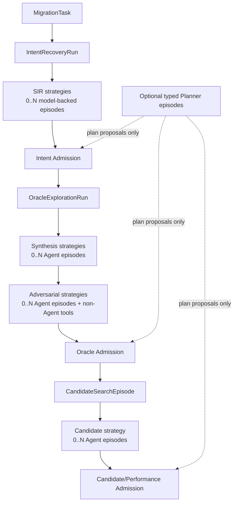
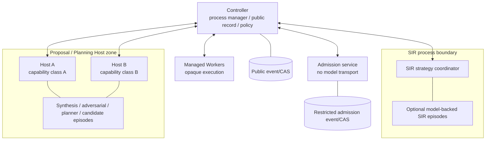

# Cairn Agent 与 Strategy 软件架构设计

- 状态：规范性目标设计
- 日期：2026-08-27
- 产品范围：仅限 CUDA → Ascend C 算子移植
- 父设计：[`ARCHITECTURE_OVERVIEW.md`](ARCHITECTURE_OVERVIEW.md)
- Runtime 基础：[`../RECORD_REPLAY.md`](../RECORD_REPLAY.md)
- Admission 关系：[`ADMISSION_ARCHITECTURE.md`](ADMISSION_ARCHITECTURE.md)
- Requirements：`FR-AGENT-*`，尤其 `FR-AGENT-006/021/022/023`
- Decisions：`D-022`、`D-034`、`D-037`、`D-038`

## 1. 目的

本文统一 Cairn 中散落的 Agent 概念，回答：

- 当前规划了哪些 Agent-capable 能力；
- 哪些是 subsystem、strategy、planner profile 或具体 episode；
- 哪些能力必须存在、哪些必须由 Agent 实现；
- Agent 如何交互、何时启动、何时停止；
- Agent、进程、模型和 authority 的关系；
- 代码、权限、记录和评估如何组织。

本文不把 Cairn 泛化为通用多 Agent 平台。`cairn-agent` 可以保持 domain-neutral，是内部 runtime
性质；产品层只定义服务 CUDA → Ascend C 的 Agent/strategy profiles。

## 2. 核心结论

1. Cairn 没有固定的“Agent 总数”，只有可派生的 Agent-capable role/profile catalog；
2. 当前 catalog 有 **11 个 Agent-capable 逻辑位置**：4 个探索/生成位置和 7 个 Admission Planner
   profiles；
3. “11”是当前设计清单的派生结果，不是 protocol 常量、并发数、进程数或发布要求；
4. 功能必须存在不等于必须使用 LLM Agent；规则、静态分析、mutation、solver、search 和 deterministic
   recipe 可以实现同一 strategy contract；
5. Blue/Red 是当前 model-backed synthesis/adversarial profiles，不是永久 Agent 类型；
6. 不存在万能 Admission Planner；每个 Admission kind 使用不同 typed profile，且 Planner 可以不运行；
7. Agent 全部属于 Proposal authority，不能生成 admitted artifact、execution receipt 或最终 verdict；
8. 多 Agent 交互只通过冻结 artifact、typed request/diagnostic 和 durable event，不共享私有 continuation
   或可变工作内存；
9. capability-equivalent episodes 可以共用 Host，是否拆进程由 data/tool/OS/authority boundary 决定，
   不由 Agent 名称或数量决定；
10. 多 Agent 一致、投票或重复反思不提升 evidence strength；真实证据仍由独立执行和 Mechanical Gate
    建立。

## 3. 术语

### 3.1 Agent-capable function

产品工作流中的一个逻辑位置，其任务可能受益于模型推理和 tool use，但也可能由非 Agent 实现。
例如“Oracle adversarial exploration”是 Agent-capable function；它可以由 Red model episode、mutation
engine 或 property-based search 承担。

### 3.2 Strategy

完成探索/生成目标的一种可替换方法。Strategy 可以是：

- model-backed Agent episode；
- deterministic rule/template；
- compiler/static analyzer；
- mutation/fuzz/property engine；
- solver/formal tool；
- 多个方法的受控组合。

Strategy 只产生 proposal/analysis artifact，不因实现是程序而自动成为 trusted authority。

### 3.3 Planner Profile

某个 Admission kind 的可选规划 contract，定义输入、obligation、实验请求、工具、可见性、预算和输出。
它不是通用 role 字符串。Intent、Oracle、Hardware、Performance、Candidate、Knowledge 和 Skill 的
profiles 不可互换。

### 3.4 Agent Profile

一个 model-backed strategy/planner 的冻结产品配置，包括：

- product role/strategy identity；
- repository instructions；
- input/output schemas；
- capability request；
- knowledge/skill policy；
- budget/stop policy；
- model template/deployment/protocol selection policy；
- profile lifecycle 和 exact content identity。

Profile 不是一次运行，也不是权限本身。

### 3.5 Agent Episode

一个具体、durable 的 model/tool loop 实例，绑定 task/run、profile、model snapshot、context snapshot、
capability grant、budget、continuation 和 artifact lineage。新 revision 不一定产生新 episode；新 role、
新 profile、不同私有上下文或不同 authority lineage 必须产生新 episode。

### 3.6 Turn、Step 与 Tool Operation

- Turn：一次 provider exchange；
- Step：模型 response 与其提出的 tool calls/结构化提交形成的逻辑步骤；
- Tool Operation：经 runtime 验证、授权和记录的具体外部动作。

Model transport 只完成一次 Turn，不执行 tool、不拥有 loop。

### 3.7 Host Process

承载一个或多个 capability-equivalent Agent Episodes 的 OS 进程。Host 不等于 Agent：

- 一个 Host 可承载多个隔离 episode；
- 一个逻辑 role 可在多个 Host instance 上运行；
- 同一模型可以服务多个 episode；
- process restart 不产生新的业务 role。

### 3.8 Authority

Agent profile、role 名称、模型能力和 Host process 都不授予 Admission 或 Execution authority。Agent
只有 proposal capability；Controller、Admission、Worker 和 User/Policy authority 的权利由独立端口、
进程身份和 typed policy 决定。

## 4. 当前 Agent-capable catalog

### 4.1 探索与生成类：4 个

| 逻辑位置 | 必须存在的产品功能 | Agent 默认 | 非 Agent 实现 | 正式输出 |
| --- | --- | --- | --- | --- |
| SIR reasoning strategy | 从 CUDA/context 形成竞争性意图假设 | Agent-preferred，但非必须 | static/IR/rules/symbolic analysis | `IntentHypothesisSet` proposal |
| Oracle synthesis strategy | 生成 claim/domain/reference/case/comparator/instrument proposal | Agent-preferred | templates/analyzers/generators | `OraclePortfolioProposal` revision |
| Oracle adversarial strategy | 寻找 false accept/reject、coverage、conflict、bypass | Policy-required function；Agent 可选 | mutation/property/fuzz/counterexample search | attack/findings artifacts |
| Candidate Search strategy | 生成和修订 Ascend C candidate | Agent-preferred | enumerative/search/template/optimizer | frozen `Candidate` revisions |

当前 Blue 是 model-backed Oracle synthesis profile，Red 是 model-backed Oracle adversarial profile。它们
保留自己的 durable episode/continuation，但只是一组策略实现。

### 4.2 Admission Planning Profiles：7 个

| Profile | 规划问题 | 默认执行方式 | Agent 适用位置 |
| --- | --- | --- | --- |
| `IntentEvidencePlannerProfile` | 如何区分竞争性用户意图假设？ | Agent-preferred | 设计区分实验、定位 conflict/unknown |
| `OracleControlPlannerProfile` | 如何挑战冻结 Oracle proposal？ | Agent-preferred | 选择正负控制、mutation、coverage、bypass 实验 |
| `HardwareMeasurementPlannerProfile` | 如何建立 scoped hardware fact/ceiling？ | Deterministic-first | 新 microbench、异常解释、bottleneck hypothesis |
| `PerformanceExperimentPlannerProfile` | 如何有效测量 candidate 并区分瓶颈？ | Deterministic-first + optional Agent | adaptive workload/profile experiment |
| `CandidateEvidencePlannerProfile` | 如何按依赖/成本收集 candidate evidence？ | Deterministic-first | 非常规 evidence gap 的计划建议 |
| `KnowledgeReviewPlannerProfile` | 如何审查 reusable claim 的 scope/归因/复用？ | Curator rules first | 复杂归因和证据整理 |
| `SkillProbePlannerProfile` | 如何验证 exact skill capability/effect/safety？ | Deterministic probes first | 复杂 probe 设计和异常分析 |

Planner profiles 的完整规则见
[`ADMISSION_ARCHITECTURE.md`](ADMISSION_ARCHITECTURE.md)。它们不是七个常驻 Agent，也不要求七个
process。

### 4.3 派生数量

```text
4 exploration/generation positions
+ 7 typed Admission Planner profiles
= 11 Agent-capable logical positions
```

该公式只用于理解当前 catalog。新增一种 deterministic strategy 不增加 Agent 数量；同一 profile 启动
十次 episode 也不增加 role/profile 种类；未来取消某个 Agent 实现但保留功能，catalog 的
Agent-capable 标记可以变化而不改变 admission/evidence contract。

### 4.4 计数口径

以后回答“Cairn 有多少 Agent”必须先给出口径，不能只报一个数字：

| 口径 | 当前答案 | 数据来源 |
| --- | --- | --- |
| 目标设计中的 Agent-capable 逻辑位置 | 11 | 本节 typed catalog 派生 |
| 已有明确实现/运行证据的 model-backed 产品 profiles | 2：Blue synthesis、Red adversarial | 当前代码与 Oracle dogfood；不代表完整目标 catalog |
| 某一时刻正在运行的 Agent episodes | `0..N` | durable runtime projection |
| 部署中的 Agent-capable Host processes | 按 capability class 和负载变化 | deployment/process inventory |

模型 template、provider deployment、Planner kind、strategy implementation 和 episode attempt 也分别有自己
的数量，不能拿来替换上表任一口径。新增 profile 时修改 typed catalog；启动新 episode 或扩容 Host 不
修改 profile catalog。

## 5. 哪些组件不是 Agent

| 组件 | 为什么不是 Agent |
| --- | --- |
| Controller/process manager | 确定性编排 durable workflow、policy 和 event，不做开放式模型判断 |
| Oracle Explorer coordinator | 组合 strategies、冻结 revisions、路由 findings；本身无需模型 |
| Admission obligation derivation | trusted policy 机械派生 required evidence |
| Plan validator | 确定性验证 typed plan/capability/budget |
| Mechanical Gate | 从 authoritative receipt 重算 admission outcome |
| Hardware Performance Model | 管理 admitted facts/ceilings/measurement semantics |
| Scheduler | 按 capability/resource/policy 分配，不理解业务语义 |
| Managed Worker | 执行 opaque job 并产生 observation receipt |
| Knowledge/Skill Registry | 保存、检索和执行 lifecycle policy，不因检索进行推理授权 |
| Feedback Router | 分类后按 typed disposition 路由，不把 reward 当真值 |
| Model integration evaluator | 受控执行环境，产生 integration observation，不判断局部正确性 |

这些组件内部可以使用统计、搜索或确定性分析，但不能因此被标成 Agent。若未来某组件引入模型推理，
必须把 model-backed 部分分离为 proposal episode，原 authority 组件仍只消费 typed proposal/receipt。

## 6. Logical topology



图中的 `0..N Agent episodes` 不意味着对应功能可以缺失。例如 Oracle synthesis function 必须存在，
但 policy 可以选择一个 deterministic strategy，因此 model-backed episode 数量为 0。

## 7. Agent invocation policy

### 7.1 Invocation mode

每个 strategy/profile 由 trusted product policy 选择一种模式：

```text
AgentRequiredForThisAttempt
AgentPreferred
AgentOptional
DeterministicOnly
DisabledNotApplicable
UnavailableByPolicy
```

这些是 workflow policy outcomes，不是 schema 版本或模型自报状态。

- `AgentRequiredForThisAttempt` 只在 caller/release policy 明确要求 model-backed diversity 或现有非 Agent
  方法不足时使用；
- `AgentPreferred` 表示当前证据显示模型通常提高 proposal quality，但失败仍保持显式；
- `AgentOptional` 由 expected information gain 与预算决定；
- `DeterministicOnly` 用于 authority-sensitive 或 recipe 已完全覆盖的步骤；
- `DisabledNotApplicable` 表示该 task/domain 不适用；
- `UnavailableByPolicy` 表示数据、网络、provider、预算或安全政策禁止。

不得用“Agent 不可用”静默降级为更弱但仍标 green 的流程。若 policy 要求 Agent diversity 而无法运行，
结果是 not-executed/unverifiable/budget/infrastructure outcome。

### 7.2 启动依据

Controller/strategy coordinator 根据冻结事实决定是否启动 Agent：

- 当前 evidence gap/unknown/conflict；
- task/operator/claim 风险；
- 可用 deterministic strategy 的覆盖；
- 历史 false accept/false reject/production feedback；
- 下一 Agent turn 的 expected information gain；
- remaining model/tool/hardware/human budget；
- 数据出域、provider 和 skill policy；
- 已有 strategy common dependencies；
- hidden exposure/diagnostic budget；
- 停止或发布 policy。

Agent 不能自行决定扩大自己的轮数、切换 role、加载额外 skill、调用新 provider 或启动子 Agent。

### 7.3 默认建议

| 位置 | 默认 |
| --- | --- |
| SIR | Model + static facts 的混合 strategy；保留竞争假设 |
| Oracle synthesis | 一个 model-backed synthesis episode + deterministic generators |
| Oracle adversarial | mutation/property controls 必须；model-backed adversarial episode 按风险启用 |
| Candidate Search | 一个 model-backed episode；每个 source revision 冻结 |
| Intent/Oracle Planner | evidence gap 需要 adaptive planning 时启用 |
| Hardware/Performance Planner | deterministic measurement recipe 先行，异常/瓶颈移动时启用 Agent |
| Candidate Evidence Planner | 首期不用 Agent，使用 deterministic dependency/cost scheduler |
| Knowledge/Skill Planner | 治理规则/固定 probes 先行，复杂归因时启用 |

默认不是 authority，具体 attempt 必须保存 exact invocation-policy identity 和选择理由。

## 8. Multi-Agent interaction

### 8.1 基本原则

Agent 不直接“聊天”。跨 episode 交流必须经过：

```text
Episode A
  → typed submission
  → canonical validation
  → immutable content identity
  → durable event
  → role/strategy visibility filter
  → Episode B input projection
```

允许传递：

- admitted/public upstream contract；
- 冻结 proposal revision；
- typed attack finding；
- 公开 execution observation；
- trusted schema/plan diagnostic；
- 被允许披露的 counterexample；
- knowledge/skill snapshot identity；
- budget/stop/remaining-obligation facts。

禁止传递：

- 另一 episode 的 provider-native continuation；
- unsubmitted reasoning 或 scratchpad；
- mutable in-memory context；
- hidden expected value/private mutant；
- secret/provider credential；
- applicant 不应看到的 judge diagnostic；
- 无 provenance 的自然语言“共识”。

### 8.2 支持的协作形态

#### Synthesis → adversarial revision

Synthesis 提交完整冻结 proposal，adversarial strategy 返回 attack findings，负责的 synthesis episode
提交 changed revision。当前 Blue/Red loop 是该模式的一种实现。

#### Independent proposal ensemble

多个 synthesis episode 可独立提交候选 proposal。Deterministic merger/difference analyzer 只形成差异、
共同依赖和 merge proposal，不能用多数票产生 admitted claim。

#### Specialist decomposition

Policy 可为 semantic、numerical、safety 或 performance exploration 启动专门 episode。Coordinator 提供
相互隔离的 scoped inputs，最终组合仍是 proposal portfolio，不是多个 Agent 的联合 authority。

#### Planner → execution → next planning round

Typed Planner 提交 plan proposal，经 validator 执行后只接收 sanitized observation bundle；下一轮产生新
plan revision。Planner 不直接连接 Worker 或 restricted store。

#### Candidate diagnosis and repair

Candidate Search 接收最小 public diagnostic，产生新 candidate identity。它不能查询 hidden case 或与
Gate 直接辩论。

### 8.3 禁止自由群聊

不建立所有 Agent 共享的 channel、群聊 memory、blackboard prompt 或可随意读取的公共 scratch store。
这类设计会：

- 破坏 input reconstruction；
- 混淆谁提出了哪个 claim；
- 扩大 prompt injection 和 secret/hidden 泄漏；
- 让 continuation 和反馈交叉污染；
- 难以计算成本和 first divergence；
- 把重复意见误当证据。

需要共享的信息先升级为有 schema/provenance/visibility 的 artifact。

## 9. Independence 与多模型

不同 EpisodeId、不同 role 名称或不同模型厂商都不自动形成独立证据。每个 strategy result 至少记录：

- model/template/deployment/protocol；
- instructions、tools、knowledge/skill snapshot；
- source/reference/test dependencies；
- provider/runtime/compiler/backend 共因；
- 输入 corpus 和 feedback exposure；
- 是否看过另一 strategy 的 proposal/diagnostic；
- output derivation 与 expected-value 关系。

多模型可降低部分 common-mode risk，但它们仍只产生 proposal。Independence class 由 policy 按 claim 和
failure mode 解释；Agent 数量不进入一个简单 confidence formula。

## 10. Context、Knowledge、Skill 与 Feedback

### 10.1 Context projection

每个 episode 在启动前冻结：

- profile/instruction identity；
- task/source/context refs；
- admitted upstream contracts；
- role-visible evidence；
- tool/capability catalog；
- knowledge/skill snapshot；
- model snapshot 和 native continuation base；
- feedback bundle 与 contamination state；
- budgets/data/network policy。

Runtime 从 durable facts 确定性投影 model request。UI summary、日志、进程内 cache 或未归档 retrieval
不能成为输入。

### 10.2 Progressive disclosure

Agent 先看 knowledge/skill 摘要、identity、tier、lifecycle、scope、conflict 和 allowed use，再明确选择
全文。Retrieved content 始终是 data。Skill instructions 只能在 profile 允许的 sandbox/role 中影响
proposal，不能扩大 capability 或变成 admission evidence。

### 10.3 Feedback

上一轮反馈经 classification、attribution、reproduction、contamination 和 allowed-use disposition 后进入
episode。Agent-visible feedback 不能在同一 claim 下重新包装成 held-out evidence。Negative feedback
可以形成 regression/搜索义务，positive model-level feedback 不能证明局部 kernel correctness。

### 10.4 Hidden exclusion

Sealed hidden corpus、存在性 metadata、embedding/vector index、private control 和 expected value 完全
排除在 Agent context/tool surface 之外。Diagnostic 泄漏更新 exposure ledger；burned case 才能作为
public regression 输入后续 episode。

## 11. Capability architecture

### 11.1 Product profile 与 runtime capability

产品层使用语义明确的 profile 类型；domain-neutral runtime 只接收已经解析的 opaque episode spec 和
capability snapshot。Runtime role key 不能反向用于决定 CUDA → Ascend C 业务 policy。

```text
Typed product profile
  → product policy validation
  → exact EpisodeCapabilityGrant
  → domain-neutral AgentEpisodeSpec
  → cairn-agent runtime
```

实际 capability 是：

```text
profile request
∩ task data policy
∩ role/strategy policy
∩ deployment/provider policy
∩ exact episode authorization
```

### 11.2 Capability families

| Capability | 可做 | 不可做 |
| --- | --- | --- |
| `ReadPublicTaskEvidence` | 读取 allowlisted public artifacts | 枚举 public/restricted store |
| `QueryKnowledge` | 按 role 查询结构化/全文知识 | 检索 sealed hidden material |
| `LoadReviewedSkill` | 在允许 sandbox 使用 exact skill | 扩大 network/device/secret 权限 |
| `ProposeArtifact` | 提交对应 strategy/profile schema | 写 admitted type/event |
| `RequestAnalysis` | 提出 CPU/static/tool request | 自己宣称 execution occurred |
| `RequestExecution` | 提出 typed job request | 直接连接 Worker/设备 |
| `UseExternalResearch` | 使用 bounded allowlisted research adapter | 任意 URL、秘密或无界下载 |
| `ReadPublicDiagnostic` | 读取经 redaction 的修复信息 | 读取 hidden expected/control |

`Adjudicate`、`ReadRestrictedAdmissionStore`、`PublishAdmissionDecision` 和 worker evidence write capability
永远不授予 Agent profile。

### 11.3 Process split rule

Episodes 只有在下列条件全部相同或可由 Host 安全收窄时才可共用 Host instance：

- OS user/filesystem/network boundary；
- provider/secret resolver scope；
- tool executable/sandbox policy；
- public data classification；
- hardware/external-service request scope；
- failure/resource isolation requirement。

若 Host 只能通过持有权限并集工作，则必须拆 process。Prompt 中声明“你现在是另一个 role”不能替代
重新授权或新 episode。

## 12. Process topology



SIR 保持独立进程是因为它是未来可大幅替换的高阶语义子系统。其他 proposal/planning episodes 可按
capability class 共享 Host。Mechanical Gate、restricted store 和 generated-code Worker 永远不与 Agent
episode 混在同一 authority process。

## 13. Episode lifecycle

```text
Prepared
  → InputsResolved
  → ReadyToDispatch
  → TurnRunning
  → ToolProposed
  → ToolValidated
  → ToolRunning
  → ObservationCommitted
  → ReadyForNextTurn
  → SubmissionProposed
  → SubmissionAccepted | SubmissionRejectedAndRepairable
  → Completed | BudgetExhausted | Cancelled | InfrastructureFailure | AmbiguousEffect
```

规则：

- provider dispatch 前 model-visible bytes 和 start authority 已 durable；
- tool proposal 不是 tool authorization；
- malformed submission 原子拒绝，不接受 partial body；
- 修订产生新的 artifact identity，不覆盖旧 proposal；
- 同一 episode 可保留 continuation 以修复自己的 submission；
- role/profile/capability/context authority 变化时创建新 episode；
- live rerun 是新 episode/branch，不冒充 deterministic replay；
- external effect 不确定时进入 `AmbiguousEffect`，不盲重试。

## 14. Budgets 与停止

每个 episode 独立冻结：

- turn count；
- input/output token limits；
- tool-operation count；
- wall time；
- external API/provider spend；
- CPU/CUDA/NPU request budget；
- artifact/context byte limits；
- diagnostic/hidden exposure allowance；
- revision/stability round limits。

Coordinator 可在以下条件停止：

- 产生 schema-valid complete proposal；
- 具体 blocker 已解决且 policy-required strategy controls 完成；
- 下一 turn 的 expected information gain 低于已记录阈值；
- 便宜 decisive failure 已出现；
- 达到 saturation/stop policy；
- budget exhausted；
- policy/user decision required；
- infrastructure/policy prevents继续。

停止不能依据“多个 Agent 都同意”。同一 Agent 重复输出也不制造独立 evidence。Stability recheck 只
评价 proposal reconsideration，不等于 Admission。

## 15. Artifact contracts

Agent 只通过对应 profile 的 typed submission gateway 写 artifact：

| Agent-capable position | 主要 submission |
| --- | --- |
| SIR | `IntentHypothesisSetProposal`、`DisambiguationExperimentProposal` |
| Oracle synthesis | `OraclePortfolioProposalRevision` |
| Oracle adversarial | `OracleAttackFindingSet`、`CounterexampleProposal`、`MutationProposal` |
| Candidate Search | `CandidateRevisionProposal`、`CandidateExplanationProposal` |
| Intent Planner | `IntentAdmissionPlanProposal` |
| Oracle Planner | `OracleAdmissionPlanProposal` |
| Hardware Planner | `HardwareMeasurementPlanProposal` |
| Performance Planner | `PerformanceExperimentPlanProposal` |
| Candidate Planner | `CandidateEvidencePlanProposal` |
| Knowledge Planner | `KnowledgeReviewPlanProposal` |
| Skill Planner | `SkillProbePlanProposal` |

Agent 不填写由 trusted code 可派生的 identity、required set、admission state、receipt outcome 或 content
digest。Gateway 验证 schema、cross-field invariants、cited identity、role write capability 和 unchanged
revision。

## 16. Strong type boundaries

至少区分：

```text
IntentRecoveryProfileId         != OracleSynthesisProfileId
OracleSynthesisEpisodeId        != OracleAdversarialEpisodeId
CandidateSearchEpisodeId        != CandidateAdmissionAttemptId
IntentPlannerProfileId          != OraclePlannerProfileId
AgentProfile                    != AgentEpisode
AgentEpisodeId                  != HostProcessId
ModelTemplateId                 != ModelDeploymentId
EpisodeCapabilityRequest        != EpisodeCapabilityGrant
ToolCallProposal                != AuthorizedToolOperation
AgentObservation                != AuthoritativeExecutionReceipt
AgentSubmission                 != AdmittedArtifact
StrategyFinding                 != AdmissionDiagnostic
BudgetExhausted                 != InfrastructureFailure
```

Public product APIs 不使用 `agent_type: String`、`role: String` 或一个 generic ID 决定权限。Wire/storage
DTO decode 后立即转换为具体 profile/episode 类型并重新验证。Domain-neutral runtime 可持 opaque
validated role key，但产品逻辑不能用它代替 typed product profile。

容易混淆的 role、profile、episode、Host、model、tool proposal/authorization 和 proposal/admitted 类型
必须有 compile-fail/equivalent static boundary tests。

## 17. Record、Replay 与 Observability

### 17.1 Durable record

每个 episode 可重建：

- 为什么被启动以及 invocation policy；
- profile/model/template/deployment/protocol；
- exact instructions、tools、knowledge/skill/feedback snapshots；
- 每个 model request/response/native continuation；
- tool proposal、validation、authority、result；
- submission/rejection/repair/revision；
- budgets、usage、stop reason；
- 所有跨 episode artifact edges；
- common-dependency/visibility/contamination edges。

### 17.2 Replay

- recorded replay 使用记录的 provider/tool outputs；
- semantic replay 重建 provider-neutral turns，不冒充 native continuation；
- live counterfactual 使用新 branch/episode identity；
- 不同 profile/model/knowledge/feedback 的比较声明 changed variable 和 first divergence；
- Host process 布局变化但 inputs/outputs 相同，不改变业务 artifact identity。

### 17.3 Observability

日志只记录 typed IDs、role/strategy class、operation、outcome class、elapsed 和 bounded usage。禁止记录
prompt/request/response body、reasoning、tool args/results、source、hidden、secret 或 private continuation。
关闭日志不能改变 episode、tool 或 artifact identity。

## 18. Failure semantics

| Failure | Outcome/处理 |
| --- | --- |
| Profile/schema invalid | pre-dispatch rejection |
| Input/recording gap | blocked before provider dispatch |
| Provider unavailable/rate limited | infrastructure/provider failure；按 effect policy 重试 |
| Provider effect ambiguous | `AmbiguousEffect` + reconcile |
| Tool proposal unauthorized | policy denial，不执行 |
| Tool execution failure | infrastructure/tool observation，不伪装 proposal defect |
| Submission malformed | atomic rejection + bounded same-episode repair |
| Proposal semantically rejected | typed diagnostic；允许负责 episode 修订 |
| Agent budget exhausted | explicit terminal；required work 保持 incomplete |
| Host crash | 从 durable episode 恢复，不读取日志补状态 |
| Cross-episode context leak | security failure；相关 evidence 无效并做 impact audit |
| Hidden diagnostic disclosure | exposure ledger + burn/replenish |
| Agent hallucinated `passed` | 普通 proposal text；无 authority effect |

## 19. Evaluation

Agent 评价不使用一个全局 reward。按 profile 记录：

- schema-valid submission rate；
- semantic precision/recall；
- conflict/unknown discovery；
- false-accept/false-reject challenge yield；
- required obligation coverage；
- valid tool/plan request rate；
- correction turns 与 unchanged-revision rate；
- decisive evidence per token/cost/wall time；
- redundant/low-information turn rate；
- hidden/capability violation attempts；
- provenance/replay completeness；
- downstream correction cost；
- 相对 deterministic baseline 的增益。

Oracle synthesis/adversarial、SIR、Candidate Search 和各 Planner 的指标不同，不能用同一 leaderboard
分数决定 authority。真实模型 integration feedback 是新的 typed evidence，不直接变成训练 reward 或
局部 correctness。

## 20. Code organization

### 20.1 Product crate

目标结构：

```text
crates/cairn-cuda-ascend/src/agent_profiles/
├── catalog.rs
├── invocation_policy.rs
├── capability_policy.rs
├── interaction.rs
├── common_dependency.rs
├── sir.rs
├── oracle_synthesis.rs
├── oracle_adversarial.rs
├── candidate_search.rs
└── admission/
    ├── intent.rs
    ├── oracle.rs
    ├── hardware.rs
    ├── performance.rs
    ├── candidate.rs
    ├── knowledge.rs
    └── skill.rs
```

该目录拥有产品 profile/strategy semantics，不执行 provider HTTP。`catalog.rs` 返回当前 profile
descriptors，不保存一个人工维护的“Agent 总数”字段；数量由有效 catalog 派生。

### 20.2 `cairn-agent`

保持 domain-neutral，拥有 episode/turn/step、model transport、semantic/native continuation、tool loop、
budget、dispatch/recovery 和 recorded providers。其生产代码不得出现 CUDA、Ascend、Oracle、Intent、
Planner 或 Candidate 业务分支。

### 20.3 SIR 与 Proposal/Planning Host

- `cairn-sir` 组合 SIR strategies 和可选 model episodes；
- `cairn-proposal-host` 读取 product profile，形成 runtime episode spec，执行 model/tool loop；
- Host 只实现 capability gateway，不拥有 admission policy；
- 不同 capability class 使用不同 Host instance/config/principal。

### 20.4 Instructions 与 templates

Repository-owned product instructions 应按 profile content-address，不以自然语言文件名授予权限。Provider
model templates 继续与产品 profile 分离：前者描述模型/协议能力，后者描述 CUDA → Ascend C 业务角色。

## 21. Verification strategy

### 21.1 Catalog/type tests

- 11 个当前位置可从 catalog 派生，但无 hard-coded runtime count；
- profile/episode/Host/model IDs 不可互换；
- wrong-role submission 和 wrong-profile Planner plan compile/decode fail；
- Agent submission 不能传入 admitted-only API；
- 新增/删除 profile 时 requirements/docs/catalog consistency check 变红。

### 21.2 Interaction tests

- synthesis/adversarial 只通过 frozen artifact 交互；
- 同 Host 多 episode continuation/context/tool result 不串流；
- capability boundary 变化强制新 process instance；
- ensemble majority 无法产生 admitted outcome；
- hidden/private continuation cross-link 拒绝；
- unchanged rejected revision 不获得新 identity；
- free-form chat/scratch artifact 不能进入 verdict graph。

### 21.3 Runtime/recovery tests

- dispatch 前 crash、provider effect 后 crash、tool effect 后 crash；
- budget/cancel/suspend safe points；
- recorded replay 与 live branch；
- knowledge/skill/profile/model snapshot mutation；
- logging enabled/disabled semantic parity；
- non-V1 strict rejection，无兼容 reader。

### 21.4 Quality/economics tests

- Agent 与 deterministic baseline 对照；
- 新增 Agent strategy 的 incremental evidence/cost；
- 多 Agent interaction 对 false accept/reject 和 coverage 的实际贡献；
- 重复反思/投票不改变 admission strength；
- 低 information gain 停止政策；
- 真实模型 feedback 的 attribution 与 replay。

## 22. 当前实现与目标

### 22.1 当前已实现/有证据

- domain-neutral `cairn-agent` 的 provider、continuation、tool、budget 和 durable episode 基础；
- OpenAI Responses、Chat Completions、Anthropic Messages 的 native protocol paths；
- model/template/deployment/protocol/credential 分层；
- Blue/Red 当前 model-backed profiles、external-test research、artifact-mediated revision/dogfood；
- recorded/scripted provider 和部分 replay/failure controls。

### 22.2 尚未实现

- 产品侧完整 11-position profile catalog；
- 独立 SIR strategy/process；
- generic Proposal/Planning Host process；
- Oracle strategy 插件式组合政策（不采用 native dynamic plugin ABI）；
- 七个 Admission Planner profiles；
- Agent invocation/expected-information-gain policy；
- common-dependency/contamination graph 的完整 Agent 投影；
- Candidate Search 的正式 Agent profile；
- 同 Host 多 episode isolation 和 capability-driven process split；
- profile-specific evaluation dashboard/receipts。

当前 Blue/Red dogfood 证明模型 episode、结构化提交和 revision loop 的部分机制，不证明完整 Agent
architecture 已实现。

## 23. 首期实施边界

第一个 architecture proof slice 只需要：

1. 一个 SIR strategy profile/episode contract；
2. 一个 `IntentEvidencePlannerProfile` 或 deterministic recipe；
3. 一个 Oracle synthesis profile，生成一个 Oracle claim proposal；
4. exact episode/profile/capability/context/budget identities；
5. artifact-mediated handoff；
6. separate Admission gate；
7. recorded replay 和 capability/continuation isolation controls。

是否在该 slice 启用 model-backed adversarial strategy 由风险和 OQ-019 的 operator/claim/corpus 决定，
不是为了凑齐 Agent 数量。Candidate Search、Hardware/Performance Agent planners 和 Knowledge/Skill
planners 不属于第一 slice。

## 24. Catalog 维护规则

新增 Agent-capable 位置前必须说明：

- 现有 strategy/profile 为什么不能承担；
- 输入、输出和 authority 是否真正不同；
- 需要何种 tool/data/capability；
- 是否能由 deterministic mechanism 完成；
- 新增 episode/interaction 如何提高 evidence 或效率；
- 成本、泄漏、common-mode 和 replay 风险；
- 对应 requirements、decision、tests 和 DesignConformanceRecord。

删除或改为 non-Agent 实现时保留业务功能 contract 和历史 episode，不保留过时 profile compatibility
path。Pre-release V1 直接修改当前 catalog/schema/code/tests/docs 并重建开发状态。

## 25. 被拒绝的方案

| 方案 | 拒绝原因 |
| --- | --- |
| 固定“系统有 11 个 Agent” | 混淆 capability catalog、runtime instances、进程和必需功能 |
| 一个业务概念一个 Agent | Agent inflation；确定性机制被错误包装为推理 |
| 一个 Agent 一个进程 | 进程边界应由 capability/data/authority 决定 |
| 一个 Host 持有全部能力 | role 隔离退化成 prompt 自律，权限形成并集 |
| Agent 自由群聊/共享 memory | 不可重建、污染、泄漏和 authority 模糊 |
| 多数票/多模型一致即通过 | proposal agreement 不构成 execution/admission evidence |
| Agent 直接连接 Worker | 绕过 Controller policy、scheduler 和 effect authority |
| Agent 读取 hidden corpus 以提高效率 | 破坏 held-out strength，诱发 hard-code/泄漏 |
| 通用 `agent_type: String` | 擦除 role/profile/capability 强类型边界 |
| 把 Agent runtime 泛化为产品 | Cairn 产品仍严格是 CUDA → Ascend C |
