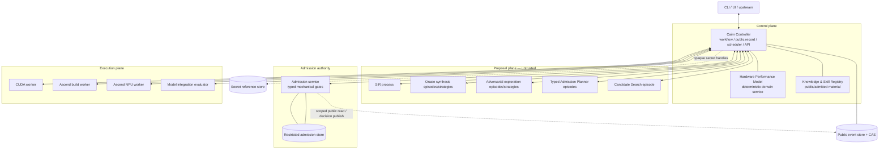

# Cairn 软件架构总览

- 状态：规范性目标设计
- 日期：2026-08-27
- 产品范围：仅限 CUDA → Ascend C 算子移植
- 父设计：[`../SYSTEM_DESIGN.md`](../SYSTEM_DESIGN.md)
- Agent 设计：[`AGENT_ARCHITECTURE.md`](AGENT_ARCHITECTURE.md)

## 1. 结论

Cairn 采用下面的软件形态：

> 模块化 Controller + 独立提案进程 + 独立 Admission authority + 通用执行 Worker +
> 按可见性分区的 event/CAS。

这不是“每个概念一个微服务”。Controller 仍是控制面的模块化单体，拥有工作流、调度、公共记录、
API 和反馈路由。只有必须获得替换性或 authority 隔离的能力跨进程：

- Semantic Intent Recovery（SIR）从首个新架构 V1 起独立运行；
- Oracle synthesis、adversarial exploration、typed Admission Planner 和 Candidate Search 作为
  durable proposal episode/strategy 运行，不共享私有 continuation；相同 capability/data boundary 可
  共用 Planning Host，不同边界按 policy 拆进程；
- Admission Gate 与 restricted material 位于独立 Admission 进程；
- CUDA、Ascend build、Ascend NPU 和模型集成通过 opaque job Worker 执行；
- Hardware Performance Model 首期是 Controller 中的独立确定性领域服务，通过 ports 获取规格、
  microbench 和 profiling receipt，不为概念完整性提前拆成微服务。

## 2. 架构目标

软件架构必须同时保证：

1. **不漂移产品范围**：业务层、公共资源和评估始终明确写作 CUDA → Ascend C；
2. **可替换提案机制**：未来可用静态分析、IR、形式化方法或更强模型替换 SIR/Explorer，而不改变
   admitted contract；
3. **不可伪造 authority**：模型、proposal process、candidate workspace 和普通知识检索没有
   promotion edge；
4. **证据可闭合**：任何正式结论都能沿 typed identity 回到 event、artifact、receipt 或明确的
   external/secret reference；
5. **长流程可恢复**：外部模型、编译、设备执行和人工决策不依赖一个长时间阻塞 RPC 存活；
6. **强类型承载权限**：身份、role、store visibility、lifecycle、evidence 和 outcome 不退化成
   `String`、generic ID 或布尔值；
7. **逐步实施**：先建立真实边界和一条纵向路径，再由实际依赖证明是否需要继续拆 crate/服务。

## 3. 顶层软件组成



图中的连线表示受控协议，不表示任意双向数据访问。尤其是：

- proposal process 只能通过授予的 capability 获取公开输入、知识快照和 tool；
- Controller 可以请求 admission，但不能枚举或读取 hidden corpus；
- Admission 可以读取被授权的公共 artifact，不能改写 applicant；
- Worker 只看 `JobContract`，不知道 job 属于 intent、Oracle 还是 candidate；
- Secret store 返回临时能力或在 adapter 内解析，不把 secret bytes 写入 event/CAS。

## 4. 三种平面与五个 authority domain

运行部署可归纳为三个平面：

| 平面 | 包含 | 性质 |
| --- | --- | --- |
| Control plane | Controller、公共 record/CAS、scheduler、hardware/knowledge services | 拥有流程事实，不拥有 hidden answer |
| Proposal plane | SIR、Oracle synthesis/adversarial、typed Planner、Candidate Search | 可推理、搜索和请求工具，但不能授权自己 |
| Authority/execution plane | Admission gate、restricted store、managed workers | 前者授权 claim，后者只产生 observation receipt |

它们仍服从总体设计中的五个 authority domain：Proposal、Execution、Admission、Record、Policy/User。
“进程”与“authority”不是一一对应：Controller 同时承载 Record 与 process management，但不能因此
拥有 Admission 权限；任何 typed Admission Planner 虽为 admission 工作，却仍属于 Proposal。

## 5. 核心边界

### 5.1 Proposal/admitted 类型边界

跨进程协议也必须保留：

```text
IntentHypothesisSet      != MigrationIntentContract
OraclePortfolioProposal != AdmittedOraclePortfolio
HardwareFactProposal    != AdmittedHardwareFact
CandidateObservation    != CandidateVerdict
AdmissionPlan           != AdmissionDecision
PublicReceipt           != RestrictedAdmissionReceipt
```

只有 Admission service 暴露的 typed decision port 可以产生 admitted 类型。序列化不会抹平该边界：
V1 bytes 在入口立即转为经构造器验证的领域类型。

### 5.2 数据可见性边界

V1 必须存在三个不可互换的 storage capability：

- `PublicEvidenceStore`：proposal、Controller 和经授权执行路径可读的 artifact/event；
- `RestrictedAdmissionStore`：只有 Admission authority 可读写的 hidden cases、expected values、mutants、
  exposure ledger 和完整 judge receipt；
- `SecretReferenceStore`：凭据、私钥、provider token 等不可归档 bytes 的引用与解析边界。

首期可使用相同存储技术和同一受控主机，但必须使用不同数据库/CAS root、进程凭据和 API port。
任何进程都不得获得“知道任意 `ContentId` 就能读取全部 namespace”的通用 handle。

### 5.3 Capability 边界

权限由 Controller/Admission 在进程外强制，最终 capability 是以下交集：

```text
role policy
∩ task data policy
∩ operator deployment policy
∩ worker/device policy
∩ exact episode/run authorization
```

Prompt、skill、知识正文、模型声明和进程命令行 role 名称都不能扩大该集合。

### 5.4 时间与生命周期边界

长时间任务以 command → durable event → immutable artifact 协作。同步 RPC 只用于：

- 接受/拒绝一个命令；
- 查询当前 projection；
- 传输小型、幂等、无外部副作用的控制信息。

模型调用、编译、真实设备执行、admission batch 和人工审批都产生 operation identity，完成结果通过
事件关联。断线和 Controller 重启不改变已经授予的 effect authority。

## 6. 为什么保留模块化 Controller

工作流编排、event append、projection、预算、scheduler、feedback routing 和 API 高度共享同一套
事务与身份约束。在首期把它们拆为网络服务会引入分布式事务和重复 lifecycle，而不会提高 proposal
或 authority 隔离。

因此 Controller 内部按模块/port 隔离，但同进程部署：

- task intake 与 policy resolution；
- process manager；
- agent episode coordinator；
- execution scheduler；
- public record/CAS adapters；
- hardware model；
- knowledge/skill public registry；
- feedback/revalidation routing；
- external API/projection。

Controller 不执行 applicant 代码，不读取 restricted corpus，不把 profiler 文本直接解释成 verdict，
也不允许 model output 直接 append authoritative decision event。

## 7. 为什么 SIR 从 V1 起跨进程

SIR 是最可能快速演化的子系统：它未来可能组合 Clang/LLVM 静态事实、CUDA 动态画像、模型图、
symbolic execution、多模型或形式化工具。若它直接嵌入业务 aggregate，很容易让抽取器的内部表示
成为下游永久依赖。

跨进程边界强制它只接收冻结的 `IntentRecoveryInputV1`，只产出
`IntentHypothesisSetV1`/实验提案，并且：

- 不能构造 `MigrationIntentContract`；
- 不能读取 hidden intent corpus；
- 不能写 policy 或用户声明；
- 不能直接调度未授权设备；
- 失败或替换不改变 Controller 的 durable task truth。

这项隔离服务于未来优化，不意味着把产品泛化为通用语义恢复平台。

## 8. 为什么 Admission 必须是独立 authority

Admission 同时需要 hidden material、mechanism qualification 和产生 admitted type 的权限。把它作为
Controller 内一个普通模块，会让普通应用代码过于容易获得 restricted store handle；把它交给第二个
agent，又不能形成机械独立性。

目标结构把 Admission 拆成：

- **Typed Planner episode**：可选的不可信规划层，按 admission kind 安排实验、总结 receipt、提出
  diagnostic；
- **Mechanical gate**：确定性代码，验证 identity、closure、policy、control 和 receipt 后重算；
- **Restricted store**：hidden corpus、完整 control/expected material、exposure ledger；
- **Public decision surface**：只发布 claim-scoped outcome、允许的 diagnostic、公开 receipt 和 opaque
  restricted reference。

Planner 可以更换模型；gate 的 qualification 和 exact identity 仍独立管理。Required evidence 必须在
Planner 之前由 trusted policy 机械派生，不存在一个可以覆盖 Intent、Oracle、Hardware、Performance
和 Candidate 的万能 Planner profile。详细设计见
[`ADMISSION_ARCHITECTURE.md`](ADMISSION_ARCHITECTURE.md)。

## 9. Crate 与进程不是同一种边界

- crate 边界控制编译期依赖、类型所有权和可测试性；
- process 边界控制故障、权限、secret/hidden 可见性和替换；
- deployment unit 决定伸缩和运维。

一个 crate 可以被多个进程链接；一个进程也可组合多个 crate。不能因为设计中有 Intent、Oracle、
Hardware、Feedback 六个概念，就立刻创建六个网络服务；也不能因为共享一个 Rust crate，就让两个
进程共享同一文件权限或 capability。

具体目标结构见 [`CODE_ORGANIZATION.md`](CODE_ORGANIZATION.md)，业务协作见
[`LOGICAL_ARCHITECTURE.md`](LOGICAL_ARCHITECTURE.md)，部署与恢复见
[`RUNTIME_ARCHITECTURE.md`](RUNTIME_ARCHITECTURE.md)。

## 10. 已拒绝的替代方案

| 方案 | 拒绝原因 |
| --- | --- |
| 所有能力都放进 `cairn-server` | SIR 不可替换、hidden 访问面过宽、proposal 与 authority 易混合 |
| 每个 bounded context 一个微服务 | 首期引入无收益的网络和一致性复杂度 |
| 一个通用 Planning Host 持有所有 role 权限并共享上下文 | continuation、知识、hidden diagnostic 和 candidate context 可能串流；Host 只能承载 capability-equivalent 的隔离 episode |
| 一个全局 CAS API，以 content ID 控制访问 | identity 不是 authorization，枚举/泄漏后会越过 visibility |
| Admission Planner 直接给最终结论 | Planner 是可选、typed、proposal-only 的实验规划器，不能替代 receipt 重算和 trusted gate |
| Worker 理解 Oracle/candidate 业务 | 破坏 opaque execution，资源层会积累产品 authority |
| 为未来其他源/目标预建 plugin schema | 超出 CUDA → Ascend C 产品范围，且没有第二个产品证明抽象 |
| 为新架构保留旧 `cairn-migration` 双路径 | pre-release V1 应直接替换并删除 superseded path |

## 11. 需求与决策追踪

| 软件架构选择 | 主要依据 |
| --- | --- |
| 产品 crate 明确为 CUDA → Ascend C | D-024、D-036、QR-MNT-001/004 |
| SIR 独立且 proposal-only | D-025、D-034、FR-INTENT-*、QR-SEC-006 |
| Proposal episode/context/capability 隔离 | D-022、D-034、FR-AGENT-*、QR-SEC-002/006 |
| Agent catalog、调用和 artifact-mediated interaction | D-038、FR-AGENT-022/023 |
| Admission 独立进程、typed Planner/Gate 分离 | D-032、D-034、D-037、QR-AUD-001/002/005、QR-SEC-006 |
| Public/Restricted/Secret 三类 capability | D-031、D-035、FR-REC-009、FR-KNOW-009、QR-SEC-007 |
| Controller 模块化单体 | D-034、QR-REL-*、FR-REC-*、FR-COST-* |
| Hardware Model 首期是 Controller domain service | D-027、D-034、FR-PERF-* |
| Worker 保持 opaque/domain-neutral | D-024、FR-EXEC-*、QR-MNT-004 |
| Event-driven long workflow | FR-REC-*、QR-REL-*、FR-API-003/004 |
| V1 直接替换、不保留兼容层 | D-036、FR-REC-013、QR-MNT-003 |

具体 requirement 文本仍以 [`../SYSTEM_REQUIREMENTS.md`](../SYSTEM_REQUIREMENTS.md) 为准；本表只帮助
定位，不扩写其含义。

## 12. 有意延后的软件选择

以下内容尚不改变核心 architecture，可留到相应 implementation slice 决定：

- 本地 process protocol 使用 Unix domain socket 还是 framed stdin/stdout；
- process 由 systemd、容器编排还是 Controller 的受限 child supervisor 管理；
- restricted one-time capability 的具体传输与加密 adapter；
- SQLite/CAS 之后是否替换为远程 store；
- proposal host 的实例池预热策略；
- Controller/Admission 的 HA 与多副本；
- vector retrieval、分布式 CAS 和跨 region 部署。

这些选择必须满足已经冻结的 typed protocol、authority、visibility、durability 和 recovery 约束。
任何方案若要求 Controller 读取 hidden bytes、Proposal 获得 promotion edge、Worker 理解 Oracle 业务，
或引入非 V1 fallback，就不再是“实现细节”，必须回到规范层重新讨论。

第一个 architecture proof slice 仍限定为一个 kernel 的
`IntentHypothesisSet → Intent Admission → MigrationIntentContract → 一个 Oracle claim proposal`，在
Candidate Search 之前停止。具体 operator、claim 和 hidden corpus 仍受
[`OQ-019`](../OPEN_QUESTIONS.md) 阻塞；这句话不构成本轮实施授权。

## 13. 当前实现与目标差距

当前已有 `cairn-server`、`cairn-worker`、agent/record/execution/verification 基础和
`cairn-migration` 中的固定 Oracle/历史 reduction 路径。以下仍是目标而非实现：

- `cairn-migration` 尚未重命名并重组为明确的 CUDA → Ascend C 产品 crate；
- SIR、proposal host 和 Admission 尚无独立进程协议与部署；
- 产品侧 Agent profile catalog、invocation policy 和 interaction validator 尚未实现；
- public/restricted/secret storage capability 尚未按本设计闭合；
- Controller 还没有完整 product process manager；
- Hardware Performance Model、knowledge/skill registry 和 feedback routing 尚未形成目标模块；
- 新架构的第一条 intent → Oracle claim 纵向路径尚未开始。

实施必须从 [`../dev/SLICE_CATALOG.md`](../dev/SLICE_CATALOG.md) 选择 Ready slice，且每一片先形成
`DesignConformanceRecord`。本文不授权直接实施。
