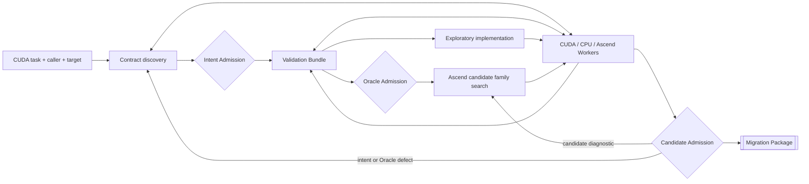

# Cairn 当前产品与系统设计

- 状态：当前产品设计基线
- 最近修订日期：2026-09-01
- 产品方向：CUDA → 特定 Ascend 硬件亲和的 Ascend C 迁移
- 首个硬件目标：Ascend 950PR（3510）
- 当前实验目标：比较 up-front 结构化 D 与证据驱动、自适应共设计 E，并验证 Candidate promotion 的可信性

## 1. 文档地位

本文档定义 Cairn 当前唯一的全局产品方向和系统结构。后续实现、实验和评审必须从本文档开始。

[`SIR_ORACLE_CURRENT_DESIGN.md`](SIR_ORACLE_CURRENT_DESIGN.md) 是 SIR、Oracle 及其 exploratory Candidate/promotion
接口的当前联合权威设计。它可以细化本文的 authority dependency 和执行时序，但不能削弱本文的产品使命、四平面、
exact target、Worker evidence 和 release Gate。仓库中更早的需求、系统、Oracle、workflow、decision 和开发记录保留为
历史证据，不用于给本文档补充隐含要求。

本文档与 `AGENTS.md` 冲突时，以 `AGENTS.md` 为准。本文档与代码不同时，差异是待验证或待修复的实现缺口，
不是引入 compatibility reader、V2、legacy alias、fixture branch 或 authority fallback 的理由。

此前针对 A/B/C 的冻结已经完成其 pilot 作用。用户随后明确重新审视固定 SIR/Oracle 时序并形成 D/E 候选；当前仍不得因
一次模型失败、一个 fixture 或实现便利继续漂移，但可以通过预注册 D/E 对照和明确产品决策更新本基线。

## 2. 产品使命

Cairn 的使命是帮助开发者把此前未知的 CUDA 实现迁移为针对指定 Ascend SoC、CANN/toolchain 和真实 workload
优化的 Ascend C 实现，并交付足以复现和审查其正确性、数值行为、集成、安全与性能结论的证据。

当前第一个产品目标固定为 Ascend 950PR（3510）。所有 platform facts、编译/运行 receipts、性能结论和 candidate
适用范围都必须显式绑定 3510 及 exact CANN/toolchain；其他 SoC 的事实不得自动继承。

Cairn 不是：

- CUDA token/API 替换器；
- 只会拼装现有模板库的 generator；
- 假定输入 CUDA 正确的等价抄写器；
- 只生成建议、报告或 Oracle 而不交付可运行实现的咨询系统；
- 由 repository coding agent 预先理解 fixture 后代替 runtime model 完成任务的脚本；
- 以模型自评、角色共识或输出格式完整性作为成功标准的 Agent 演示。

最短产品承诺是：

> 生成能被开发者带回项目的 Ascend C migration package，并诚实说明它已经证明什么、尚未证明什么、如何重放，
> 以及为什么选择这组硬件亲和实现。

## 3. 输入范围

任务不要求存在 PyTorch、其他 framework 或独立 reference。最低输入可以只是获准的 CUDA 项目材料，例如：

- 一个或多个 `.cu` / `.cuh` 文件；
- host launcher、参数构造和 build files；
- 可执行程序、命令行入口或 C/C++ tests；
- caller 对迁移目标的最小声明；
- 目标 Ascend 平台或显式 unknown。

若任务同时包含以下材料，Cairn 应当利用但不得要求它们存在：

- PyTorch custom op、Python reference、OpInfo 或 tests；
- TensorFlow、JAX、Triton 或其他 framework integration；
- CPU reference、论文、规范或模型图；
- 生产 shape/dtype/workload trace；
- 既有性能报告、历史缺陷或用户反馈。

PyTorch 是可选的 framework/reference adapter，不是产品入口条件，也不是天然 truth authority。

## 4. 长期定位：Ascend C first

Cairn 长期优先生成硬件亲和 Ascend C，而不是把任务默认降级为 API 替换或现有库调用。这个定位特别面向：

- 新 Ascend 硬件的软件生态尚未成熟；
- framework/operator coverage 不完整；
- 现有高层实现不能满足融合、布局、精度或性能目标；
- CUDA 实现包含项目特有算法或执行结构；
- 开发者需要针对真实 workload 控制 tiling、pipeline、memory 和 core mapping。

已有 `torch_npu`、aclnn、Triton-Ascend 或其他实现可以成为 reference、correctness baseline、performance baseline、
implementation seed 或显式 escape hatch。它们不能让 Cairn 的核心能力退化为“找到一个现有算子并结束”。

### 4.1 不依赖模板库，不等于每次从零开始

Cairn 不以 CUTLASS 式完整算子模板覆盖率作为能力边界，但必须建设可复用的低层资产：

- 经测量的硬件事实；
- Ascend C 数据搬运、对齐、tail、reduction、queue、buffer 和 pipeline 原语；
- 可组合的计算结构；
- 可搜索的 schedule 变换；
- target-specific 编译、调试和 profiling 方法。

这些资产扩大 runtime model 的有效搜索空间，不编码某个 fixture 的已知答案。模型仍然可以提出模板库从未覆盖的
算法和实现结构。

### 4.2 输出通常是实现族

硬件亲和实现可能按 shape、dtype、alignment、workload 或 target capability 分成多个变体。产品输出允许：

```text
AscendCandidateFamily
├── general correctness baseline
├── specialized kernel variants
├── host tiling and TilingKey policy
├── workload-aware dispatch
└── explicitly scoped safe path
```

每个变体和 dispatch 分支必须分别进入适用 domain、validation 和 performance lineage。生成产物内部经准入的安全路径
不是 Cairn authority fallback。

## 5. 不为输入 CUDA 的正确性担保

CUDA 源码是迁移对象，也是证据来源，但不是默认 specification。Cairn 必须区分：

1. CUDA 程序在 exact 环境和输入下实际做了什么；
2. caller 希望迁移保留什么；
3. independent reference 或 framework contract 表达什么；
4. future Ascend C candidate 必须满足什么。

CUDA bug、race、越界、未初始化读、偶然 launch 行为、错误边界结果或不必要数值误差，不会因被观察到就自动进入
迁移目标。Source execution receipt 只能形成 source behavior evidence；只有 Intent Admission 才能发布下游可依赖的
exact claim。

## 6. 为什么保留结构化 Agent 工作流

Cairn 不寄希望于 Agent 在一次长思考中主动、完整且勤奋地覆盖所有义务。任务被拆分为 claim、risk、dimension、
item、experiment、review 和 revision，使 runtime model 在一个受控问题上聚焦，并让遗漏、反馈和停止条件显式化。

但是，结构化只提供注意力和责任边界，不提供语义 truth。以下内容不能单独构成证据：

- schema 被完整填满；
- 同一模型换角色后同意自己；
- 多个 Agent 得到相同结论；
- reviewer 重写了 draft；
- 自由文本表达得专业或有信心。

### 6.1 一个结构值得持久化的条件

一个结构化步骤至少应满足以下一项：

1. 让模型聚焦一个已知容易遗漏、会改变下游结果的问题；
2. 引入新的 source slice、knowledge、tool observation、Worker receipt、counterexample 或用户决定；
3. 产生 mechanical Gate 可以独立重算的 artifact 或 outcome；
4. 承载 restart、authority、budget、security 或用户可见 lineage。

都不满足的 planning detail 应留在 episode 内，不能仅为了架构整齐变成永久领域协议。

### 6.2 Reviewer 的独立性来自信息，而不是名称

Reviewer 若只看到与 Developer 相同的材料和同源模型输出，主要承担结构、引用和覆盖检查。只有获得新的独立信息
通道时，才能增加更强的验证价值，例如：

- 独立 reference；
- compiler、CUDA 或 Ascend execution；
- sanitizer、proof、mutation 或 fuzz；
- hidden challenge；
- 不同信赖来源或模型；
- Controller 机械重算。

### 6.3 Risk-adaptive decomposition

结构化深度按风险和证据派生：

- 明确、可执行且有独立 reference 的普通 item 可以短路径闭合；
- 数值敏感、并发、stateful、无 reference、跨 framework 或性能关键 item 使用完整 review 和实验；
- review 连续没有产生新 finding 时，不通过重复角色调用制造虚假 assurance；
- concern 对 claim 不适用时记录有理由的 `NotApplicable`，不要求模型编造内容填满矩阵。

消融实验完成前，当前完整结构化流程继续作为 B 组基线，不提前凭直觉删除。

## 7. 四个产品平面

### 7.1 Semantic Contract

回答“需要迁移什么”：

- source facts 和 behavior observations；
- competing intent hypotheses；
- semantic/numerical/framework obligations；
- implementation freedoms；
- unknown、conflict 和用户决定；
- exact admitted intent。

SIR 是这个平面的 proposal mechanism，Intent Admission 是 authority boundary。

### 7.2 Platform Facts

回答“指定 Ascend 硬件实际上允许和擅长什么”：

- SoC、CANN、compiler、runtime 和 device identity；
- API、dtype、alignment、core、memory、workspace 和 instruction capability；
- compile probes 和 diagnostics；
- GM/UB、Vector/Cube、pipeline 和 synchronization microbench；
- profiler observation；
- shape/workload crossover；
- known limitation 和 revalidation trigger。

Platform fact 优先来自 exact Worker observation。官方文档和 knowledge 可以提出 probe 或解释结果，不能冒充设备测量。

### 7.3 Implementation Search

回答“如何得到硬件亲和实现”：

- 最简单的 correctness baseline；
- 多种 algorithm/layout/schedule hypotheses；
- Ascend C kernel、host tiling 和 integration revisions；
- compiler/execution/profiler feedback；
- candidate pool、淘汰原因和保留多样性；
- target-specific variant 与 dispatch search。

Runtime model、规则、原语和搜索算法可以共同提出候选；只有真实 build/run/profile 才能决定观测结果。

### 7.4 Assurance and Delivery

回答“为什么开发者可以采用它”：

- executable Validation Bundle；
- correctness、numerical、integration 和 safety controls；
- Oracle adequacy；
- target-side performance measurement；
- mechanical admission outcomes；
- reproducible migration package。

四个平面共享 evidence graph，但 identity、authority、revision 和 outcome 类型不同。

## 8. 两个耦合循环



图中的箭头表达 release authority dependency，不要求所有认知活动严格按图从左到右完成。source understanding 每次迁移都会
发生，但 focused SIR 只在实际 reasoning 暴露 material semantic fork 时物化；不得增加 mini-SIR classifier。完整 Oracle
accepted 是 Candidate Admission 的前置条件，不是生成第一个无发布 authority 的 exploratory Candidate 的前置条件。

### 8.1 语义与验证循环

Migration reasoning → optional focused SIR → Intent Admission → evolving Validation Bundle → Oracle Admission。新
source/reference/Candidate observation 或 counterexample 可以创建新的 Intent/Oracle revision，但不能原地修改已冻结
artifact；任何 relevant revision 都会使旧 Qualification Epoch 失效。

### 8.2 实现与性能循环

Candidate family → build/run → correctness → profiling → revision。Correctness baseline 始终保留，性能变体不能覆盖或
删除它的历史证据。

### 8.3 Exploratory implementation

在完整 Oracle accepted 前，Controller 可以授权没有发布资格的 `ExploratoryImplementation`，用于：

- 验证 Ascend build 和 integration 可行性；
- 发现 target capability 和 compiler 限制；
- 检查 Validation Bundle 是否真的能消费 Ascend candidate observation；
- 为 platform characterization 提供 probe。

它不是正式 Candidate，不能获得 Candidate verdict，不能修改 intent/Oracle，也不能通过自身表现调宽 comparator。

## 9. SIR 与证据交接

runtime model 直接开始迁移推理。它若发现会改变 Candidate、domain、comparator、ABI 或用户可见行为的 semantic fork，才
进入 focused SIR；不存在统一的 readiness/skip-SIR 前置判断。focused SIR 或 direct reasoning path 可以组合：

- source/caller/build 静态分析；
- host launch 和数据流切片；
- CUDA Worker 的边界、sanitizer、race 和行为实验；
- CPU/reference synthesis 与验证；
- 外部研究、knowledge 和 skill；
- 用户对 desired semantics 的 exact 决定。

两条路径产生同一个 intent proposal type。focused SIR 不生成最终 Oracle，也不准入 Candidate。Intent Admission 发布：

- claim-scoped admitted contract；
- admitted evidence snapshot；
- source behavior disposition；
- unresolved unknown/conflict；
- 下游允许使用每项 evidence 的方式。

Oracle 不能只获得一段 SIR summary，也不能读取未经筛选的全部 transcript。

## 10. Oracle 是 executable Validation Bundle

Oracle 的用户价值不是一份验证建议，而是一组将来可以运行在 Ascend C candidate 上的 mechanisms：

```text
ValidationBundle
├── typed input/domain generators
├── public regression cases
├── hidden and adaptive cases
├── optional CUDA/CPU/framework reference providers
├── relational and metamorphic properties
├── numerical comparators and allowance derivation
├── ABI/framework/integration checks
├── memory/concurrency/safety checks
├── performance workloads and measurement policy
└── provenance, dependency and replay manifest
```

没有 PyTorch 或独立 reference 时，Oracle 可以组合 source observations、caller declarations、properties、metamorphic
relations、multiple implementations、high-precision partial references、formal tools 和用户 decisions。缺少证据的部分必须
保持 unknown 或 partial，不能让 CUDA 代码自动成为 truth。

每个 Oracle item 必须最终产生可执行 mechanism、可反驳 claim、明确 evidence gap 或有依据的 `NotApplicable`。只分析
CUDA 源码质量、无法对 future Ascend candidate 产生判断的 item 不得计入 accepted portfolio。

详细流程和失败分类见 [`SIR_ORACLE_CURRENT_DESIGN.md`](SIR_ORACLE_CURRENT_DESIGN.md)。

## 11. Candidate family search

Candidate Search 从最简单、最容易检查的 Ascend C baseline 开始，再探索硬件亲和变体。搜索维度可以包括：

- algorithm decomposition 和 fusion boundary；
- Vector/Cube/SIMT 路径；
- core mapping 和 blockDim；
- host tiling、TilingKey 和 shape specialization；
- GM↔UB data movement；
- alignment、padding 和 tail；
- LocalTensor/queue/buffer 生命周期；
- double buffering 和 pipeline；
- accumulator/output dtype；
- integration、workspace 和 launch policy。

一次 revision 只能在 exact admitted intent、Oracle、platform facts 和公开 feedback 下产生。Repository coding agent 不得
解释 fixture 后写入生成答案。

## 12. 正确性、数值、安全与性能

内部至少保留以下独立 outcome：

- semantic/algorithmic correctness；
- numerical acceptance 与 assurance；
- ABI/framework/execution authenticity；
- memory/state/concurrency safety；
- Oracle adequacy；
- resource/performance。

性能不能补偿其他 required outcome 的失败。性能平面始终存在；没有业务目标时为 informational、unknown 或
not-executed，而不是静默删除。

性能必须在目标 Ascend 环境中相对有意义的 target baseline 测量。CUDA 与 Ascend 的裸耗时不能直接成为公平 verdict。
用户真实 shape/dtype/workload 分布优先于单一 microbenchmark；同时记录 latency、throughput、workspace、memory 和稳定性。

## 13. Knowledge、skill 与经验沉淀

Knowledge 和 skill 帮助 runtime model 处理未知任务，但不拥有 authority。首期优先建设：

- 版本和 target 精确的官方文档索引；
- Platform Facts 和 compile/microbench receipts；
- 可复用原语及其验证范围；
- 常见 compiler diagnostic 的定位方法；
- 已审查迁移中抽取的通用方法。

不把成功 fixture 的算法答案、ID、expected output 或特定 prompt 提升为 production knowledge。

Skill 只能建议步骤或工具请求，不能扩张 capability。Knowledge entry 必须携带 provenance、scope、trust state 和
revalidation trigger。检索排名和模型信心不能支持 Admission。

## 14. 运行结构

### 14.1 Controller

`cairn-server` 保持业务无关，migration app composition 驱动 `CudaMigrationWorkflow`。Controller 是唯一公共 workflow
writer，负责冻结输入、签发 authority、保存 revisions、调度 Worker、提交 durable facts 和机械选择 transition。

### 14.2 Agent Loops

SIR、Oracle 和 Candidate reasoning 使用 `cairn-agent` 的真实 model/tool episode。Dimension、item、revision、candidate
pool 和 experiment 的外层遍历是机械编排，不是嵌套 Agent Loop。

### 14.3 Worker fabric

CUDA、CPU/reference、Ascend build、NPU、sanitizer、proof、mutation 和 profiling 都通过统一 managed Worker 调度。Worker
只执行 exact job contract，不解释 intent 或产生 verdict。

### 14.4 Gates

Intent、Oracle 和 Candidate Admission 是独立函数边界。它们从 exact artifacts、policy 和 trusted receipts 重算结果，
不调用模型补齐缺失事实。

### 14.5 正常客户入口

```text
cairn-cli → cairn-server → migration app API → CudaMigrationWorkflow → managed Workers
```

内部 test helper、fixture proposal、专属 binary 或伪 receipt 不能成为 dogfood 成功路径。

## 15. 强类型、持久化与日志

强类型优先保护：

- task、claim、artifact、revision、role 和 scope；
- source observation、intent evidence、platform fact、Oracle evidence 和 candidate evidence；
- operation authority、Worker job/attempt/receipt；
- comparator、measurement unit 和 outcome；
- feedback route 和 lifecycle state。

模型 episode 内不承载 authority 的临时思考不需要全部进入永久领域模型。

所有昂贵或外部 effect 都必须 restart-safe、可查询且不重复执行。日志只记录关联 identity、阶段、计数、分类和状态；
不记录源码、prompt、模型正文、stdout/stderr、hidden material 或 credential。

## 16. 开发者交付物

最终 `MigrationPackageV1` 应包含：

- Ascend C kernel family；
- host tiling、dispatch 和 build files；
- 必要的 host/framework integration；
- validation cases、references、properties 和 replay commands；
- benchmark/profile scripts；
- 支持的 target、dtype、shape、layout 和 workload scope；
- 已知限制、unknown 和 revalidation trigger；
- correctness/numerical/safety/performance outcomes；
- 可审查 source diff 和采用建议。

项目成功不是生成代码、完成 workflow 或得到一个 `accepted` 单词，而是开发者能够理解、复现并采用这个 package。

## 17. 产品指标

优先指标是：

- previously unseen tasks 的端到端成功率；
- time-to-first-running Ascend implementation；
- time-to-reviewable / mergeable package；
- hidden/mutant correctness detection；
- correct variant false rejection；
- source defect 被误迁移的比例；
- target baseline 上的真实性能；
- 人工问题数量和人工修改量；
- model token、Worker/device time 和总成本；
- restart/replay 成功率；
- 开发者最终采用率。

Agent 数量、文档长度、schema 字段数量和 workflow transition 数不是产品指标。

## 18. 已完成的 A/B/C 推理分解 pilots

A/B/C 已作为实现与设计 pilots 运行并保存。它们没有共同 hidden semantic evaluator，且执行深度、二进制与 prompt/limit
并不完全一致，因此不能作为因果优胜结论。其价值是暴露结构膨胀、Reviewer 真实 finding、Worker evidence 收益和 capability
错配。

### 18.1 历史实验组

三组使用相同 task intake、runtime model version、target context、可见材料和最终 mechanical evaluator：

| 组 | 推理结构 | 外部实验 |
| --- | --- | --- |
| A `MinimalDecomposition` | 一个 SIR episode；Intent Admission 后一个整体 Oracle portfolio episode；无模型 Reviewer | 不允许，仅能读取冻结 artifacts |
| B `StructuredReview` | dimension/item discovery、Developer、Reviewer、revision、portfolio coherence | 不允许新的 Worker 实验，仅能读取冻结 artifacts |
| C `EvidenceAugmentedStructuredReview` | 与 B 相同 | 允许 SIR/Oracle 提交 typed CUDA/CPU/reference/Ascend Worker requests 并消费 receipts |

A 组仍遵守 SIR proposal、Intent Admission、Oracle proposal 和 mechanical Admission 的 authority 分离；减少的是模型推理
分解，不是 Gate。

这些模式是 task-generic `ReasoningDecompositionPolicyV1`，不是 fixture-specific helper 或绕过正常入口的测试协议。

### 18.2 公平性

每个 task 至少执行：

1. 固定总模型 token/tool-call budget 的对照；
2. 允许各组自然闭合、但完整记录成本的实用性对照。

模型 deployment、prompt version、source bundle、target、knowledge snapshot 和 visible evidence 必须冻结。若 provider
提供在当前 reasoning 模式下真实生效的 seed，则同时冻结 seed；否则不得声称单次 A/B/C 是确定性配对。当前
DeepSeek thinking mode 明确忽略 `temperature` 和 `top_p`，且 Responses API 未提供可用 seed，因此每个 task/mode
必须执行多次独立重复，随机化 mode 顺序，报告分布和方差，并把 task 与 repetition 作为配对 block。该限制见
[DeepSeek Thinking Mode](https://api-docs.deepseek.com/guides/thinking_mode/) 与
[Responses API](https://api-docs.deepseek.com/api/create-response/)。

Worker time 和模型成本分别报告，不能把 C 组额外真实执行隐藏在总分中。

### 18.3 独立评价

评价侧使用 proposal Agent 不可见的：

- semantic obligations；
- correct implementation variants；
- targeted mutants；
- hidden/disjoint input distributions；
- source-defect traps；
- framework-optional integration obligations；
- measurement validity checks。

评价重算：

- intent obligation recall 和错误 promotion；
- candidate-facing Oracle item 比例；
- mutant rejection 和 correct-variant acceptance；
- numerical/domain/safety coverage；
- Reviewer 新增 finding 数量及其证据来源；
- tokens、turns、wall time、Worker/device time；
- invalid submission、revision 和 stalled-loop 数量。

### 18.4 任务梯度

语料必须同时包含无 framework 和有 framework 的任务，至少覆盖：

1. 裸 CUDA + host launcher 的 elementwise/integration smoke；
2. reduction；
3. numerical-sensitive normalization 或 softmax；
4. layout/indexing；
5. state/atomic/concurrency；
6. fusion/performance-sensitive task。

PyTorch custom op 可以提供其中一部分任务和 reference，但不得成为全体任务的前置条件。

### 18.5 原实验假设

这些是 A/B/C 设计时希望验证的假设；pilots 没有充分条件逐项关闭：

- H1：B 相比 A 提高 obligation recall 和结构完整性；
- H2：B 中没有新证据的同源 Reviewer 收益会随 revision 快速递减；
- H3：C 相比 B 的主要提升来自 external observations，而不是更多角色；
- H4：固定 concern 矩阵会产生一定比例的低价值或不适用 item；
- H5：target platform facts 会降低后续 build/performance revisions；
- H6：没有 framework/reference 的任务仍可形成 useful partial Oracle，但 unknown 比例更高。

### 18.6 原决策规则

这些规则仍作为历史分析框架，但不能把 pilots 误写成已经满足其统计前提：

- 若 B 在相近成本下显著优于 A，保留结构化分解；
- 若部分 Reviewer 主要改写而不增加 finding，缩短或条件化对应 role；
- 若 C 显著优于 B，优先建设 Worker experiment/evidence plane，而不是增加更多模型角色；
- 若某些 task class 需要不同结构，采用 risk-adaptive policy；
- 若数据不充分，保持当前冻结设计并扩大任务，而不是凭单个 fixture 改架构。

具体阈值、corpus identity、model deployment、budget 和 evaluator artifacts 在首个实验 manifest 中冻结。

## 19. 已完成的 A/B/C 实现顺序

以下列表记录此前为 A/B/C pilots 安排的实现顺序，不再是当前下一步：

1. 建立 `ReasoningDecompositionPolicyV1` 和同一正常 CLI/API 入口下的 A/B/C mode；
2. 建立 experiment manifest、run identity、成本和 outcome 记录；
3. 让 B 复用当前结构化流程；
4. 为 A 增加最小分解的真实 Agent path，不绕过 Intent/Oracle Gates；
5. 为 C 接通 typed Worker request → receipt → exact Agent Loop resume；
6. 先运行不要求 PyTorch 的 CUDA task，再加入可选 framework/reference task；
7. 冻结第一批结果后决定哪些结构保留、条件化或删除；
8. 随后进入 Candidate family 与 Platform Facts 的真实闭环。

在此之前，不继续扩建通用知识库、额外 Reviewer topology、兼容层或 fixture-specific 机制。

## 20. 当前 D/E 设计与实验方向

下一轮比较：

- **D-Upfront**：先完成 blind scope、sealed policy challenge、global obligation graph 和完整 property/mechanism Review；
- **E-Adaptive**：intent、assurance 和 exploratory Candidate 在 evidence graph 中共同演进，qualification 前完成 late policy
  challenge，必要时 full D fallback；
- **E-Full-D-Fallback**：对 high-severity gap 或 repeated qualification failure强制完整 D；
- **E-Organic-Only diagnostic**：只测自然发现，不具备产品 release 资格。

E 不以足够强模型为前提，也不新增 mini-SIR。正式 Candidate promotion 必须绑定同一个 frozen Intent、Qualification Oracle、
950PR target、Candidate revision 和 promotion policy。Oracle 改版后 parent/current variants 对称重测；latest revision 不自动
晋升；performance/precision improvement 预声明并通过 required non-regression、minimum practical improvement、hidden query/
exposure 和 independent qualification Gate。

详细 current SIR/Oracle authority 见 [`SIR_ORACLE_CURRENT_DESIGN.md`](SIR_ORACLE_CURRENT_DESIGN.md)，方案 E 和 metrics 见
[`EVIDENCE_DRIVEN_ADAPTIVE_MIGRATION_DESIGN.md`](EVIDENCE_DRIVEN_ADAPTIVE_MIGRATION_DESIGN.md)。正式 experiment manifest
仍须冻结 task、model capability strata、budget、target、common hidden evaluator、semantic matching、promotion policy 和
intention-to-treat 规则。
