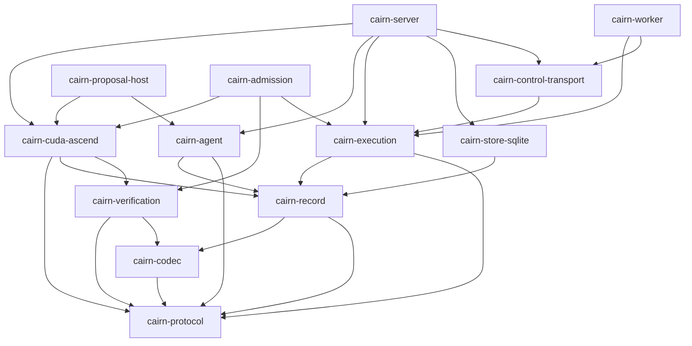

# Cairn 代码目录与依赖设计

- 状态：规范性目标设计
- 日期：2026-08-29
- 产品范围：仅限 CUDA → Ascend C 算子移植
- 说明：目录树是目标结构，不表示目录或 crate 已存在

## 1. 组织原则

代码结构首先表达 dependency 和 authority，其次才表达概念分类：

1. domain-neutral 基础 crate 不出现 CUDA、Ascend C、Oracle workflow 或产品 verdict；
2. CUDA → Ascend C 领域类型归一个明确命名的产品 crate，不使用泛化的 migration 产品名；
3. proposal type 和 admitted type 在类型定义、module export 和 constructor 可见性上隔离；
4. process boundary 对应独立 binary crate，但不为每个领域名词创建 crate；
5. port 定义在拥有业务需求的一侧，adapter 定义在实现外部技术的一侧；
6. binary crate 只做配置、composition、lifecycle 和 adapter wiring，不存放可复用业务规则；
7. 测试跟随 authority boundary，不能只按文件或函数做 happy-path unit test；
8. pre-release 架构替换直接修改 V1、搬迁调用者并删除旧路径，不保留 alias、re-export compatibility
   facade、dual reader 或转换器。

## 2. 目标 workspace

```text
cairn/
├── Cargo.toml
├── AGENTS.md
├── config/
│   ├── controller/
│   ├── admission/
│   ├── proposal/
│   └── worker/
├── crates/
│   ├── cairn-protocol/             # 强类型基础 identity/unit/schema/error
│   ├── cairn-codec/                # canonical V1 wire/storage codec
│   ├── cairn-record/               # event/CAS/graph/replay ports
│   ├── cairn-store-sqlite/         # public/restricted store 的 SQLite adapters
│   ├── cairn-agent/                # 业务中立的 model/tool/episode runtime
│   ├── cairn-execution/            # opaque job/attempt/lease/receipt
│   ├── cairn-control-transport/     # managed worker control transport
│   ├── cairn-verification/          # 经证明可共享的 admission mechanics
│   ├── cairn-cuda-ascend/           # 唯一 CUDA→Ascend C 产品领域与应用层
│   ├── cairn-server/                # Controller composition root / App Server
│   ├── cairn-proposal-host/         # SIR/Oracle/Planner/Candidate role-scoped episode process
│   ├── cairn-admission/             # 独立 Admission authority process
│   ├── cairn-worker/                # 通用 managed execution worker
│   ├── cairn-observability/         # 进程日志初始化与字段政策
│   └── cairn-testkit/               # recorded providers/faults/fixtures（目标）
├── docs/
│   ├── design/
│   └── oracle/
├── model-templates/                 # content-addressed model instruction assets
├── tests/
│   ├── architecture/                # dependency/API/static boundary tests
│   ├── contracts/                   # process/store/worker/provider contract suites
│   ├── workflows/                   # hardware-free recorded vertical slices
│   └── hardware/                    # 显式启用的 CUDA/Ascend/model lanes
├── scripts/                         # 唯一入口的 lint/test/release/real-lane wrappers
└── release/
```

只有 `cairn-proposal-host` 和 `cairn-admission` 是新架构明确要求增加的进程 crate。
Hardware、Knowledge、Feedback、Intent、Oracle、Candidate 首期都先放在产品 crate 的独立 module；出现
第二种实现、无法接受的编译依赖或独立部署需求后再决定拆 crate。

当前 workspace 中的 `cairn-sir` 是 DEV-008 one-shot typed ingress/capability proof。它不是目标树的一部分；
通用 Proposal Host 接管 production SIR 后，当前 V1 直接删除该 crate/path，不保留 alias、dual launcher
或 compatibility adapter。

## 3. Crate 责任

### 3.1 基础层

| Crate | 拥有 | 不得拥有 |
| --- | --- | --- |
| `cairn-protocol` | `SchemaVersion`、基础 typed IDs、时间/数量/单位、通用 envelope | 产品 aggregate、Oracle claim、vendor ABI |
| `cairn-codec` | canonical V1 encode、strict decode、duplicate/unknown/non-V1 rejection | 生命周期转换、policy 和 verdict |
| `cairn-record` | `EventStore`/`ContentStore` ports、event envelope、evidence graph/replay primitives | SQLite、业务 decision、hidden 可见性默认值 |
| `cairn-store-sqlite` | 上述 ports 的 SQLite 实现、事务与完整性检查 | 业务 aggregate 和 admission policy |
| `cairn-observability` | subscriber、redaction policy、稳定 operational fields | durable state 或业务结果派生 |

`cairn-protocol` 不应成为“所有 schema 的垃圾桶”。产品专属 V1 类型留在
`cairn-cuda-ascend`，只有跨产品基础机制使用的 identity/unit 才下沉。

### 3.2 通用机制层

| Crate | 拥有 | 不得拥有 |
| --- | --- | --- |
| `cairn-agent` | episode/turn/step、provider protocol、tool dispatch、预算、recorded/live continuation | SIR/Oracle strategy 业务 prompt、CUDA/Ascend 工具政策、admission verdict |
| `cairn-execution` | job/attempt/assignment/lease、opaque bundle、worker-controlled evidence、receipt | kernel 数学、Oracle case、roofline 解读 |
| `cairn-control-transport` | worker enrollment/session/wire/tls adapter | product resource 或 worker 业务角色 |
| `cairn-verification` | 真正跨 admission kind 的 claim/obligation/receipt mechanics、comparator/mutation primitives | 产品 required-claim policy、CUDA source disposition、Ascend candidate 结论 |

若所谓“通用”类型只有 Oracle 一处使用，先留在产品 crate。`cairn-verification` 不能为了复用当前
reduction fixture 而迫使新架构继承错误抽象。

### 3.3 产品层

现有 `cairn-migration` 在实施该架构时直接重命名为 `cairn-cuda-ascend`，并同时更新 workspace、代码、
测试、fixture、example 和文档。旧 crate 名、旧 re-export 和两个并存产品入口全部删除。

该 crate 拥有：

- `CudaToAscendMigrationTask` 及产品 aggregate；
- CUDA/Ascend C ABI、shape、dtype、memory、launch 和 artifact contracts；
- intent proposal/admission contract；
- Oracle portfolio、case、relation、comparator applicability 和 required claim closure；
- hardware fact、measurement、roofline 和 performance outcome；
- candidate、feedback、knowledge/skill 的产品侧 policy；
- process manager 所消费的 command/event 与 application ports；
- MigrationVerdict 派生规则。

它不实现 model HTTP、SQLite、WebSocket、Docker 或 device driver adapter。

### 3.4 进程层

| Crate | 进程责任 | 允许依赖 |
| --- | --- | --- |
| `cairn-server` | Controller、API、process manager、scheduler、public stores、adapter composition | 产品层及所有必要基础 ports/adapters |
| `cairn-proposal-host` | 运行 SIR、Oracle synthesis/adversarial、typed Planner、Candidate 等 durable proposal episode | 产品 proposal protocol、`cairn-agent`、严格 capability client |
| `cairn-admission` | restricted store、typed gates、public outcome/diagnostic surface | 产品 admission types、verification mechanics、execution/public-read clients |
| `cairn-worker` | 认证连接、执行 opaque authorized job、回传 worker evidence | execution/control transport/adapters，不依赖产品 crate |

`cairn-proposal-host` 是运行载体，不是把所有 role 混成一个 session。一个 process instance 只可承载
具有相同 OS/external capability boundary 的 episode；每个 episode 仍有独立 `EpisodeRole`、typed
profile、capability grant、artifact namespace 和 private continuation。边界不同或需执行不可信 tool
时按 policy 拆 process instance。Admission gate 不链接 model provider adapter；需要推理的 typed
Planner 在 proposal host 中运行。

## 4. 产品 crate 内部结构

```text
crates/cairn-cuda-ascend/src/
├── lib.rs
├── task/
│   ├── model.rs
│   ├── policy.rs
│   ├── commands.rs
│   └── events.rs
├── intent/
│   ├── source_facts.rs
│   ├── hypothesis.rs              # proposal-only
│   ├── experiments.rs
│   ├── admission.rs               # exact intent gate contracts
│   ├── contract.rs                # admitted types
│   └── process_protocol.rs
├── oracle/
│   ├── claim.rs
│   ├── domain.rs
│   ├── portfolio_proposal.rs
│   ├── case.rs
│   ├── relation.rs
│   ├── comparator.rs
│   ├── controls.rs
│   ├── admission.rs
│   └── admitted_portfolio.rs
├── candidate/
│   ├── model.rs
│   ├── search.rs
│   ├── build.rs
│   ├── execution.rs
│   └── admission.rs
├── hardware/
│   ├── facts.rs
│   ├── measurement.rs
│   ├── microbench.rs
│   ├── profiler.rs
│   ├── roofline.rs
│   └── admission.rs
├── feedback/
│   ├── model.rs
│   ├── attribution.rs
│   ├── contamination.rs
│   └── routing.rs
├── knowledge/
│   ├── claim.rs
│   ├── skill.rs
│   ├── retrieval.rs
│   ├── lifecycle.rs
│   └── impact.rs
├── agent_profiles/
│   ├── catalog.rs
│   ├── invocation_policy.rs
│   ├── interaction.rs
│   ├── sir.rs
│   ├── oracle_synthesis.rs
│   ├── oracle_adversarial.rs
│   ├── candidate_search.rs
│   └── admission/
│       ├── intent.rs
│       ├── oracle.rs
│       ├── hardware.rs
│       ├── performance.rs
│       ├── candidate.rs
│       ├── knowledge.rs
│       └── skill.rs
├── admission/
│   ├── policy.rs
│   ├── obligation.rs
│   ├── receipt_closure.rs
│   ├── diagnostic.rs
│   └── ports.rs
├── workflow/
│   ├── process_manager.rs
│   ├── intent_flow.rs
│   ├── oracle_flow.rs
│   ├── candidate_flow.rs
│   └── revalidation_flow.rs
├── ports/
│   ├── public_evidence.rs
│   ├── restricted_reference.rs
│   ├── agent_episode.rs
│   ├── execution.rs
│   ├── admission.rs
│   ├── knowledge.rs
│   └── hardware.rs
└── verdict/
    ├── claim_outcome.rs
    ├── policy_outcome.rs
    └── migration_verdict.rs
```

这是 module ownership map，不要求一次性生成所有空文件。实施时只创建当前 slice 所需 module，
但新代码必须落在最终归属位置，避免临时塞回 `lib.rs` 或 historical fixture module。

## 5. 进程 crate 内部结构

### 5.1 Controller

```text
crates/cairn-server/src/
├── main.rs                    # parse config, initialize process, signal handling
├── lib.rs                     # narrow public composition API
├── config.rs
├── composition.rs             # construct ports/adapters; no business branching
├── api/
│   ├── commands.rs
│   ├── queries.rs
│   ├── subscriptions.rs
│   └── export.rs
├── workflow/
│   ├── task_supervisor.rs
│   ├── process_dispatch.rs
│   └── outbox.rs
├── proposal/
│   ├── sir_client.rs
│   └── episode_client.rs
├── admission/
│   └── decision_client.rs     # no restricted-store adapter
├── execution/
│   ├── scheduler_adapter.rs
│   ├── worker_registry.rs
│   └── restricted_job_route.rs
├── registry/
│   ├── knowledge.rs
│   ├── skill.rs
│   └── hardware.rs
└── storage/
    ├── public_event.rs
    └── public_content.rs
```

当前 `cairn-server/src/lib.rs` 的 composition/state 代码在相应实施 slice 中逐步移入上述模块。不要先做
无行为变化的大爆炸重排；也不要继续把新的 product process manager 写入巨型 `lib.rs`。

### 5.2 Proposal Host 与当前 SIR ingress

下列目录是已打通纵向路径后的 target organization，不是一次性重排清单。首个 DeepSeek-backed SIR
proof 复用现有 `cairn-agent` 形成真实 episode；DEV-008 的最小 one-shot `cairn-sir` 只作为当前
typed ingress/capability proof。现在 SIR、Oracle 和 Candidate 已有真实 consumer，目标是由一个通用
`cairn-proposal-host` 承载它们的 role-scoped lifecycle，而不是把 one-shot SIR 扩展为第二套 Host。

```text
crates/cairn-proposal-host/src/
├── main.rs
├── host.rs
├── role_manifest.rs
├── context_projection.rs
├── tool_gateway.rs
├── artifact_submission.rs
└── roles/
    ├── sir.rs
    ├── oracle_synthesis.rs
    ├── oracle_adversarial.rs
    ├── admission/
    │   ├── intent.rs
    │   ├── oracle.rs
    │   ├── hardware.rs
    │   ├── performance.rs
    │   ├── candidate.rs
    │   ├── knowledge.rs
    │   └── skill.rs
    └── candidate_search.rs
```

`roles/` 只适配产品侧 profile 的 instruction/template、tool menu 和 proposal schema，不拥有独立
authority，也不在 Host 内定义第二份 role catalog。产品侧 Agent catalog、调用和交互规则见
[`AGENT_ARCHITECTURE.md`](AGENT_ARCHITECTURE.md)；Admission planning 的 type-specific profile 和 plan
schema 归属见 [`ADMISSION_ARCHITECTURE.md`](ADMISSION_ARCHITECTURE.md)。若某 role
未来不使用模型或依赖完全不同，可由 process protocol 支持另一实现；不要在 host 中增加 runtime
plugin ABI。

### 5.3 Admission

```text
crates/cairn-admission/src/
├── main.rs
├── service.rs
├── config.rs
├── request.rs
├── public_surface.rs
├── obligation_derivation.rs
├── plan_validation.rs
├── planning_bridge.rs
├── restricted_store/
│   ├── events.rs
│   ├── content.rs
│   └── exposure.rs
├── execution/
│   ├── scheduling.rs
│   ├── restricted_bundle.rs
│   └── evidence_ingest.rs
├── gates/
│   ├── intent.rs
│   ├── oracle.rs
│   ├── hardware.rs
│   ├── performance.rs
│   ├── knowledge.rs
│   ├── skill.rs
│   └── candidate.rs
├── closure.rs
├── diagnostic_redaction.rs
├── decision_publish.rs
└── mechanism_qualification.rs
```

每个 `gates/*` 只接受对应的强类型 applicant/policy/receipt。共享 identity 校验、closure walk 或
control harness 可放 private helper 或 `cairn-verification`；不得退化为按字符串/大 enum 选择的万能
gate。`public_surface` 只输出允许公开的 outcome/diagnostic/binding。完整 Planner/Gate/required-evidence
边界见 [`ADMISSION_ARCHITECTURE.md`](ADMISSION_ARCHITECTURE.md)。

### 5.4 Testkit

```text
crates/cairn-testkit/src/
├── recorded_provider.rs
├── scripted_process.rs
├── fake_worker.rs
├── receipt_builder.rs
├── fault_injection.rs
├── mutation.rs
└── fixtures/
```

Testkit 可以帮助制造事实和故障，但不能暴露 production-only bypass constructor。若测试需要非法状态，
应通过 raw wire/corrupt store/外部 fake 边界注入并证明 production decode fail closed。

## 6. Module export 规则

### 6.1 构造权限

- proposal module 可公开 proposal constructors，但不能导出 admitted constructor；
- admitted type 的字段保持 private，只能由相应 admission decision 的受限 constructor 产生；
- persistence/wire DTO 使用 private `*WireV1`，decode 后调用 public/domain constructor；
- 不允许 `From<Proposal> for Admitted*`；必须消费 `AdmissionReceipt` 和 exact policy/closure proof；
- `AdmittedWithLimits` 与完整 closure 类型不同，下游 release API 不能误收前者。

### 6.2 Identity 与 role

每类 aggregate/run/artifact 具有独立 ID，例如：

```text
MigrationTaskId
IntentRecoveryRunId
IntentAdmissionRunId
OracleExplorationRunId
OracleAdmissionRunId
CandidateId
CandidateAdmissionRunId
HardwareMeasurementRunId
FeedbackId
```

底层都使用 UUID 或 SHA-256 也不允许公共 generic ID。`EpisodeRole`、`WorkerCapability`、
`AdmissionKind` 和 `StoreVisibility` 也不是字符串。易混淆参数必须有 compile-fail test。

### 6.3 Port ownership

Port 由需要外部能力的 application/domain side 定义：

```text
workflow needs execution  -> product crate defines CandidateExecutionPort
server talks to worker    -> server adapter implements that port with cairn-execution
admission needs public CAS -> admission-facing PublicEvidenceReader port
SQLite stores events      -> cairn-store-sqlite implements cairn-record port
```

禁止定义一个全能的 `CairnRepository`、`Context` 或 `ServiceLocator`。每个 port 只暴露当前 authority
需要的动作和 typed identities。

## 7. 目标依赖方向



图只列关键依赖。必须通过 workspace/CI boundary check 额外禁止：

- `cairn-agent`、`cairn-execution`、`cairn-worker` 依赖产品 crate；
- product crate 依赖 `cairn-server`、SQLite、Docker、具体 provider；
- proposal process 依赖 restricted store adapter；
- Controller 依赖 restricted admission storage implementation；
- Admission gate 依赖 model transport；
- 任意 crate 使用 sibling repository path dependency。

## 8. Adapter 位置

技术 adapter 放在实际 composition process 或专用基础 crate：

| Adapter | 位置 |
| --- | --- |
| SQLite event/CAS | `cairn-store-sqlite` |
| worker mTLS/WebSocket | `cairn-control-transport` |
| Docker executor/device probe | `cairn-worker` 或 execution adapter module |
| model provider HTTP/native protocol | `cairn-agent` |
| Controller external API | `cairn-server` |
| SIR/Oracle/Candidate model and analysis composition | `cairn-proposal-host` role adapter；执行 effect 仍由 Worker |
| hidden corpus/restricted CAS | `cairn-admission` private adapter |
| CUDA/Ascend build/run/profiler job assembler | 产品 crate定义 contract，Controller/Admission adapter 组装 job |

Profiler parser 若影响 verdict，解析规则本身属于需要 qualification 的 mechanism。它可有技术 adapter，
但“该字段支持何种 performance claim”的 policy 留在产品/Admission 层。

## 9. 测试目录和责任

### 9.1 Crate-local tests

- constructor、canonicalization、state transition、unit/domain invariants；
- codec round trip 以及 invalid/non-V1 rejection；
- compile-fail/static boundary tests；
- pure policy/gate 的 positive、negative、conflict、unknown cases。

### 9.2 Contract suites

每个 port 有复用 contract suite，所有 adapter 都必须运行：

- event/CAS integrity、restart 和 corruption；
- Proposal Host/Admission process protocol；
- model provider continuation；
- worker/job/evidence capture；
- knowledge/skill loader 和 hidden-index exclusion；
- profiler adapter calibration。

### 9.3 Workflow tests

`tests/workflows` 使用 recorded provider 和 fake/recorded execution 完成无硬件纵向路径。它验证的是
跨 aggregate/event/identity 的 closure，不允许用 test-only shortcut 绕过 Admission。

### 9.4 Hardware lanes

`tests/hardware` 显式区分 CUDA、Ascend build、Ascend NPU、model integration。默认单元测试不能把
环境缺失解释为 green。每条 lane 输出 exercised scope、not-executed scope 和 receipt identities。

### 9.5 Architecture tests

至少检查：

- Cargo dependency allow/deny graph；
- 禁止 product vocabulary 出现在 runtime/worker crate；
- 禁止 proposal binaries 链接 restricted store；
- 禁止 Admission gate 链接 model transport；
- 强类型 compile-fail fixtures；
- 当前 schema 只有 V1，且无 migration/compatibility reader；
- public/restricted content IDs 不能跨 port 调用；
- Agent profile catalog 数量由当前 typed entries 派生，不能硬编码为 protocol/process 常量；
- 同 Host episode 只能经冻结 artifact/typed event 建立交互边，private continuation/context 不可串流；
- superseded `cairn-migration` 名称在完成替换后不存在。

## 10. 当前到目标的代码归宿

| 当前区域 | 目标处理 |
| --- | --- |
| `cairn-migration/domain.rs` 等产品类型 | 重新审查后迁入 `cairn-cuda-ascend` 对应 module |
| fixed matmul/reduction Oracle pipeline | 作为 transport/materialization/historical control 拆入 fixture 或明确的旧实现证据，不作为新领域核心模板 |
| `cairn-verification` 中产品专属 policy | 移回产品 crate；只保留真正共享的 mechanics |
| `cairn-server` 调度/enrollment | 保持 Controller adapter，逐步加 process manager，不把产品规则写入 server 巨型 `lib.rs` |
| `cairn-worker` Docker/probe | 保持通用 opaque worker，不添加 Oracle role 判断 |
| 尚不存在的 SIR/Admission | 首条纵向 slice 建立进程协议和最小 binary，不先铺满概念空壳 |

这里的“迁入/重命名”是未来实施动作。本轮只确定归属。

## 11. 演进规则

出现以下证据之一才新增独立 crate：

- 存在第二种可替换实现且依赖集明显不同；
- process/security boundary 需要阻止链接某类 capability；
- 编译依赖或构建目标需要独立；
- 复用已有两个真实消费者，而不是想象中的未来消费者；
- 一个 module 的测试/发布生命周期确实独立。

出现以下情况不构成拆 crate 理由：名称重要、文档章节很多、可能未来泛化、文件数增加或希望得到
“整洁的架构图”。同样，代码量少也不构成合并 SIR/Admission 进程的理由，因为那是 authority
边界而不是规模边界。
