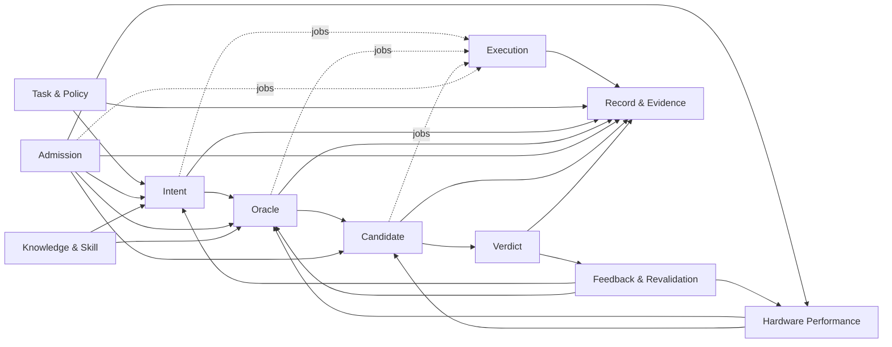
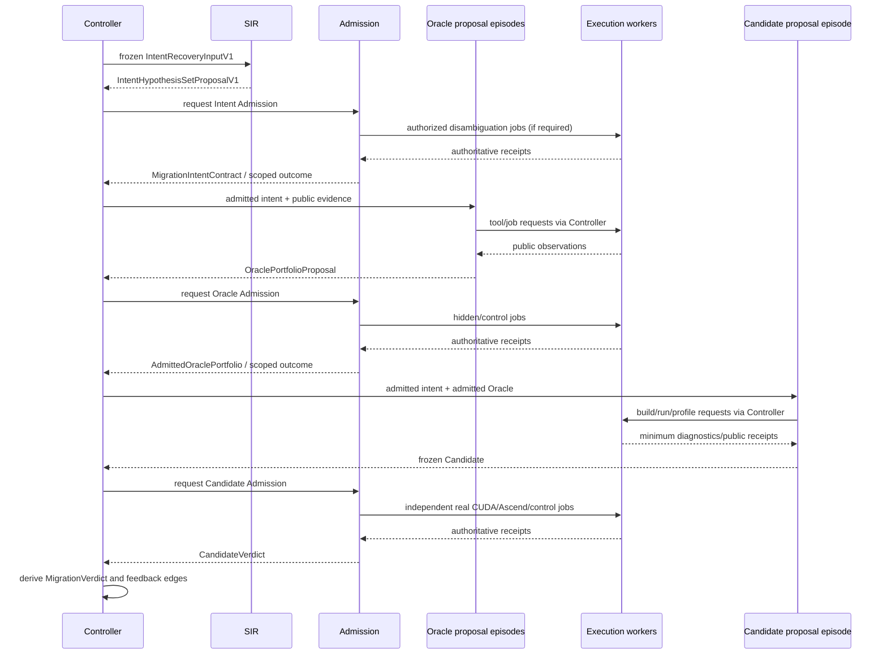

# Cairn 逻辑架构设计

- 状态：规范性目标设计
- 日期：2026-08-27
- 产品范围：仅限 CUDA → Ascend C 算子移植
- 相关设计：[`ARCHITECTURE_OVERVIEW.md`](ARCHITECTURE_OVERVIEW.md)、
  [`AGENT_ARCHITECTURE.md`](AGENT_ARCHITECTURE.md)、
  [`../oracle/DESIGN_INVARIANTS.md`](../oracle/DESIGN_INVARIANTS.md)

## 1. 逻辑架构目标

逻辑架构将一个 CUDA → Ascend C 任务拆成独立生命周期和 authority，不把所有信息塞入一个可变
`Migration` 对象。核心规则是：

- aggregate 内强一致，aggregate 间通过 process manager 和 durable event 最终一致；
- proposal、observation、admission decision 和 policy decision 是不同事实；
- Controller 编排但不重算受限 gate，Admission 授权但不拥有 applicant；
- 所有跨边界输入先冻结并赋予 typed immutable identity；
- 失败、未知、冲突、预算耗尽和基础设施错误保持各自语义；
- 历史不原地修改，feedback/retraction 创建新的 run 或 revalidation branch。

## 2. Bounded contexts



### 2.1 Task & Policy

拥有 task intake、source/caller/model context 引用、target SoC/toolchain、数据边界、预算、required claim
policy 和用户决策。它不解释 kernel 算法，也不生成 Oracle。

### 2.2 Intent

拥有静态/动态 source facts、竞争假设、冲突、unknown、区分实验、source behavior disposition、
`MigrationIntentContract`。SIR 产生前半部分；Intent Admission 独占正式 contract 的生成。

### 2.3 Oracle

拥有 claim decomposition、domain partition、reference/property/relation、case/comparator proposal、
六个验证平面、portfolio closure 和 admitted portfolio。Explorer 不产生 admission outcome。

### 2.4 Candidate

拥有冻结 Ascend C source/bundle、revision lineage、build/run/profile observations、搜索预算、Pareto
frontier 和 candidate diagnostic。它不能修改已准入 intent、Oracle 或 judge policy。

### 2.5 Admission

拥有 admission request/attempt、required obligations、planner plan、hidden controls、receipt closure、
typed gate outcome、diagnostic disclosure 和 mechanism qualification。Intent、Oracle、Hardware、
Performance、Knowledge、Skill 和 Candidate admission 共享框架，不共享业务 policy 类型。
Planner 是 admission-kind-specific 的可选 proposal capability；详细软件结构见
[`ADMISSION_ARCHITECTURE.md`](ADMISSION_ARCHITECTURE.md)。

### 2.6 Hardware Performance

拥有理论规格、实测 ceiling、microbench、profiler calibration、algorithm/implementation intensity、
条件化 roofline、measurement validity 和 bottleneck classification。它提供事实和模型，不自行通过
candidate。

### 2.7 Knowledge & Skill

拥有 claim/content identity、T0–T3、生命周期、allowed use、role-scoped retrieval、skill validation、
freshness/conflict/retraction 和 reverse impact edges。检索排序不改变 authority。

### 2.8 Feedback & Revalidation

拥有 feedback 分类、attribution、reproducibility、contamination、allowed-use disposition、hidden exposure
影响、workload drift 和 revalidation scheduling。它不能原地更新被反馈的 artifact。

### 2.9 Execution

拥有 opaque Job/Attempt/Assignment/Lease、worker capability、worker-controlled evidence 和 execution
receipt。它不理解业务 claim。

### 2.10 Record & Evidence

拥有 append-only event、CAS、projection、causality、artifact link 和 backwards audit。它保存事实但不
决定事实的业务含义。

## 3. Aggregate 与生命周期

| Aggregate | 主要状态 | 只允许的 authority |
| --- | --- | --- |
| `MigrationTask` | Accepted → Active → Completed/terminal | Controller + 用户/policy command |
| `IntentRecoveryRun` | Prepared → Running → Proposed/terminal | SIR proposal process，Controller 记账 |
| `IntentAdmissionRun` | Requested → Evaluating → decision/terminal | Admission service |
| `OracleExplorationRun` | Prepared → synthesis/adversarial revisions → Proposed/terminal | proposal episodes/strategies，Controller 编排 |
| `OracleAdmissionRun` | Requested → ControlsRunning → decision/terminal | Admission service |
| `CandidateSearchEpisode` | Open → Iterating → Stopped/terminal | candidate proposal process |
| `Candidate` | Frozen → Observed → Submitted | candidate author lineage；冻结后不可变 |
| `CandidateAdmissionRun` | Requested → Evaluating → decision/terminal | Admission service |
| `Job` / `Attempt` | Authorized → Assigned → Running → terminal | Controller/execution coordinator/worker 各有不同 transition |
| `HardwareMeasurementRun` | Planned → Executed → Assessed/terminal | execution observation + hardware admission |
| `KnowledgeClaim` / `SkillRecord` | proposal/review/admit/retract 等各自 lifecycle | curator/admission，不由检索调用者改变 |
| `FeedbackItem` | Captured → Classified → Attributed/Unresolved → Disposed | Feedback policy authority |
| `MigrationVerdict` | Derived → Issued → RevalidationRequired/Superseded | mechanical verdict derivation |

每个 aggregate 有独立 stream 和 revision。对多个 aggregate 的业务动作由 process manager 分步完成；
不存在跨所有 stream 的巨大事务。一个 step 的 event append 与 outbox command 在同一 durable commit
中形成，consumer 以 command/operation identity 幂等。

## 4. 类型与 artifact 家族

### 4.1 Facts、proposals、decisions

```text
SourceFact / ExecutionObservation / UserDeclaration
                     ↓ evidence relation
IntentHypothesis / OracleClaimProposal / HardwareFactProposal / Candidate
                     ↓ independent admission
MigrationIntentContract / AdmittedOraclePortfolio / AdmittedHardwareFact / CandidateVerdict
```

Facts 不会因被记录就成为 authority；proposal 不会因字段完整就成为 admitted；decision 不能脱离其
policy、receipt 和 exact applicant identity。

### 4.2 Public 与 restricted artifact

公共侧可以保存：

- applicant、公开 policy、public derivation/validation cases；
- execution receipt 的非敏感事实；
- admitted claim scope/outcome/strength/blind spots；
- 经过 redaction 的 diagnostic；
- opaque restricted receipt reference 和 public closure digest。

restricted 侧保存：

- sealed hidden case/expected material；
- private mutant/anti-bypass control；
- exposure ledger 和 diagnostic disclosure analysis；
- 完整 gate inputs/intermediate facts/receipt；
- 不能让 applicant 推导 hidden answer 的 metadata。

Secret bytes 不属于上述任一 artifact，只能以 typed external/secret reference 出现。

## 5. 应用 ports

逻辑层通过最小 capability port 协作：

| Port | 消费者 | 允许动作 |
| --- | --- | --- |
| `IntentRecoveryPortV1` | Controller | 提交冻结 recovery input、取消、获取 typed proposal/terminal outcome |
| `ProposalEpisodePort` | Controller | 启动 typed、role-scoped episode，投递公开 artifact、接收 proposal/tool request |
| `AdmissionDecisionPort<A>` | Controller | 提交 exact applicant/policy refs、查询公开进度、接收 decision |
| `PublicEvidenceReader` | proposal/admission | 按授权列表读取 public typed artifact |
| `PublicEvidenceWriter` | Controller/authorized adapter | 写入声明类型的公共 artifact，不写 authoritative decision |
| `RestrictedAdmissionReader<A>` | mechanical gate only | 读取 exact admission kind 的 hidden control |
| `RestrictedAdmissionWriter<A>` | admission curator/gate | 写 exposure/receipt/lifecycle，不供 proposal 使用 |
| `ExecutionRequestPort` | Controller/Admission | 请求 policy-scoped opaque job |
| `KnowledgeQueryPort<R>` | proposal role | 查询该 role 可见的知识/skill snapshot |
| `HardwareFactQueryPort` | Oracle/Candidate/Admission | 按 exact environment/domain 取 admitted facts |
| `FeedbackQueryPort<R>` | SIR/Oracle/Hardware | 取已 disposition 且适合该 role 的 feedback |
| `SecretResolver<S>` | exact adapter | 在 effect boundary 解析所需 secret，不返回给 domain/model |

`A`、`R`、`S` 是语义不同的强类型参数/trait family，不是运行时字符串选择器。特别是 Controller 只持
`AdmissionDecisionPort`，不持 `RestrictedAdmissionReader`。

## 6. Command/Event 协作

### 6.1 命令原则

Command 表达一次意图和授权，至少绑定：

- command/operation identity；
- target aggregate 与 expected revision；
- actor/service principal；
- exact input artifact identities；
- policy/capability/budget snapshot；
- effect/retry semantics；
- causation/correlation identity。

命令被接受只表示系统承诺处理，不表示工作已经完成。外部 effect 前必须先 durable record authority。

### 6.2 关键事件词汇

```text
MigrationTaskAccepted
IntentRecoveryRequested
IntentHypothesisSetProposed
IntentAdmissionRequested
MigrationIntentAdmitted | IntentAdmissionRejected | IntentAdmissionNeedsUserDecision
OracleExplorationOpened
OraclePortfolioProposed
OracleAdmissionRequested
OraclePortfolioAdmitted | OracleAdmissionRejected
CandidateSearchOpened
CandidateFrozen
CandidateAdmissionRequested
CandidateAdmissionDecided
MigrationVerdictIssued
FeedbackCaptured
RevalidationRequired
```

事件名表达已经发生的 durable fact，不使用 `Try*`、`Maybe*` 或存储 applicant 自报的 `Passed`。
失败事件区分 applicant violation、policy denial、budget exhaustion、cancellation、infrastructure failure
和 ambiguous effect。

## 7. 主流程



图中 Oracle/Candidate 的 job request 必须经 Controller 授权和 scheduler；它们不能直接连接 worker。
Admission 可以通过 Controller 的 execution port 请求资源，但 Controller 只能看到调度所需 metadata，
不能看到 hidden payload/expected value。

## 8. Intent 流程细化

1. Controller 从 intake 形成冻结 `IntentRecoveryInputV1`，记录 `NoPriorFeedback` 或允许的 feedback refs；
2. SIR 只读输入，产生事实引用、竞争假设、unknown/conflict、优化自由度和区分实验提案；
3. Controller 验证 proposal schema/identity，但不把“结构有效”当成“语义成立”；
4. Intent Admission 计算 required claim set，选择公开/hidden/用户决策 obligation；
5. Mechanical gate 逐 claim 输出 admitted、limited、rejected、unknown、conflict 等结果；
6. 只有 closure 满足的 claim 构成 `MigrationIntentContract`；需要用户选择的 desired-semantics 冲突
   产生独立 decision request；
7. 新反馈启动新 recovery/admission run，旧 contract 保留并标注 revalidation impact。

`MigrationIntentContract` 是 Oracle Explorer 的强制输入。没有该类型，API 在编译期和运行时都不能
打开要求正式结论的 Oracle Exploration。

## 9. Oracle 流程细化

Oracle Explorer 从 admitted intent 计算 `RequiredOracleClaimSet`，再由 synthesis strategies 提案、
adversarial strategies 攻击并产生新 revision。每次 revision 是不可变 artifact；不同 episode/strategy
仅通过 Controller 提供的冻结 artifact/typed diagnostic 交流。当前 Blue/Red 只是模型驱动实现之一。
这类交互不共享 continuation、草稿或可变上下文，也不把 Agent 共识当作 evidence；统一规则见
[`AGENT_ARCHITECTURE.md`](AGENT_ARCHITECTURE.md)。

Oracle Admission 分别处理：

- semantic/algorithmic；
- numerical allowance/assurance；
- execution/integration；
- safety/concurrency；
- adequacy/anti-bypass；
- performance instrument。

性能在此阶段只准入 workload、timer、profiler adapter、baseline、ceiling applicability 和统计政策等
instrument，尚未对不存在的 candidate 给出性能 pass。只有 required portfolio closure 形成
`AdmittedOraclePortfolio`；局部准入类型只能被显式接受局部 scope 的探索调用者消费。

## 10. Candidate 与性能时序

Candidate Search 只能读取 admitted intent、admitted Oracle 的公开 contract、允许的 knowledge/skills
和公开 diagnostic。每个 source revision 产生新 `CandidateId`，禁止修改冻结 candidate。

Candidate Admission 的顺序是：

1. identity/source completeness/ABI/build；
2. semantic/numerical；
3. execution/safety/concurrency；
4. anti-bypass 与 Oracle applicability；
5. 在 correctness prerequisite 满足后运行 performance measurement；
6. 对照 business target、production baseline、conditional roof 和 workload policy 形成独立
   `PerformanceOutcome`；
7. 聚合成 claim-scoped `CandidateVerdict`，再由发布 policy 派生 `MigrationVerdict`。

性能优异不能更改前四步的失败。测量无效或样本不足产生 invalid/inconclusive，不产生 regression 或
improvement。

## 11. Knowledge、skill 与 feedback

### 11.1 检索

一次 query 先形成 durable `KnowledgeQuery`，registry 返回带 identity、tier、lifecycle、scope、conflict、
allowed use 和 match reason 的结果。Controller 冻结本 episode 的 `KnowledgeSnapshot`/`SkillSnapshot`
后再交给 proposal process。正文是 data，只有系统 instruction layer 有 instruction authority。

### 11.2 Feedback

每项 feedback 经过：

```text
Capture -> Classification -> Reproduction -> Attribution -> Contamination analysis
        -> Allowed-use disposition -> Route / Knowledge crystallization candidate
```

未归因的真实模型负反馈可建立 regression obligation，但不能直接把责任归给 kernel。正反馈仅支持
exact deployment slice，不能提升局部 correctness。暴露 hidden 区分信息的 feedback 同时更新
exposure ledger 并 burn 相应 case。

### 11.3 Retraction 与影响传播

Knowledge/skill、hardware fact、mechanism qualification、corpus 或 policy 被撤回时，反向索引找出依赖的
intent、Oracle、candidate/performance 和 verdict。系统追加 `RevalidationRequired`，不重写历史 artifact
或伪造当时未发生的失败。

## 12. Consistency 与事务

### 12.1 Aggregate 内

- event append 使用 expected revision；
- artifact 必须在引用事件提交前已 durable 且 identity 校验成功；
- event 与同一 store 的 outbox record 原子提交；
- projection 不是 authority，可从 event 重建。

### 12.2 Aggregate 间

- process manager 以 event 驱动下一 command；
- command 至少一次投递，handler 按 operation identity 幂等；
- 不使用跨 Controller/Admission/Worker 的分布式事务；
- compensation 只撤销未发生的业务保留/lease，不删除已经发生的 observation；
- 不确定的外部 effect 进入 `Ambiguous` 并 reconcile，不能盲重试。

### 12.3 Admission decision 发布

Admission service 先在 restricted store 提交完整 receipt/decision，再发布带 service principal、exact
applicant/policy、public outcome、diagnostic identity、restricted reference 和 closure digest 的结果。
Controller 验证身份与绑定后追加公共 workflow event。若发布中断，Admission 以 decision identity
幂等重发；Controller 不自行重建隐藏结论。

## 13. Capability matrix

| Actor | Public evidence | Restricted material | Knowledge/skills | Job request | 产生 admitted type | 修改 policy |
| --- | --- | --- | --- | --- | --- | --- |
| Controller | scoped read/write | opaque ref only | 管理公开快照 | 是，按 workflow policy | 否 | 仅接受授权 policy command |
| SIR | scoped read | 否 | role-scoped | 仅提出请求 | 否 | 否 |
| Oracle synthesis/adversarial strategies | scoped read/write proposal | 否 | strategy-scoped | 仅提出请求 | 否 | 否 |
| Typed Admission Planner | public applicant + kind-specific obligation metadata | 最小 opaque metadata | profile-scoped only | 仅提出 typed plan | 否 | 否 |
| Mechanical Gate | exact inputs | exact admission scope | 仅 admitted dependency refs | 是，受 policy 限制 | 是 | 否 |
| Candidate Search | admitted public contracts | 否 | role-scoped | 仅提出请求 | 否 | 否 |
| Worker | job bundle only | 不可枚举 | 否 | 不适用 | 否 | 否 |
| User/Policy authority | authorized summaries | 通常否 | 不适用 | 审批资源/数据 | 只决定 desired semantics/risk policy | 在其权限 scope 内 |

“产生 admitted type”仍受 exact admission kind 限制：Intent gate 不能产生 Oracle admission，
Performance gate 不能产生 correctness outcome。

## 14. Error 与停止模型

逻辑 API 不返回一个通用 `failed: bool`。至少区分：

- `ProposalRejected`：输入/输出结构或 proposal obligation 不满足；
- `ClaimViolated`：存在适用、可重现的反例；
- `Unverifiable`：当前 evidence 无法达到所需强度；
- `AuthorityConflict`：适用权威冲突且 policy 未裁决；
- `NeedsUserDecision`：desired semantics/policy 需要用户选择；
- `BudgetExhausted`；
- `PolicyDenied`；
- `InfrastructureFailure`；
- `AmbiguousExternalEffect`；
- `Cancelled`。

每种 terminal outcome 都有允许的下一动作。例如 InfrastructureFailure 可重试/reconcile，但不能作为
candidate revision 的负反馈；ClaimViolated 可路由到 proposal repair；NeedsUserDecision 不能由 agent
自行选择默认值。

## 15. 逻辑架构验收问题

任何实现 slice 至少能回答：

1. 它修改哪个 aggregate，由谁拥有 transition？
2. 输入是 fact、proposal、observation、policy 还是 admitted artifact？
3. 哪个 port 最小化地授予所需 capability？
4. operation/event/artifact identity 如何闭合？
5. applicant 是否可能看到 hidden 或自报权威结果？
6. crash 位于 effect 前、effect 后、commit 前后分别如何恢复？
7. false accept、false reject、conflict、unknown、bypass 和 tamper 如何变红？
8. feedback/retraction 会创建什么新 run，如何保持历史？
9. 哪些内容仍是 unknown/not-executed？
10. 是否仍严格服务 CUDA → Ascend C，而没有为假想产品泛化？
