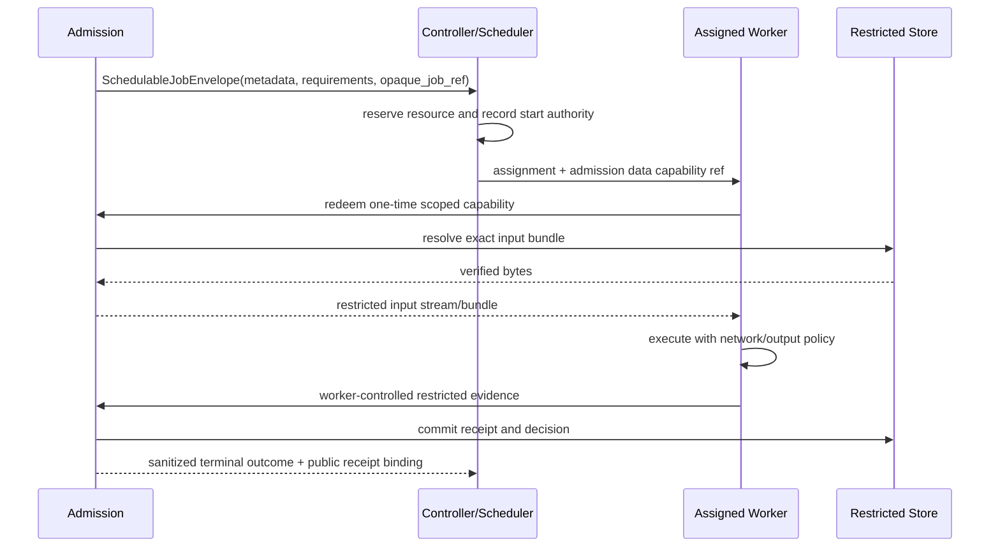

# Cairn 运行架构设计

- 状态：规范性目标设计
- 日期：2026-08-29
- 产品范围：仅限 CUDA → Ascend C 算子移植
- 说明：部署与进程均为目标形态；当前已实现状态见
  [`../dev/CURRENT_BASELINE.md`](../dev/CURRENT_BASELINE.md)
- Agent 逻辑与交互：[`AGENT_ARCHITECTURE.md`](AGENT_ARCHITECTURE.md)

## 1. 运行时结论

Cairn 的最小新架构部署不是单进程，也不是大规模微服务集群。它由以下进程角色组成：

- 一个 active Controller；SIR、Oracle、Candidate 等 proposal 是其中的主工作流步骤；
- 一个独立 Admission service；
- 零到多个 managed execution workers；
- public、restricted、secret 三种不同可见性存储边界。

proposal 不拥有独立进程、二进制、service identity、OS principal 或文件权限域。只有 applicant code、
toolchain、Docker、host adapter 或设备执行才离开 Controller，并作为 typed job 进入具备相应能力的 Worker。

## 2. 进程拓扑

```mermaid
flowchart TB
    client["CLI / UI / upstream"]
    provider["Model providers / approved external research"]

    subgraph chost["Controller host"]
      controller["cairn-server\nController + App Server"]
      publicdb[("public-events-v1.db")]
      publiccas[("public CAS root")]
      registry[("knowledge/skill/hardware projections")]
      sir["SIR proposal step"]
      oracle["Oracle proposal steps"]
      planner["Typed planning steps"]
      cand["Candidate proposal steps"]
      controller --- publicdb
      controller --- publiccas
      controller --- registry
      controller --- sir
      controller --- oracle
      controller --- planner
      controller --- cand
    end

    subgraph ahost["Admission authority zone"]
      admission["cairn-admission\nmechanical gates"]
      restricteddb[("restricted-events-v1.db")]
      restrictedcas[("restricted CAS root")]
      admission --- restricteddb
      admission --- restrictedcas
    end

    subgraph workers["Managed private workers"]
      cuda["CUDA-capable cairn-worker"]
      build["Ascend-build cairn-worker"]
      npu["Ascend-NPU cairn-worker"]
      integ["Model-integration evaluator"]
    end

    secrets[("secret references / OS secret provider")]

    client <--> controller
    controller <--> admission
    cuda -->|"direct outbound mTLS/WSS"| controller
    build -->|"direct outbound mTLS/WSS"| controller
    npu -->|"direct outbound mTLS/WSS"| controller
    integ -->|"direct outbound mTLS/WSS"| controller
    controller --> provider
    admission -. "one-time restricted capability" .-> cuda
    admission -. "one-time restricted capability" .-> build
    admission -. "one-time restricted capability" .-> npu
    admission -. "one-time restricted capability" .-> integ
    controller -. "typed secret refs" .-> secrets
```

图中的 proposal 节点只是 Controller 主工作流中的领域步骤，不是部署节点。它们可以拥有不同的 typed
input、budget、model continuation 和 stop condition，但不形成额外的运行 authority。图中的
Admission→Workers 虚线是 restricted data plane；所有调度/lease 仍由 Controller control plane 管理。

## 3. 进程职责与权限

### 3.1 Controller (`cairn-server`)

Controller 是公共 durable truth 和工作流入口，负责：

- external API、subscription 和 approval；
- task/process-manager lifecycle；
- public event/CAS、projection 和 evidence graph；
- agent episode 创建、预算和 capability grant；
- worker enrollment、resource registry、scheduler、lease 和 reconciliation；
- Hardware Performance Model、公开 knowledge/skill registry；
- feedback/revalidation routing；
- 验证 Admission service 发布的 decision identity/binding。

Controller 不执行 generated source，不持 restricted store file/credential，不读取 hidden expected value，
不替 Mechanical Gate 重算私有结论，不用日志或模型 summary 推进 authoritative state。

首期只要求一个 active Controller writer。HA、leader election 和多 region 不属于当前目标；restart-safe
比横向扩 Controller 更优先。

### 3.2 SIR Agent Loop

SIR 是 Controller 主工作流中的 proposal step，接收冻结 `IntentRecoveryInputV1` 与 capability manifest，
执行静态分析和模型推理，返回 `IntentHypothesisSetProposalV1`。
它：

- 通过 Controller 已冻结的 typed input 读取任务材料；
- 没有 restricted/secret store 枚举权限；
- 可查询获准知识，并把任何编译、运行或设备验证需求提交为 Worker job；
- 只写 proposal artifact 与运行记录；
- 不能构造 Admission outcome，也不能把自己的分析当成 execution observation。

SIR 的稳定边界是“冻结输入 → typed proposal”。内部分析图和模型组合可替换，但不产生独立 process protocol。

### 3.3 主工作流中的 proposal step

Controller 可以在主工作流中执行以下 proposal step：

- Semantic Intent Recovery；
- Oracle synthesis strategies；
- adversarial exploration strategies；
- type-specific Admission Planner profiles；
- Candidate Search；
- 后续明确批准的 proposal-only role。

每个 step 都接收 exact task/run identity、public snapshot、模型选择、tool catalog 和预算。step 不能自行
切换 role、扩大输入或生成 Admission authority。模型 continuation 只是该 workflow step 的运行状态；
verdict-relevant 输入和输出必须在 transition 前归档。

Typed Admission Planner 只能读取对应 kind 的公开 applicant、公开 policy、机械派生的 required set 和
最小 obligation metadata。它不能与 Mechanical Gate 同进程，不能读取完整 hidden case/expected
value，也不能调用 admitted constructor。详细设计见
[`ADMISSION_ARCHITECTURE.md`](ADMISSION_ARCHITECTURE.md)。

一个 proposal step 只能投影 Controller 已授权的冻结输入；一个 step 的 provider-native continuation、
pending tool result、未提交 draft 和私有 diagnostic 不得成为另一 step 的输入。跨 step 协作只消费已提交
artifact 和 typed durable event，规则见
[`AGENT_ARCHITECTURE.md`](AGENT_ARCHITECTURE.md)。

### 3.4 Admission service (`cairn-admission`)

Admission service 是单独 service principal 和文件权限域，负责：

- 接收 exact applicant/policy/environment references；
- 解析 `RequiredEvidenceSet` 和 hidden control；
- 验证 Planner 提议的实验是否合法；
- 通过 Controller scheduler 请求 execution placement；
- 为 assigned worker 签发一次性 restricted bundle/evidence capability；
- 从 worker-controlled receipt 重算 comparator/statistics/closure；
- 提交完整 restricted decision，再发布最小 public outcome/diagnostic；
- 维护 hidden exposure/burn/replenishment 和 mechanism qualification 状态。

它不持 model provider transport；Mechanical Gate 不调用 LLM。不同 admission kind 使用不同 typed
policy/gate，不使用一个 runtime `kind: String` 分派全部 authority。

首期一个 Admission service 可承载 Intent、Oracle 和 Candidate 等 gate，因为它们共享同一 authority
zone；内部 module/strong types 保持隔离。只有新的安全/吞吐证据出现时才拆成多个服务。

### 3.5 Managed Worker (`cairn-worker`)

Worker 通过 outbound mutually authenticated control connection 注册能力。实例可能具备多个物理资源，
但 scheduler 只按 exact capability/resource facts 分配：

- CUDA build/device/sanitizer；
- Ascend C build/toolchain；
- Ascend NPU/device/profiler；
- CPU/reference；
- 受控 model/deployment integration。

Worker 只执行 opaque `JobContract`。候选 workspace 与 worker evidence channel 分离；worker credential、
journal、local CAS 和 control socket 不挂入 job。Cairn 假设 operator-controlled private infrastructure，
不声称 hostile multi-tenant 或通用恶意代码 containment。

### 3.6 Model integration evaluator

模型/部署级 evaluator 可复用 worker contract，但 capability、数据政策和 output receipt 单独声明。它的
正向结果只支持 exact deployment slice；负向结果保留 attribution uncertainty。它不是“更高一级
正确性 judge”。

## 4. Store 拓扑与可见性

### 4.1 Public store

由 Controller 独占写入/管理：

- task、episode、job、attempt、public decision event；
- source/caller/model context 中允许归档的内容；
- proposal、candidate、公开 knowledge/skill/hardware facts；
- public receipt、diagnostic 和 verdict；
- restricted artifact 的 opaque typed reference，不含私有 bytes。

Proposal process 使用短期 scoped read capability 或经 Controller materialize 的 input bundle，不直接
获得数据库文件。

### 4.2 Restricted admission store

由 Admission service 独占文件/credential：

- hidden corpus、private controls/mutants/expected outputs；
- 完整 admission request、gate facts 和 receipt；
- exposure/disclosure/burn/replenishment ledger；
- mechanism/policy qualification 的受限材料。

Controller 只保存 `RestrictedAdmissionReceiptRef` 与 public closure digest。一个普通 `ContentId` 不能
传给 public store API 后读取 restricted bytes；两个 namespace 使用不同 typed ID/domain 和访问 port。

### 4.3 Secret reference store

Secret provider 保存 provider token、private key、enrollment material 等。Durable event 只引用 secret
name/state/credential identity，不保存值。解析发生在 exact effect adapter 中，返回值不进入模型输入、
artifact、日志或 exported evidence。

### 4.4 首期物理布局

最小部署可以在同一可信主机使用相同 SQLite/CAS 实现，但必须：

- public/restricted 使用不同数据库文件和 CAS root；
- OS user/group 与文件模式不同；
- Controller 配置中不存在 restricted path；
- Admission 可通过 read-only/scoped public API 解析 applicant，不能直接写 public DB；
- proposal process 不能打开任一 DB 文件；
- backup/export 分别执行，public export 不夹带 restricted/secret 数据。

“同一存储技术”不等于“一个共享数据库里的逻辑表”。未来切到独立 service account/bucket 不改变领域
协议。

## 5. Control plane 与 restricted data plane

Hidden admission job 同时需要 Controller 调度资源、又不能让 Controller/proposal 获得 hidden payload。
因此分两条路径：

约束：

- Controller 看得到调度所需设备、资源量、toolchain、超时和成本，不看 hidden case 内容；
- capability 绑定 job/attempt/worker、短时有效、单次使用，不能枚举相邻 artifact；
- candidate job 默认断网，candidate-writable stdout/output 不返回 proposal lineage；
- 完整 output 先进入 restricted evidence channel，只有 redactor 允许的 diagnostic 发布到 public；
- Worker compromise/越权属于 trust-boundary failure，会使相应 receipt 无效并触发 revalidation；
- 若首期尚未实现该 restricted data plane，则 hidden-device admission 必须标为 not-executed，不能临时把
  hidden bytes 放进 public CAS。

## 6. 通信模型

### 6.1 外部 API

Client 通过 App Server 使用 product resources、command acknowledgement、durable query 与 event
subscription。瞬时 update 可丢，完成事实必须可重查。外部 API 不暴露内部 event enum 或 restricted
metadata。

### 6.2 内部 process protocol

proposal step（承载 SIR/Oracle/Candidate/Planner episode）和 Admission 使用 typed V1 process/service
protocol。它至少包含：

- process handshake 与 exact implementation identity；
- run/episode identity；
- capability manifest；
- immutable input/output artifact refs；
- operation/start authority；
- heartbeat/cancel/terminal outcome；
- bounded diagnostic；
- protocol/schema V1 strict decode。

本地默认可用 Unix domain socket/stdin-stdout framed transport，远程部署可用 authenticated transport；
wire 选择不改变语义。当前 pre-release 直接修改 V1，不实现多版本协商或 fallback reader。

### 6.3 Worker control

Single-lab profile 复用 operator 已部署的可路由私网/VPN；Cairn 不再增加 VPN overlay。Controller 的
ordinary worker-control listener 监听 `0.0.0.0:7443`，启用 bootstrap 时 enrollment listener 监听
`0.0.0.0:7444`；端口可由 policy 修改，但 single-lab listener 不得只绑定 loopback。对外发布的是 VPN
内可达的 Controller DNS/IP，绝不能把 `0.0.0.0`、loopback 或 tunnel-local address 写入 enrollment bundle
或 Worker config。

Worker 作为客户端直接建立 outbound mTLS/WSS connection。Controller 下发 assignment、lease、
cancel/reconcile；Worker 回传 heartbeat、resource observation、attempt lifecycle 和 worker-controlled
evidence descriptor。Controller 不反向拨号 Worker，Worker 不暴露 Cairn inbound service。SSH local/reverse
tunnel、临时端口转发和 Cairn 自建 VPN 都不是正常部署路径或 fallback。VPN 只提供可路由性，不能替代
mTLS、registry/pool authority、lease 或 receipt binding。Heartbeat 只证明 session liveness，不证明
外部 effect 未发生。

### 6.4 Provider/external research

只有对应 proposal process 的 allowlisted adapter 可连接 provider/research endpoint。请求前已经冻结
model-visible input、knowledge/skill snapshot、tool catalog 和 budget。Provider response 先归档，再用于
native continuation/semantic projection。Admission gate 不走这条网络。

## 7. 一次完整任务的运行时路径

1. Client 向 Controller 提交 CUDA kernel、host launch、context refs、target environment 和 policy；
2. Controller 归档 public material，创建 task/intent run，在合适的 proposal step 打开 SIR episode；
3. SIR 通过 scoped input/research/tool API 完成 proposal，Controller 归档结果；
4. Controller 请求 Admission；Admission 运行 Intent gate，必要时调度区分实验；
5. admitted intent 发布后，Controller 按 policy 启动 Oracle synthesis/adversarial strategies；
6. portfolio proposal 冻结后进入 Oracle Admission，hidden controls 只走 restricted path；
7. admitted portfolio 发布后，Controller 启动 Candidate Search process；
8. candidate 的公开 build/run/profile 请求走普通 execution path，修订生成新 identity；
9. candidate 冻结后，Admission 在独立 control/hidden corpus 上运行 Candidate Admission；
10. correctness prerequisites 满足后执行性能 measurement/admission；
11. Controller 依据公开 admission decisions 和 policy 派生 `MigrationVerdict`；
12. feedback/impact router 生成下一轮输入与 revalidation edges，不修改历史结果。

## 8. 调度与资源

Scheduler 只理解 capability/resource/placement/policy，不理解 Oracle 数学。关键规则：

- CPU/静态检查失败后不占 CUDA/NPU；
- Ascend build 失败后不占 NPU；
- correctness prerequisite 未满足不运行发布级 performance gate；
- source CUDA、Ascend build、Ascend NPU、integration capability 分别匹配；
- Admission hidden job 额外要求 restricted-data capability 和适用的 worker trust profile；
- device reservation、lease、attempt 和 release 均为 durable facts；
- 同一 device 上的并发、thermal/frequency/state policy 进入 measurement validity；
- model/provider budget 与硬件验证梯度分别核算。

Worker profile 只陈述资源事实和可证明 capability，不携带“Oracle worker”“candidate judge”之类业务
角色。业务 role 由 job authority 和 process manager 决定。

## 9. 故障与恢复

### 9.1 Controller restart

Controller 从 public event/CAS、projection revision、operation authority、lease 和 outbox 重建。它：

- 不重复 dispatch 已有 confirmed start authority 的外部 effect；
- 查询/等待 proposal process、Admission 或 Worker 的 exact operation；
- 对失联但 effect 可能发生的 operation 标记 `Ambiguous` 并 reconcile；
- 重建 projection，不从日志推断状态。

### 9.2 Proposal process crash

- 未产生完整、校验通过的 proposal artifact：run 以 infrastructure/agent terminal outcome 结束；
- provider effect 已发出但 response 未确认：按 provider idempotency/reconciliation policy 标为 ambiguous；
- 已归档 response/proposal：新进程可从 durable episode 恢复；
- 不能把 partial stdout 解析成权威 proposal。

### 9.3 Admission crash

- decision 未在 restricted store commit：不得发布 public admitted outcome；
- restricted commit 完成但 public publish 未确认：按 decision identity 幂等重发；
- hidden job effect 模糊：保留 attempt 并 reconcile，不生成 candidate fail；
- mechanism/receipt corruption：fail closed，标记 infrastructure/qualification failure。

### 9.4 Worker disconnect

Lease expiry不证明 job 没执行。Controller/Worker 根据 journal、attempt ID 和 output commit 查询
reconcile；只有 effect policy 明确幂等或证明未开始才重试。设备故障与 candidate violation 分开。

### 9.5 Store corruption/缺失

任何 identity mismatch、缺失 verdict edge 或无法读取 required data 都阻止 admitted/satisfied 结果。
Public store 恢复不能用 restricted backup 替代，反之亦然；secret 缺失产生 credential/policy failure，
不把值从历史日志中“恢复”。

## 10. 部署 profiles

### 10.1 Hardware-free development profile

用途：schema、process、record/replay、mechanical gate 和 workflow 开发。

- 所有长期进程在同一开发主机，但仍是不同 OS process；
- public/restricted 使用不同临时目录/SQLite；
- recorded/scripted model provider；
- fake/recorded execution worker；
- 不声称 CUDA、Ascend 或真实 performance evidence。

### 10.2 Single-lab profile（首个真实目标）

用途：首条真实 CUDA → Ascend C 纵向工作流。

- Controller 与 public store 位于控制主机；
- Admission 与 restricted store 位于同一或更受限主机的独立 principal；
- SIR/Oracle/Candidate/planning steps 位于 Controller 主 workflow，且没有 restricted store handle；
- CUDA worker、Ascend build worker、Ascend NPU worker 可为不同机器，也可在 capabilities 可验证时合并
  物理主机；
- Controller control/enrollment listener 绑定 `0.0.0.0`，发布 VPN 内可达 endpoint；
- 所有 Worker 直接 outbound 连接，不使用 SSH tunnel/端口转发；设备与 toolchain identity 写入 receipt；
- operator 明确开启真实执行和外部 provider。

### 10.3 Expanded lab profile（未来可选）

- model-backed workflow steps 可由 Controller 在任务间并发调度；
- worker pool 按 resource partition 扩展；
- Admission 可扩展 read-only planner/worker coordination，但每个 admission stream 仍只有一个
  authoritative gate writer；
- public/restricted store 可换技术 adapter，但不会合并 visibility；
- 不在没有真实瓶颈前引入多 Controller active-active、分布式 CAS 或跨 region consistency。

该 profile 是架构可演进性，不是首期交付要求。

## 11. 安全和信息流

### 11.1 信赖区域

| Zone | 主要风险 | 强制措施 |
| --- | --- | --- |
| Client/input | 错误声明、敏感代码、未授权数据 | intake policy、scope、archive/secret classification |
| Proposal | prompt injection、越权 tool、hidden 泄漏、共同错误 | process isolation、capability intersection、snapshot、no restricted access |
| Admission | gate bug、policy bug、hidden 泄漏、self-certification | small TCB、mechanism qualification、restricted store、redaction controls |
| Worker | candidate output forgery、stale/fallback/no-launch、device mismatch | worker evidence channel、identity/launch/device controls、sandbox/network policy |
| Storage | namespace confusion、corruption、export leak | typed visibility IDs、separate roots/credentials、hash verification、export policy |
| Operations/logging | secret/body 泄漏、日志被当真值 | redaction、stderr projection、no state transition from logs |

### 11.2 Hidden material 生命周期

- Sealed：从未向 applicant lineage 暴露；
- ConsumedWithoutDisclosure：使用过但 diagnostic 未泄漏区分信息；
- BurnedToPublicRegression：已泄漏或等价推导，转入公开 regression；
- Retired：不再适用。

每次 adaptive query、diagnostic 和 knowledge writeback 都更新 exposure ledger。普通搜索 index/embedding
完全排除 sealed material 及可泄漏其存在的 metadata。

## 12. Observability

每个 process 初始化一次结构化 stderr logging，公共字段至少包括 task/run/episode/job/attempt/decision
identity、operation name、outcome class、elapsed 和已知 usage。禁止日志包含：

- source/prompt/request/response/tool body；
- hidden case、expected value、mutant detail；
- secret/token/certificate；
- workload stdout/stderr 原文；
- candidate diagnostic 原文；
- 模型 reasoning。

Metrics/logs 可丢失且只做观察。健康检查只报告 process/store/provider/worker 的可用性，不得返回
`admission healthy => claim passed` 一类业务推论。

## 13. 启动与关闭顺序

### 13.1 启动

1. 校验配置、schema V1、目录权限和 secret references；
2. 启动 public/restricted store owner，并各自做 integrity check；
3. 启动 Admission，加载 exact gate/mechanism qualification state；
4. 启动 Controller，恢复 public process managers/outbox/leases；
5. proposal step 按需启动 role-scoped episode，不在空闲时持有 broad token；
6. Workers enrollment/connect，resource facts 经 admission 后才可调度；
7. 对外 API readiness 只在 Controller 恢复完成后开启。

### 13.2 关闭

1. 停止接受新 task/effect authority；
2. 对 proposal/worker 发出有界 cancel 或 drain；
3. commit terminal/ambiguous facts与 outbox；
4. Admission 完成 restricted commit 或明确中止；
5. 关闭 transport、store 和日志 subscriber。

强制终止后的恢复仍以 durable authority 为准，不能假设 shutdown hook 已运行。

## 14. 容量与 backpressure

- API admission control 先于创建无限 task/episode；
- 每个 task 分别限制 model turns、tool calls、CPU/CUDA/NPU、artifact bytes 和 wall time；
- proposal queue、execution queue、admission queue 分开度量；
- restricted store 不通过 public cache/CDN 扩散；
- event subscription 慢消费者不阻塞 durable writer，可断开后从 cursor 重建；
- scarce NPU 以 reservation/lease 控制，不以 proposal 紧迫度绕过 correctness gate；
- Admission diagnostic budget 与 hidden exposure budget 同时生效。

## 15. 运行架构验收场景

进入真实实现后至少验证：

1. Controller 进程无权限打开 restricted DB/CAS；
2. SIR/Oracle synthesis/adversarial/typed Planner/Candidate episode 无法调用 admitted constructor endpoint；
3. Admission gate binary 无 model provider dependency/credential；
4. 知道 restricted content digest 仍无法通过 public port 读取 bytes；
5. hidden device job 不将 input/output 写入 public CAS 或 proposal-visible logs；
6. Controller、Admission、proposal、Worker 分别在 effect/commit 临界点 crash 后能恢复且不双执行；
7. Worker 提交 applicant-authored `passed`、伪造 stdout、stale output 或 wrong device 时 gate 变红；
8. Admission decision restricted commit 后 public publish 丢失可幂等恢复；
9. logging 完全关闭不改变任何 artifact/outcome identity；
10. hardware-free profile 不产生真实 CUDA/NPU/performance strength；
11. real-lab profile 的 receipt 明确绑定 CUDA device、Ascend SoC、toolchain、binary、launch 和 state；
12. 并行/恢复多个 Agent step 时 continuation、context、budget 和 tool result 不串流；
13. non-V1 process/storage input fail closed，不走 compatibility path。
