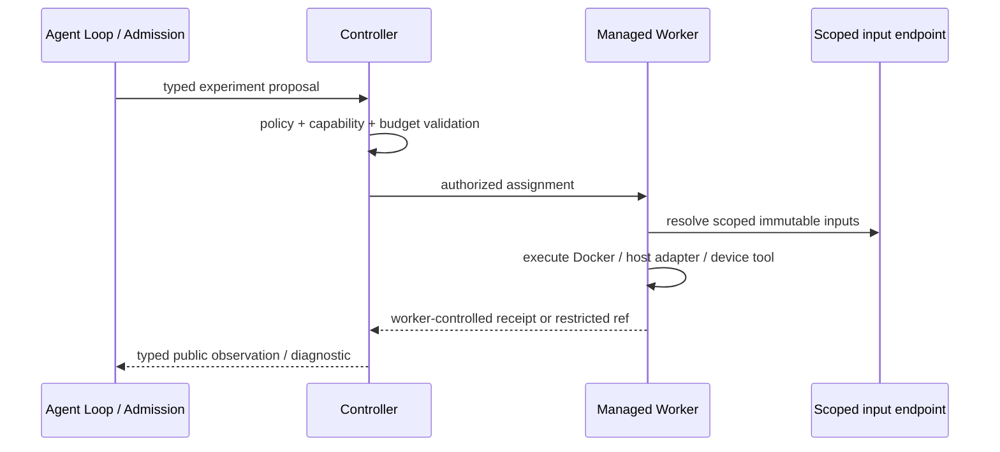

# Cairn 工作流与 Agent Loop 架构

- 状态：规范性目标设计
- 日期：2026-08-29
- 产品范围：仅限 CUDA → Ascend C 算子移植
- 父设计：[`../SYSTEM_DESIGN.md`](../SYSTEM_DESIGN.md)
- 运行设计：[`RUNTIME_ARCHITECTURE.md`](RUNTIME_ARCHITECTURE.md)
- Agent 设计：[`AGENT_ARCHITECTURE.md`](AGENT_ARCHITECTURE.md)

## 1. 目标

Cairn 要把一次 CUDA → Ascend C 移植固化成由 Controller 驱动、可暂停、可恢复、可审计的
工作流。运行时模型负责逐任务推理；Cairn 负责冻结输入、限制能力、保存 lineage、执行外部实验，并由
独立 Admission authority 把提案变成可依赖的 contract 或 verdict。

最短表述是：

> SIR 发现“用户可能想要什么”，用户决定只有用户能决定的分叉，Intent Admission 冻结“系统获准依赖
> 什么”；Oracle Loop 提出“怎样判断”，Oracle Admission 证明该判断器在声明范围内有资格；Candidate
> Loop 生成和修复 Ascend C，Candidate Admission 最终判断它是否满足已准入 contract。

Repository coding agent 是应用的建设者和旁观者，不是任务答案的作者。fixture 用于评价这条通用路径，
不定义 production prompt、policy 或答案。

## 2. 一个 Controller 状态机，多个 Agent Loop

```mermaid
flowchart LR
    intake["Task intake"]
    sir["SIR Loop\nproposal-only"]
    need_user{"Needs user\ndecision?"}
    user["Scoped user decision"]
    ia["Intent Admission"]
    oracle["Oracle Exploration\nstrategy portfolio"]
    oa["Oracle Admission"]
    cand["Candidate Loop\ngenerate / build / repair"]
    ca["Candidate Admission\ncorrectness / safety / performance"]
    verdict[["MigrationVerdict"]]

    intake --> sir --> need_user
    need_user -->|yes| user --> ia
    need_user -->|no| ia
    ia -->|revision / unknown| sir
    ia -->|admitted intent| oracle --> oa
    oa -->|Oracle diagnostic| oracle
    oa -->|admitted Oracle| cand --> ca
    ca -->|candidate diagnostic| cand
    ca -->|admitted outcomes| verdict
```

Controller 是唯一的公共工作流 writer。它根据 typed state 和 policy 打开 episode、签发 operation
authority、安排 Worker job、提交公共事件并选择下一条 transition。Agent 不靠自由群聊互相推进状态，
Admission 也不靠模型 summary 决定结果。

一个阶段可由多个 strategy episode 完成，也可完全由确定性机制完成；“Loop”表示一类输入、反馈、停止
条件和产物，不表示固定模型、固定轮数或专用 OS 进程。

## 3. 各阶段的职责

| 阶段 | 主要输入 | 允许产物 | 不拥有的 authority |
| --- | --- | --- | --- |
| Intake | source、caller、tests、target、policy、预算 | 冻结任务与 mandatory facts | 不猜用户语义，不生成 verdict |
| SIR Loop | 任务事实、用户声明、公开知识/研究、实验 observation | 竞争 intent hypotheses、证据、unknown、用户问题 | 不产生 admitted intent |
| Intent Admission | exact proposal、用户决定、trusted evidence/policy | claim-scoped intent contract 或 conflict/unknown | 不调用模型补齐语义 |
| Oracle Exploration | admitted intent、公开证据、qualification feedback、policy obligations | claim/domain/reference/case/comparator portfolio、attack、counterexample、coverage gap | 不授权自己的 Oracle，不固定为模型或两个角色 |
| Oracle Admission | exact portfolio、required controls、Worker receipts | admitted/partial/rejected Oracle claims | 不按 candidate 表现调宽 judge |
| Candidate Loop | admitted intent/Oracle、target environment、公开 diagnostic | immutable Ascend C revisions | 不读取 hidden corpus，不改 gate |
| Candidate Admission | frozen candidate、admitted Oracle、trusted receipts | 多平面 candidate outcomes | 不修 candidate，不隐式改 intent/Oracle |

用户只在 desired semantics、风险或政策确实需要 authority 时进入流程。用户不是常规 lint reviewer，也
不替 Agent 或 Gate 做可机械验证的工作。

## 4. Agent Loop 的统一运行模型

SIR、Oracle synthesis/adversarial、Candidate Search 和可选 Admission Planner 都使用同一种逻辑运行
模型：

1. Controller 冻结 exact input、profile、模型、知识快照、tool catalog、预算和 capability grant；
2. Proposal Host 打开独立 durable episode；
3. Agent 可以读取获准材料、查询知识或提出实验请求；
4. 每个外部 effect 在执行前由 Controller 验证并获得 durable start authority；
5. 结果先成为带 provenance 的 observation，再投影回当前 episode；
6. Agent 提交 strict typed proposal；无效提交原子拒绝，并可在预算内修复；
7. Controller 保存 terminal outcome，并把冻结 artifact 交给下一个 Gate 或 Loop。

DEV-025把上述跨角色顺序直接固化为`cairn-server::controller_workflow::run_controller_workflow`的可读业务
骨架；DEV-026又把用户authority边界显式展开为：freeze → SIR → derive intent decision requests → await user
intent decision → Intent Admission → Oracle Exploration → Oracle Admission → Candidate → Worker observations
→ Candidate Admission → terminal。各环节通过`ControllerWorkflowStages`的distinct associated artifact type连接。
尚未实现的环节只有port签名、没有default/no-op成功实现；因此composition skeleton不会把空stage冒充为已运行。
DEV-027现已把actual typed user decision、Admission durable start authority、independent model-free child与public
outcome observation接入同一task-owned aggregate，并明确停在`AwaitOracleWorkflow`。Controller不会替用户决定、
读取restricted artifacts或自动越过Oracle边界。

逻辑 role 不映射为专用 binary。通用 `cairn-proposal-host` 承载 capability-equivalent episode；不同数据
可见性、外部凭据、工具或 OS sandbox 才要求不同 Host instance。每个 episode 的 continuation、context、
budget、tool result、write namespace 和 capability grant 始终隔离。

DEV-008 的 `cairn-sir` one-shot process曾用于首个 authority consumer的typed ingress/capability proof。
DEV-022已由通用 Proposal Host接管production SIR episode并直接删除该专用路径，没有双路径或兼容adapter。
DEV-024又删除了遗留的`run_sir_episode`及Candidate同类role-specific runner与旁路测试。当前
`run_proposal_host_episode`只编排freeze request、drive frozen episode、freeze outcome；所有现有role profile
都进入同一个durable Proposal Loop。`run_proposal_loop`自身只表达open、dispatch、settle、admit、authorized
execute、observation projection和advance步骤；每一步由独立函数和不可互换的内部typestate实现。共同loop只执行
获准的pure/read-only Host tool，先归档observation再投影continuation。DEV-029已将external effect改为exact
durable yield：Controller验证request/episode/step/operation和capability binding，提交start fact后才调用Worker
adapter，receipt-bound observation进入原operation stream，Proposal Host随后恢复同一episode/native continuation。
它没有新增某个领域experiment tool或声称recorded adapter等于真实远端Worker运行。
实现其异步yield/resume协议。

## 5. SIR 的自主研究能力

SIR 应能在任务政策和预算内主动减少语义不确定性，而不是只对一段 kernel 做一次 prompt completion。
可授予的能力包括：

- 浏览完整获准 source/caller/test/model-context slice；
- 查询已冻结的知识库、官方文档、公开网络资料和论文原文；
- 请求静态分析、编译、CPU/CUDA probe、差分或最小复现实验；
- 比较相互竞争的算法、数值、部署与 source-behavior 解释；
- 根据 observation 修订 hypothesis，或生成精确的 `UserIntentDecisionRequest`。

网络检索必须经过 allowlisted research adapter；检索 query、响应 bytes/快照、时间、来源和引用进入
episode provenance。内容的“官方”“论文”或检索排名不自动产生 authority。SIR 不直接启动本机
Docker、不登录设备、不持 Worker credential；需要实验时提交 typed request，由 Controller 选择本地或
远程 Worker。

## 6. Oracle 生成和充分验证

Oracle 不是 Candidate Loop 的几个公开样例，而是被独立准入的 claim portfolio。首期完整闭环至少包含：

1. synthesis strategy 从 admitted intent 分解 claim/domain，提出 reference、property/metamorphic relation、
   case、comparator、execution/safety 与 coverage obligations；
2. adversarial strategy 独立寻找 correct-variant false reject、fault/mutant false accept、domain gap、
   common-mode、no-launch/fallback/constant-output 和 tolerance bypass；
3. trusted policy 在任何可选 Planner 之前机械派生 required evidence；
4. Controller 把 public/hidden qualification experiment 交给适配的 Worker；
5. Oracle Admission 验证 exact binding，并从 honest controls、定向错误实现/mutants、wrong-binding、
   domain/conflict/unknown、hidden disjoint corpus 和执行真实性 receipt 重算；
6. 只有闭合的局部 claim 进入 `AdmittedOraclePortfolio`；其余保持 rejected、unknown 或 partial。

前两项是逻辑义务，不是固定拓扑。Controller可以按policy选择模型驱动的synthesis/adversarial episode、
确定性analyzer/generator、mutation、property/metamorphic、fuzz或counterexample strategy；一次exploration可以使用
其中一个或多个。现有model-backed debate只是可选策略组合，不能成为Controller主工作流的强制阶段。

Agent 可以提出 mechanism、case 和下一步实验，但不能生成自己的 qualification receipt 或把另一个模型的
赞同当作资格。qualification 要与 exact implementation、scope、环境和风险绑定；不预建与真实 consumer
无关的通用评审体系。

## 7. 反馈路由与防漂移

反馈必须先分类，不能作为一个共享的“上一轮结果”广播给所有 Agent：

| 反馈 | 允许进入 | 禁止作用 |
| --- | --- | --- |
| 用户语义/政策决定 | 新 SIR/Intent Admission run | 直接改写已准入 artifact |
| SIR evidence gap | SIR Loop | 让 Candidate 猜用户意图 |
| Oracle qualification counterexample | Oracle Exploration portfolio revision | 修改 admitted intent |
| Candidate build/source diagnostic | Candidate revision | 调整 Oracle expected semantics |
| Candidate correctness counterexample | Candidate revision；若证明 Oracle 缺陷则开独立 Oracle revalidation | 在同一 lineage 内调宽 comparator |
| 设备/网络/toolchain failure | execution recovery/reconcile | 记为 candidate violation |
| 真实模型/deployment observation | attribution 后进入 SIR、Oracle、Candidate 或 performance 新 run | 直接当作全域 correctness authority |

若 Candidate 暴露的是实际意图歧义，Controller 必须回到 SIR → 用户决定 → Intent Admission，产生新
contract 与下游依赖；不能在 Candidate Loop 内偷偷改变题目。若暴露的是 Oracle 缺陷，原 Oracle 进入
revalidation，依赖它的 candidate verdict 失效或阻塞；不能为了让当前 candidate 通过而修 judge。

## 8. 统一执行平面

所有会执行代码、调用 toolchain、占用设备或访问受控 host 的实验都表示为 opaque Worker job：

“本地实验”只是调度到了 Controller 所在实验室中的 CPU/host/Docker Worker，不是 Proposal Host
获得本地 shell。CUDA、Ascend build、NPU、sanitizer、reference 和 model-integration 使用同一
Controller/Worker control-plane contract，仅 capability 与 job adapter 不同。

## 9. Worker 与 Controller 的直连网络

Single-lab profile 使用已经存在的可路由私网/VPN；Cairn 不建立、管理或要求额外 VPN。网络约束固定为：

- Controller 的 ordinary worker-control listener 监听 `0.0.0.0:7443`；启用 bootstrap 时 enrollment
  listener 监听 `0.0.0.0:7444`；端口可以由 deployment policy 改变，但不能只监听 loopback；
- enrollment bundle 和 Worker 配置发布 VPN 内可达的 Controller DNS/IP，不得发布 `0.0.0.0`、
  `127.0.0.1` 或 tunnel-local endpoint；
- Worker 作为客户端直接发起 outbound mTLS/WSS，并在断线后按 durable state 重连；
- Controller 不反向拨号 Worker，不要求 Worker 暴露 inbound service；
- SSH local/reverse tunnel、临时端口转发和 Cairn 自建 VPN 不属于目标架构，也不是正常部署 fallback；
- mTLS identity、Worker registry、pool authority、lease 和 receipt binding 不因 VPN 网络信任而降低；
  firewall 应只向 Worker 所在私网开放 control/enrollment port。

现有 [`../../config/controller.example.json`](../../config/controller.example.json) 已以两个
`0.0.0.0` listener 表达该部署默认；[`../../config/worker.example.json`](../../config/worker.example.json)
中的 endpoint 必须替换为真实 VPN 可达地址。

## 10. 恢复、停止与人工介入

每个 Loop 必须有预算、最大并发、允许的 effect class 和 terminal reason，但系统不以固定迭代数作为
产品正确性。常见 terminal state 包括 proposed、needs-user-decision、admitted、revision-requested、
rejected、unknown、budget-exhausted、infrastructure-failure 和 cancelled。

Controller 重启后从 event、CAS、episode state、operation authority、Worker attempt journal 和 Admission
decision identity 恢复。外部 effect 是否发生不明确时先 reconcile；不得因为模型 turn 或连接丢失而
盲目重试。用户只处理真正需要其 authority 的问题，operator 只处理部署、秘密、设备或基础设施问题。

## 11. 当前实现映射与下一步

截至 DEV-020，第一条窄纵向路径已经实际走过：DeepSeek SIR proposal → 用户意图选择 → independent
Intent Admission → Oracle materialization/qualification/publication → Candidate input/source → remote
Ascend native build → typed compiler diagnostic → DeepSeek repair → repaired candidate remote build。最后一次
build 仍为 `SubjectFailed`，因此它证明了跨主机执行和反馈闭环，不证明 native build success、NPU runtime
correctness、Oracle portfolio adequacy 或最终 MigrationVerdict。

DEV-021已把Candidate native suffix固化进Controller-owned state machine，DEV-022已实现最小generic
Proposal Host并接通persisted Candidate episode request。DEV-023又实现一个active Controller内的单任务process
manager，把durable next action连接到exact Host binary/start marker、existing Worker scheduler/reconciliation与typed
receipt折回。它只监管配置中一个已存在Task，不代表task intake、global catalog或Host pool已经实现；后续仍须保留
现有V1强类型和receipts，不得为尚无consumer的Agent、reviewer、service或compatibility path预建结构。
DEV-024把现有SIR/Candidate profile的duplicated runner收敛为一个request-bound durable Proposal Loop，并删除旧入口
与测试。
DEV-025进一步冻结完整Controller业务骨架，并把现有Candidate manager turn改为recover/select/execute子骨架。
DEV-026将exact SIR Host request/recovery input、durable episode start authority、SIR terminal/proposal observation
和model-free user decision requests接入新的task-owned `ControllerWorkflowV1`；DEV-027把该aggregate移动到拥有
Controller composition的`cairn-server`，继续接入actual typed user decision、独立Intent Admission executable/
restricted-store start authority和public outcome observation。active driver仍只表达recover/select/execute并停在
`AwaitOracleWorkflow`。通用Host supervision继续由SIR/Candidate共享，Admission仍是独立model-free process。
Oracle Exploration、后续Admission和Candidate suffix尚未并入这个连续aggregate。DEV-028已把composition skeleton
纠正为`Oracle Exploration → Oracle Admission`，并把原Blue/Red代码、示例和配置收窄命名为可选
model-backed debate strategy；没有为尚无consumer的exploration portfolio预建persisted artifact。
DEV-029又把原external-effect硬错误替换为request-bound durable yield、Controller start authority、Worker receipt
provenance与same-episode resume；没有具体adapter时仍停在typed waiting boundary，不会由Host执行。该seam可由
后续SIR/Oracle/Candidate consumer复用，但没有把任何strategy或experiment设为产品必经路径。

## 12. 被拒绝的方案

| 方案 | 拒绝原因 |
| --- | --- |
| SIR 永久使用专用 binary/service pool | role 与 process 一一对应，形成特殊部署和重复 agent runtime |
| Agent 直接启动本地 Docker 或连接 Worker | 绕过 Controller 的 effect authority、scheduler、receipt 和恢复 |
| Worker 等待 Controller 反向连接 | 需要设备侧 inbound service，增加网络和身份面 |
| SSH tunnel 作为正常控制通道 | 把临时部署拓扑写进产品架构，endpoint/恢复/观测语义混乱 |
| Cairn 再管理一层 VPN | 复制现有基础设施职责；mTLS/registry 已承担应用身份 |
| Candidate 失败后同步修改 Oracle | judge 随 applicant 漂移，失去 held-out 和独立性 |
| 每阶段固定一个 Agent 或固定轮数 | 策略数量不是 authority，也不等于充分证据 |
