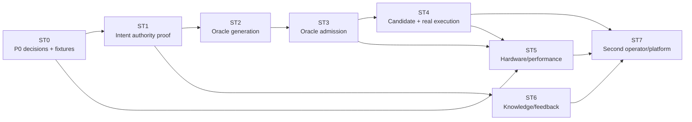

# Cairn 开发路线图

- 状态：规范性开发计划设计，尚未授权代码实施
- 日期：2026-08-27
- 产品范围：仅限 CUDA → Ascend C 算子移植
- 计划模型：[`DEVELOPMENT_MODEL.md`](DEVELOPMENT_MODEL.md)
- 具体切片：[`SLICE_CATALOG.md`](SLICE_CATALOG.md)

## 1. 路线图结论

新路线图以八个 integration stages 推进：先关闭 P0 决策并建立 authority 边界，再形成 Intent 纵向证明，
然后完成 Oracle 自动生成和独立准入，之后才把 Candidate、真实设备、性能、知识/skill 和反馈接入。
第二个 operator 用来验证边界，而不是扩大产品范围。

本路线图没有日历承诺。日期需要团队容量、Ascend 设备窗口、首个 operator 和模型预算确定后另行排期。
依赖顺序和验收条件不因排期变化。

## 2. 阶段总览

| Stage | 目标 | 对应里程碑 | 主要 blocker |
| --- | --- | --- | --- |
| `ST0 Planning Readiness` | 物化首片决策、净化 fixture、冻结开发 contract | M0 补强 | D-039/040/041 evidence、DEV-004 |
| `ST1 Intent Authority Proof` | 一个 kernel 从 SIR proposal 到 admitted intent，再交出一个 Oracle claim | M2 前半 | ST0 |
| `ST2 Oracle Generation Core` | 自动生成 claim portfolio，并以确定性+可选 Agent 策略攻击 | M2 探索部分 | ST1 |
| `ST3 Independent Oracle Admission` | 从 qualified mechanisms 和 receipts 形成 admitted Oracle portfolio | M2 完成 | ST2、OQ-024 的适用部分 |
| `ST4 Candidate and Real Execution` | Candidate 修订闭环与真实 CUDA/Ascend C execution evidence | M3 | ST3、设备能力 |
| `ST5 Hardware and Performance` | admitted hardware facts、microbench、profiling、conditional roofline | M4 性能部分 | OQ-020、correctness path |
| `ST6 Knowledge, Skill and Feedback` | 受控检索/skill、真实模型反馈、污染与 revalidation | M4 反馈部分 | OQ-021、OQ-022 |
| `ST7 Boundary Validation and Platform` | 第二个 operator、公开 API/CI/release surface | M4/M5 | ST4–ST6 的 required scope |

## 3. 关键路径



`ST0 → ST1 → ST2 → ST3 → ST4` 是首个统一迁移的 product critical path。Hardware profiling adapter、
Knowledge Registry 的无权限基础和设备 Worker 准备可以并行，但不得在上游 authority 未闭合时产生
正式产品结论。

## 4. ST0 — Planning Readiness

### 目标

把已经接受的“第一个实现什么”物化为 exact source、corpus、mechanism qualification contract、sanitized
fixture 和可审查开发 contract。

### 必须完成

- 执行 D-041：生成首批净化历史 fixtures、provenance manifests、public/private disposition 和扫描记录；
- 由 DEV-003 先落一个被首批fixtures真实消费的最小 `cairn-testkit` provenance/sanitation contract，
  DEV-001复用它，不并行定义第二套fixture manifest；
- 物化 D-039：复用上述contract生成clean-room deterministic CUDA/host source、intent claim fixtures、
  公开/restricted corpus 和 user-decision controls；
- 物化 D-040：冻结十项 semantic mechanism slots、independently authored golden/property expectations、
  mutation/fault controls、review assignment 和 qualification/requalification plans；exact implementation
  identity 与 receipt 在 owning ST1 slice 写出实现后、首次用于 Gate 前生成；
- 为 ST1 形成一份已审查的 `DesignConformanceRecord`；
- 明确真实 CUDA/Ascend build/NPU lane 的可用性，但不要求此时占用设备；
- 对目标产品 crate 直接替换策略形成 change inventory，不建立 alias/dual path。

### 退出断言

团队无需在代码中猜测首个 intent 的语义、corpus、mechanism qualification obligation 或旧 fixture 的
合法用途；尚未实现的 mechanism 不被误报为已经 qualified。

## 5. ST1 — Intent Authority Proof

### 目标

建立第一条最小但真实的 authority-safe 路径：

```text
Frozen CUDA task/context
→ isolated SIR
→ IntentHypothesisSet
→ mechanically derived RequiredIntentEvidenceSet
→ optional typed planning or deterministic recipe
→ authorized observations
→ separate mechanical Intent Gate
→ MigrationIntentContract | explicit non-success outcome
→ one OracleClaimProposal
```

### 范围

- 直接把产品 crate 更新为 `cairn-cuda-ascend` 当前 V1；
- 建立 SIR process protocol 和最小 proposal implementation；
- 建立 Admission service 的最小独立进程、restricted capability 和 Intent Gate；
- 只实现 `IntentEvidencePlannerProfile` 或 approved deterministic recipe，不铺七类 Planner；
- 只产生一个下游 Oracle claim proposal，在 Candidate Search 前停止；
- recorded/hardware-free lane 覆盖 positive、conflict、unknown、wrong-hypothesis、tamper 和 restart。
- 按 [`SLICE_CATALOG.md`](SLICE_CATALOG.md) 的 owner mapping，在每项 D-040 mechanism 首次被 Gate 使用前
  绑定 exact implementation identity、完成独立 review并生成 qualification receipt；DEV-104 闭合全部十项。

### 非目标

- 完整 Oracle portfolio；
- Blue/Red 多轮探索；
- Candidate Search；
- 真实 NPU、roofline 或 model-integration feedback；
- 通用异构 intent schema。

### 退出断言

SIR 无法直接创建 admitted intent；Controller/Proposal Host 无法读取 restricted corpus；Admission 无
model dependency；下游只接受 `MigrationIntentContract` 强类型。

## 6. ST2 — Oracle Generation Core

### 目标

把 admitted intent 转换为多平面 Oracle proposal portfolio，并系统性寻找 false accept、false reject、
coverage gap、authority conflict 和 bypass。

### 顺序

1. trusted policy 派生 `RequiredOracleClaimSet` 与 dependency graph；
2. product catalog 注册 Oracle synthesis strategy；
3. 建立 deterministic case/property/mutation generators；
4. 把当前 Blue profile 接入正式 proposal gateway；
5. 先运行 deterministic adversarial baseline，再按 policy 选择 Red profile；
6. 冻结 revision/findings/feedback lineage；
7. 形成 ready-for-admission portfolio，不产生 admitted outcome。

### 退出断言

模型或 deterministic strategy 可以产生 proposal，但无法删除 required claims、制造 content identity、
读取 hidden corpus或自报 admission。Blue/Red 不再是唯一拓扑，当前 dogfood 成为策略级控制。

## 7. ST3 — Independent Oracle Admission

### 目标

从 qualified mechanisms、正负控制、authoritative receipts、hidden controls 和机械 Gate 形成 claim-scoped
`AdmittedOraclePortfolio` 或明确的 rejected/unknown/conflict/not-executed outcome。

### 顺序

1. `OracleControlPlannerProfile` 与 deterministic plan validator；
2. public positive/correct-family controls；
3. deliberately wrong/mutation/anti-bypass controls；
4. restricted hidden path、exposure ledger 和 diagnostic redaction；
5. receipt closure 与 mechanism identity；
6. algorithmic、numerical、execution、safety、adequacy、performance-instrument 分平面 Gate；
7. portfolio closure、blind spots 和 revalidation triggers。

如果首个策略需要 adaptive diagnostics，先关闭 `OQ-024`。若使用非自适应 sealed batch，可只实现与其
严格对应的 exposure policy，不得假装已经解决一般 adaptive case。

### 退出断言

Oracle proposal、debate convergence、correct example 或模型共识都不能绕过 Mechanical Gate；每个 admitted
claim 可回溯到 required obligation、qualified mechanism 和 authoritative receipt。

## 8. ST4 — Candidate and Real Execution

### 目标

完成第一个 CUDA → Ascend C candidate 修订闭环，并在声明的真实路径上建立 execution evidence。

### 子路径

- Candidate Search profile 和冻结 revision lineage；
- hardware-free/recorded candidate correction loop；
- 真实 CUDA reference build/run；
- 真实 Ascend C build；
- 真实 Ascend NPU execution；
- target safety/concurrency controls；
- Candidate Admission 和多平面 verdict assembly；
- worker loss、controller restart、ambiguous effect 和 retry lineage。

真实 CUDA、Ascend build 和 Ascend NPU 是三个不同 gate。当前已有 CUDA source execution 与普通 Ascend
toolchain build 证据可以复用，但不能冒充新 operator 的 target build/device correctness。

### 退出断言

一个任务达到 M3：可恢复的 candidate rejection/repair、真实 source/target execution、完整证据图和分别
表达 correctness/numerical/execution/safety/adequacy/performance 的 verdict。未执行性能可明确保留，不能
被省略。

## 9. ST5 — Hardware and Performance

### 目标

为首个选定 Ascend 环境建立条件化 hardware ceilings、测量工具和 performance admission。

### 入口

- 关闭 `OQ-020`；
- 至少有一个 correctness-qualified candidate 路径；
- device state、CANN/compiler/firmware 和 profiler version 可冻结；
- profiler adapter 与 timer mechanism 有 qualification plan。

### 顺序

1. theoretical/spec fact ingestion；
2. deterministic microbench registry 和 measurement validity；
3. profiler calibration；
4. algorithmic/implementation intensity；
5. measured ceiling 与 applicable roofline；
6. candidate observation、bottleneck diagnosis 和 business target comparison；
7. repeated/stability/workload aggregate controls。

### 退出断言

性能不是单个峰值或耗时数；每项结论绑定 SoC/dtype/shape/engine/memory/dataflow/toolchain/device state，
且不能补偿 correctness failure。

## 10. ST6 — Knowledge, Skill and Feedback

### 目标

让 Agent 可查询知识、加载 skill、接收上一轮和真实模型反馈，同时不扩大权限或污染 held-out evidence。

### 顺序

1. 关闭 `OQ-021`，建立 per-role knowledge/skill policy；
2. exact content/claim identity、T0–T3 和 lifecycle；
3. progressive disclosure 与 role-scoped retrieval；
4. reviewed/validated skill sandbox 和 capability probe；
5. retraction reverse-impact；
6. 关闭 `OQ-022`，接入 model/deployment feedback；
7. classification、attribution、contamination、allowed use 和 revalidation branch。

### 退出断言

检索来源、官方标签、skill 安装或正向模型表现不产生 authority；negative feedback 形成可追踪义务，
不原地修改 intent、Oracle 或 verdict。

## 11. ST7 — Boundary Validation and Platform

### 目标

用第二个语义形态不同的 CUDA kernel 检验架构边界，并完成第一公共平台表面。

第二个 operator 应改变至少一个关键维度，例如输出结构、state/side effect、layout、并发/原子语义或
数值性质。它仍然是 CUDA → Ascend C，不是第二 source/target 平台。

退出要求包括：

- 不修改 domain-neutral agent/record/execution core 的业务 vocabulary；
- 新 domain behavior 通过产品 types/adapters/artifacts 进入；
- 第一个 operator 的旧 verdict 和 evidence 保留；
- hardware-free CI 与显式 hardware lanes；
- stable resource-oriented App Server、reference CLI、security/contribution/release docs；
- no public compatibility baseline 直到用户明确宣布首个端到端 workflow 完成并建立基线。

## 12. 并行开发窗口

在不改变 critical path 的前提下可并行：

| 主路径 | 可并行工作 | 合并前约束 |
| --- | --- | --- |
| ST0/ST1 | Ascend Worker availability probes、fixture sanitation | 不冻结未决定的 intent schema |
| ST1 | Proposal Host domain-neutral isolation tests | 产品 profile contract 仍由产品 crate 拥有 |
| ST2 | verifier qualification controls | 不先产生 Oracle admitted constructor |
| ST2/ST3 | Candidate tool sandbox prototype | 不读取 hidden Oracle material、不宣称 Candidate Search 完成 |
| ST3/ST4 | CUDA/Ascend adapter contract lanes | 必须使用 opaque Job/Receipt，不写 product verdict |
| ST4 | OQ-020 实测环境审计 | 不提前硬编码 roofline 数字 |
| ST4/ST5 | OQ-021 knowledge policy 与 registry mechanics | retrieval 未准入前不进 model-visible context |
| ST5/ST6 | App Server resource projection | 不冻结公共兼容承诺 |

并行工作只有在接口 owner 提供冻结 contract fixture 后才能消费；共享 mutable branch、复制强类型或临时
string bridge 不属于并行化手段。

## 13. 阶段停止规则

遇到以下情况停止受影响路径：

- open question 会改变当前 V1 类型或 policy；
- normative 文档冲突；
- applicant 获得 hidden/promotion capability；
- mechanism qualification 缺失；
- real hardware/device evidence 无法区分未执行与失败；
- fixture provenance 不清；
- slice 需要兼容旧开发格式；
- 新抽象没有当前第二消费者或实际边界证据；
- exit gate 只能靠模型自报、日志、mock 或 stored `passed` 满足。

停止不等于整个 program blocked；不依赖该条件的 workstream 可按 [`WORKSTREAMS.md`](WORKSTREAMS.md)
继续。
