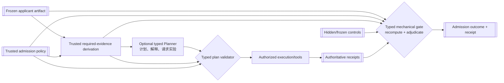

# Cairn 独立准入架构

- 状态：规范性目标设计
- 日期：2026-08-27
- 父设计：[系统设计](../SYSTEM_DESIGN.md)
- 产品范围：仅限 CUDA → Ascend C 算子移植
- 相关设计：[Oracle 探索](ORACLE_EXPLORATION_SYSTEM_DESIGN.md)、
  [Oracle 准入](ORACLE_ADMISSION.md)、
  [意图恢复](SEMANTIC_INTENT_RECOVERY_DESIGN.md)、
  [性能 Oracle](PERFORMANCE_ORACLE_DESIGN.md)、
  [Admission 软件架构](../design/ADMISSION_ARCHITECTURE.md)、
  [Agent 软件架构](../design/AGENT_ARCHITECTURE.md)

## 1. 目的

Cairn 中有多类 applicant：高阶意图假设、Oracle claim、硬件事实、性能测量、知识 claim、skill
能力和 Ascend C candidate。它们的内容不同，但共享同一信赖问题：提出者不能自行决定自己的
结论是否有资格被下游使用。

本设计定义一个共同的独立准入架构。它不是把所有 admission 塞进一个通用布尔函数，而是统一
authority、隔离、receipt、hidden control、outcome 和 revalidation 规则，同时让每类 admission
拥有自己的强类型 policy 和 judge。

## 2. 可选 typed Planner 与机械 gate

Admission Planner 可以是 agent，因为选择最有区分力的下一项实验、解释 profiler 或缩小反例可能
需要推理，但它不是所有 Admission 的必经步骤。Qualified deterministic recipe 足够时不调用模型。
Intent、Oracle、Hardware、Performance、Candidate、Knowledge 和 Skill 使用不同 typed profile；可以
共享 runtime/model/Host，不能共享 applicant、obligation、plan、diagnostic、continuation 或权限类型。

`RequiredEvidenceSet<A>` 必须在 Planner 之前由 trusted policy 机械派生。Planner 只负责：

- 阅读 applicant 的公开 contract；
- 按 policy 选择尚未完成的 obligation；
- 请求被授权的分析/执行；
- 归纳 receipt 和生成 typed diagnostic proposal；
- 建议继续、补证或停止。

Planner 不能：

- 写入 applicant、policy、hidden corpus、comparator 或 gate implementation；
- 把自己的 tool result 声明成权威 receipt；
- 直接输出 `Admitted`；
- 读取不需要公开的 hidden expected values/mutant definition；
- 用自然语言覆盖机械 gate 的结果。

Planner 还不能删除、降级、满足或替换 required obligation。每个 plan proposal 在外部 effect 前经过
deterministic typed validation。

最终 gate 是确定性、受信、按 admission kind 专用的代码。它验证所有 identity 和 receipt，重算
适用事实，再产生 outcome。另一个模型的“同意”不是独立 gate。

Planner profile、进程、状态机和 plan validator 的软件设计见
[`../design/ADMISSION_ARCHITECTURE.md`](../design/ADMISSION_ARCHITECTURE.md)。

## 3. 共同行为契约

每项 admission 都由以下强类型输入组成：

- `ApplicantArtifact<A>`：冻结且不可变；
- `AdmissionPolicy<A>`：具体 applicant kind 的 policy；
- `AdmissionCorpus<A>`：公开、hidden、历史和回归义务；
- `RequiredEvidenceSet<A>`：必须闭合的 observation/receipt；
- `AdmissionEnvironment`：工具、设备、runner 和数据政策；
- `AdmissionAttemptId<A>`：本次执行生命周期；
- `AdmissionBudget<A>`：成本、轮数、执行和停止政策。

输出为：

- `AdmissionReceipt<A>`：精确输入、obligation、receipt、blind spots 和重算事实；
- `AdmissionOutcome<A>`：`Admitted`、`AdmittedWithLimits`、`Rejected`、`Unverifiable`、
  `Conflict`、`BudgetExhausted` 或 `InfrastructureFailure`；
- 若被准入，产生新的 `AdmittedArtifact<A>`，而不是给 applicant 加布尔字段；
- `AdmissionDiagnostic<A>`：只暴露修复所需信息，不泄漏 hidden material。

不同 `A` 之间不能互换 policy、receipt、outcome 或 admitted artifact。

## 4. Admission 类型

| 类型 | Applicant | 主要控制 | 下游权限 |
| --- | --- | --- | --- |
| Intent Admission | `IntentHypothesisSet` 中的 claim | evidence graph、竞争假设、区分实验、用户政策、hidden intent cases | 形成 `MigrationIntentContract` |
| Oracle Admission | Oracle claim/portfolio proposal | honest variants、wrong variants、mutants、conflict、bypass、coverage | 判断 candidate 的指定 claim |
| Hardware Fact Admission | spec/measurement claim | source applicability、microbench controls、device state、profiler calibration | 支持 roof/measurement policy |
| Performance Admission | candidate performance observation | correctness prerequisites、measurement validity、baseline/roof/workload | 形成 performance outcome |
| Knowledge Admission | reusable fact/recipe proposal | exact evidence、scope、recurrence/attribution、retrieval value | 被新探索引用到允许用途 |
| Skill Validation | skill capability/safety claim | content audit、sandbox probe、expected effect、negative controls | 进入对应 role 的可用菜单 |
| Candidate Admission | frozen Ascend C candidate | admitted intent/Oracle、real execution、安全、performance、integration | 形成 migration verdict |

共享架构不意味着共享一个 `AdmissionPolicy` enum。每类 applicant 有不同 semantics，Rust 接口必须
阻止用 Oracle mutant grid 准入 hardware ceiling，或用 performance improvement 准入 correctness。

## 5. Corpus 与信息隔离

### 5.1 Corpus 分区

适用时，corpus 至少区分：

- `PublicDerivationCorpus`：applicant 可读，用于形成 proposal；
- `PublicValidationCorpus`：用于公开调试与正负控制；
- `HiddenAdmissionCorpus`：防止投机和过拟合；
- `HistoricalRegressionCorpus`：已知真实失败；
- `ProductionFeedbackCorpus`：真实模型/部署 observation；
- `RevalidationCorpus`：工具链、设备、知识或 policy 变化后的控制。

经验 allowance 的 derivation 与 held-out validation corpus 必须 identity-disjoint。Hidden 并不自动
正确；hidden material 自身也要有来源、review 和防泄漏控制。

### 5.2 Visibility

- Applicant author 只能看到 policy 的公开 contract 和允许的 corpus；
- Admission Planner 只看到调度当前 obligation 所需的 hidden metadata，尽量不看到 expected value；
- Executor 只看到 opaque job；
- Mechanical gate 读取完整 typed control 和 receipt；
- Diagnostic 通过最小反例、claim ID 和 fault class 反馈，不返回可用于硬编码的 hidden answer；
- Candidate Search 永远不能通过知识检索、skill、日志或 artifact API 旁路读取 hidden material。

## 6. Receipt closure

Admission 不能仅凭“存在一个 receipt”通过。Gate 必须证明 receipt 支持 exact claim：

1. receipt 来自 controller 已承认的 execution/tool completion；
2. job/attempt 绑定确切 applicant、policy、corpus、environment 和 executable；
3. worker evidence channel 不受 applicant 写入；
4. declared output 与实际 capture 完整且 identity 匹配；
5. comparator、统计或事实派生由 trusted code 重算；
6. 所有 required obligations 有且只有一个适用 disposition；
7. skipped/non-injectable/unknown 都有 typed reason；
8. assumptions、tool limits 和 blind spots 进入 receipt；
9. 没有 stored summary 覆盖底层事实；
10. backwards graph audit 能走到原始 input 或明确 external reference。

Applicant 提交的日志、JSON `passed`、截图、stdout 或自然语言报告都不是 authoritative receipt。

## 7. 控制族

不同 admission 选择适用子集，但至少考虑：

- **honest-path control**：正常正确路径可通过；
- **false-reject control**：独立正确变体不被拒绝；
- **false-accept control**：目标故障和历史错误被拒绝；
- **conflict control**：矛盾不会被多数票抹平；
- **unknown control**：信息不足不会被填成支持；
- **domain control**：域外材料不能支撑域内/全域 claim；
- **bypass control**：no-launch、constant output、fallback、stale output、answer leakage 不能通过；
- **identity control**：替换 source/binary/device/policy/corpus 任一关键边会被发现；
- **measurement control**：计时、同步、干扰、样本和 profiler 有效；
- **retraction control**：依赖失效触发影响传播；
- **budget control**：耗尽不会变成 admitted。

每个新 gate 先验证 perturbation 确实作用于目标机制，再证明结果变红。仅修改 comparator receipt 不足
以证明真实 build/execute/observe 路径能发现问题。

## 8. 独立性模型

独立性按 claim 和 failure mode 表达，不是 `independent: bool`。至少记录：

- 是否共享作者/model episode/prompt；
- 是否共享 source、reference code、vendor library 或生成模板；
- 是否共享 compiler/runtime/device backend；
- 是否共享数据和 expected-value derivation；
- 是否由同一 observation 同时派生阈值和验证结果；
- 是否存在 policy/hidden material 泄漏。

多模型、Blue/Red、外部文档和多 reference 可以降低某些共同错误风险，但不会自动形成独立 authority。
Gate 根据 policy 接受具体 independence class，并在 verdict 中保留限制。

## 9. Outcome 与后续动作

| Outcome | 含义 | 后续动作 |
| --- | --- | --- |
| `Admitted` | requested claim 在声明范围内满足 policy | 产生 admitted artifact |
| `AdmittedWithLimits` | 只有子域/较低 evidence strength 满足 | 下游只能消费限定 claim |
| `Rejected` | 发现可重现反例或违反 policy | 返回 diagnostic，形成新 proposal |
| `Unverifiable` | 现有方法无法建立所需强度 | 请求更弱 claim 或新 evidence，不得 pass |
| `Conflict` | 权威证据矛盾且政策无法裁决 | 请求区分实验或用户决策 |
| `BudgetExhausted` | obligations 未完成且预算结束 | 记录停止原因，不得准入 |
| `InfrastructureFailure` | 应获得的 observation 因系统/环境失败 | 恢复/重试/人工处理，不归咎 applicant |

`AdmittedWithLimits` 不是“几乎通过”。类型中必须携带 exact domain/claim/strength 限制，调用端无法
把它当作全域 `Admitted`。

用户或 operator 可以在看到 verdict 后产生独立 `RiskAcceptanceDecision`，授权部署、继续实验或
接受某个 blind spot；它必须引用 exact outcome、scope、期限和责任主体。该决策不能把
`Violated`、`Unknown`、`Conflict` 或 `NotExecuted` 改写为 `Satisfied`/`Admitted`，也不能成为后续
Oracle 的正确性 evidence。

## 10. Feedback 路由

Admission diagnostic 不直接奖励/惩罚一个 agent。它形成 typed feedback 并路由到负责的 subsystem：

- semantic/intent contradiction → SIR；
- reference/case/comparator/coverage/bypass failure → Oracle Explorer；
- build/correctness/safety/performance candidate failure → Candidate Search；
- wrong roof/profiler/measurement control → Hardware Performance Model；
- stale/refuted knowledge/skill → Knowledge & Skill Registry；
- unresolved policy conflict → User/Policy authority。

反馈引用 frozen applicant、attempt、failed obligation、receipt 和公开 counterexample。修订创建新
applicant identity 与 admission attempt；旧结果不变。

## 11. Revalidation 与撤回

每个 admitted artifact 声明 revalidation triggers，例如：

- intent/Oracle/corpus/policy/comparator 内容变化；
- CUDA/Ascend source、compiler、CANN、firmware、SoC 或 runner 变化；
- knowledge/skill/hardware fact 被撤回；
- 新历史故障、hidden counterexample 或真实模型 regression；
- workload 分布或业务 target 变化；
- admission mechanism 自身的 bug。

Trigger 产生 `RevalidationRequired` 投影和新 attempt，不把历史 artifact 改成新含义。若 admission
mechanism 被证明有缺陷，反向审计所有依赖 verdict，并分别记录仍有效、scope reduced、需要重跑
或已失去支持。

## 12. Admission mechanism qualification

Admission framework 不能把自己的“trusted”标签当作证明。每种 applicant 的 policy evaluator、
comparator、adapter、runner、parser、corpus builder、diagnostic redactor 和 promotion gate 都必须
引用 exact `MechanismQualificationReceipt`，包含 honest/negative/tamper/empty/fault-injection controls、
适用环境和已知限制。

机制和 policy 有独立 proposed/reviewed/qualified/refuted 生命周期。内容或 verdict-relevant policy
变化使新 run 需要重新 qualification；发现机制缺陷触发依赖 artifact 的反向影响审计。最底层 TCB
以最小代码、独立测试、review、mutation 和真实工具校准建立，而不是让 gate 用自身输出证明自身。

## 13. 安全边界

- Admission service 与 applicant author 使用不同 capability set 和写入流；
- hidden corpus、judge binary、policy secret 和 expected artifact 不挂载到 candidate workspace；
- Planner 的 knowledge/skill 查询不能绕过 hidden filter；
- job 由 controller 从 trusted records 组装，模型不重填 identity；
- 高权限设备、网络和秘密只由独立 approval/execution authority 授予；
- 日志与 UI 是 projection，不作为 gate 输入；
- prompt injection、skill instruction 或 external docs 无法修改 policy/tool authority；
- Admission code 和 fixture 自身进入 mutation、fault-injection 和 historical regression。

## 14. 强类型边界

必须保持不同类型：

- 每种 `ApplicantId<A>`、`AdmissionPolicyId<A>`、`AdmissionAttemptId<A>`、
  `AdmissionReceiptId<A>` 和 `AdmittedArtifactId<A>`；
- planner proposal、execution observation、trusted receipt、derived fact 和 final outcome；
- public/hidden/historical/production/revalidation corpus；
- sealed/burned/retired hidden state、exposure ledger 和 diagnostic budget；
- admission mechanism identity、qualification lifecycle 和 qualification receipt；
- claim outcome、admission outcome、task outcome 和 release policy outcome；
- evidence strength、reference tier、independence class 和 provenance；
- budget exhausted、infrastructure failure、unverifiable、conflict 和 rejected；
- diagnostic-visible counterexample 与 hidden expected artifact。

反序列化重新执行全部 invariant。Static boundary tests 至少证明：

- Oracle admission receipt 不能传给 Hardware Fact Admission；
- Planner recommendation 不能传给只接受 mechanical outcome 的 promotion API；
- `AdmittedWithLimits` 不能传给要求全域 `Admitted` 的 API；
- performance outcome 不能满足 semantic gate；
- public corpus identity 不能用在 hidden-corpus capability 上。

## 15. 当前状态

现有 `ORACLE_ADMISSION.md`、historical reduction 和固定 matmul path 已证明部分 Oracle Admission、
receipt 和 candidate judgment 机制。Worker/record/runtime 也提供了大部分通用基础。

尚未实现的统一准入类型包括 Intent、Hardware Fact、Performance、Knowledge/Skill 以及完整的多平面
Candidate Admission。本设计不授权本轮实现；它规定未来重新切分 Phase G 时必须遵守的共同边界。
