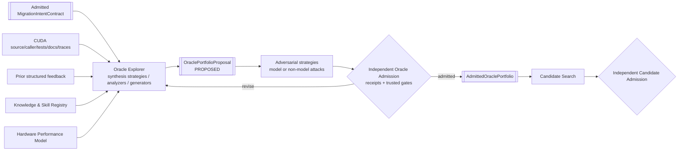

# CUDA → Ascend C Oracle 探索子系统设计

- 状态：规范性目标设计
- 日期：2026-08-29
- 父设计：[系统设计](../SYSTEM_DESIGN.md)
- 相关设计：[意图恢复](SEMANTIC_INTENT_RECOVERY_DESIGN.md)、
  [性能 Oracle](PERFORMANCE_ORACLE_DESIGN.md)、
  [知识与 Skill 信赖](KNOWLEDGE_AND_SKILL_TRUST_DESIGN.md)、
  [Oracle 准入](ORACLE_ADMISSION.md)、
  [Agent 软件架构](../design/AGENT_ARCHITECTURE.md)
- 调研依据：[Oracle 自动生成调研](ORACLE_RESEARCH_REPORT.md)、
  [可借鉴方向](BORROWABLE_DIRECTIONS.md)

## 1. 目标与非目标

Oracle Explorer 的任务，是为一个明确的 CUDA → Ascend C kernel 移植任务自动探索“应当如何
判断迁移结果”，并提交一个可以被独立准入系统审查的 Oracle proposal portfolio。

它不是 expected-output 生成器，也不是第二个候选代码生成器。它需要组合算法语义、数值接受域、
执行真实性、安全性质、测试充分性和性能目标，并把每项结论的权威、适用域、共同依赖、未知和
冲突保留下来。

Oracle Explorer 不负责：

- 决定最终用户意图；它只消费已准入的 `MigrationIntentContract`；
- 授权自己的 reference、case、comparator 或性能结论；
- 修改 hidden corpus、trusted mutants、admission policy 或 judge；
- 判断 candidate 最终通过；
- 把 Cairn 泛化到 CUDA → Ascend C 之外的迁移。

## 2. 设计结论

可信 Oracle 不是一个函数或一个二元 verdict，而是一个被准入的 claim portfolio：

```text
Oracle = claims
       + domains
       + authorities/dependencies
       + cases and relations
       + comparators/allowances
       + execution and safety plans
       + adequacy evidence
       + performance claims
       + assumptions/conflicts/blind spots
```

LLM/agent 适合提出候选语义、reference、关系、case 和实验；确定性代码适合验证 schema、身份、
domain membership、单位、覆盖集合、比较和政策；真实工具/设备提供 observation；独立 Admission
决定 proposal 是否有资格判断 candidate。任何一层都不能独自完成全部 Oracle。

## 3. 系统位置与隔离



Explorer strategies、Oracle Admission、Candidate Search 和 Candidate Admission 具有不同 logical
role/authority。Synthesis 与 adversarial strategy 可以在 capability-equivalent Host 中运行，但必须
隔离 episode/context/write namespace；它们可以由 agent 编排，也可以是非 Agent tool。交流只通过
冻结、内容寻址、带 provenance 的 artifact 和 trusted diagnostic。

## 4. Oracle 的验证平面

用户提出的算法正确性、精度/误差允许范围和性能是三个一级目标，但为了避免一个维度冒充另一个，
产品内部必须展开为以下平面：

| 平面 | 核心问题 | 典型产物 |
| --- | --- | --- |
| Semantic/algorithmic | Ascend C 是否实现已准入算法和可观察契约 | reference/property/differential claims |
| Numerical | 哪些差异属于合法浮点、量化或非确定性结果 | comparator family + allowance claim |
| Execution/integration | 结果是否来自指定 binary、NPU、launch、ABI 和本次执行 | execution attestation plan |
| Safety/concurrency | 是否有越界、未初始化、竞争、同步或写覆盖缺陷 | sanitizer/invariant claims |
| Adequacy | 当前 Oracle 能否发现相关故障，覆盖了什么 | mutation/history/bypass controls |
| Performance | 是否满足业务目标，距离适用 roof 多远，瓶颈为何 | performance claim portfolio |

对用户展示时可把 execution 和 safety 汇总在“正确性保证”下面，但内部 artifact、gate 和 outcome
必须独立。性能 gate 永远不能抵消前五个平面的失败。

## 5. 输入

### 5.1 必需输入

- 已准入的 `MigrationIntentContract`，含明确 unknown/conflict/decision；
- CUDA kernel、host/caller 和有限上下文的精确内容身份；
- source/target environment、toolchain、device 与数据政策；
- 用户请求的 correctness、numerical 和 performance claims；
- 预算、允许的证据强度和人工决策政策；
- 基础 ABI/domain contract 与可信代码派生的 mandatory obligations。

### 5.2 可选证据输入

- 独立 CPU/高精度/reference 实现；
- CUDA 多次执行、sanitizer、profiling 和 trace；
- 框架 schema、upstream tests、论文和官方文档；
- 历史 CUDA→Ascend C 失败、mutants 和 operator-family relations；
- 硬件规格、microbench、profile calibration；
- 前一轮 candidate、Oracle conflict、覆盖 gap 和真实模型接入反馈；
- 当前 role 允许查询的知识快照与 skill。

所有可选输入只是带来源的 evidence。Explorer 不能因为来源是官方、用户或模型就自动提高 trust。

## 6. 核心领域模型

### 6.1 Oracle claim

Oracle 的最小权威单元是 `OracleClaimProposal`：

- `ClaimSubject`：算法输出、状态、内存、执行、性能等；
- `ClaimKind`：exact value、allowed set、relation、safety absence、execution occurrence、性能关系等；
- `ClaimDomain`：dtype/shape/layout/value/alias/environment region；
- `AuthorityGraph`：支持/反驳来源和共同依赖；
- `ObservationPlan`：如何得到可比较 observation；
- `ExpectedRelation`：值、集合、关系、invariant 或统计关系；
- `ComparatorProposal`：比较机制及依据；
- `CoverageObligationSet`；
- `RequestedStrength` 和可接受降级；
- assumptions、conflicts、unknowns、blind spots；
- revalidation triggers。

Proposal 不能携带 `admitted=true`、最终 allowance、trusted mutant 结果或 candidate verdict。

### 6.2 Oracle portfolio

一个 kernel 通常需要多个局部 claim。`OraclePortfolioProposal` 保存：

- 已准入意图身份；
- 所有 claim proposal；
- claim 之间的 dependency/precedence；
- domain partition 和 coverage map；
- 公共 corpus proposal；
- source/reference/property/target execution plans；
- numerical allowance derivation proposals；
- safety 和 anti-bypass plans；
- performance claim proposals；
- 整体未覆盖区域和 policy questions。

Portfolio 不压缩成总分。某个 claim 可被 admitted，另一个可 conflict 或 unknown。

### 6.3 Authority graph

每项 expected value、relation、comparator 和 domain constraint 必须连接到权威图。图至少区分：

- specification、user decision、source behavior、independent reference、external tests、
  model inference、measured hardware fact、historical failure；
- shared source code、library、model episode、training prior、device backend 或数据；
- support、refute、conflict、derive 和 condition-on；
- evidence strength 和适用 domain。

来源数量不是证据强度。共享 cuBLAS、共享 PyTorch reference 或同一 agent 同时生成的多个实现不能
被当作独立投票。

## 7. 探索流程

### 7.1 Claim decomposition

Explorer 从 `MigrationIntentContract` 分解出局部、可判断 claim：

- 算法/离散语义；
- shape、layout、alias、状态和 side effect；
- 数值语义与特殊值；
- CUDA 定义行为、合法非确定性和源端缺陷；
- Ascend C 特有的 tiling、搬运、pipeline、多核和同步风险；
- 真实执行和集成；
- 性能目标及 workload。

无法形成清晰前置条件和可观察结果的 claim 必须先回到 Intent Recovery/Admission，而不是用几个
样例掩盖语义缺口。

### 7.2 Domain partition

输入域按可能改变语义、数值或执行路径的维度分区：

- dtype、accumulator、shape/rank、zero/empty/singleton；
- tile 边界、tail、alignment、stride、layout；
- value scale、cancellation、NaN/Inf/subnormal/signed zero；
- alias、in-place、workspace、invalid inputs；
- reduction order、duplicate index、tie、atomic/nondeterminism；
- launch geometry、core count、pipeline/data movement path；
- 真实模型中高权重 shape 与隐藏 admission region。

每个 case 必须引用 `CaseIntent`，说明覆盖哪个 partition、历史故障、mutant、relation 或路径。随机
seed 不是 case rationale。

### 7.3 Reference strategy exploration

按 claim 选择一个或多个候选方法：

1. 规范派生/独立 reference；
2. 更高精度或区间 reference；
3. CUDA differential behavior；
4. allowed-result set；
5. metamorphic/property relation；
6. translation-validation 子证明；
7. implicit runtime/safety oracle；
8. 暂不可验证。

CUDA 输出是行为证据。若 source 有 race、越界或未定义行为，正常功能 differential claim 必须停止
或缩小 domain。若规范、用户意图与 CUDA 行为冲突，Explorer 输出 conflict，不能自行决定“保留
还是修复”。

### 7.4 Comparator exploration

Comparator 是一族有适用域的关系，而不是全局 `allclose`：

- bit/exact；
- normalized exact（如用户未规定 signed zero）；
- absolute/relative；
- ULP；
- interval/range；
- set/multiset/permutation；
- property/metamorphic；
- statistical/nondeterministic envelope。

容差必须分别记录 magnitude、provenance 和 assurance。Explorer 可提出误差分析、合法实现族、
held-out measurement 或 external prior，但无权把 asserted tolerance 提升为已证明界。用于推导和
验证经验 allowance 的 corpus 必须 identity-disjoint。

### 7.5 Case generation

Case 来源包括：

- 从准入 domain 由可信代码派生的 mandatory boundaries；
- 约束求解和 pairwise/interaction coverage；
- CUDA/Ascend C 风险模板；
- metamorphic relation 实例化；
- historical failure 和 targeted mutant；
- coverage-guided/fuzzing 发现；
- 真实模型 workload 与上一轮 counterexample；
- hidden admission corpus。

Agent 可以提出新 partition 和 case，确定性代码验证其 domain membership、构造、期望关系和文件
身份。固定 case 和随机 case 均需抗投机控制；恒定输出、公开 shape 特化和 expected-data access
必须能被发现。

### 7.6 Execution/safety exploration

Explorer 为 CUDA 和 Ascend C 分别提出：

- build/toolchain/ABI adapter；
- binary、kernel symbol、launch configuration；
- 同步与输出写覆盖观测；
- device attestation；
- sanitizer/memory/race/synchronization checks；
- timeout、hang、crash 和 async error 处理；
- no-launch、fallback、stale-output 和 expected-artifact access 控制。

CPU twin/host fixture 是低层 transport 或 debug 证据，不替代真实 CUDA/NPU device evidence。

### 7.7 Performance exploration

Explorer 只引用 [性能 Oracle 设计](PERFORMANCE_ORACLE_DESIGN.md) 中已准入的硬件事实、workload
和测量政策，提出 performance claim 和实验。它不能根据 profiler 文本自行创造 roof，也不能用
理论峰值给 candidate 授权。候选生成前的 Oracle Admission 只冻结可用的 workload、baseline、
measurement/comparison policy 和 hardware-fact 依赖；候选的实际性能 outcome 必须在候选冻结并
真实测量后由独立 Performance Admission 得出。

### 7.8 Self-critique 与 adversarial exploration

Synthesis strategy 提交冻结 proposal 后，adversarial strategies 寻找：

- 会被误拒的 independently correct variants；
- 会被误收的 fault-targeted wrong variants；
- 未覆盖 domain 和 interaction；
- authority common-mode error；
- 容差吞错和 reference 缺陷；
- no-launch/constant-output/fallback 等绕过；
- 性能 benchmark gaming；
- source undefined behavior 和 intent conflict。

Adversarial strategy 只提交 attack artifact；它无权决定 admission。当前模型驱动的 Blue/Red profile
在独立 durable episode 中通过冻结 artifact 传递，不共享私有 continuation；policy 也可以选择
mutation、property 或 counterexample search 等非 Agent strategy。轮数/预算耗尽输出明确
`Unresolved`。

## 8. 上一轮反馈如何进入探索

反馈是一级输入，但不是统一“reward”。必须先分类：

| 反馈 | Explorer 的动作 | 权威限制 |
| --- | --- | --- |
| Candidate counterexample | Candidate Loop 先修 candidate；只有独立证据证明 Oracle 缺陷时才打开 Oracle revalidation | 不得为当前 candidate 同步调宽 expected semantics/comparator |
| Oracle false reject | 检查合法实现族、数值 allowance、错误 reference | 需独立证明该实现确实正确 |
| Oracle false accept | 增加 fault model/mutant/observable | 不代表其他 fault 已覆盖 |
| Real-model failure | 建立 e2e regression 和 first-divergence 任务 | 未归因前不能自动判定 kernel 错 |
| Real-model success | 调整 workload 权重或增加现实证据 | 不能证明局部 kernel 全域正确 |
| Performance profile | 更新瓶颈假设和实验顺序 | profile 必须校准且绑定环境 |
| User decision | 消解明确的语义/政策分叉 | 只在用户授权范围内有效 |

反馈产生新的 proposal revision 和新的 admission attempt。旧 Oracle 和 verdict 保持原有身份与含义。
Candidate build/source/runtime diagnostic 默认只进入 Candidate Loop。若反馈暴露的是实际意图歧义，必须
回到 SIR → 用户决定 → Intent Admission；若独立归因证明是 Oracle 缺陷，则原 Oracle 进入
`RevalidationRequired` 并阻塞或失效其依赖 verdict。任何一种情况都不能在当前 candidate lineage 中
偷偷改变题目或 judge。

## 9. Oracle Admission

Oracle Admission 与 Explorer 进程、权限、hidden material 和状态存储隔离。完整设计见
[ORACLE_ADMISSION.md](ORACLE_ADMISSION.md)，新架构要求它至少对每个 claim 检查：

1. schema、身份、domain 和 authority graph 闭合；
2. intent contract 一致性；
3. honest reference/source/target path；
4. independently correct positive controls；
5. wrong variants、trusted mutants 和历史故障负控制；
6. conflict、unknown 和 domain-outside 控制；
7. bypass、candidate leakage 和 expected-output isolation；
8. comparator/allowance 的 provenance 与 assurance；
9. execution/safety observation 的真实性和工具盲区；
10. coverage/adequacy 与 hidden corpus；
11. performance workload、baseline、measurement policy 与 hardware-fact 依赖的可准入性；
12. replay、revalidation 和 blind-spot 传播。

Admission agent 可以选择下一项检查、归纳失败并请求补证；最终 gate 由受信代码从 receipt 重算，
不读取 applicant 自报的 `passed` 字段。

所有 qualification experiment——包括 host/reference、CUDA、Ascend build/NPU、sanitizer、mutant 和
hidden control——都由 Controller 调度到适配的 managed Worker。Explorer/Planner 只能提交 typed
experiment proposal，不能直接启动本地 Docker、登录设备或连接 Worker。最低资格闭包必须同时证明
honest path 可通过、目标 fault/mutant 确实发生且会被拒绝、correct variant 不被错误拒绝、binding/domain/
bypass controls 生效，并明确未覆盖区域；评审人数或第二个 Agent 的赞同不能替代这些 receipt。

## 10. Candidate Admission 与结论模型

Candidate judge 只消费冻结的 `AdmittedOraclePortfolio`、candidate artifact 和权威 execution
receipts。它在候选冻结后另行运行 Performance Admission；Oracle Admission 从不预判尚不存在的
候选性能。最终结果是多轴、claim-scoped 的 `MigrationVerdict`：

```text
MigrationVerdict
  semantic:    claim results by domain
  numerical:   allowance/assurance results by region
  execution:   build/launch/device/ABI attestation
  safety:      sanitizer/invariant results and tool limits
  adequacy:    coverage/mutation/history/bypass evidence
  performance: target/baseline/roof/bottleneck claims
  integration: model/deployment observations
  unresolved:  conflicts, unknowns, assumptions, blind spots
```

每项 claim outcome 至少可表达：

- `Satisfied`；
- `Violated`；
- `Unknown`；
- `Conflict`；
- `NotApplicable`；
- `NotExecuted`；
- `InfrastructureFailure`。

每项 evidence strength 可以是 proven/exhaustive/specification-derived/independent-differential/
property-supported/empirical/unsupported 等离散类别。不得把所有维度压成一个置信分。

产品可以依据 policy 导出一个 release decision，但派生规则必须显式。例如：semantic、numerical、
execution 和 safety 任一 required claim 不是 `Satisfied` 就不能发布；performance 不达标可产生
`CorrectButPerformanceRejected`，不能改写 correctness 结果。

## 11. 状态机

```text
Created
  → InputsResolved
  → Exploring
  → ProposalFrozen
  → AdversarialReview
  → AdmissionRunning
      → RevisionRequested
      → Rejected
      → Unverifiable
      → PartiallyAdmitted
      → Admitted
  → Frozen
  → RevalidationRequired / Superseded / Retracted
```

`PartiallyAdmitted` 表示部分局部 claim 有资格使用，不允许暗示整个 kernel 已有 Oracle。Revision 创建
新 artifact identity。Pre-release 期间 schema 仍直接修改 V1，不建立 V2、dual reader 或迁移路径。

## 12. Agent 和工具能力

Explorer agent 可拥有：

- 只读 source/caller/model-context 浏览；
- 受限文档/知识查询；
- 按 role 加载 reviewed/validated skill；
- 静态分析、约束求解和 reference/case 提案；
- 通过执行服务申请 CUDA/CPU/NPU probe；
- 读取公开 admission diagnostic 并修订 proposal。

它不能拥有：

- hidden admission corpus/mutant 的读取；
- admission policy/comparator/judge 的写入；
- candidate private history；
- 直接设备/网络/秘密权限；
- 把外部测试 bytes 提升为可执行 trusted corpus；
- 写入 admitted knowledge 或最终 verdict。

工具结果先成为 observation/proposal。执行权限由任务政策和 controller 授予，skill 不能扩大权限。

## 13. 可重放与证据闭包

一次探索 run 必须冻结：

- intent、task、source/caller/context；
- 使用过的 synthesis/adversarial strategy、模型、prompt、native continuation、tool catalog 和预算；
- knowledge snapshot、skills 和外部检索 bytes；
- analyzer/generator/solver 版本与 seeds；
- 每项实验请求、job、environment、receipt 和 observation；
- proposal revisions、reviews、diagnostics 和停止原因。

Recorded replay 可以重放已记录外部响应并得到同样的 proposal；用同一请求重新调用 live model 只是
counterfactual continuation，不能声称确定性 replay。

## 14. 故障与停止语义

| 情况 | 结果 |
| --- | --- |
| 模型/工具提交格式错误 | 原子拒绝，返回准确 diagnostic，可在预算内修复 |
| 证据不足 | `Unverifiable` 或局部 `Unknown` |
| 权威冲突 | `Conflict` / `NeedsUserDecision` |
| admission attack 命中 | `RevisionRequested` 或 `Rejected` |
| source undefined behavior | source defect claim，阻止对应正常 differential Oracle |
| 设备/工具不可用 | `InfrastructureFailure` 或 `NotExecuted`，不转 candidate fail |
| 预算耗尽 | `BudgetExhausted`，不能转 admitted |
| knowledge/skill 被撤回 | `RevalidationRequired`，运行影响审计 |

## 15. 评价 Explorer

Explorer 的主要指标不是 proposal 数量或最终 pass 率，而是：

- admitted claim precision 与后续反例率；
- hidden faults、historical failures 和 bypass 的检出；
- correct-variant false-reject；
- domain/interaction/intent coverage；
- authority independence 和 conflict discovery；
- comparator/allowance 依据强度；
- unknown calibration；
- 真实模型反馈后的 first-divergence 和 regression capture；
- 人工决策次数、设备成本和可诊断性；
- 对 candidate search 的修复轮数与最终收益。

Mutation score 只评价被建模 fault 的敏感度，不能解释为正确概率。模型间一致也不是独立 authority。

## 16. 当前实现与目标设计的关系

当前固定 `matmul-zero-k` f32、模型生成 expected bytes 的路径证明了：结构化 Blue 输出、强类型
ABI/shape/raw bits、expected artifact 隔离、adapter 执行、capture 和 comparator 管线可用。

它尚未证明：

- 高阶意图已恢复并准入；
- 非零/边界/interaction corpus 充分；
- reference 和 comparator 有独立 authority；
- CUDA/Ascend C 真实设备行为与安全；
- Oracle 能杀死相关 mutants 和绕过；
- 数值 allowance 的 domain-wide 依据；
- 性能目标、roofline 或真实模型反馈闭环。

因此该路径应保留为 transport/materialization control，而不是继续自然外推为最终 Oracle 生成范式。
后续实施计划必须从本设计重新切片，不能只以增加固定 nonzero-K case 宣称架构完成。

## 17. 分步实施边界（非本轮实施）

未来实施建议按可独立验收的纵向切片推进：

1. 定义 SIR proposal 与 Intent Admission 隔离边界；
2. 对一个 kernel 形成已准入的局部语义 contract；
3. 形成 claim/domain/authority graph 和多 comparator proposal；
4. 建立正控制、负控制、conflict 和 bypass 的 Oracle Admission；
5. 接入真实 CUDA 与 Ascend C device evidence；
6. 建立最小 hardware model、microbench、profiling 和 performance admission；
7. 接入真实模型反馈、知识写回和 revalidation；
8. 用第二个语义形态不同的 CUDA kernel 验证边界，但仍不扩大产品范围。

本文件只规定目标架构和信赖边界，不在本轮授权任何代码、schema 或执行环境改动。
