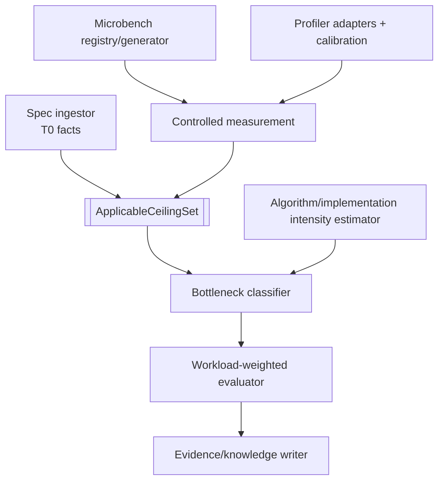

# CUDA → Ascend C 性能 Oracle 与硬件能力模型设计

- 状态：规范性目标设计
- 日期：2026-08-27
- 父设计：[系统设计](../SYSTEM_DESIGN.md)
- 产品范围：仅限 CUDA → Ascend C 算子移植
- Agent 软件架构：[Agent 与 Strategy](../design/AGENT_ARCHITECTURE.md)
- 调研依据：[Oracle 自动生成调研](ORACLE_RESEARCH_REPORT.md)、
  [可借鉴方向](BORROWABLE_DIRECTIONS.md)

## 1. 目的

性能是 Cairn Oracle 组合中的一级验证平面，但不是功能正确性的附属字段，也不能补偿算法、数值、
安全或真实执行失败。性能 Oracle 要回答的不是简单的“Ascend C 是否比 CUDA 快”，而是：

1. 在真实目标 workload 和受控环境中，候选的延迟、吞吐、资源和稳定性是否满足用户目标；
2. 在当前 shape、dtype、layout、数据流和并发条件下，理论上限和可持续实测上限分别是什么；
3. 候选距离适用的 roof 有多远，当前瓶颈是什么，证据是否足以支持该分类；
4. 下一项优化是否仍有可验证的收益空间；
5. 性能改善是否通过改变语义、降低精度、绕过执行或牺牲未声明场景取得。

## 2. 性能结论的前置 gate

性能测量只有在以下条件成立后才能支持发布级结论：

- 被测 candidate、binary、toolchain、device 和 launch identity 已冻结；
- 对相同 workload，功能、数值、执行真实性和安全 gate 已满足所需强度；
- warmup、同步、计时范围、重复次数、设备状态和并发干扰已记录；
- 未使用 fallback、缓存旧输出、跳过 kernel 或改变 workload；
- 性能 corpus 与用户实际 shape/模型权重相匹配，或明确标为 proxy。

探索阶段可以提前运行 profiling 或 microbench，但其结果只能指导搜索，不能形成最终性能 verdict。

## 3. Roofline 不是一个数

“基于硬件规格的 roofline”必须被建模为带条件的多 ceiling 集合，而不是设备型号对应的单一峰值。

### 3.1 两类 roof

| Roof 类型 | 含义 | 主要用途 |
| --- | --- | --- |
| 算法 roofline | 对已准入语义，在理想映射下必要的 FLOP/操作、数据移动、同步和 launch 下界 | 判断算法与数据流的根本上限 |
| 实现 roofline | 给定 Ascend C 映射、tiling、引擎、memory level、并发和工具链后的可达上限 | 定位当前实现瓶颈和优化空间 |

算法 roofline 不能由当前候选的实际访存量直接定义，否则低效实现会人为降低自己的上限。实现
roofline 也不能只使用芯片宣传峰值，否则会把 shape、指令混合、bank、搬运路径和并发限制忽略。

### 3.2 Ceiling family

每个 ceiling 必须带适用条件。至少包括：

- Cube/Matrix、Vector、Scalar 等计算引擎 ceiling；
- dtype、累加 dtype、指令形态和 shape 对计算峰值的限制；
- HBM/GM、L2、UB/local memory 以及各 MTE/搬运路径的带宽 ceiling；
- engine 间 overlap 与 pipeline ceiling；
- launch、runtime、同步和小任务 latency ceiling；
- occupancy、AI Core 数量、block 调度和并发 ceiling；
- layout transform、transpose、padding、tail 和对齐 ceiling；
- workspace、容量和片上驻留 ceiling；
- 融合/不融合及上下游数据重用条件。

一项性能分析必须明确选择了哪些 ceiling、为什么适用、哪些 roof 因证据不足而未知。

## 4. 硬件知识分层

### 4.1 T0：规格与工具链事实

T0 保存可追溯的官方或机器可读规格，例如：

- SoC、芯片和固件身份；
- AI Core/Vector/Cube 等硬件单元数量；
- 支持的 dtype、指令和理论吞吐；
- memory hierarchy 容量、总线宽度和宣称带宽；
- CANN、编译器、profiler、sanitizer 版本与支持矩阵；
- 对齐、队列、event、workspace 和 launch 限制。

官方文档是重要来源，但不是对持续性能的自动保证。T0 claim 仍需记录适用型号、软件版本和来源
revision。

### 4.2 T1：实测能力事实

T1 来自受控 microbench，描述在精确环境和条件下测得的可持续 ceiling。例如：

- 连续/跨步/不同 transaction size 的 GM↔UB 带宽；
- 不同 dtype/shape/instruction 的 Cube 和 Vector 吞吐；
- MTE 与计算 overlap；
- 多核 scaling、launch latency 和同步开销；
- transpose/layout convert、tail 和 misalignment 代价；
- 编译器生成代码与关键开关的影响。

T1 不能只保存最终数字。它必须引用 benchmark source/binary、运行参数、设备状态、原始样本、
统计方法和 receipt。硬件、固件、CANN、编译器或 benchmark 内容变化后，旧事实不会被原地改写，
而是失去对新 claim 的适用性并触发重新测量。

### 4.3 T2/T3：经验与案例

- T2 是已通过归因和重放验证的性能机制/优化 recipe，例如某类连续搬运对特定 shape region 有效；
- T3 是具体任务的候选、profile、失败轨迹、模型级效果和反例。

T2/T3 可以帮助探索与排序，但不能覆盖 T0/T1 或本任务实际 receipt。

## 5. Hardware Performance Model 子系统



该子系统包含：

1. **Spec ingestor**：把官方资料解析为 claim-scoped T0 proposal，经校验后准入；
2. **Microbench registry/generator**：维护 benchmark 语义、参数域和预期测量机制；
3. **Measurement controller**：冻结环境、排他/共享状态、warmup、同步、采样与原始数据；
4. **Profiler adapters**：读取工具事实，同时校准字段含义和盲区；
5. **Intensity estimator**：分别估计算法必要工作量与候选实际工作量；
6. **Multi-ceiling model**：选择在当前条件下适用的 roof；
7. **Bottleneck classifier**：给出受证据约束的瓶颈集合和替代解释；
8. **Workload evaluator**：按真实 shape/模型调用频率加权，而不是只报最佳 case；
9. **Knowledge writer**：把经 admission 的事实写入知识库并管理失效。

模型可以编排 probe、解释 profile 和提出假设；机械工具负责计数、单位、身份、统计和 gate。

## 6. Microbench 设计原则

每个 microbench 都应声明它隔离的机制，而不是以文件名暗示。最低要求：

- 单一被测机制和明确污染因素；
- 参数域：dtype、大小、对齐、stride、并发、core count、memory level；
- warmup、同步和计时边界；
- 防止编译器删除或常量折叠的观察路径；
- 对输入/输出正确性的轻量 gate；
- 空操作、计时开销和已知峰值的校准 control；
- 原始样本、分布、异常值政策和置信区间；
- device temperature、频率、功耗模式、其他占用和前后台任务状态；
- benchmark 与 profiler 自身版本/内容身份。

Microbench 只能对它隔离成功的机制建立 ceiling。若实际算子瓶颈来自不同数据流、指令组合或
并发形态，就必须降低适用性而不是机械套用最高数字。

## 7. Profiling 设计

Profiler 输出是事实候选，不是优化建议权威。Adapter 至少需要：

- 把 vendor 字段转换为强类型单位和指标；
- 记录字段在当前工具/SoC 组合下的定义；
- 处理 counter multiplexing、采样缺失、overflow 和不兼容配置；
- 证明 profile 对应确切 candidate binary、launch 和 workload；
- 记录 profiling 本身的扰动；
- 通过 microbench 校准“该字段真的测到了声称的机制”。

当 profiler 字段与 wall-clock、trace 或 microbench 冲突时，系统输出冲突，不允许 agent 选择看似
合理的一方。

## 8. Workload 与基线

### 8.1 Workload corpus

性能 corpus 与正确性 corpus 可以共享输入身份，但目标不同。它应包含：

- 用户声明的重要 shape/dtype/layout；
- 真实模型/部署 trace 形成的频率或权重；
- 冷启动、稳态、batch、并发和 tail 场景；
- 边界 case，但避免用极端边界替代真实分布；
- 隐藏/冻结的 admission 子集，防止候选针对公开 benchmark 特化。

真实模型反馈是重要输入，但必须记录采样窗口、部署版本、调用路径和归因不确定性。
加权平均不能隐藏高权重之外的严重 tail/SLO regression；policy 必须同时声明 aggregate、per-region、
quantile 和 hard-regression constraints 中哪些是 required。

### 8.2 不同基线回答不同问题

| 基线 | 回答的问题 |
| --- | --- |
| CUDA source baseline | 新实现相对当前源实现的跨平台业务表现如何；受硬件差异影响，不是效率 roof |
| Ascend production/stock baseline | 是否优于当前可部署方案 |
| Ascend simple correct baseline | 优化搜索相对可读基线的收益 |
| Measured hardware ceiling | 在当前机制与条件下距离可持续能力多远 |
| Algorithmic lower/upper bound | 距离语义允许的根本上限多远 |

不能用 CUDA 与 Ascend 硬件的绝对时间比直接评价 Ascend 映射质量，也不能用理论峰值替代生产
baseline。

## 9. Performance claim 模型

一个 `PerformanceClaim` 至少包括：

- candidate 和已准入语义/数值契约身份；
- workload corpus 与权重；
- target environment 和 device-state policy；
- 指标：latency、throughput、resource、variance 或复合业务指标；
- baseline 与比较方向；
- applicable ceiling set；
- 统计政策、显著性/噪声界和回归阈值；
- profile/bottleneck 证据；
- 适用范围、假设、盲区和 revalidation trigger。

性能结果不能是一个 `faster: bool`。至少应区分：

- `MeetsTarget`；
- `ImprovesBaseline`；
- `NearApplicableRoof`；
- `BottleneckSupported`；
- `Regression`；
- `Inconclusive`；
- `InvalidMeasurement`。

这些是不同 claim，可同时出现。例如候选可能显著优于 production baseline，但仍远离 memory roof；
也可能接近某项 roof，却不满足业务 latency 目标。

## 10. 性能准入

Performance Admission 可以由独立 agent 编排，但最终 gate 必须读取受信 receipt 并重新计算。准入
至少检查：

1. correctness/numerical/safety/execution 前置 gate；
2. candidate、binary、workload、device 和环境身份闭合；
3. 计时同步和 anti-bypass control；
4. warmup、重复、样本量、噪声和异常值政策；
5. device contention、频率、温度和后台占用；
6. baseline 同条件可比性；
7. ceiling 的 dtype/shape/引擎/memory level/工具链适用性；
8. profiler 字段的校准状态；
9. hidden workload 和回归 corpus；
10. 性能提升没有改变已准入语义或精度政策。

如果共享设备干扰无法排除，输出 `InvalidMeasurement` 或 `Inconclusive`，不能把异常值当作性能
回归或突破。

## 11. 搜索与停止策略

性能搜索应维护 Pareto frontier，而不是只有最快候选。轴可以包括：

- workload 加权 latency/throughput；
- 正确性与数值证据强度；
- workspace、内存带宽和 core 占用；
- 编译时长与二进制大小；
- 稳定性和可维护性；
- 模型级收益。

下一轮优化价值由三项共同决定：

```text
expected value ≈ remaining headroom × next-rung cost × verifiability
```

“接近 roof”只有在 roof 选对且测量有效时才是停止依据。瓶颈可能在优化后移动，系统必须重新选择
ceiling 并重新 profile，而不是沿用旧分类。

## 12. 与真实模型反馈的关系

模型级反馈作为 `ProductionObservation` 或 `ModelIntegrationObservation` 输入：

- 正向结果支持“在该模型部署切片中没有观察到问题”，不能单独证明 kernel 正确；
- 负向结果可以形成强回归义务，但需要 first-divergence 或消融归因；
- 端到端加速低于 kernel microbench 可能来自调用频率、同步、layout 或融合损失；
- kernel 加速但模型变慢是有效反例，必须保留而非以局部 benchmark 覆盖；
- 反馈不可直接修改 benchmark 权重、阈值或已准入契约，需形成新的 corpus/policy proposal 并准入。

Workload 分布变化先形成 `WorkloadDriftObservation`，记录旧/新 snapshot、采样窗口、距离度量和
归因限制。超过 admitted trigger 时只使旧 performance claim `RevalidationRequired`；它不重写旧
verdict，也不自动批准新权重。新 corpus/weight 经准入后产生新的 performance experiment identity。

## 13. 强类型边界

以下概念不能共用原始数字、字符串、通用 digest 或布尔类型：

- 字节、周期、纳秒、赫兹、瓦、FLOP/operation、带宽、吞吐、比例和样本数；
- `HardwareSpecClaimId`、`MeasuredCeilingId`、`MicrobenchRunId`、`ProfileRunId`、
  `PerformanceClaimId`；
- 理论 peak、实测 sustainable ceiling、候选观测和业务 target；
- algorithmic intensity 与 implementation intensity；
- workload weight、confidence interval、noise bound 和 regression threshold；
- proposed/observed/admitted hardware fact；
- correctness verdict 与 performance outcome。

反序列化必须重新验证单位、正值、范围、环境适用性和身份。静态边界测试必须防止把 GB/s 当作
FLOP/s、把 CUDA 设备事实当作 Ascend 事实、把理论 peak 当作实测 roof。

## 14. 首期设计范围

首期只需覆盖一个明确 Ascend SoC、一个固定 CANN/compiler 环境、单 kernel + 显式 host launch，
但接口必须允许同一硬件上的多 ceiling。建议按以下顺序建设：

1. 冻结 device/toolchain identity 和可靠 wall-clock/同步测量；
2. 建立 launch、GM↔UB、Vector/Cube 的最小校准 microbench；
3. 建立 profiler adapter 与字段校准；
4. 建立真实 workload corpus 和基线；
5. 输出多 claim 性能 verdict 与瓶颈候选；
6. 接入真实模型反馈和 ROI 停止策略。

首期范围小不意味着退化为单一“峰值利用率”。所有缺失 ceiling 和未校准字段都必须显式未知。
