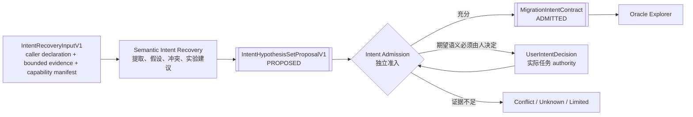

# CUDA 高阶语义意图恢复子系统设计

- 状态：规范性目标设计
- 日期：2026-08-29
- 父设计：[系统设计](../SYSTEM_DESIGN.md)
- 产品范围：仅限 CUDA → Ascend C 算子移植
- Agent 软件架构：[Agent 与 Strategy](../design/AGENT_ARCHITECTURE.md)
- 当前实施基线：[CURRENT_BASELINE](../dev/CURRENT_BASELINE.md)
- 调研依据：[Oracle 自动生成调研](ORACLE_RESEARCH_REPORT.md)、
  [可借鉴方向](BORROWABLE_DIRECTIONS.md)

## 1. 目的

CUDA kernel 往往不是算法定义的直接抄写。它可能混合了 CUDA 线程层次、特定 GPU 的访存
布局、某一模型的 shape 特化、部署时的融合、近似数学、历史兼容行为以及上游调用者未显式
写出的约束。Cairn 的最终目标不是逐句翻译这些实现偶然性，而是尽可能恢复用户希望在
Ascend C 上保留的高阶语义，并据此确定哪些实现细节必须保持、哪些可以改变。

这项工作本身是一个长期可优化的研究子系统。因此，本设计把它隔离为
`Semantic Intent Recovery`（SIR）：SIR 只产生带证据的候选意图，不直接定义正式迁移契约，
不生成最终 Oracle 权威，也不判断 Ascend C 候选是否通过。

`proposal-only` 是永久 authority 边界，不是能力上限或暂停建设的同义词。SIR 可以逐步组合模型、
静态分析、IR、规则、符号方法和受控实验，形成越来越完整的意图恢复能力；但这些能力始终只能提交
proposal，由独立 Intent Admission 决定哪些 exact claim 可以进入正式迁移契约。

## 2. 核心边界



最重要的不可跨越规则是：

- SIR 的输出一律是 `ProposedIntent*`，不能伪装成 `MigrationIntentContract`；
- 只有独立的 Intent Admission 可以把被支持的 claim 提升为正式迁移意图；
- 未能恢复的语义必须保留为 `Unknown`，相互矛盾的解释必须保留为 `Conflict`；
- 不能以一个自然语言摘要替代原始证据、推导路径和竞争假设；
- 要求正式结论的 Oracle、候选搜索和性能优化只能消费 `MigrationIntentContract` 中的已准入 claim；
  未决 claim 只能缩小或阻断对应 scope，不能作为弱化版正式意图旁路输入；
- SIR 无权查看隐藏 admission corpus、候选最终 verdict 或修改 judge policy。

### 2.1 参与者与责任

| 参与者 | 责任 | 不承担 |
| --- | --- | --- |
| 任务提交者/Controller | 收集调用者最小声明，冻结输入、权限、预算与运行身份 | 替 SIR 编写答案或把结构有效当成语义成立 |
| runtime SIR actor | 面对未见任务读取授权材料，运行 0..N 个恢复策略并提交 typed proposal | admission、用户决策、Oracle/candidate verdict |
| repository coding agent | 构建通用 SIR 应用、协议、工具与测试 | 阅读 evaluator answer 后代写 runtime proposal |
| Intent Admission | 逐 claim 机械检查 authority、证据闭包与冲突，形成 contract 或 scoped outcome | 用另一模型的“同意”代替证据 |
| 实际任务 authority | 只处理证据无法决定的期望语义或 policy 分叉 | 审阅每份 SIR 报告、确认源码可机械观察的事实 |

所谓“非 case 作者”不是固定第三人 reviewer。case/fixture 作者只负责 evaluator 材料，不能借此成为
产品运行时的意图 authority；真正进入 `NeedsUserDecision` 环节的人，应是实际调用者、算子/模型负责人
或其明确授权代表。该角色只回答 exact、scoped 的决策请求，不读取 restricted expected answer，也不为
每次 SIR run 举行通用评审。

## 3. “用户意图”的分层模型

用户意图不是一个自由文本字段，也不等于 CUDA 当前输出。SIR 应同时识别以下层次：

| 层次 | 典型内容 | 默认处理 |
| --- | --- | --- |
| 算法意图 | 矩阵乘、归约、softmax、采样、索引或状态更新的数学/离散语义 | 优先恢复为与硬件无关的 claim |
| 数值意图 | dtype、累加精度、舍入、近似函数、稳定性、合法非确定性 | 独立于算法 claim 表达 |
| 模型/部署意图 | 实际 shape 分布、融合边界、layout、checkpoint 依赖、调用前后处理 | 可能高于教科书定义的现实约束 |
| 外部契约意图 | ABI、alias、workspace、错误行为、side effect、stream 顺序 | 必须保留可观测行为 |
| CUDA 实现策略 | grid/block/warp、shared memory、vector width、特定 intrinsic | 默认是实现证据，不自动成为目标语义 |
| 历史偶然性 | bug、未定义行为、未初始化值、过拟合特化、废弃兼容行为 | 报告并请求政策，不自动保留或修复 |

高阶数学并不天然比真实模型契约权威。例如，某个看似错误的裁剪、量化或 layout 变换可能已经
被 checkpoint、调用者或后处理共同依赖。SIR 必须同时保留“算法定义”和“部署实际契约”，不能
把前者直接覆盖后者。

### 3.1 Claim-scoped decision rights

Cairn 不采用一个对所有问题通用的 authority 排名。不同来源只对不同 claim 有决策权：

| 来源 | 可以权威决定 | 不能权威决定 |
| --- | --- | --- |
| 用户/上游 policy authority | 想保留的业务语义、允许的修复、目标 domain、发布目标 | 某次 binary/device 是否真实执行、数学事实是否成立 |
| 已准入外部规范 | 其明确版本和适用范围内的算子/平台 contract | 用户是否选择该 contract、当前 CUDA 是否遵守 |
| CUDA execution receipt | exact binary/environment/input 下实际观察到的行为 | 该行为是否是用户意图或是否应被保留 |
| CUDA/Ascend 工具和 device receipt | 工具明确可观察范围内的执行/安全/性能事实 | 算法意图、工具未覆盖区域 |
| 独立 reference/proof | exact 前置条件下被建立的数学/关系 claim | 部署实际 contract 或域外行为 |
| 模型、知识、skill、文档检索 | hypothesis、解释和实验建议 | admission、用户决策或执行事实 |

当多个来源看似冲突时，先判断它们是否在回答同一个 claim。只有 claim 与 domain 真正相同时才
进入 conflict；不能用用户意图覆盖 execution receipt，也不能用 CUDA observation 覆盖用户意图。

### 3.2 Source behavior disposition

每个 CUDA 异常、特化或与高阶语义不一致的区域必须产生独立
`SourceBehaviorDispositionProposal`，并由 Intent Admission/用户 policy 形成以下强类型之一：

- `PreserveObservedBehavior`：用户明确要求保留该 defined、可观察行为；
- `FollowAdmittedSemanticIntent`：CUDA 行为被确认偏离用户意图，Ascend C 按准入语义修复；
- `ExcludeUndefinedRegion`：race、越界或其他 undefined region 不属于可迁移保证域；
- `SplitDomain`：不同部署/shape region 使用不同已说明 contract；
- `BlockPendingUserDecision`：现有证据不能合法决定保留还是修复。

Disposition 必须绑定 exact claim/domain/source observation 和授权依据。不得设置一个全项目
“永远保留 CUDA”或“永远按教科书修复”的布尔策略。改变 disposition 会产生新的
`MigrationIntentContract`，并触发 Oracle 与 candidate revalidation。

## 4. 输入模型

Controller 冻结 `IntentRecoveryInputV1`。它至少包含：

1. 调用者最小机器可读声明：source entry point/参数角色、dtype/shape、已知合法域与错误行为、请求的
   输出语义或 reference、明确 exclusion 与 unknown；
2. 目标 Ascend SoC/toolchain、迁移 scope、requested claims 和预算；
3. 被授权的证据引用、结构化 prior feedback 或 `NoPriorFeedback`；
4. exact capability manifest、数据政策和 task/run identity。

调用者声明是一个有 provenance 的 authority source，不是 SIR prompt 中可以被覆盖的普通文本。caller
declaration、SIR hypothesis、source observation、external expectation 和 feedback 必须保持来源分离；
冲突由 Intent Admission 显式记录，不能合并成一个无出处的值。

SIR 的读取面可以比单个执行单元更大，但执行和候选判断仍以单个 kernel 或显式 migration unit 为边界。
授权证据可以包括：

1. CUDA kernel、头文件、宏、模板实例化信息和编译选项；
2. host launch 代码、参数构造、shape/stride/layout 计算和 stream 使用；
3. 上下游调用图的有界切片，包括融合前后算子和数据变换；
4. 框架 schema、模型图节点、实际部署配置以及在授权范围内的 checkpoint 元信息；
5. 项目文档、论文、注释、已有单测/集成测试和参考实现；
6. CUDA 动态 trace、sanitizer、profiling、输出样本和边界探测结果；
7. 上一轮迭代的结构化反馈，包括真实模型接入结果；
8. 经检索策略允许的知识条目和 skill，但保留其精确信赖状态与内容身份。

证据进入不可变、内容寻址的 `IntentEvidenceSet`，再由 `IntentRecoveryInputV1` 引用；声明、证据、
capability 与生命周期 identity 不得擦除为通用字符串或 digest。密钥、私有模型数据或不可归档材料只能
以受控外部引用存在，并明确限制 replay 能力。SIR 不拥有任何输入的写权限。

## 5. 主要产物

### 5.1 Intent hypothesis

一个 `IntentHypothesis` 至少包含：

- 被声明的 `SemanticClaim`；
- claim 所属层次和适用 domain；
- 前置条件、后置条件和可观察 side effect；
- 必须保持的 `SemanticInvariant`；
- 可改变的 `OptimizationFreedom`；
- 适用时的 `DeterminismContractProposal`、`RandomnessContractProposal` 或
  `StateTransitionContractProposal`；
- 支持、反驳和未知证据边；
- 与其他假设的互斥、蕴含或重叠关系；
- 提取器、模型、prompt、skill、知识快照和工具身份；
- 建议用来区分竞争假设的实验。

### 5.2 Hypothesis set，而不是唯一答案

`IntentHypothesisSetProposalV1` 必须允许：

- 多个竞争解释；
- 每个解释覆盖不同 domain region；
- 一项 claim 被部分支持、部分冲突；
- “没有足够信息”的显式结论；
- 需要用户决策的政策分叉；
- 不同抽象层次的 claim 共同成立。

禁止用一个总置信分选择唯一答案。置信度可作为探索排序信号，但不能替代证据类别和准入结果。

### 5.3 实现伪影与优化自由度

SIR 需要把以下信息显式分开：

- `RequiredSemantic`: Ascend C 必须保留；
- `RequiredObservableContract`: 调用者可观察且必须保留；
- `ConditionallyRequired`: 只对特定模型/shape/部署成立；
- `ImplementationArtifact`: CUDA/特定 GPU 的实现选择；
- `SuspectedDefect`: 可能的源端缺陷；
- `UnknownClassification`: 当前无法判断。

`OptimizationFreedom` 不是“随便优化”。它需要引用不会被改变的 invariants、适用 domain 和证据
强度，例如允许改变线程分解但不允许改变 reduction 的合法结果集合。

## 6. 恢复流程

### 6.0 Strategy coordinator

SIR 是任务级恢复运行时，不等于某一个模型。Controller 按冻结 policy 启动 `IntentRecoveryRun`；SIR
coordinator 可为该 run 选择静态/IR/规则/符号 strategy，并按需要运行 0..N 个 model-backed episode。
DeepSeek 是当前首个 runtime strategy，不是永久拓扑。模型不能自行扩大 provider、turn、token、tool、
skill、网络或设备权限；也不要求为了形式完整而固定组织多 Agent debate 或第三人复核。

各 strategy 输出必须保留自己的 provenance 和共同依赖。聚合可以去重或建立关系，但不能把不同来源
压平为“多数意见”。任务规模或当前 consumer 不需要的 strategy 不预建空框架。

### 6.1 静态事实提取

可信解析器和受限分析器先提取不带高阶解释的事实：

- ABI 参数、类型、地址空间和读写角色；
- shape、stride、offset、索引和边界检查；
- launch geometry、同步、原子、共享内存和 warp-level 操作；
- 常量、查表、近似公式和模板特化；
- 调用链中的预处理、后处理和异常路径。

静态工具的输出是 `ObservedProgramFact`，不是语义真值。解析失败、宏展开缺失和动态分派必须是
显式不完整性。

### 6.2 行为画像

在已授权的 CUDA 环境上，SIR 可请求可复现 probe：

- 边界 shape 与值域；
- 特殊浮点值和敏感数值区域；
- 不同 launch/调度/重复运行；
- sanitizer 和 race 检查；
- 读写覆盖、alias 与错误状态；
- profiling 热点和实际执行路径。

动态结果是 `SourceBehaviorObservation`。它描述 CUDA 代码做了什么，不自动说明用户想要什么。

### 6.3 语义归一化

模型与分析器把低层事实映射为受控的中间语义：

- tensor/index expression；
- reduction/scan/selection/scatter 等算子骨架；
- shape/layout relation；
- state transition 和 side effect；
- numerical mode 与 nondeterminism set；
- deployment specialization predicate。

中间表示必须允许保留未解释片段及其源码位置。不能为了得到完整表达式而臆造缺失语义。

### 6.4 假设形成和证据图

SIR 组合代码、caller、测试、文档、模型图、运行观测和知识条目，产生多个 claim-scoped 假设。
每条边记录推导类型和共同依赖。例如两个 reference 最终都调用 cuBLAS 时，不能把它们算作两份
独立语义证据。

### 6.5 主动区分实验

对会改变 Oracle 或迁移目标的竞争假设，SIR 生成 `DisambiguationExperimentProposal`：

- 哪两个或多个假设需要区分；
- 最小输入或上下文变化；
- 每个假设预测的可观察差异；
- 需要的 CUDA、CPU/reference、模型接入或人工输入；
- 风险、成本和数据政策；
- 何种结果仍不足以区分。

实验由独立执行/授权层运行。SIR 只能消费归档后的观察，不能自己声称实验已发生。

### 6.6 Intent Admission

Intent Admission 按 claim 审查：

1. 验证证据身份、适用域和依赖图；
2. 检查是否存在未解决反证或 source undefined behavior；
3. 机械派生该 claim 所需的公开、restricted、执行或用户决策 obligation；
4. 仅在当前 exact admission mechanism 和风险确实需要时运行相应冻结/隐藏 control；
5. 验证从原始证据到 claim 的可重放推导；
6. 选择 `Admitted`、`AdmittedWithLimits`、`Conflict`、`Unknown` 或
   `NeedsUserDecision`；
7. 只有完成 closure 的 claim 才进入不可变 `MigrationIntentContract`，原始 hypothesis 不被修改。

可选 `IntentEvidencePlannerProfile` 可以提出如何补证或区分假设，但它仍是 proposal actor。Admission
gate 本身必须 model-free，只读取已验证 identity、policy、decision 和权威 receipt，不能以另一模型或
通用 reviewer 的“同意”作为独立性。若缺失的是用户期望语义，gate 产生独立、scoped
`UserIntentDecisionRequest`；实际任务 authority 的回答作为新输入进入后续 recovery/admission run。

## 7. 隔离设计

### 7.1 Host 与依赖隔离

最终 authority 架构中，SIR 是独立 durable Agent Loop，由 Controller 通过通用 proposal step port
运行。其实现可以更换为规则、静态分析、不同模型、多 episode、形式化工具或它们的组合，而不改变
Oracle Explorer、Candidate Search 和 Admission 的接口。SIR role 本身不要求专用 binary；只有
data/tool/credential/OS capability 不同时才拆 Host instance。

`cairn-migration::sir`中的DeepSeek proposal harness继续复用domain-neutral `cairn-agent`完成runtime
reasoning；它仍没有Admission权限。DEV-008在首个admitted consumer出现时增加了独立one-shot
`cairn-sir` recorded-ingress process、typed `SirRunId`/`OperationId` protocol和独立OS principal smoke，
并由另一个`cairn-admission` principal完成promotion。当前process adapter只物化并复验已有proposal，不应被
误报为新的模型host或目标 SIR service pool；DEV-022 generic proposal step接管production SIR profile后，
直接删除该 one-shot path。

依赖方向只能是：

```text
protocol/types <- SIR implementation
protocol/types <- Intent Admission
SIR implementation -X-> verifier internals / hidden corpus / candidate judge
```

### 7.2 数据隔离

SIR 只有以下权限：

- 读取任务授权的不可变输入和允许的知识快照；
- 通过 allowlisted research adapter 查询公开网络、官方文档和论文原文，并冻结 query、响应快照、时间、
  来源与引用；
- 提交提案、查询和实验请求；
- 读取经公开边界返回的结构化反馈；
- 写入自身提案流。

它不能：

- 修改 caller declaration 或已准入意图；
- 写 Oracle admission policy、比较器政策或最终 verdict；
- 读取隐藏 admission corpus、隐藏 mutants 或 candidate-private continuation；
- 将搜索结果直接写为权威知识；
- 直接启动 Docker、连接 Worker/设备，或执行未经过 Controller 授权的网络、代码或设备操作。

### 7.3 能力隔离

工具、知识查询和 skill 加载均由 capability token/role scope 控制。Skill 可以建议分析步骤或生成
提案，但其内容不提升事实信赖等级。未经验证的 skill 可以在探索域使用并带警告，不能直接触发
准入、改变 comparator 或获得高权限执行能力。

### 7.4 身份和生命周期隔离

每次 SIR run 冻结：

- extractor/model/prompt 身份；
- tool catalog 和权限；
- skill 与知识快照；
- 输入证据集；
- 预算和数据政策。

同一输入在新的实现或知识下重新运行会生成新的 `IntentRecoveryRunId` 和 hypothesis set，不覆盖
历史结果。Cairn 仍处于 pre-release，所有内部格式直接更新当前 V1；这里的“新 run”是生命周期
和内容身份，不是 schema 升级或兼容迁移。

## 8. 反馈闭环

反馈必须结构化为不同的证据类型：

| 反馈类型 | 作用 | 不能证明 |
| --- | --- | --- |
| `SemanticCounterexample` | 直接反驳某个 claim 或缩小 domain | 其他未测试区域正确 |
| `OracleConflictFeedback` | 暴露 authority/reference/comparator 矛盾 | 自动选择胜者 |
| `ProductionObservation` | 描述真实模型/部署表现 | 单个 kernel 局部正确 |
| `UserIntentDecision` | 对明确政策分叉授权 | 未声明范围外的语义 |
| `CoverageGap` | 指出缺少的输入域或故障类 | gap 已被解决 |
| `ImplementationFeedback` | 暴露无法实现或高代价约束 | 应自动改变用户意图 |
| `PerformanceFeedback` | 说明瓶颈或业务权重 | 功能/数值正确 |

反馈进入新的探索 run，触发 hypothesis 修订和重新准入。它绝不静默修改已准入契约。真实模型
正向表现通常只是弱支持；真实模型失败往往能产生强反例，但仍需定位到具体 claim。

## 9. 评价 SIR 本身

SIR 的评估不能只看模型生成文本是否“合理”。至少需要：

- claim precision：准入后被反例推翻的比例；
- semantic recall：隐藏语义义务是否被发现；
- artifact separation：能否识别 CUDA 实现伪影；
- conflict discovery：能否保留而非抹平矛盾；
- calibrated unknown：证据不足时是否愿意输出未知；
- disambiguation value：实验是否真正区分假设；
- downstream utility：是否减少 Oracle 错误、候选返工和人工决策成本；
- provenance completeness：每项结论能否追溯；
- replacement stability：更换 SIR 实现是否不影响下游协议。

评估必须以实际runtime-model episode为对象，不能由repository coding agent阅读fixture答案后代写结果。
至少比较source-preserving、user-declared intent和runtime SIR三条路径。若SIR没有改变下游Oracle/candidate
判断，也没有减少用户工作，或换一个语义形态不同的task就要求修改production代码/prompt结构，则SIR不进入
critical path。

case 数量、第三人评审数量和 proposal 文本是否漂亮都不是 SIR 泛化证据。fixture 只服务 evaluator；
runtime SIR 不读取 expected answer。未来确有 admission mechanism 时，其控制应按 exact claim 和风险覆盖
硬件特化但语义不变、模型/checkpoint 依赖的非教科书行为、文档与源码冲突、CUDA 源 bug、多个合理解释、
信息不足、融合和 side effect 等类别，而不是预建一个无 consumer 的通用资格仪式。

## 10. 强类型边界

以下概念必须是不同的验证类型，而不是 `String`、通用 ID、整数或布尔值：

- `IntentEvidenceId`、`IntentHypothesisId`、`IntentRecoveryRunId`、
  `MigrationIntentContractId`；
- `ObservedProgramFact`、`SourceBehaviorObservation`、`SemanticClaim`；
- `SemanticInvariant`、`OptimizationFreedom`、`ImplementationArtifact`；
- `ProposedIntent` 与 `AdmittedIntent`；
- `IntentConflict`、`IntentUnknown`、`UserIntentDecision`；
- `SourceBehaviorDispositionProposal` 与每一种 admitted disposition；
- 每类反馈及其适用 domain；
- evidence provenance、strength、independence 和 admission outcome。

反序列化必须重新执行构造约束。需要静态边界测试证明 proposed intent 不能传给只接受 admitted
contract 的 Oracle Explorer，也不能把 performance feedback 误传为 semantic counterexample。

## 11. 明确不做

SIR 不应：

- 声称从 CUDA 源码总能唯一恢复用户真实意图；
- 把 CUDA 单次行为、注释、框架名称或 LLM 解释单独当成权威；
- 为了自动化率隐藏冲突和未知；
- 直接生成候选 Ascend C 并以实现可行性倒推语义；
- 直接访问 hidden admission material；
- 将高层 IR 设计成不可替换的全项目中心模型；
- 把未来可能的通用迁移抽象引入当前 CUDA → Ascend C 产品边界。

## 12. 当前 runtime-model 价值证明

首个evaluation fixture使用
[`D-039`](../DECISIONS.md#d-039--the-first-sir-evaluation-fixture-is-a-clean-room-finite-f32-reduction)
的clean-room CUDA `f32`一维求和及显式host launch。D-039中的expected domain、数学解释、竞争标签、public/
restricted case和review identity都属于evaluator，不属于SIR input。

Runtime DeepSeek profile只接收该task实际提供的source、host launch、bounded caller/context、文档/测试和
authorized tool results。Prompt可以要求引用事实、保留竞争假设和unknown，但不能列出本fixture应产生的
具体答案。Proposal是否发现数学归约、source-order行为、deployment specialization或证据不足，由evaluator
在episode完成后判断；production代码不得为这些标签建fixture-specific branch。

DEV-004 已完成上述 reduction 的 recorded/live proposal episode。DEV-005 又用同一 production path 处理
atomic compaction task，没有修改 `sir.rs`、production prompt 或控制流；SIR 对 atomic output order 的
unknown 改变了一个具体下游 Oracle 选择。因此 D-042 的 cross-task/downstream-utility gate 结论为 `Go`。

`Go` 证明当前 task-generic seam 值得继续建设，不证明 SIR 已泛化、proposal 正确或 Intent 已 admitted；
也不授权一次性铺满完整 process tree、qualification registry 或固定 reviewer topology。若未来某阶段的
downstream utility 下降，含义是暂停不成比例的 SIR 投资并保留已被真实 consumer 使用的最小 seam，而不是
永久否定或删除 SIR 方向。

## 13. 当前建设路线

当前已经完成的 foundation 是：task-generic source projection、bounded read tools、DeepSeek recorded/live
episode、完整current-V1 competing hypothesis proposal、durable provenance，以及第二任务的下游 utility
control。首个窄authority consumer也已闭合。

第一条纵向链的设计与当前完成情况为：

1. 冻结完整 `IntentRecoveryInputV1`：调用者最小声明、目标环境、允许证据、显式 unknown、capability；
2. 将当前 proposal 直接完善为当前 V1 的 `IntentHypothesisSetProposalV1`：严格分开 observed facts、hypotheses、
   conflicts/unknowns、invariants、optimization freedoms、source behavior disposition 和实验提案；
3. 建立 `IntentRecoveryRun` lifecycle 和 strategy coordinator；只按真实任务需要增加 static/model strategy，
   不固定多 Agent 或 reviewer 数量；
4. 为首个下游 claim 实现最小 model-free Intent Admission 与强类型 promotion boundary；
5. 对不可由证据决定的 desired semantics 生成 `UserIntentDecisionRequest`，由实际任务 authority 回答；
6. 形成第一个 `MigrationIntentContract`，并让一个真实 Oracle 决策只能通过该 contract 消费 SIR 结果。

这一链路闭合后，再按真实 consumer 逐步增加 bounded caller slice、动态 probe、模型图/部署上下文、
结构化反馈、更强 IR/关系抽取/主动实验，以及可建模子域的形式化语义和 translation-validation
obligations。第一条 authority integration 已证明 SIR 必须处在 Controller/Admission 之外的 capability
boundary，但不证明需要专用 SIR process；没有 consumer 的空 crate、全量 planner catalog 或资格体系
不作为前置工作。

DEV-006用现有production runtime闭合第1、2项，并以真实DeepSeek strict-repair/restart验证current V1；
DEV-007/008闭合第4、5、6项，并用最小independent SIR ingress与Admission process落实第一条authority
boundary。DEV-009–021又把contract推进到Oracle、Candidate、remote build、diagnostic、model repair、rebuild
与durable workflow；DEV-022实现第3项中的最小generic proposal step lifecycle并删除专用`cairn-sir`。
完整Controller coordinator/supervisor仍未实现，不能据此预建完整process tree。

设计允许分块演进，但每一步都保持相同隔离边界：

- 每个 slice 必须连接一个真实下游 decision、减少明确人工工作，或关闭一条 authority/capability 风险；
- fixture expected answer、case author 和 repository coding agent 不进入 runtime SIR context；
- 不以固定 case、评审、Agent 或迭代数量代替 task-generic API 与 downstream utility；
- 不因避免过度建设而删除已证明有用的 SIR seam，也不以保留 seam 为由预建无 consumer 的体系；
- 每阶段提升可恢复 claim 的范围和强度，不改变“SIR 提案、Intent Admission 授权”的根本边界。
