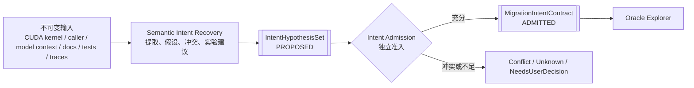

# CUDA 高阶语义意图恢复子系统设计

- 状态：规范性目标设计
- 日期：2026-08-27
- 父设计：[系统设计](../SYSTEM_DESIGN.md)
- 产品范围：仅限 CUDA → Ascend C 算子移植
- Agent 软件架构：[Agent 与 Strategy](../design/AGENT_ARCHITECTURE.md)
- 调研依据：[Oracle 自动生成调研](ORACLE_RESEARCH_REPORT.md)、
  [可借鉴方向](BORROWABLE_DIRECTIONS.md)

## 1. 目的

CUDA kernel 往往不是算法定义的直接抄写。它可能混合了 CUDA 线程层次、特定 GPU 的访存
布局、某一模型的 shape 特化、部署时的融合、近似数学、历史兼容行为以及上游调用者未显式
写出的约束。Cairn 的最终目标不是逐句翻译这些实现偶然性，而是尽可能恢复用户希望在
Ascend C 上保留的高阶语义，并据此确定哪些实现细节必须保持、哪些可以改变。

这项工作本身是一个长期可优化的研究子系统。因此，本设计把它隔离为
`Semantic Intent Recovery`（SIR）：SIR 只产生带证据的候选意图，不直接定义正式迁移契约，
不生成最终 Oracle 权威，也不判断 Ascend C 候选是否通过。

## 2. 核心边界



最重要的不可跨越规则是：

- SIR 的输出一律是 `ProposedIntent*`，不能伪装成 `MigrationIntentContract`；
- 只有独立的 Intent Admission 可以把被支持的 claim 提升为正式迁移意图；
- 未能恢复的语义必须保留为 `Unknown`，相互矛盾的解释必须保留为 `Conflict`；
- 不能以一个自然语言摘要替代原始证据、推导路径和竞争假设；
- 后续 Oracle、候选搜索和性能优化只能消费已准入 claim，或者明确消费仍未决的 claim 并输出
  弱化结论；
- SIR 无权查看隐藏 admission corpus、候选最终 verdict 或修改 judge policy。

## 3. “用户意图”的分层模型

用户意图不是一个自由文本字段，也不等于 CUDA 当前输出。SIR 应同时识别以下层次：

| 层次 | 典型内容 | 默认处理 |
| --- | --- | --- |
| 算法意图 | 矩阵乘、归约、softmax、采样、索引或状态更新的数学/离散语义 | 优先恢复为与硬件无关的 claim |
| 数值意图 | dtype、累加精度、舍入、近似函数、稳定性、合法非确定性 | 独立于算法 claim 表达 |
| 模型/部署意图 | 实际 shape 分布、融合边界、layout、checkpoint 依赖、调用前后处理 | 可能高于教科书定义的现实约束 |
| 外部契约意图 | ABI、alias、workspace、错误行为、side effect、stream 顺序 | 必须保留可观测行为 |
| CUDA 实现策略 | grid/block/warp、shared memory、vector width、特定 intrinsic | 默认是实现证据，不自动成为目标语义 |
| 历史偶然性 | bug、未定义行为、未初始化值、过拟合特化、废弃兼容行为 | 报告并请求政策，不自动保留或修复 |

高阶数学并不天然比真实模型契约权威。例如，某个看似错误的裁剪、量化或 layout 变换可能已经
被 checkpoint、调用者或后处理共同依赖。SIR 必须同时保留“算法定义”和“部署实际契约”，不能
把前者直接覆盖后者。

### 3.1 Claim-scoped decision rights

Cairn 不采用一个对所有问题通用的 authority 排名。不同来源只对不同 claim 有决策权：

| 来源 | 可以权威决定 | 不能权威决定 |
| --- | --- | --- |
| 用户/上游 policy authority | 想保留的业务语义、允许的修复、目标 domain、发布目标 | 某次 binary/device 是否真实执行、数学事实是否成立 |
| 已准入外部规范 | 其明确版本和适用范围内的算子/平台 contract | 用户是否选择该 contract、当前 CUDA 是否遵守 |
| CUDA execution receipt | exact binary/environment/input 下实际观察到的行为 | 该行为是否是用户意图或是否应被保留 |
| CUDA/Ascend 工具和 device receipt | 工具明确可观察范围内的执行/安全/性能事实 | 算法意图、工具未覆盖区域 |
| 独立 reference/proof | exact 前置条件下被建立的数学/关系 claim | 部署实际 contract 或域外行为 |
| 模型、知识、skill、文档检索 | hypothesis、解释和实验建议 | admission、用户决策或执行事实 |

当多个来源看似冲突时，先判断它们是否在回答同一个 claim。只有 claim 与 domain 真正相同时才
进入 conflict；不能用用户意图覆盖 execution receipt，也不能用 CUDA observation 覆盖用户意图。

### 3.2 Source behavior disposition

每个 CUDA 异常、特化或与高阶语义不一致的区域必须产生独立
`SourceBehaviorDispositionProposal`，并由 Intent Admission/用户 policy 形成以下强类型之一：

- `PreserveObservedBehavior`：用户明确要求保留该 defined、可观察行为；
- `FollowAdmittedSemanticIntent`：CUDA 行为被确认偏离用户意图，Ascend C 按准入语义修复；
- `ExcludeUndefinedRegion`：race、越界或其他 undefined region 不属于可迁移保证域；
- `SplitDomain`：不同部署/shape region 使用不同已说明 contract；
- `BlockPendingUserDecision`：现有证据不能合法决定保留还是修复。

Disposition 必须绑定 exact claim/domain/source observation 和授权依据。不得设置一个全项目
“永远保留 CUDA”或“永远按教科书修复”的布尔策略。改变 disposition 会产生新的
`MigrationIntentContract`，并触发 Oracle 与 candidate revalidation。

## 4. 输入模型

SIR 的读取面可以比单个执行单元更大，但执行和候选判断仍以单个 kernel 为边界。输入至少包括：

1. CUDA kernel、头文件、宏、模板实例化信息和编译选项；
2. host launch 代码、参数构造、shape/stride/layout 计算和 stream 使用；
3. 上下游调用图的有界切片，包括融合前后算子和数据变换；
4. 框架 schema、模型图节点、实际部署配置以及在授权范围内的 checkpoint 元信息；
5. 项目文档、论文、注释、已有单测/集成测试和参考实现；
6. CUDA 动态 trace、sanitizer、profiling、输出样本和边界探测结果；
7. 上一轮迭代的结构化反馈，包括真实模型接入结果；
8. 经检索策略允许的知识条目和 skill，但保留其精确信赖状态与内容身份。

所有输入先进入不可变、内容寻址的 `IntentEvidenceSet`。密钥、私有模型数据或不可归档材料只能
以受控外部引用存在，并明确限制 replay 能力。SIR 不拥有任何输入的写权限。

## 5. 主要产物

### 5.1 Intent hypothesis

一个 `IntentHypothesis` 至少包含：

- 被声明的 `SemanticClaim`；
- claim 所属层次和适用 domain；
- 前置条件、后置条件和可观察 side effect；
- 必须保持的 `SemanticInvariant`；
- 可改变的 `OptimizationFreedom`；
- 适用时的 `DeterminismContractProposal`、`RandomnessContractProposal` 或
  `StateTransitionContractProposal`；
- 支持、反驳和未知证据边；
- 与其他假设的互斥、蕴含或重叠关系；
- 提取器、模型、prompt、skill、知识快照和工具身份；
- 建议用来区分竞争假设的实验。

### 5.2 Hypothesis set，而不是唯一答案

`IntentHypothesisSet` 必须允许：

- 多个竞争解释；
- 每个解释覆盖不同 domain region；
- 一项 claim 被部分支持、部分冲突；
- “没有足够信息”的显式结论；
- 需要用户决策的政策分叉；
- 不同抽象层次的 claim 共同成立。

禁止用一个总置信分选择唯一答案。置信度可作为探索排序信号，但不能替代证据类别和准入结果。

### 5.3 实现伪影与优化自由度

SIR 需要把以下信息显式分开：

- `RequiredSemantic`: Ascend C 必须保留；
- `RequiredObservableContract`: 调用者可观察且必须保留；
- `ConditionallyRequired`: 只对特定模型/shape/部署成立；
- `ImplementationArtifact`: CUDA/特定 GPU 的实现选择；
- `SuspectedDefect`: 可能的源端缺陷；
- `UnknownClassification`: 当前无法判断。

`OptimizationFreedom` 不是“随便优化”。它需要引用不会被改变的 invariants、适用 domain 和证据
强度，例如允许改变线程分解但不允许改变 reduction 的合法结果集合。

## 6. 恢复流程

### 6.1 静态事实提取

可信解析器和受限分析器先提取不带高阶解释的事实：

- ABI 参数、类型、地址空间和读写角色；
- shape、stride、offset、索引和边界检查；
- launch geometry、同步、原子、共享内存和 warp-level 操作；
- 常量、查表、近似公式和模板特化；
- 调用链中的预处理、后处理和异常路径。

静态工具的输出是 `ObservedProgramFact`，不是语义真值。解析失败、宏展开缺失和动态分派必须是
显式不完整性。

### 6.2 行为画像

在已授权的 CUDA 环境上，SIR 可请求可复现 probe：

- 边界 shape 与值域；
- 特殊浮点值和敏感数值区域；
- 不同 launch/调度/重复运行；
- sanitizer 和 race 检查；
- 读写覆盖、alias 与错误状态；
- profiling 热点和实际执行路径。

动态结果是 `SourceBehaviorObservation`。它描述 CUDA 代码做了什么，不自动说明用户想要什么。

### 6.3 语义归一化

模型与分析器把低层事实映射为受控的中间语义：

- tensor/index expression；
- reduction/scan/selection/scatter 等算子骨架；
- shape/layout relation；
- state transition 和 side effect；
- numerical mode 与 nondeterminism set；
- deployment specialization predicate。

中间表示必须允许保留未解释片段及其源码位置。不能为了得到完整表达式而臆造缺失语义。

### 6.4 假设形成和证据图

SIR 组合代码、caller、测试、文档、模型图、运行观测和知识条目，产生多个 claim-scoped 假设。
每条边记录推导类型和共同依赖。例如两个 reference 最终都调用 cuBLAS 时，不能把它们算作两份
独立语义证据。

### 6.5 主动区分实验

对会改变 Oracle 或迁移目标的竞争假设，SIR 生成 `DisambiguationExperimentProposal`：

- 哪两个或多个假设需要区分；
- 最小输入或上下文变化；
- 每个假设预测的可观察差异；
- 需要的 CUDA、CPU/reference、模型接入或人工输入；
- 风险、成本和数据政策；
- 何种结果仍不足以区分。

实验由独立执行/授权层运行。SIR 只能消费归档后的观察，不能自己声称实验已发生。

### 6.6 Intent Admission

Intent Admission 按 claim 审查：

1. 验证证据身份、适用域和依赖图；
2. 检查是否存在未解决反证或 source undefined behavior；
3. 在隐藏/冻结的意图区分语料上进行控制；
4. 验证从原始证据到 claim 的可重放推导；
5. 选择 `Admitted`、`AdmittedWithLimits`、`Conflict`、`Unknown` 或
   `NeedsUserDecision`；
6. 生成不可变 `MigrationIntentContract`，不修改原始 hypothesis。

Admission 可以由 agent 编排和解释，但机械 gate 只能读取权威 receipt，不能以另一模型的一句
“同意”作为独立性。

## 7. 隔离设计

### 7.1 进程与依赖隔离

SIR 应通过独立 worker/service port 运行。其实现可以更换为规则、静态分析、不同模型、多 agent、
形式化工具或它们的组合，而不改变 Oracle Explorer、Candidate Search 和 Admission 的接口。

依赖方向只能是：

```text
protocol/types <- SIR implementation
protocol/types <- Intent Admission
SIR implementation -X-> verifier internals / hidden corpus / candidate judge
```

### 7.2 数据隔离

SIR 只有以下权限：

- 读取任务授权的不可变输入和允许的知识快照；
- 提交提案、查询和实验请求；
- 读取经公开边界返回的结构化反馈；
- 写入自身提案流。

它不能：

- 修改 caller declaration 或已准入意图；
- 写 Oracle admission policy、比较器政策或最终 verdict；
- 读取隐藏 admission corpus、隐藏 mutants 或 candidate-private continuation；
- 将搜索结果直接写为权威知识；
- 执行未经过授权的网络、代码或设备操作。

### 7.3 能力隔离

工具、知识查询和 skill 加载均由 capability token/role scope 控制。Skill 可以建议分析步骤或生成
提案，但其内容不提升事实信赖等级。未经验证的 skill 可以在探索域使用并带警告，不能直接触发
准入、改变 comparator 或获得高权限执行能力。

### 7.4 身份和生命周期隔离

每次 SIR run 冻结：

- extractor/model/prompt 身份；
- tool catalog 和权限；
- skill 与知识快照；
- 输入证据集；
- 预算和数据政策。

同一输入在新的实现或知识下重新运行会生成新的 `IntentRecoveryRunId` 和 hypothesis set，不覆盖
历史结果。Cairn 仍处于 pre-release，所有内部格式直接更新当前 V1；这里的“新 run”是生命周期
和内容身份，不是 schema 升级或兼容迁移。

## 8. 反馈闭环

反馈必须结构化为不同的证据类型：

| 反馈类型 | 作用 | 不能证明 |
| --- | --- | --- |
| `SemanticCounterexample` | 直接反驳某个 claim 或缩小 domain | 其他未测试区域正确 |
| `OracleConflictFeedback` | 暴露 authority/reference/comparator 矛盾 | 自动选择胜者 |
| `ProductionObservation` | 描述真实模型/部署表现 | 单个 kernel 局部正确 |
| `UserIntentDecision` | 对明确政策分叉授权 | 未声明范围外的语义 |
| `CoverageGap` | 指出缺少的输入域或故障类 | gap 已被解决 |
| `ImplementationFeedback` | 暴露无法实现或高代价约束 | 应自动改变用户意图 |
| `PerformanceFeedback` | 说明瓶颈或业务权重 | 功能/数值正确 |

反馈进入新的探索 run，触发 hypothesis 修订和重新准入。它绝不静默修改已准入契约。真实模型
正向表现通常只是弱支持；真实模型失败往往能产生强反例，但仍需定位到具体 claim。

## 9. 评价 SIR 本身

SIR 的评估不能只看模型生成文本是否“合理”。至少需要：

- claim precision：准入后被反例推翻的比例；
- semantic recall：隐藏语义义务是否被发现；
- artifact separation：能否识别 CUDA 实现伪影；
- conflict discovery：能否保留而非抹平矛盾；
- calibrated unknown：证据不足时是否愿意输出未知；
- disambiguation value：实验是否真正区分假设；
- downstream utility：是否减少 Oracle 错误、候选返工和人工决策成本；
- provenance completeness：每项结论能否追溯；
- replacement stability：更换 SIR 实现是否不影响下游协议。

意图恢复 admission corpus 应包含：硬件特化但语义不变、模型/checkpoint 依赖的非教科书行为、
文档与源码冲突、CUDA 源 bug、多个合理解释、信息不足、融合和 side effect 等案例。

## 10. 强类型边界

以下概念必须是不同的验证类型，而不是 `String`、通用 ID、整数或布尔值：

- `IntentEvidenceId`、`IntentHypothesisId`、`IntentRecoveryRunId`、
  `MigrationIntentContractId`；
- `ObservedProgramFact`、`SourceBehaviorObservation`、`SemanticClaim`；
- `SemanticInvariant`、`OptimizationFreedom`、`ImplementationArtifact`；
- `ProposedIntent` 与 `AdmittedIntent`；
- `IntentConflict`、`IntentUnknown`、`UserIntentDecision`；
- `SourceBehaviorDispositionProposal` 与每一种 admitted disposition；
- 每类反馈及其适用 domain；
- evidence provenance、strength、independence 和 admission outcome。

反序列化必须重新执行构造约束。需要静态边界测试证明 proposed intent 不能传给只接受 admitted
contract 的 Oracle Explorer，也不能把 performance feedback 误传为 semantic counterexample。

## 11. 明确不做

SIR 不应：

- 声称从 CUDA 源码总能唯一恢复用户真实意图；
- 把 CUDA 单次行为、注释、框架名称或 LLM 解释单独当成权威；
- 为了自动化率隐藏冲突和未知；
- 直接生成候选 Ascend C 并以实现可行性倒推语义；
- 直接访问 hidden admission material；
- 将高层 IR 设计成不可替换的全项目中心模型；
- 把未来可能的通用迁移抽象引入当前 CUDA → Ascend C 产品边界。

## 12. 首个 Intent Admission profile

首个 architecture proof 使用 [`D-039`](../DECISIONS.md#d-039--the-first-intent-admission-operator-is-a-clean-room-finite-f32-reduction)
冻结的 clean-room CUDA `f32` 一维求和及显式 host launch。首个 admitted domain 只包括 contiguous、
normal-or-signed-zero binary32、`1 <= N <= 256`、`abs(x_i) <= 65536`；input/output alias、空输入、
subnormal、非有限值和更宽 shape 不被临时猜测，而是保持 domain-outside 或 user-decision obligation。

SIR 必须至少产生并保留下列可竞争解释：数学求和、source reduction-tree bit identity、部署 shape
特化，以及证据不足的 unknown。Intent Admission 的目标选择 real-number sum；任意 permutation/
parenthesization、每个节点 round-to-nearest-ties-to-even binary32 addition 的 family 只作为后续 allowance
calibration evidence，signed zero 数值等价。Launch geometry、block decomposition 和 tree order 是实现
伪影。具体 allowance 和 evidence strength 仍由后续 Oracle Admission 独立建立，Intent contract 不预先
制造该结论。

首个 corpus 是 non-adaptive sealed batch。Public controls 覆盖 honest、tail/non-power-of-two、
order-sensitive cancellation、wrong exact-bit、wrong deployment-specialization 和 unknown；restricted
controls 分别覆盖 implementation artifact、source defect、deployment quirk、competing meaning、genuine
unknown 和 tamper/wrong binding。任一 hidden diagnostic 泄漏区分信息后按 D-031 burn 为公开 regression。
一般 adaptive-query/replenishment policy 仍由 OQ-024 决定。

## 13. 分步建设原则

设计允许分块演进，但每一步都保持相同隔离边界：

1. 先支持 kernel + 显式 host launch 的 ABI/shape/算法骨架与多假设输出；
2. 再加入 bounded caller slice、测试、文档和 CUDA 动态 probe；
3. 再加入模型图/部署上下文和结构化真实反馈；
4. 按算子类别加入更强的 IR、关系抽取和主动实验；
5. 最后在可建模子域加入形式化语义和 translation-validation obligations。

每阶段提升的是可恢复 claim 的范围和强度，不改变“SIR 提案、Intent Admission 授权”的根本边界。
